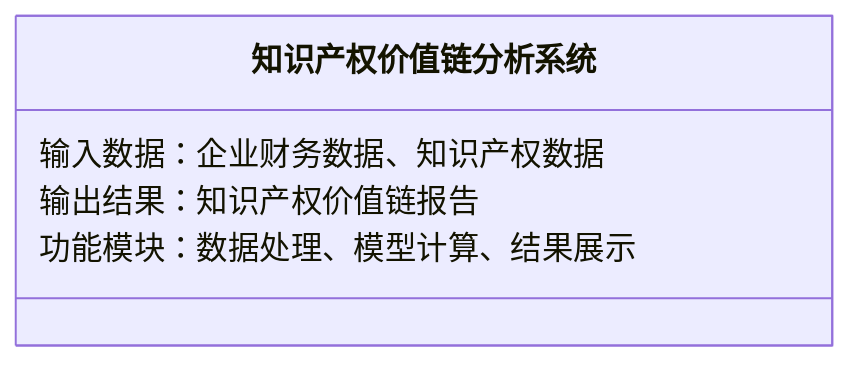
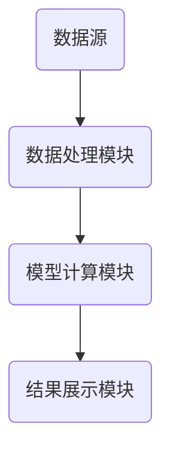
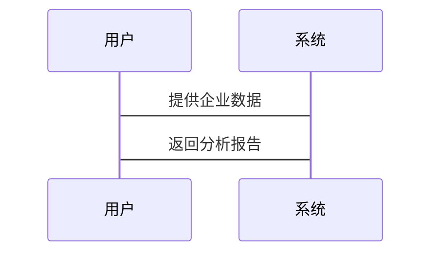

                 


# 股市估值在国际知识产权价值链分析中的应用

> 关键词：股市估值，知识产权，价值链分析，数学模型，系统架构

> 摘要：本文探讨了在国际知识产权价值链分析中应用股市估值的方法与技术。通过分析知识产权的核心特征、股市估值的基本原理以及两者之间的关系，提出了一种将知识产权价值纳入股市估值体系的创新方法。本文结合数学模型、系统架构设计和实际案例分析，为读者提供了全面的解决方案。

---

# 第一部分: 股市估值与国际知识产权价值链分析基础

---

## 第1章: 股市估值与知识产权价值链概述

### 1.1 知识产权的基本概念与特征

#### 1.1.1 知识产权的定义与分类
- **定义**：知识产权（Intellectual Property, IP）是指人们在创造性的智力劳动中所形成的成果的法律权利，包括专利、商标、版权、商业秘密等。
- **分类**：
  - 专利：保护发明的实用性。
  - 商标：保护商业标识。
  - 版权：保护文学、艺术和科学作品。
  - 商业秘密：保护未公开的技术信息和经营策略。

#### 1.1.2 知识产权的核心特征
- **独占性**：知识产权的排他性权利。
- **地域性**：在特定国家或地区内有效。
- **时间性**：有法定保护期限。
- **无形性**：不依赖于物理载体。

#### 1.1.3 知识产权在经济活动中的作用
- 创新激励：保护创新者权益，促进技术进步。
- 财产权益：作为企业资产的一部分，影响企业价值。
- 市场竞争：通过知识产权保护企业竞争优势。

---

### 1.2 股市估值的基本原理

#### 1.2.1 股市估值的定义与方法
- **定义**：股市估值是指通过对企业的财务数据、市场表现和行业地位等多方面分析，估算其股票的内在价值。
- **方法**：
  - 市盈率法（P/E）：市价与每股收益的比率。
  - 市净率法（P/B）：市价与每股净资产的比率。
  - 现金流折现法（DCF）：通过未来现金流的现值估算企业价值。

#### 1.2.2 影响股市估值的主要因素
- 财务状况：收入、利润、资产负债。
- 行业地位：市场占有率、竞争格局。
- 宏观经济：GDP、利率、通货膨胀。
- 市场情绪：投资者心理、市场波动。

#### 1.2.3 知识产权对股市估值的潜在影响
- 知识产权是企业核心资产之一，影响其市场竞争力和盈利能力。
- 高质量的知识产权组合可以提升企业的估值倍数。

---

### 1.3 国际知识产权价值链分析

#### 1.3.1 知识产权价值链的定义
- 知识产权价值链是指从知识产权的创造、保护、运用到商业化的过程中，涉及的价值链结构。

#### 1.3.2 知识产权价值链的构成要素
- 创造：研发、设计阶段。
- 保护：专利申请、商标注册。
- 运用：许可、转让、自营。
- 商业化：市场推广、收益分配。

#### 1.3.3 知识产权价值链的分析框架
- 价值链分解：将知识产权的生命周期分解为多个环节。
- 价值评估：量化每个环节对整体价值的贡献。

---

### 1.4 股市估值与知识产权价值链的结合

#### 1.4.1 知识产权对股市估值的影响路径
- 通过提升企业技术壁垒，增强市场竞争力。
- 通过增加企业未来的现金流，提升DCF模型的估值。

#### 1.4.2 知识产权价值链对股市估值的优化作用
- 提供更精确的企业价值评估依据。
- 优化投资者决策，减少信息不对称。

#### 1.4.3 知识产权价值链分析的必要性
- 传统估值方法忽视了知识产权的特殊性。
- 知识产权对企业长期价值的影响日益显著。

---

### 1.5 本章小结
本章从知识产权和股市估值的基本概念入手，分析了两者的联系，并提出了将知识产权价值链纳入股市估值体系的必要性。

---

## 第2章: 知识产权与股市估值的核心概念与联系

### 2.1 知识产权与股市估值的核心概念

#### 2.1.1 知识产权的经济价值
- **经济价值**：知识产权对企业收入的贡献能力。
- **评估方法**：通过许可费、侵权赔偿等估算其价值。

#### 2.1.2 知识产权的市场价值
- **市场价值**：知识产权在市场上的交易价格。
- **影响因素**：技术成熟度、市场需求、法律保护力度。

#### 2.1.3 知识产权的法律价值
- **法律价值**：知识产权在法律框架内的保护力度。
- **评估维度**：专利的可诉性、商标的显著性。

---

### 2.2 知识产权与股市估值的关系分析

#### 2.2.1 知识产权对企业价值的影响
- 知识产权是企业核心竞争力的重要组成部分。
- 优质知识产权可以提升企业的议价能力。

#### 2.2.2 知识产权对股市估值的直接影响
- 通过影响企业的收入和利润，直接改变市盈率、市净率等估值指标。
- 通过影响企业的未来现金流，直接改变DCF模型的估值结果。

#### 2.2.3 知识产权对股市估值的间接影响
- 通过影响企业的市场地位，间接影响其估值倍数。
- 通过影响投资者对企业的信心，间接影响股价波动。

---

### 2.3 知识产权与股市估值的核心要素对比

| 要素 | 知识产权 | 股市估值 |
|------|----------|----------|
| 核心资产 | 无形资产（专利、商标等） | 有形资产与无形资产结合 |
| 评估方法 | 以许可收入为基础 | 以财务指标为基础 |
| 时间维度 | 长期性 | 短期与长期结合 |
| 风险因素 | 技术风险、法律风险 | 市场风险、财务风险 |

---

### 2.4 知识产权与股市估值的ER实体关系图

```mermaid
er
actor(投资者) -->
company(企业) -->
intellectual_property(IP) -->
valuation_model(估值模型)
```

---

### 2.5 本章小结
本章分析了知识产权与股市估值的核心概念及其联系，为后续的模型构建奠定了基础。

---

## 第3章: 知识产权价值链分析的算法原理

### 3.1 知识产权价值链分析的基本原理

#### 3.1.1 知识产权价值链的分解
- 创造阶段：研发、设计。
- 保护阶段：专利申请、商标注册。
- 运用阶段：许可、转让、自营。
- 商业化阶段：市场推广、收益分配。

#### 3.1.2 知识产权价值链的量化方法
- 通过经济指标量化每个环节的价值贡献。
- 通过权重系数反映不同环节的重要性。

#### 3.1.3 知识产权价值链的评估指标
- 专利数量与质量。
- 商标知名度。
- 知识产权收入占比。

---

### 3.2 知识产权价值链分析的数学模型

#### 3.2.1 知识产权价值的计算公式
$$
IP\text{价值} = \sum_{i=1}^{n} w_i \cdot v_i
$$
其中，\(w_i\) 是第 \(i\) 个环节的权重，\(v_i\) 是第 \(i\) 个环节的价值贡献。

#### 3.2.2 知识产权对股市估值的影响模型
$$
Stock\text{估值} = \alpha \cdot IP\text{价值} + \beta \cdot \text{其他因素}
$$
其中，\(\alpha\) 是知识产权价值的权重，\(\beta\) 是其他因素的权重。

---

### 3.3 本章小结
本章通过数学模型量化了知识产权价值链的价值，并提出了其对股市估值的影响模型。

---

# 第四部分: 知识产权价值链分析的系统架构与应用

---

## 第4章: 知识产权价值链分析的系统架构设计

### 4.1 系统功能设计

#### 4.1.1 领域模型设计


#### 4.1.2 系统架构设计


---

### 4.2 系统接口设计

#### 4.2.1 系统输入接口
- 数据接口：接收企业财务数据和知识产权数据。
- 用户接口：接收用户输入的参数。

#### 4.2.2 系统输出接口
- 报告接口：输出知识产权价值链分析报告。
- 数据接口：输出可供其他系统使用的数据。

---

### 4.3 系统交互设计



---

## 第5章: 知识产权价值链分析的项目实战

### 5.1 项目环境安装

```bash
pip install numpy pandas matplotlib
```

---

### 5.2 核心代码实现

#### 5.2.1 知识产权价值计算模块

```python
def calculate_ip_value(ip_data):
    weights = [0.4, 0.3, 0.2, 0.1]
    values = []
    for ip in ip_data:
        value = 0
        for i in range(len(ip['attributes'])):
            value += weights[i] * ip['attributes'][i]
        values.append(value)
    return values
```

#### 5.2.2 股市估值模型实现

```python
def stock_valuation(ip_values, financial_data):
    alpha = 0.6
    beta = 0.4
    total_valuation = alpha * sum(ip_values) + beta * sum(financial_data)
    return total_valuation
```

---

### 5.3 案例分析

#### 5.3.1 案例背景
某科技公司拥有发明专利100项，实用新型专利50项，商标80项。

#### 5.3.2 数据处理
```python
ip_data = [
    {'attributes': [100, 50, 80]},
    # 其他数据
]
```

#### 5.3.3 计算知识产权价值
```python
ip_values = calculate_ip_value(ip_data)
```

#### 5.3.4 计算股市估值
```python
financial_data = [1000, 200, 300]
total_valuation = stock_valuation(ip_values, financial_data)
print("总估值：", total_valuation)
```

---

## 第6章: 知识产权价值链分析的优化与展望

### 6.1 最佳实践
- 数据质量：确保知识产权数据的准确性和完整性。
- 模型优化：结合机器学习算法提升预测精度。
- 应用场景：拓展至跨国公司和新兴行业。

### 6.2 小结
本文通过理论分析和实践案例，展示了如何将知识产权价值链分析应用于股市估值。

### 6.3 注意事项
- 知识产权价值受政策和市场环境影响较大。
- 模型需根据实际情况进行调整。

### 6.4 拓展阅读
- 《知识产权管理》
- 《股市估值方法论》
- 《价值链分析与企业战略》

---

# 作者：AI天才研究院 & 禅与计算机程序设计艺术

