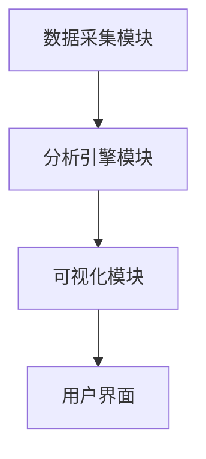
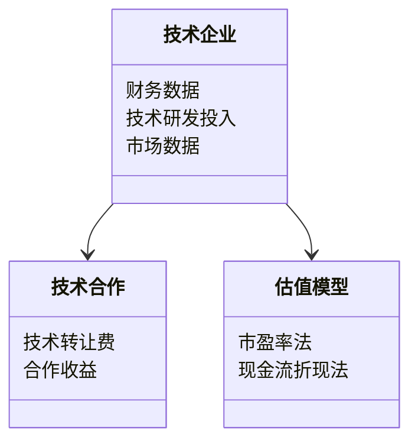
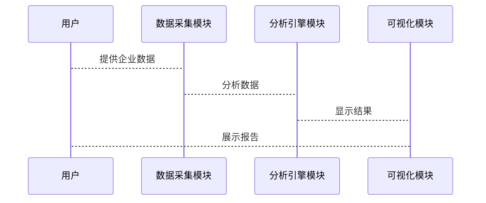

                 


# 股市估值在跨境技术价值链分析中的应用

## 关键词：股市估值、跨境技术价值链、企业价值评估、技术经济分析、投资决策、技术合作

## 摘要：  
随着全球经济一体化的深入发展，技术价值链的跨境合作日益频繁，企业价值评估在技术合作中的重要性逐渐凸显。本文从股市估值的基本概念出发，结合跨境技术价值链的分析框架，探讨如何将股市估值方法应用于技术价值链的分析中。通过构建技术价值链的实体关系图和属性对比表，本文详细阐述了股市估值与技术价值链的结合点，并提出了基于博弈论和网络分析的算法原理。最后，本文通过实际案例分析，展示了如何通过系统化的架构设计和项目实战，实现技术价值链的优化和企业价值的最大化。

---

# 第1章 股市估值的基本概念与方法

## 1.1 股市估值的定义与核心要素

### 1.1.1 股市估值的定义  
股市估值是指通过对企业的财务数据、市场地位、行业前景等因素进行分析，估算其股票的内在价值或市场价格的过程。股市估值的核心目标是帮助投资者和企业管理者做出更合理的投资决策。

### 1.1.2 股市估值的核心要素  
- **企业财务状况**：包括收入、利润、资产负债情况等。  
- **行业地位**：企业在行业中的竞争地位、市场份额等。  
- **市场前景**：行业的增长潜力和技术发展趋势。  
- **风险因素**：包括市场风险、行业风险、政策风险等。  

### 1.1.3 股市估值的基本原理  
股市估值基于“价值发现”的理念，通过对企业未来现金流的折现、市盈率、市净率等指标的分析，评估企业的内在价值。  

---

## 1.2 股市估值的主要方法

### 1.2.1 市盈率法  
市盈率（P/E Ratio）= 股票价格 / 每股净利润。  
- 适用于盈利稳定的企业，反映市场对企业盈利能力的估值。  

### 1.2.2 市净率法  
市净率（P/B Ratio）= 股票价格 / 每股净资产。  
- 适用于资产密集型行业，反映市场对企业资产价值的估值。  

### 1.2.3 现金流折现法  
现金流折现法（DCF）通过将企业未来自由现金流折现，估算企业的内在价值。  
- 公式：  
  $$ V = \sum_{t=1}^{n} \frac{CF_t}{(1+r)^t} $$  
  其中，\( V \) 是企业价值，\( CF_t \) 是第 \( t \) 年的现金流，\( r \) 是折现率。  

### 1.2.4 其他估值方法  
- **相对估值法**：基于可比公司或行业平均值进行估值。  
- **隐含估值法**：通过市场交易数据推导企业价值。  

---

## 1.3 股市估值的应用场景

### 1.3.1 投资决策中的应用  
投资者通过股市估值方法，评估股票的投资价值，制定买入或卖出策略。  

### 1.3.2 企业并购中的应用  
企业在并购过程中，通过估值方法确定目标企业的价值，制定合理的并购价格。  

### 1.3.3 股票投资组合管理中的应用  
投资经理通过股市估值方法，优化股票组合的配置，降低风险，提高收益。  

---

## 1.4 本章小结  
本章介绍了股市估值的基本概念、核心要素和主要方法，并探讨了其在投资决策、企业并购和投资组合管理中的应用场景，为后续章节的分析奠定了基础。

---

# 第2章 跨境技术价值链分析的定义与框架

## 2.1 跨境技术价值链的定义

### 2.1.1 技术价值链的基本概念  
技术价值链是指企业在技术研发、生产、销售等环节中形成的产业链条。  

### 2.1.2 跨境技术价值链的特点  
- **全球化**：技术价值链跨越国界，涉及多个国家和地区的合作。  
- **复杂性**：涉及多个环节和参与者，链条较长。  
- **协作性**：企业之间通过合作实现技术价值链的优化。  

### 2.1.3 跨境技术价值链的核心要素  
- **技术开发**：技术创新和研发能力。  
- **生产制造**：生产效率和成本控制。  
- **市场销售**：全球市场布局和渠道管理。  

---

## 2.2 跨境技术价值链的分析框架

### 2.2.1 价值链的构成环节  
- **研发**：技术创新和专利布局。  
- **生产**：制造能力和成本控制。  
- **销售**：市场推广和渠道管理。  
- **服务**：售后服务和技术支持。  

### 2.2.2 价值链的驱动因素  
- **技术创新**：技术进步推动价值链的优化。  
- **成本控制**：降低生产成本，提高竞争力。  
- **市场拓展**：开拓新市场，扩大市场份额。  

### 2.2.3 价值链的优化策略  
- **技术创新**：加大研发投入，提升技术竞争力。  
- **成本控制**：优化生产流程，降低运营成本。  
- **市场布局**：制定全球化市场战略，拓展新兴市场。  

---

## 2.3 跨境技术价值链的典型案例

### 2.3.1 全球科技企业的价值链分析  
例如，苹果公司的全球供应链布局，涉及多个国家的生产、研发和销售环节。  

### 2.3.2 区域性技术企业的价值链分析  
例如，中国某科技企业在东南亚市场的技术合作和生产布局。  

### 2.3.3 跨境合作中的价值链整合  
例如，跨国公司与本地企业的技术合作，实现价值链的协同优化。  

---

## 2.4 本章小结  
本章详细介绍了跨境技术价值链的定义、特点、核心要素和分析框架，并通过典型案例分析，展示了技术价值链在实际中的应用，为后续章节的结合提供了理论基础。

---

# 第3章 股市估值在跨境技术价值链分析中的结合与应用

## 3.1 股市估值与跨境技术价值链的结合点

### 3.1.1 技术企业的估值需求  
- 技术企业在技术研发、生产、销售等环节中的价值评估。  

### 3.1.2 跨境合作中的价值分配  
- 技术合作中的价值分配问题，例如技术转让费的合理确定。  

### 3.1.3 技术创新对估值的影响  
- 技术创新如何影响企业的市场地位和未来现金流。  

---

## 3.2 股市估值在技术价值链分析中的应用策略

### 3.2.1 技术企业的估值模型  
通过构建技术企业的估值模型，结合企业财务数据和技术研发投入，估算企业价值。  

### 3.2.2 跨境合作中的价值评估  
在技术合作中，通过估值方法确定各方的价值贡献，实现合作共赢。  

### 3.2.3 技术创新的经济价值评估  
通过股市估值方法，评估技术创新对企业的经济价值影响。  

---

## 3.3 股市估值与跨境技术价值链结合的算法原理

### 3.3.1 算法选择  
基于博弈论的估值模型，结合网络分析方法，构建技术价值链的优化策略。  

### 3.3.2 算法流程  
1. 收集技术价值链的相关数据，包括企业财务数据、市场数据和技术合作数据。  
2. 构建技术价值链的网络模型，分析各环节的价值贡献。  
3. 应用博弈论模型，确定各方的价值分配。  
4. 输出技术价值链的优化方案和企业估值结果。  

### 3.3.3 算法实现  
```python
def calculate_value_chain_value(data):
    # 数据预处理
    # 数据分析与建模
    # 计算各环节的价值贡献
    return value_chain_value
```

---

## 3.4 股市估值与跨境技术价值链结合的系统架构设计

### 3.4.1 系统功能设计  
- 数据采集模块：收集企业财务数据、市场数据和技术合作数据。  
- 分析引擎模块：基于博弈论和网络分析的算法，计算技术价值链的价值。  
- 可视化模块：展示技术价值链的优化结果和企业估值报告。  

### 3.4.2 系统架构图  


---

## 3.5 股市估值与跨境技术价值链结合的实际案例

### 3.5.1 案例背景  
某跨国技术企业在全球范围内开展技术合作，需要通过估值方法优化其技术价值链。  

### 3.5.2 案例分析  
- 数据采集：收集企业的财务数据、市场数据和技术合作数据。  
- 估值计算：应用博弈论模型和网络分析方法，计算技术价值链的价值。  
- 结果展示：输出技术价值链的优化方案和企业估值报告。  

### 3.5.3 案例总结  
通过股市估值方法，优化了技术价值链，提升了企业的市场竞争力和价值。  

---

## 3.6 本章小结  
本章探讨了股市估值与跨境技术价值链的结合点，并提出了基于博弈论和网络分析的算法原理和系统架构设计。通过实际案例分析，展示了如何通过股市估值方法优化技术价值链，提升企业价值。

---

# 第4章 系统分析与架构设计

## 4.1 问题场景介绍  
本章将从系统分析的角度，探讨股市估值与跨境技术价值链结合的系统设计。  

## 4.2 系统功能设计

### 4.2.1 领域模型  


### 4.2.2 系统架构  


---

## 4.3 系统接口设计  
- 数据采集模块接口：提供数据输入和处理功能。  
- 分析引擎模块接口：提供算法调用和结果输出功能。  
- 可视化模块接口：提供数据展示和报告生成功能。  

---

## 4.4 系统交互设计  


---

## 4.5 本章小结  
本章从系统分析的角度，设计了股市估值与跨境技术价值链结合的系统架构，并通过接口和交互设计，展示了系统的实现过程。

---

# 第5章 项目实战

## 5.1 环境安装  
- 安装Python和相关开发工具。  
- 安装数据分析库（如Pandas、NumPy）和可视化库（如Matplotlib、Seaborn）。  

## 5.2 核心代码实现

### 5.2.1 数据采集模块  
```python
import pandas as pd

def load_data():
    data = pd.read_csv('tech_chain.csv')
    return data
```

### 5.2.2 分析引擎模块  
```python
def calculate_value(data):
    # 示例：计算市盈率
    pe_ratio = data['股价'] / data['每股收益']
    return pe_ratio
```

### 5.2.3 可视化模块  
```python
import matplotlib.pyplot as plt

def visualize_result(pe_ratio):
    plt.hist(pe_ratio, bins=10)
    plt.xlabel('市盈率')
    plt.ylabel('频数')
    plt.show()
```

## 5.3 案例分析与结果解读  
- 数据采集：加载技术价值链数据。  
- 估值计算：计算市盈率和现金流折现值。  
- 结果展示：绘制市盈率分布图，分析企业估值结果。  

## 5.4 项目总结  
通过项目实战，验证了股市估值方法在跨境技术价值链分析中的应用，展示了系统的实际操作流程和结果。

---

# 第6章 小结与注意事项

## 6.1 本章小结  
本文从股市估值的基本概念出发，结合跨境技术价值链的分析框架，探讨了如何通过股市估值方法优化技术价值链。通过算法原理和系统设计，展示了技术价值链分析的实际应用。

## 6.2 注意事项  
- 数据采集的准确性是估值的关键，需确保数据的完整性和可靠性。  
- 技术价值链的分析需结合企业的实际情况，避免一刀切。  
- 算法的复杂性和计算成本需在实际应用中进行权衡。  

## 6.3 最佳实践 tips  
- 在技术合作中，优先选择具有技术优势和市场潜力的合作方。  
- 定期更新估值模型，适应市场变化和技术进步。  

## 6.4 拓展阅读  
- 建议阅读相关领域的学术论文和行业报告，深入了解技术价值链和股市估值的最新研究进展。  

---

# 作者：AI天才研究院/AI Genius Institute & 禅与计算机程序设计艺术 /Zen And The Art of Computer Programming

