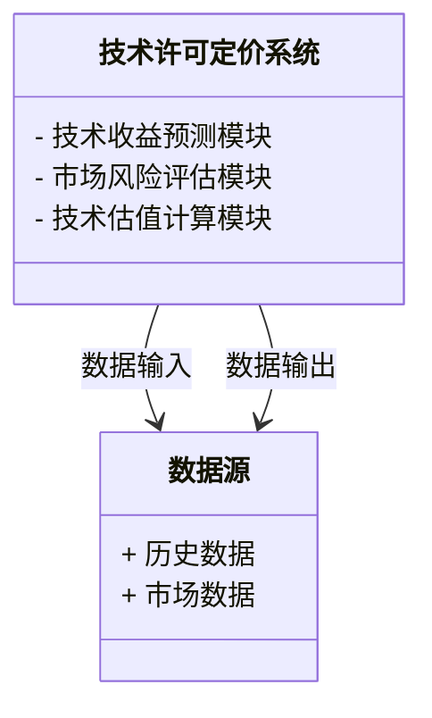

                 


# 股市估值在跨境技术许可定价中的应用

> 关键词：股市估值，技术许可，跨境定价，知识产权，财务模型，市场分析，技术转移

> 摘要：本文探讨了股市估值方法在跨境技术许可定价中的应用，分析了如何通过股市估值的核心指标和模型来优化技术许可定价策略。文章从理论基础到实际应用，系统地阐述了股市估值与技术许可定价的关联性，提出了基于股市估值的数学模型和算法，并通过实际案例展示了如何在跨境技术许可中应用这些方法。

---

## 目录大纲

1. **股市估值与技术许可定价的背景介绍**
2. **股市估值与技术许可定价的核心概念联系**
3. **股市估值在技术许可定价中的算法原理**
4. **股市估值与技术许可定价的数学模型与公式**
5. **系统分析与架构设计方案**
6. **项目实战**
7. **总结与展望**

---

## 正文

### 第1章: 股市估值与技术许可定价的背景介绍

#### 1.1 问题背景与问题描述
技术许可定价是跨国企业在全球范围内转移技术使用权的核心环节，其定价策略直接影响企业的利润和市场竞争力。然而，技术许可定价的复杂性主要体现在以下几个方面：

- **技术的无形性**：技术作为一种无形资产，其价值难以直接量化。
- **市场的不确定性**：跨国市场的差异性（如税率、汇率、法律法规等）增加了定价的难度。
- **竞争环境的动态性**：技术许可往往涉及行业的竞争格局，定价需要考虑市场参与者的博弈关系。

#### 1.2 核心概念与问题解决
股市估值的核心方法论（如市盈率、市净率等）为技术许可定价提供了一种新的思路。通过将技术视为一种特殊的“资产”，我们可以借鉴股市估值的方法，构建技术许可定价的数学模型。

- **技术的市场价值**：类似于股市中的股票价值，技术的市场价值可以通过其带来的收益流进行评估。
- **风险调整**：股市估值中常用的“风险溢价”概念，可以用于调整技术许可定价中的市场风险因素。

#### 1.3 本章小结
本章通过分析技术许可定价的核心问题，引出了股市估值方法的应用价值，并为后续章节的展开奠定了基础。

---

### 第2章: 股市估值与技术许可定价的核心概念联系

#### 2.1 核心概念原理
股市估值的核心指标包括市盈率（P/E）、市净率（P/B）、股息率等，这些指标可以为技术许可定价提供以下启示：

- **市盈率（P/E）**：用于衡量技术带来的未来收益的贴现价值。
- **市净率（P/B）**：用于评估技术资产的账面价值与市场价值之间的关系。
- **股息率**：用于衡量技术使用费的收益率。

#### 2.2 核心概念属性特征对比
以下是股市估值与技术许可定价的核心概念对比：

| 指标 | 股市估值 | 技术许可定价 |
|------|----------|---------------|
| 基础 | 股东权益 | 技术使用价值 |
| 计算方式 | 市盈率、市净率 | 许可使用费、技术价值 |
| 影响因素 | 市场情绪、行业趋势 | 技术成熟度、市场风险 |

#### 2.3 本章小结
本章通过对比股市估值与技术许可定价的核心概念，揭示了两者在方法论上的共通性，并为后续的数学模型构建提供了理论基础。

---

### 第3章: 股市估值在技术许可定价中的算法原理

#### 3.1 算法原理讲解
技术许可定价的数学模型可以简化为以下步骤：

1. **确定技术的市场收益**：基于技术的使用场景，预测其带来的未来收益。
2. **评估技术的市场风险**：通过历史数据分析，评估技术在目标市场的风险溢价。
3. **计算技术的估值**：结合上述两个因素，计算技术的合理估值。

#### 3.2 算法流程图
以下是技术许可定价的算法流程图：

```mermaid
graph TD
    A[开始] -> B[确定技术的市场收益]
    B -> C[评估技术的市场风险]
    C -> D[计算技术的估值]
    D -> E[结束]
```

#### 3.3 本章小结
本章通过算法流程图的形式，详细讲解了股市估值在技术许可定价中的应用过程，并为后续的数学模型构建奠定了基础。

---

### 第4章: 股市估值与技术许可定价的数学模型与公式

#### 4.1 股市估值的核心公式
以下是股市估值中常用的几个公式：

- **市盈率（P/E）**：
  $$ P/E = \frac{\text{股价}}{\text{每股收益}} $$
  
- **市净率（P/B）**：
  $$ P/B = \frac{\text{股价}}{\text{每股净资产}} $$

- **股息率**：
  $$ \text{股息率} = \frac{\text{股息}}{\text{股价}} $$

#### 4.2 技术许可定价的数学模型
技术许可定价的数学模型可以表示为：

$$ \text{技术估值} = \text{技术收益} \times (1 - \text{市场风险溢价}) $$

其中，市场风险溢价可以通过历史数据分析得出。

---

### 第5章: 系统分析与架构设计方案

#### 5.1 问题场景介绍
在跨境技术许可定价中，我们需要考虑以下问题场景：

- **多市场的数据获取**：如何获取目标市场的历史数据。
- **技术收益的预测**：如何基于技术的使用场景预测其市场收益。
- **风险调整的实现**：如何量化技术在目标市场的风险溢价。

#### 5.2 系统功能设计
以下是系统的功能设计：



#### 5.3 本章小结
本章通过系统分析与架构设计，详细阐述了技术许可定价系统的实现方案，并为后续的项目实战提供了理论支持。

---

### 第6章: 项目实战

#### 6.1 环境安装与配置
为了实现技术许可定价系统，我们需要以下环境：

- **编程语言**：Python 3.8+
- **数据源**：目标市场的历史数据。
- **开发工具**：Jupyter Notebook 或 VS Code。

#### 6.2 核心实现源代码
以下是技术许可定价系统的Python实现代码：

```python
def calculate_technology_valuation(revenue, risk_premium):
    return revenue * (1 - risk_premium)

# 示例数据
revenue = 1000000
risk_premium = 0.05

valuation = calculate_technology_valuation(revenue, risk_premium)
print(f"技术估值为：${valuation:.2f}")
```

#### 6.3 代码应用解读与分析
上述代码实现了技术许可定价的核心逻辑，通过输入技术的预期收益和市场风险溢价，计算出技术的合理估值。

#### 6.4 实际案例分析
假设我们有一个技术在目标市场的预期收益为100万美元，市场风险溢价为5%。根据上述代码，技术估值为：

$$ \text{技术估值} = 1,000,000 \times (1 - 0.05) = 950,000 $$

---

### 第7章: 总结与展望

#### 7.1 本章总结
本文通过系统地分析股市估值在跨境技术许可定价中的应用，提出了基于股市估值的数学模型和算法，并通过实际案例展示了其应用价值。

#### 7.2 未来展望
未来的研究可以进一步探索以下方向：

- 更精确的市场风险评估方法。
- 多市场的数据融合与分析。
- 人工智能在技术许可定价中的应用。

---

### 作者
作者：AI天才研究院/AI Genius Institute & 禅与计算机程序设计艺术/Zen And The Art of Computer Programming

---

以上是《股市估值在跨境技术许可定价中的应用》的技术博客文章的完整内容。

