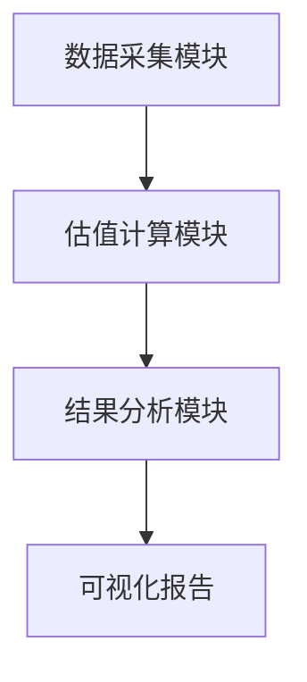

                 

# 股市估值在跨境技术许可谈判中的应用

> 关键词：股市估值，技术许可谈判，跨境交易，技术价值评估，股票估值模型，谈判策略，技术转让

> 摘要：本文探讨了股市估值在跨境技术许可谈判中的应用，分析了技术许可谈判的背景和特点，详细介绍了股市估值的核心概念与方法，以及如何将股市估值的方法应用于技术许可谈判中的技术价值评估和许可费计算。通过实际操作中的步骤与技巧，结合系统架构与工具的支持，本文为读者提供了一套完整的解决方案，并通过项目实战案例分析，深入剖析了股市估值在技术许可谈判中的具体应用。

---

## 第一部分：股市估值的基本概念与方法

### 第1章：股市估值的定义与核心要素

#### 1.1 股市估值的定义
- **1.1.1 什么是股市估值**  
  股市估值是指通过对上市公司财务数据、市场环境和行业趋势等多方面因素的分析，估算其股票的内在价值或市场价格的过程。  
  $$ 股票价值 = 财务数据 + 市场环境 + 行业趋势 $$

- **1.1.2 股市估值的核心要素**  
  - **财务数据**：包括收入、利润、资产、负债等。  
  - **市场环境**：如宏观经济状况、利率、通货膨胀等。  
  - **行业趋势**：行业的发展阶段、竞争格局等。  
  - **市场情绪**：投资者的心理预期和行为。

- **1.1.3 股市估值的基本原理**  
  股市估值的目的是为了确定股票的合理价格区间，帮助投资者做出投资决策。

#### 1.2 股市估值的主要方法
- **1.2.1 市盈率法**  
  $$ 市盈率 = 股价 / 每股净利润 $$  
  通过比较市盈率，可以判断股票是否被高估或低估。

- **1.2.2 市净率法**  
  $$ 市净率 = 股价 / 每股净资产 $$  
  适用于重资产行业的公司估值。

- **1.2.3 股息率法**  
  $$ 股息率 = 每股股息 / 股价 $$  
  用于评估股票的分红能力。

- **1.2.4 内在价值法**  
  内在价值法通过对公司未来现金流的折现，计算其合理价格。  
  $$ 内在价值 = \sum_{t=1}^{n} \frac{CF_t}{(1+r)^t} $$  
  其中，CF_t为第t年的现金流，r为折现率。

### 第2章：股市估值的核心模型与公式

#### 2.1 常见估值模型
- **2.1.1 市盈率模型**  
  $$ P/E = \frac{股价}{每股净利润} $$  
  常用于评估成长型公司。

- **2.1.2 市净率模型**  
  $$ P/B = \frac{股价}{每股净资产} $$  
  适合评估银行、房地产等重资产行业。

- **2.1.3 股息贴现模型**  
  $$ 股票价值 = \sum_{t=1}^{\infty} \frac{\text{股息}_t}{(1+r)^t} $$  
  用于评估成熟企业的价值。

- **2.1.4 内在价值模型**  
  $$ 内在价值 = \sum_{t=1}^{n} \frac{\text{现金流}_t}{(1+r)^t} $$  
  常用于评估具有稳定现金流的企业。

#### 2.2 股票估值公式
- **2.2.1 市盈率公式**  
  $$ P/E = \frac{股价}{\text{每股净利润}} $$  

- **2.2.2 市净率公式**  
  $$ P/B = \frac{股价}{\text{每股净资产}} $$  

- **2.2.3 股息率公式**  
  $$ \text{股息率} = \frac{\text{每股股息}}{\text{股价}} $$  

- **2.2.4 内在价值计算公式**  
  $$ V = \sum_{t=1}^{\infty} \frac{\text{现金流}_t}{(1+r)^t} $$  

#### 2.3 股票估值的数学模型
- **2.3.1 市盈率模型的数学表达**  
  $$ P = E \times P/E $$  

- **2.3.2 内在价值模型的数学表达**  
  $$ V = \sum_{t=1}^{n} \frac{\text{现金流}_t}{(1+r)^t} $$  

- **2.3.3 市场情绪指数模型**  
  $$ \text{情绪指数} = \alpha \times \text{市场情绪} + \beta \times \text{宏观经济指标} $$  

---

## 第三部分：技术许可谈判的背景与特点

### 第3章：技术许可谈判的基本框架

#### 3.1 技术许可谈判的背景
- **3.1.1 技术许可的定义**  
  技术许可是指一方将其技术使用权授予另一方，以获得许可费或其他形式的收益。

- **3.1.2 技术许可的类型**  
  - **独占许可**：授予方在指定区域内不得再授权第三方使用该技术。  
  - **排他许可**：授予方可以在指定区域内使用该技术，但不得授权第三方。  
  - **普通许可**：授予方可以将技术授权给多个 licensee 使用。

- **3.1.3 技术许可在国际贸易中的作用**  
  技术许可是跨国公司进行技术转移和国际合作的重要方式。

#### 3.2 技术许可谈判的核心问题
- **3.2.1 技术价值的评估**  
  如何准确评估技术的市场价值，是技术许可谈判的核心问题。

- **3.2.2 许可费的确定**  
  许可费的计算通常基于技术的市场价值、使用范围和期限等因素。

- **3.2.3 谈判策略的制定**  
  双方在谈判中需要综合考虑技术价值、市场环境和商业利益。

---

## 第四部分：股市估值在技术许可谈判中的应用

### 第4章：技术价值评估与股市估值方法

#### 4.1 技术价值评估的核心要素
- **技术的市场前景**  
  包括技术的市场需求、应用范围和竞争情况。

- **技术的生命周期**  
  技术所处的发展阶段（导入期、成长期、成熟期、衰退期）。

- **技术的可替代性**  
  技术是否容易被其他技术替代。

#### 4.2 股市估值方法在技术价值评估中的应用
- **市盈率法的应用**  
  将技术的价值与同行业企业的市盈率进行比较，评估技术的市场价值。

- **市净率法的应用**  
  适用于技术型企业的估值，尤其是重资产型技术。

- **股息贴现模型的应用**  
  用于评估技术的未来收益能力。

#### 4.3 许可费计算的股市估值方法
- **基于市盈率的许可费计算**  
  $$ \text{许可费} = \text{技术价值} \times \text{市盈率} $$  

- **基于现金流的许可费计算**  
  $$ \text{许可费} = \sum_{t=1}^{n} \frac{\text{现金流}_t}{(1+r)^t} $$  

---

## 第五部分：实际操作中的步骤与技巧

### 第5章：技术许可谈判的策略与技巧

#### 5.1 谈判前的准备工作
- **市场分析**  
  对技术的市场需求、竞争环境和行业趋势进行深入分析。

- **技术评估**  
  对技术的市场价值、生命周期和可替代性进行评估。

- **谈判目标设定**  
  明确谈判的目标，如最大化许可费收入或最小化支付成本。

#### 5.2 谈判中的策略制定
- **价格谈判策略**  
  根据技术价值和市场环境，制定灵活的价格谈判策略。

- **风险控制策略**  
  通过合同条款和法律手段，降低谈判中的风险。

---

## 第六部分：系统架构与工具支持

### 第6章：技术估值系统的架构与实现

#### 6.1 技术估值系统的功能设计
- **数据采集模块**  
  收集技术相关的财务数据、市场数据和行业信息。

- **估值计算模块**  
  应用多种估值模型，计算技术的市场价值。

- **结果分析模块**  
  对估值结果进行分析，生成可视化报告。

#### 6.2 技术估值系统的架构图

---

## 第七部分：项目实战与案例分析

### 第7章：股市估值在技术许可谈判中的案例分析

#### 7.1 案例背景
- 某高科技公司拟将一项专利技术授权给海外公司，双方需进行技术许可谈判。

#### 7.2 技术价值评估
- 使用市盈率法和现金流模型评估技术价值。

#### 7.3 许可费计算
- 根据评估结果，确定许可费的合理区间。

#### 7.4 谈判策略制定
- 制定价格谈判策略，确保公司利益最大化。

---

## 总结

### 第8章：总结与展望

#### 8.1 总结
本文详细探讨了股市估值在跨境技术许可谈判中的应用，分析了技术许可谈判的背景和特点，介绍了股市估值的核心概念与方法，并通过实际案例展示了如何将股市估值的方法应用于技术价值评估和许可费计算。

#### 8.2 展望
未来，随着人工智能和大数据技术的发展，股市估值在技术许可谈判中的应用将更加广泛和深入。建议企业加强技术估值能力，提升谈判策略的科学性和有效性。

---

**作者：AI天才研究院/AI Genius Institute & 禅与计算机程序设计艺术 /Zen And The Art of Computer Programming**

