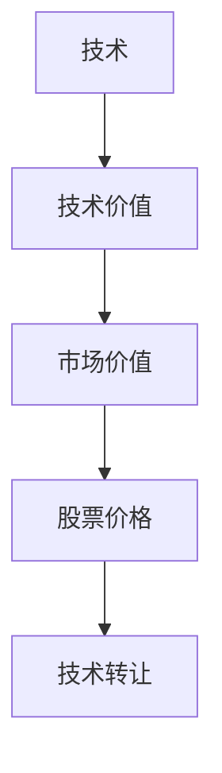
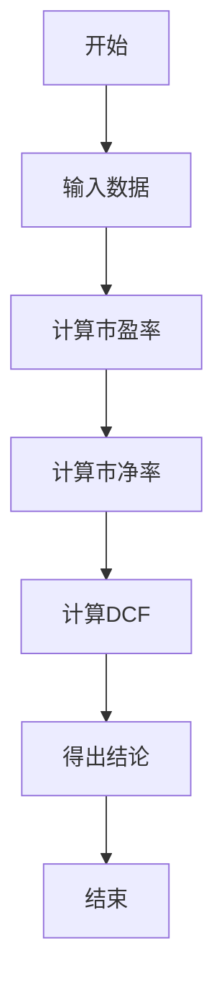
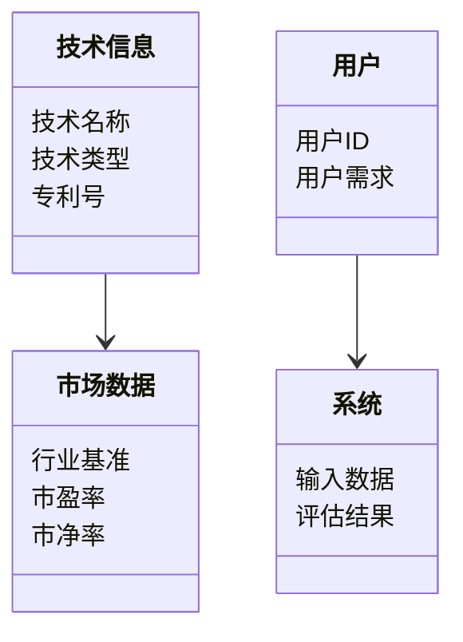
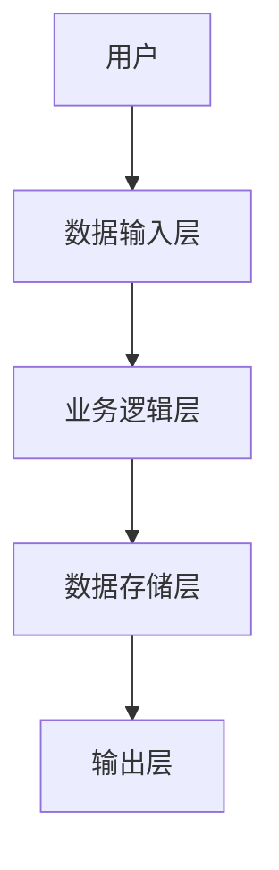
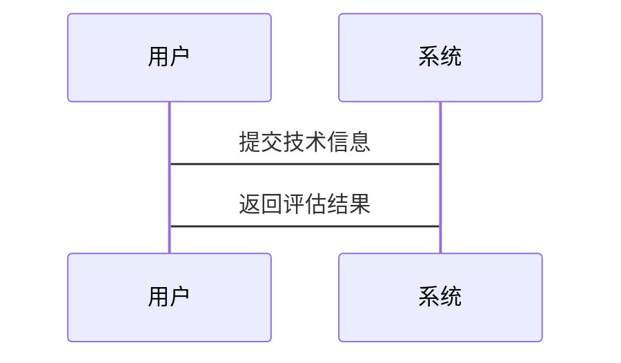

                 


# 股市估值在跨境技术转让价值评估中的应用

> 关键词：股市估值，跨境技术转让，技术价值评估，市盈率模型，折现现金流模型

> 摘要：本文探讨了股市估值在跨境技术转让中的应用，分析了技术价值评估的核心概念、方法与模型，并通过实际案例展示了如何利用股市估值方法进行技术转让的价值评估。文章还详细介绍了系统架构设计和法律风险管理，为读者提供了全面的视角。

---

## 第1章 股市估值与跨境技术转让的背景与概念

### 1.1 股市估值的基本概念

#### 1.1.1 什么是股市估值
股市估值是通过对公司财务数据和市场信息的分析，确定公司股票的合理价格范围。常用的估值方法包括市盈率（P/E）、市净率（P/B）和折现现金流模型（DCF）等。

#### 1.1.2 股市估值的核心要素
- **市盈率（P/E）**：衡量股票价格与每股收益的比率。
- **市净率（P/B）**：衡量股票价格与每股净资产的比率。
- **股息率**：衡量股票分红与股票价格的比率。
- **行业基准**：用于比较同行业公司估值的参考。

#### 1.1.3 股市估值的意义与作用
股市估值为投资者提供了一个衡量股票价格合理性的工具，帮助企业在技术转让中确定技术的价值。

### 1.2 跨境技术转让的定义与特点

#### 1.2.1 跨境技术转让的定义
跨境技术转让是指跨国公司或个人通过协议将技术、专利、商标等无形资产的所有权或使用权转移给另一方的行为。

#### 1.2.2 跨境技术转让的主要形式
- 技术授权
- 技术咨询
- 技术服务
- 技术入股

#### 1.2.3 跨境技术转让的法律与经济特征
- **法律特征**：涉及知识产权的转移和保护。
- **经济特征**：技术的价值取决于其市场应用前景和经济效益。

### 1.3 股市估值在跨境技术转让中的应用背景

#### 1.3.1 跨境技术转让的市场现状
随着全球化的发展，跨国技术转让越来越普遍，尤其是在高科技行业。

#### 1.3.2 股市估值在技术价值评估中的作用
股市估值为技术转让提供了市场化的价值参考，帮助确定技术的合理价格。

#### 1.3.3 当前存在的问题与挑战
- 技术价值难以量化。
- 跨境交易涉及复杂的法律和税务问题。
- 市场波动对估值的影响。

### 1.4 本章小结
本章介绍了股市估值和跨境技术转让的基本概念，并探讨了股市估值在技术转让中的应用背景和挑战。

---

## 第2章 技术价值评估的原理与方法

### 2.1 技术价值评估的核心原理

#### 2.1.1 技术价值的构成要素
- 技术的创新性
- 技术的市场应用前景
- 技术的经济收益能力

#### 2.1.2 技术价值评估的逻辑框架
技术价值评估需要考虑技术本身的特性和市场环境的影响。

#### 2.1.3 技术价值与市场价值的关系
技术价值是技术在市场中的表现，市场价值是技术的实际交易价格。

### 2.2 股市估值中的技术价值评估方法

#### 2.2.1 市场法
通过比较同行业公司的市盈率和市净率，确定目标公司的估值。

#### 2.2.2 收益法
基于技术的未来收益，使用折现现金流模型进行估值。

#### 2.2.3 成本法
基于技术开发成本，估算其重置成本。

### 2.3 技术价值评估方法的对比分析

#### 2.3.1 不同方法的优缺点

| 方法   | 优点                     | 缺点                     |
|--------|--------------------------|--------------------------|
| 市场法   | 数据易于获取，操作简单 | 受市场波动影响较大       |
| 收益法   | 结果更准确               | 需要预测未来现金流        |
| 成本法   | 计算简单                 | 无法反映市场价值          |

#### 2.3.2 方法适用场景的对比表格
| 方法   | 适用场景                       |
|--------|--------------------------------|
| 市场法   | 稳定的市场环境                 |
| 收益法   | 技术有稳定的收益预期           |
| 成本法   | 技术开发成本明确               |

#### 2.3.3 实际案例分析
以某科技公司为例，使用三种方法评估其技术价值，并对比结果。

### 2.4 核心概念的ER实体关系图



### 2.5 本章小结
本章详细介绍了技术价值评估的原理和方法，并通过对比分析帮助读者选择合适的方法。

---

## 第3章 基于股市估值的技术价值评估模型

### 3.1 模型的数学公式与推导

#### 3.1.1 市盈率模型
$$市盈率 = \frac{股票价格}{每股收益}$$

#### 3.1.2 市净率模型
$$市净率 = \frac{股票价格}{每股净资产}$$

#### 3.1.3 折现现金流模型
$$DCF = \sum_{t=1}^{n} \frac{CF_t}{(1+r)^t} + \frac{TV}{(1+r)^n}$$

### 3.2 算法流程图



### 3.3 算法实现代码

```python
def calculate_valuation(method, stock_price, eps, bvps, tv, r, n):
    if method == 'PE':
        return stock_price / eps
    elif method == 'PB':
        return stock_price / bvps
    elif method == 'DCF':
        dcf = 0
        for t in range(1, n+1):
            cf_t = get_cash_flow(t)
            dcf += cf_t / (1 + r)**t
        dcf += tv / (1 + r)**n
        return dcf
    else:
        return None
```

### 3.4 本章小结
本章通过数学公式和算法流程图详细介绍了技术价值评估模型的实现方法。

---

## 第4章 跨境技术转让的法律与风险管理

### 4.1 跨境技术转让的法律框架

#### 4.1.1 知识产权保护
技术转让需要遵守目标国家的知识产权法律。

#### 4.1.2 税务规划
跨国技术转让涉及复杂的税务问题，需合理规划。

### 4.2 技术转让中的风险管理

#### 4.2.1 市场风险
技术市场需求的变化会影响估值。

#### 4.2.2 法律风险
知识产权纠纷和法律合规问题。

#### 4.2.3 财务风险
汇率波动和财务状况变化的影响。

### 4.3 风险管理策略

#### 4.3.1 保险机制
购买知识产权保险，分散风险。

#### 4.3.2 合同管理
制定详细的转让合同，明确各方责任。

### 4.4 本章小结
本章探讨了跨境技术转让中的法律和风险管理策略。

---

## 第5章 项目实战：基于股市估值的技术转让评估系统

### 5.1 项目背景与目标
开发一个基于股市估值的跨境技术转让评估系统，帮助用户快速评估技术价值。

### 5.2 系统功能设计

#### 5.2.1 领域模型



#### 5.2.2 系统架构设计



#### 5.2.3 系统接口设计
- 输入接口：接收技术信息和市场数据。
- 输出接口：显示评估结果。

#### 5.2.4 系统交互流程



### 5.3 项目核心代码实现

```python
def assess_technology(technology_info, market_data):
    # 计算市盈率
    pe_ratio = calculate_pe(technology_info['eps'], market_data['stock_price'])
    # 计算市净率
    pb_ratio = calculate_pb(technology_info['bvps'], market_data['stock_price'])
    # 返回评估结果
    return {'pe_ratio': pe_ratio, 'pb_ratio': pb_ratio}
```

### 5.4 项目小结
本章通过实际案例展示了如何开发一个基于股市估值的跨境技术转让评估系统，并提供了详细的代码实现。

---

## 第6章 结论与展望

### 6.1 本章总结
本文探讨了股市估值在跨境技术转让中的应用，分析了技术价值评估的核心方法，并通过实际案例展示了系统的实现。

### 6.2 未来展望
未来可以进一步研究更复杂的估值模型，结合人工智能技术提升评估的准确性。

---

## 作者：AI天才研究院 & 禅与计算机程序设计艺术

