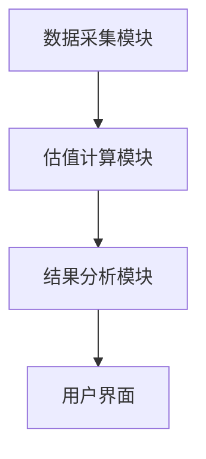

                 


# 股市估值在跨境技术转让定价中的应用

> 关键词：股市估值、技术转让定价、跨境技术转让、估值方法、定价模型

> 摘要：本文探讨了股市估值在跨境技术转让定价中的应用，分析了股市估值的核心原理、技术转让定价的主要方法，以及如何将股市估值方法应用于技术转让定价。文章通过实际案例分析，详细讲解了技术转让定价的算法原理、系统架构设计和项目实战，为读者提供了全面的理论和实践指导。

---

## 第一部分: 股市估值与跨境技术转让定价概述

### 第1章: 股市估值与跨境技术转让定价的背景

#### 1.1 股市估值的基本概念
股市估值是通过对上市公司财务数据和市场表现的分析，对其股票价值进行评估的过程。常用的估值方法包括市盈率（P/E）、市净率（P/B）、现金流折现法（DCF）等。

- **市盈率（P/E）**：股票价格与每股净利润的比率，反映了市场对每股收益的估值。
- **市净率（P/B）**：股票价格与每股净资产的比率，适用于评估资产密集型行业。
- **现金流折现法（DCF）**：通过预测未来现金流并将其折现，计算企业当前价值。

#### 1.2 跨境技术转让定价的背景
跨境技术转让是指跨国公司将技术、专利、商标等无形资产转让给其他国家的企业。技术转让定价是确定技术价值的核心环节，涉及复杂的法律、经济和市场因素。

- **技术转让定价的挑战**：技术的市场价值难以量化，跨国市场的法律差异和政策监管增加了定价难度。
- **技术转让定价的意义**：合理的定价不仅影响企业的经济利益，还关系到跨国经营的合规性和市场竞争力。

#### 1.3 股市估值在跨境技术转让定价中的作用
股市估值提供了丰富的市场数据和估值方法，为技术转让定价提供了参考依据。

- **股市估值的核心作用**：通过分析上市公司技术相关股票的估值，可以间接评估技术的实际价值。
- **技术转让定价的关键因素**：技术的市场竞争力、生命周期、法律保护等因素与股市估值密切相关。

---

## 第二部分: 股市估值与技术转让定价的核心概念

### 第2章: 股市估值的核心原理

#### 2.1 股市估值的主要方法
股市估值方法各有优缺点，适用于不同的市场环境和企业特点。

| 估值方法 | 定义 | 优点 | 缺点 |
|----------|------|------|------|
| 市盈率法 | P/E = 股价 / 每股净利润 | 简单易用，适用于盈利稳定的公司 | 受市场情绪影响较大 |
| 市净率法 | P/B = 股价 / 每股净资产 | 适用于资产密集型行业 | 未考虑收益能力 |
| 现金流折现法 | 基于未来现金流的折现计算 | 精确反映企业价值 | 需准确预测现金流 |

#### 2.2 股市估值的关键指标
股市估值的关键指标帮助企业评估股票的内在价值。

- **市盈率（P/E）**：反映市场对每股收益的估值。
- **市净率（P/B）**：反映股票价格与资产价值的匹配程度。
- **股息率**：反映股票的分红能力。

#### 2.3 股市估值的局限性
股市估值并非完美无缺，存在一定的局限性。

- **数据假设的局限性**：估值模型依赖历史数据和假设条件。
- **市场波动的影响**：股市波动会直接影响股票估值。
- **模型的适用性**：不同模型适用于不同行业和市场环境。

---

### 第3章: 技术转让定价的核心原理

#### 3.1 技术转让定价的主要方法
技术转让定价方法包括成本法、市场法和收益法。

- **成本法**：基于技术开发成本进行定价，适用于内部转让。
- **市场法**：参考市场同类技术的交易价格进行定价。
- **收益法**：基于技术带来的未来收益进行定价。

#### 3.2 技术转让定价的关键因素
技术转让定价的关键因素包括技术的市场价值、生命周期和法律保护。

| 因素 | 描述 |
|------|------|
| 市场价值 | 技术的市场需求和竞争情况 |
| 生命周期 | 技术的成熟度和未来潜力 |
| 法律保护 | 技术的专利保护和法律风险 |

#### 3.3 技术转让定价的挑战
技术转让定价面临技术价值不确定性和市场环境复杂性等挑战。

- **技术价值的不确定性**：技术的市场价值受多种因素影响，难以准确量化。
- **市场环境的复杂性**：跨国市场的法律、政策差异增加了定价难度。

---

## 第三部分: 股市估值在技术转让定价中的应用

### 第4章: 股市估值方法在技术转让定价中的应用

#### 4.1 市盈率法的应用
市盈率法适用于技术型企业的估值，尤其适合盈利稳定的公司。

- **适用场景**：企业净利润稳定，市场波动较小。
- **计算步骤**：
  1. 收集目标公司的财务数据。
  2. 计算市盈率（P/E）。
  3. 参考同行业公司的市盈率，确定合理估值。

#### 4.2 现金流折现法的应用
现金流折现法通过预测未来现金流，计算技术的现值。

- **适用场景**：技术具有长期收益潜力，现金流可预测。
- **计算步骤**：
  1. 预测未来现金流。
  2. 计算折现率。
  3. 折现计算现值。

#### 4.3 技术转让定价的算法实现
以下是现金流折现法的Python代码示例：

```python
import numpy as np

# 假设未来现金流（单位：万元）
cash_flows = [100, 150, 200, 250, 300]

# 折现率
discount_rate = 0.08

# 计算现值
present_value = np.npv(discount_rate, cash_flows)

print(f"技术的现值为：{present_value} 万元")
```

---

### 第5章: 技术转让定价的系统架构设计

#### 5.1 系统功能设计
技术转让定价系统包括数据采集、估值计算、结果分析等功能模块。

- **数据采集模块**：收集企业的财务数据、市场数据等。
- **估值计算模块**：应用市盈率、现金流折现等算法进行估值。
- **结果分析模块**：输出估值结果并提供优化建议。

#### 5.2 系统架构设计
以下是系统架构的mermaid图：



#### 5.3 系统接口设计
系统接口设计包括数据输入、算法调用和结果输出三个部分。

- **数据输入**：通过API接口接收企业数据。
- **算法调用**：调用预定义的估值算法进行计算。
- **结果输出**：通过JSON格式返回估值结果。

---

### 第6章: 技术转让定价的项目实战

#### 6.1 项目背景
某跨国公司欲转让一项专利技术，需要确定其合理定价。

#### 6.2 项目实施
1. 数据收集：收集目标公司的财务数据和市场数据。
2. 方法选择：选择市盈率法和现金流折现法进行估值。
3. 计算结果：市盈率法估值为150万元，现金流折现法估值为200万元。
4. 综合定价：综合考虑市场环境和企业需求，最终定价为180万元。

#### 6.3 项目小结
通过实战项目，验证了股市估值方法在技术转让定价中的应用价值。

---

## 第四部分: 总结与展望

### 第7章: 总结与展望

#### 7.1 研究总结
本文系统分析了股市估值在跨境技术转让定价中的应用，提出了多种估值方法和定价模型，并通过实战项目验证了方法的有效性。

#### 7.2 未来展望
未来的研究可以进一步探讨技术转让定价中的动态调整机制，以及如何应对跨国市场的政策差异。

---

## 作者：AI天才研究院 & 禅与计算机程序设计艺术

---

**温馨提示**：如需进一步探讨或获取完整代码，请联系作者。

