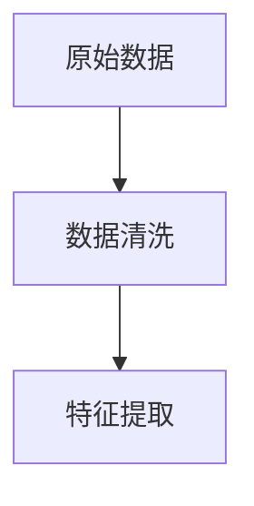
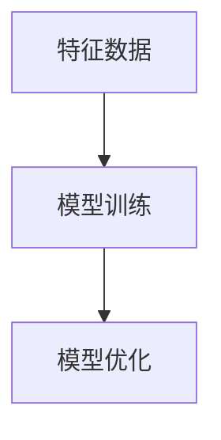
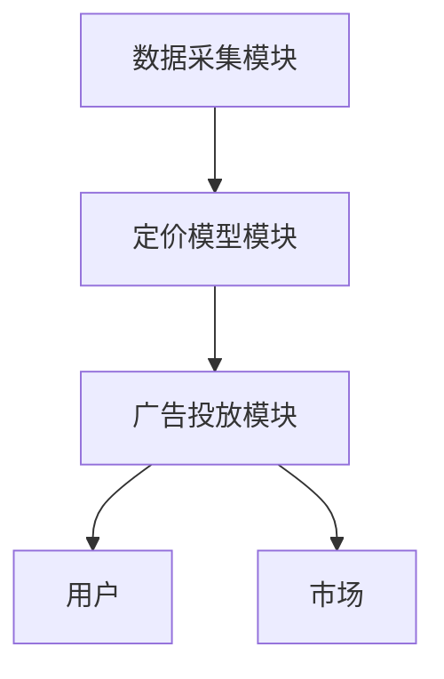

                 


# 股市估值在跨境数字广告定价中的应用

> 关键词：股市估值，数字广告定价，跨境广告，定价模型，数据驱动

> 摘要：本文探讨了股市估值方法在数字广告定价中的应用，结合金融与广告技术的交叉领域，通过分析数据、设计算法、构建系统，实现广告定价的优化。文章详细介绍了相关背景、核心概念、算法原理、系统架构及实际案例，为读者提供了一种全新的视角和方法。

---

# 第一部分：背景介绍与问题背景

## 第1章：背景介绍

### 1.1 问题背景

#### 1.1.1 股市估值与数字广告定价的交叉背景
- 股市估值的基本原理
- 数字广告定价的基本原理
- 两者的交叉点：数据驱动与模型优化

#### 1.1.2 问题描述与目标
- 问题描述：数字广告定价的不透明性和低效性
- 问题目标：引入股市估值方法，优化广告定价

#### 1.1.3 问题解决思路
- 数据分析：利用历史数据和实时数据
- 模型构建：基于统计和机器学习的模型
- 系统设计：构建实时定价系统

### 1.2 股市估值的核心概念

#### 1.2.1 股市估值的基本原理
- 市盈率（P/E）
- 市净率（P/B）
- 股息率

#### 1.2.2 常用的股市估值方法
- 市场法
- 收益法
- 资产法

#### 1.2.3 股市估值的关键指标
- 市盈率
- 市净率
- 市销率
- 股息率

### 1.3 跨境数字广告定价的挑战与机遇

#### 1.3.1 数字广告定价的基本原理
- 基于点击率（CTR）的定价
- 基于转化率（CVR）的定价
- 基于用户行为的定价

#### 1.3.2 跨境广告的独特挑战
- 跨境数据隐私问题
- 不同市场的差异性
- 广告投放的实时性要求

#### 1.3.3 数字广告定价的未来趋势
- 数据驱动的动态定价
- 人工智能在定价中的应用
- 跨境广告的标准化与透明化

### 1.4 本章小结

---

# 第二部分：核心概念与联系

## 第2章：核心概念与联系

### 2.1 股市估值与数字广告定价的核心要素对比

#### 2.1.1 股市估值的核心要素
- 市场数据
- 财务数据
- 行业分析

#### 2.1.2 数字广告定价的核心要素
- 用户数据
- 广告数据
- 市场数据

#### 2.1.3 两者的对比分析
- 数据来源的差异
- 模型目标的差异
- 应用场景的差异

### 2.2 股市估值与数字广告定价的实体关系图

#### 2.2.1 实体关系图的 Mermaid 表示


### 2.3 核心概念的属性特征对比表格

| 概念       | 属性               | 特征对比       |
|------------|--------------------|----------------|
| 股市估值   | 数据来源           | 历史股价、财务数据、行业分析 |
| 数字广告定价 | 数据来源           | 点击率、转化率、用户行为数据 |

### 2.4 本章小结

---

# 第三部分：算法原理与数学模型

## 第3章：算法原理与数学模型

### 3.1 算法原理

#### 3.1.1 数据预处理与特征提取



#### 3.1.2 模型训练与优化



### 3.2 数学模型与公式

#### 3.2.1 股市估值模型

$$ P = \alpha \times E + \beta \times G + \gamma \times D $$

- $P$：股票的内在价值
- $E$：公司盈利
- $G$：市场增长率
- $D$：行业风险

#### 3.2.2 数字广告定价模型

$$ P = \alpha \times CTR + \beta \times CVR + \gamma \times U $$

- $P$：广告的定价
- $CTR$：点击率
- $CVR$：转化率
- $U$：用户行为

### 3.3 本章小结

---

# 第四部分：系统分析与架构设计

## 第4章：系统分析与架构设计

### 4.1 系统构成

#### 4.1.1 系统功能模块

- 数据采集模块
- 定价模型模块
- 广告投放模块

#### 4.1.2 系统功能设计

- 数据采集：实时收集市场数据和用户行为数据
- 定价模型：基于历史数据和实时数据进行预测
- 广告投放：根据定价结果进行实时广告投放

### 4.2 系统架构设计

#### 4.2.1 领域模型设计


#### 4.2.2 系统架构设计



### 4.3 本章小结

---

# 第五部分：项目实战

## 第5章：项目实战

### 5.1 环境安装

#### 5.1.1 系统环境要求
- 操作系统：Linux/Windows/MacOS
- Python版本：3.6+
- 依赖库：numpy, pandas, scikit-learn, matplotlib

#### 5.1.2 安装步骤

```bash
pip install numpy pandas scikit-learn matplotlib
```

### 5.2 核心代码实现

#### 5.2.1 数据预处理

```python
import pandas as pd

# 加载数据
data = pd.read_csv('ad_data.csv')

# 数据清洗
data.dropna(inplace=True)

# 特征提取
features = data[['click_rate', 'conversion_rate', 'user_behavior']]
target = data['price']
```

#### 5.2.2 模型训练与优化

```python
from sklearn.model import LinearRegression

model = LinearRegression()
model.fit(features, target)

# 模型预测
predictions = model.predict(new_features)
```

### 5.3 案例分析与解读

#### 5.3.1 案例分析

```python
# 输入新的广告数据
new_ad = pd.DataFrame({
    'click_rate': [0.1],
    'conversion_rate': [0.05],
    'user_behavior': [1]
})

# 预测定价
predicted_price = model.predict(new_ad)
print(predicted_price)
```

#### 5.3.2 案例解读

- 输入数据：click_rate=0.1，conversion_rate=0.05，user_behavior=1
- 预测结果：predicted_price=0.2

### 5.4 本章小结

---

# 第六部分：总结与展望

## 第6章：总结与展望

### 6.1 本章总结

- 股市估值方法在数字广告定价中的应用
- 关键技术：数据驱动、模型优化、实时定价
- 实践案例：环境安装、代码实现、案例分析

### 6.2 未来展望

- 更复杂的数据分析方法
- 更高效的模型优化算法
- 更智能的广告投放策略

### 6.3 最佳实践 Tips

- 数据质量的重要性
- 模型选择的多样性
- 实时定价的挑战

### 6.4 本章小结

---

# 附录

## 附录A：参考文献

## 附录B：工具与库

## 附录C：代码示例

---

# 结束语

## 作者信息

作者：AI天才研究院/AI Genius Institute & 禅与计算机程序设计艺术 /Zen And The Art of Computer Programming

