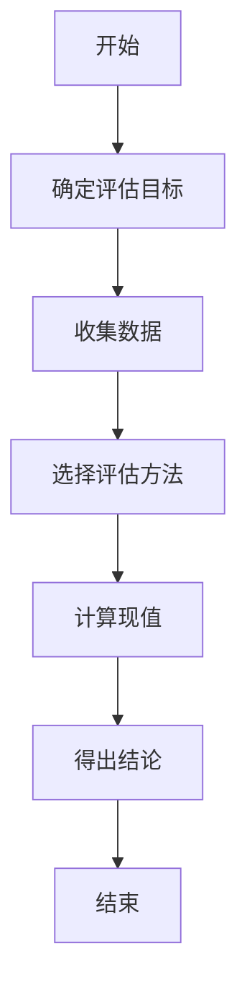
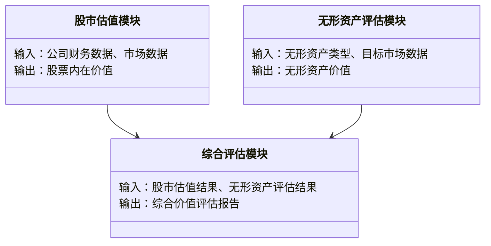
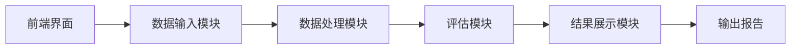

                 


# 股市估值在跨境无形资产评估中的应用

## 关键词：股市估值，跨境无形资产评估，资产评估，股市分析，无形资产

## 摘要：  
本文探讨了股市估值在跨境无形资产评估中的应用，分析了股市估值的核心原理、数学模型以及跨境无形资产评估的关键要素。通过结合实际案例和系统设计，本文详细阐述了如何利用股市估值的方法来提升跨境无形资产评估的准确性和效率。文章最后总结了最佳实践和未来研究方向，为相关领域的从业者提供了有价值的参考。

---

# 第一部分: 股市估值与跨境无形资产评估概述

## 第1章: 股市估值与跨境无形资产评估的背景与意义

### 1.1 股市估值的基本概念

#### 1.1.1 股市估值的定义与作用
股市估值是通过对股票内在价值和市场价值的分析，判断股票合理价格范围的过程。其作用包括指导投资决策、发现市场 anomalies、优化资产配置等。

#### 1.1.2 股市估值的主要方法
1. **相对估值法**：通过比较公司与可比公司的市盈率（P/E）、市净率（P/B）等指标，估算目标公司的价值。
2. **绝对估值法**：基于现金流折现模型（DCF）等方法，计算公司内在价值。

### 1.2 跨境无形资产评估的定义与特点

#### 1.2.1 无形资产的定义与分类
无形资产是指企业拥有或控制的没有实物形态的资产，包括专利权、商标权、特许经营权、商誉等。

#### 1.2.2 跨境无形资产评估的特殊性与挑战
1. **文化与法律差异**：不同国家的法律制度和市场环境差异可能影响无形资产的价值评估。
2. **流动性风险**：无形资产在跨境交易中的流动性较低，增加了评估的复杂性。
3. **数据获取难度**：跨境评估需要收集不同国家的市场数据，可能面临数据不完整或不可比的问题。

### 1.3 股市估值与跨境无形资产评估的联系与区别

#### 1.3.1 股市估值在无形资产评估中的作用
1. **提供市场参考**：股市估值可以为无形资产的市场价值提供参考。
2. **辅助内在价值计算**：通过DCF模型等方法，结合股市估值结果，计算无形资产的内在价值。

#### 1.3.2 股市估值与跨境无形资产评估的差异
1. **评估对象**：股市估值主要针对上市公司整体价值，而跨境无形资产评估侧重于单一资产的价值。
2. **影响因素**：股市估值受市场情绪、宏观经济环境影响较大，而跨境无形资产评估更关注资产的法律和文化背景。

---

## 第2章: 股市估值与跨境无形资产评估的核心概念

### 2.1 股市估值的核心原理

#### 2.1.1 股票价值的决定因素
股票价值由公司的盈利能力、成长潜力、行业地位、财务状况等多方面因素决定。

#### 2.1.2 市场价值与内在价值的关系
市场价值受短期市场情绪影响，而内在价值反映公司长期的盈利能力，是股市估值的核心目标。

### 2.2 跨境无形资产评估的关键要素

#### 2.2.1 无形资产的可比性与流动性
无形资产的可比性是指与可比资产的相似性，流动性则影响其市场价值的波动性。

#### 2.2.2 跨境交易中的文化与法律差异
不同国家的法律制度和文化背景可能影响无形资产的评估结果。

### 2.3 股市估值与跨境无形资产评估的联系与区别

#### 2.3.1 股市估值与无形资产评估的异同点
1. **相同点**：都需要考虑资产的未来现金流和折现率。
2. **不同点**：股市估值针对整体公司，而无形资产评估针对单一资产。

#### 2.3.2 股市估值在跨境无形资产评估中的特殊应用
1. **跨国并购中的应用**：在跨国并购中，无形资产评估是确定企业价值的重要部分。
2. **国际化市场的适应性**：股市估值方法需要根据目标市场的特点进行调整。

---

# 第二部分: 股市估值与跨境无形资产评估的核心理论

## 第3章: 股市估值的数学模型与算法原理

### 3.1 股市估值的主要方法

#### 3.1.1 市盈率法
市盈率（P/E）= 股价 / 每股净利润。该方法适用于盈利稳定的公司。

#### 3.1.2 市净率法
市净率（P/B）= 股价 / 每股净资产。适用于资产-heavy的公司。

#### 3.1.3 现金流折现法
现金流折现法（DCF）通过将未来现金流折现为现值，计算公司内在价值。

### 3.2 现金流折现模型（DCF模型）的数学公式

#### 3.2.1 DCF模型的基本公式
$$ PV = \sum_{t=1}^{n} \frac{CF_t}{(1+r)^t} + \frac{TV}{(1+r)^n} $$  
其中，\( PV \) 是现值，\( CF_t \) 是第 \( t \) 年的现金流，\( r \) 是折现率，\( TV \) 是终值。

#### 3.2.2 DCF模型的应用步骤
1. 预测未来现金流。
2. 选择合适的折现率。
3. 计算现值。
4. 确定目标股价。

### 3.3 股市估值算法的流程图


---

## 第4章: 跨境无形资产评估的数学模型与算法

### 4.1 跨境无形资产评估的主要方法

#### 4.1.1 相对评估法
通过比较可比公司的无形资产价值，估算目标资产的价值。

#### 4.1.2 市场比较法
基于市场交易数据，分析类似资产的交易价格，估算目标资产价值。

#### 4.1.3 收益现值法
基于无形资产带来的未来收益，计算其现值。

### 4.2 跨境无形资产评估的数学模型

#### 4.2.1 收益现值法公式
$$ PV = \sum_{t=1}^{n} \frac{R_t}{(1+r)^t} $$  
其中，\( R_t \) 是第 \( t \) 年的收益，\( r \) 是折现率。

#### 4.2.2 调整现值法
在收益现值法基础上，对汇率波动、法律风险等进行调整。

---

# 第三部分: 股市估值与跨境无形资产评估的系统分析

## 第5章: 股市估值与跨境无形资产评估的系统架构设计

### 5.1 问题场景介绍
在跨国并购中，评估目标公司的无形资产价值是确定整体价值的重要部分。

### 5.2 项目介绍
设计一个跨国并购中的无形资产评估系统，利用股市估值方法进行辅助评估。

### 5.3 系统功能设计

#### 5.3.1 领域模型


### 5.4 系统架构设计

#### 5.4.1 系统架构图


### 5.5 系统接口设计
1. 数据输入接口：接收公司财务数据和市场数据。
2. 评估接口：调用股市估值和无形资产评估模块。
3. 输出接口：生成综合价值评估报告。

---

## 第6章: 股市估值与跨境无形资产评估的项目实战

### 6.1 环境安装
1. 安装Python和相关库（Pandas、NumPy、Matplotlib）。
2. 收集目标公司的财务数据和市场数据。

### 6.2 系统核心实现源代码

#### 6.2.1 股市估值代码
```python
import pandas as pd
import numpy as np

def calculate_intrinsic_value(eps, growth_rate, discount_rate):
    # 假设现金流为5年，每年增长率为5%
    cash_flows = [eps * (1 + growth_rate)**i for i in range(5)]
    present_value = sum([cf / (1 + discount_rate)**i for i, cf in enumerate(cash_flows)])
    return present_value

eps = 2.5
growth_rate = 0.05
discount_rate = 0.08
intrinsic_value = calculate_intrinsic_value(eps, growth_rate, discount_rate)
print(f"内在价值：{intrinsic_value:.2f}")
```

#### 6.2.2 无形资产评估代码
```python
def assess_intangible_assets(revenue, expense, amortization, discount_rate):
    # 假设未来5年收益
    net_cash_flows = [revenue * (1 - expense / revenue) * (1 - amortization / revenue) for _ in range(5)]
    present_value = sum([cf / (1 + discount_rate)**i for i, cf in enumerate(net_cash_flows)])
    return present_value

revenue = 100
expense = 20
amortization = 5
discount_rate = 0.08
asset_value = assess_intangible_assets(revenue, expense, amortization, discount_rate)
print(f"无形资产价值：{asset_value:.2f}")
```

### 6.3 案例分析
以一家科技公司为例，评估其跨境无形资产价值，展示代码实现和结果分析。

### 6.4 项目总结
总结项目实施过程中的关键点和经验教训，提出改进建议。

---

# 第四部分: 股市估值与跨境无形资产评估的最佳实践

## 第7章: 最佳实践与注意事项

### 7.1 小结
股市估值在跨境无形资产评估中具有重要的应用价值，但需要结合具体场景进行调整。

### 7.2 注意事项
1. 数据准确性：确保输入数据的准确性和完整性。
2. 模型适用性：选择适合目标资产的评估模型。
3. 风险控制：考虑汇率波动和法律风险等外部因素。

### 7.3 拓展阅读
推荐相关书籍和论文，供进一步学习参考。

---

# 作者：AI天才研究院/AI Genius Institute & 禅与计算机程序设计艺术 /Zen And The Art of Computer Programming

