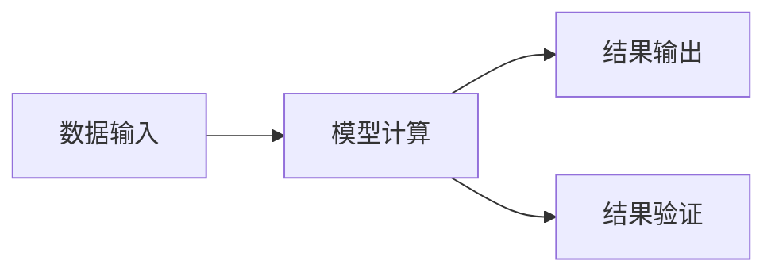

                 


# 股市估值在跨境无形资产转让定价中的应用

## 关键词：跨境无形资产、转让定价、股市估值、相对估值、DCF模型

## 摘要：  
在跨国企业中，无形资产的跨境转让定价是一个复杂而重要的问题。本文通过分析股市估值在跨境无形资产转让定价中的应用，探讨了如何利用市场数据和估值方法来确定无形资产的公允价值。文章从背景、概念、理论框架、系统分析到实际案例，全面解析了股市估值在这一领域的应用，并提出了系统化的解决方案。  

---

## 第一部分: 背景介绍

### 第1章: 股市估值与跨境无形资产转让定价的背景

#### 1.1 跨境无形资产转让定价的背景  
- **1.1.1 全球化背景下的跨国企业**  
  跨国企业在全球范围内经营，无形资产（如专利、商标、版权等）的跨境转让日益频繁。这些资产的价值评估直接影响企业的税务负担和利润分配。  
- **1.1.2 无形资产在跨国经营中的重要性**  
  无形资产是企业核心竞争力的体现，其价值往往远超有形资产。在跨境转让中，如何准确评估其价值成为关键。  
- **1.1.3 跨境无形资产转让定价的定义与特点**  
  跨境无形资产转让定价是指跨国企业在不同国家之间转让无形资产时，确定其价格的过程。其特点是涉及多方利益、税务风险高、价值评估复杂。  

#### 1.2 股市估值的基本概念  
- **1.2.1 股市估值的定义与作用**  
  股市估值是指通过对市场数据的分析，估算公司股票的公允价值。其作用在于帮助投资者和企业了解资产的真实价值。  
- **1.2.2 市场价值与内在价值的区分**  
  市场价值是资产在市场上的交易价格，内在价值是基于公司未来现金流的折现值。两者在无形资产估值中均重要。  
- **1.2.3 股市估值方法的多样性**  
  常见的估值方法包括相对估值法（市盈率、市净率）和绝对估值法（DCF模型）。  

#### 1.3 股市估值与跨境无形资产转让定价的联系  
- **1.3.1 跨境无形资产的税务影响**  
  跨境转让定价直接影响企业的税务负担，税务机关通常要求企业提供公允价值的证明。  
- **1.3.2 股市估值在定价中的作用**  
  股市估值为企业提供了市场化的价值参考，帮助确定无形资产的公允价值。  
- **1.3.3 全球经济一体化下的挑战**  
  全球化背景下，跨国企业的无形资产往往涉及多个司法管辖区，税务政策和市场环境的差异增加了估值的难度。  

### 第2章: 问题背景与问题描述  

#### 2.1 跨境无形资产转让定价的核心问题  
- **2.1.1 利润转移的税务风险**  
  跨境转让定价可能被用作利润转移的工具，导致税务纠纷。  
- **2.1.2 无形资产价值的准确评估**  
  无形资产的价值难以量化，市场数据的缺乏增加了估值的难度。  
- **2.1.3 不同国家的税收政策差异**  
  各国的税收政策不同，如何协调政策差异是跨境转让定价的关键。  

#### 2.2 股市估值在定价中的应用难点  
- **2.2.1 数据获取的难度**  
  无形资产的市场交易数据有限，难以找到可比公司或交易案例。  
- **2.2.2 方法选择的复杂性**  
  不同类型的无形资产适用不同的估值方法，选择合适的模型是关键。  
- **2.2.3 结果验证的挑战**  
  估值结果的合理性需要通过多维度验证，但实际操作中往往缺乏足够的数据支持。  

#### 2.3 问题解决的思路与边界  
- **2.3.1 多维度分析框架的构建**  
  通过市场、财务、法律等多维度分析，构建综合的估值框架。  
- **2.3.2 跨境无形资产的分类与边界**  
  根据资产类型和业务特点，对无形资产进行分类，明确其价值构成。  
- **2.3.3 核心要素的系统性分析**  
  从市场环境、资产特性、法律政策等多个维度，系统性地分析无形资产的估值问题。  

---

## 第二部分: 核心概念与联系  

### 第3章: 核心概念的原理与特征  

#### 3.1 跨境无形资产转让定价的原理  
- **3.1.1 价格制定的公平性原则**  
  转让定价应基于公允价值，避免利润转移。  
- **3.1.2 无形资产价值的评估方法**  
  包括可比非受控价格法、再销售价格法和成本加成法。  
- **3.1.3 税务机关的审查标准**  
  税务机关通常基于可比交易和行业惯例审查转让定价的合理性。  

#### 3.2 股市估值的核心原理  
- **3.2.1 市场价值的决定因素**  
  市场价值受供需关系、宏观经济环境和市场情绪影响。  
- **3.2.2 内在价值的计算模型**  
  内在价值基于未来现金流的折现，常用DCF模型。  
- **3.2.3 相关指标的动态变化**  
  如市盈率、市净率等指标会随市场变化而波动。  

#### 3.3 核心概念的对比分析  

| **特性**          | **跨境无形资产转让定价** | **股市估值**          |
|--------------------|---------------------------|-----------------------|
| **对象**          | 无形资产的公允价值       | 公司股票的公允价值   |
| **方法**          | 可比交易法、再销售价格法  | 相对估值法、DCF模型   |
| **目标**          | 避免利润转移，合规税务    | 为投资者提供参考价值 |
| **数据来源**      | 交易案例、财务报表       | 市场数据、财务数据    |

---

#### 3.4 实体关系图  

```mermaid
erd
    跨境无形资产
    端点 --> 股市估值
    端点 --> 转让定价
    端点 --> 税务合规
```

---

## 第三部分: 理论框架与方法论  

### 第4章: 股市估值方法在跨境无形资产转让定价中的应用  

#### 4.1 股市估值方法概述  
- **相对估值法**：基于可比公司的市盈率、市净率等指标。  
- **DCF模型**：通过现金流折现计算企业内在价值。  

#### 4.2 应用步骤  


---

### 第5章: 数学模型与公式  

#### 5.1 相对估值法  
- **市盈率（P/E）**：$P/E = \frac{股价}{每股净利润}$  
- **市净率（P/B）**：$P/B = \frac{股价}{每股净资产}$  

#### 5.2 DCF模型  
- 现金流折现公式：  
  $$ V = \sum_{t=1}^{n} \frac{CF_t}{(1+r)^t} $$  
  其中，$CF_t$ 是第 $t$ 年的现金流，$r$ 是折现率。  

---

## 第四部分: 系统分析与架构设计  

### 第6章: 跨境无形资产转让定价的系统分析  

#### 6.1 系统功能设计  
- 数据输入模块：收集市场数据、财务数据。  
- 模型计算模块：应用相对估值法或DCF模型。  
- 结果输出模块：生成估值报告，验证合理性。  

#### 6.2 系统架构设计  



---

## 第五部分: 项目实战  

### 第7章: 股市估值在跨境无形资产转让定价中的项目实战  

#### 7.1 项目背景  
- 某跨国技术公司转让一项专利权，需确定其公允价值。  

#### 7.2 核心代码实现  

```python
def calculate_pe_ratio(price, eps):
    return price / eps

def calculate_pfv（现金流，折现率）:
    pv = 0
    for t in range(len(现金流)):
        pv += 现金流[t] / (1 + 折现率)**t
    return pv
```

---

### 第8章: 总结与展望  

#### 8.1 总结  
股市估值为跨境无形资产的转让定价提供了重要的参考依据。通过多维度分析和系统化方法，可以有效降低税务风险。  

#### 8.2 展望  
未来，随着技术的进步和数据的丰富，股市估值在跨境无形资产转让定价中的应用将更加精准和广泛。  

---

## 作者：AI天才研究院/AI Genius Institute & 禅与计算机程序设计艺术 /Zen And The Art of Computer Programming

