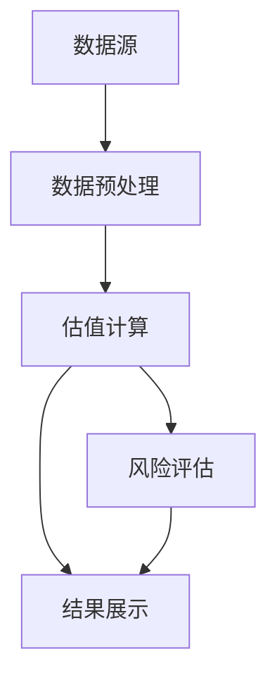

                 


# 股市估值在跨境知识产权许可中的应用

> 关键词：股市估值，知识产权许可，跨境，经济模型，定价策略，期权定价，收益分配

> 摘要：本文探讨了股市估值在跨境知识产权许可中的应用，通过分析知识产权许可的经济模型、定价策略、收益分配机制以及与股市估值的结合，提出了一种基于期权定价模型的知识产权估值方法，并通过实际案例展示了其在跨国企业中的应用。

---

## 第一章: 股市估值与知识产权许可的背景与基础

### 1.1 股票价值的基本概念

股票价值是衡量企业市场价值的核心指标，通常包括内在价值和市场价值。内在价值基于企业的盈利能力、成长潜力和资产状况，而市场价值则受投资者情绪、市场流动性等因素影响。

### 1.2 知识产权许可的基本概念

知识产权许可是指权利人将其专利、商标、版权等无形资产授权他人使用，并从中获得许可费的过程。跨境知识产权许可涉及多个国家的法律、税收和市场环境，增加了复杂性。

### 1.3 股市估值在知识产权许可中的应用背景

随着全球化的发展，跨国公司越来越多地通过知识产权许可获取额外收益。然而，知识产权的价值往往难以量化，这使得股市估值在其中扮演了重要角色。

---

## 第二章: 知识产权许可的经济模型与估值方法

### 2.1 知识产权许可的经济模型

#### 2.1.1 知识产权许可的收益分配模型

收益分配模型包括固定费率、分成制等。固定费率适用于风险较低的许可，而分成制则更适合高风险、高回报的项目。

#### 2.1.2 知识产权许可的风险分担机制

风险分担机制包括保险、担保等，确保双方在许可过程中分担风险。

#### 2.1.3 知识产权许可的定价策略

定价策略包括成本加成定价、市场导向定价等，需综合考虑市场需求、竞争状况和成本因素。

### 2.2 知识产权许可的核心经济指标

#### 2.2.1 许可收入的计算方法

许可收入 = 许可费率 × 销售收入

#### 2.2.2 许可费率的确定

许可费率需综合考虑技术复杂度、市场地位和谈判能力。

#### 2.2.3 许可期限与价值的关系

长期许可通常涉及更高的初始投资和更高的预期收益。

### 2.3 股市估值与知识产权许可的结合

#### 2.3.1 知识产权许可对股价的影响

知识产权许可的收入增长和风险降低通常会提升股价。

#### 2.3.2 股市估值对知识产权许可的反馈作用

股市估值为知识产权许可提供了市场化的定价参考。

#### 2.3.3 经济模型在股市估值中的应用

通过期权定价模型，可以将知识产权的价值嵌入到企业整体估值中。

---

## 第三章: 基于期权定价模型的知识产权估值算法

### 3.1 算法原理

期权定价模型用于评估知识产权的未来价值，考虑其潜在的市场收益和风险。

#### 3.1.1 Black-Scholes模型

$$ C = S_0 e^{\sigma^2 T/2} N(d_1) - K e^{rT} N(d_2) $$

其中，$d_1 = \frac{\ln(S_0/K) + (r + \sigma^2/2)T}{\sigma \sqrt{T}}$

$$ d_2 = d_1 - \sigma \sqrt{T} $$

### 3.2 算法实现

```python
import numpy as np
from scipy.stats import norm

def black_scholes(S, K, r, sigma, T):
    # 计算d1和d2
    d1 = (np.log(S/K) + (r + 0.5*sigma**2)*T) / (sigma*np.sqrt(T))
    d2 = d1 - sigma*np.sqrt(T)
    
    # 计算期权价格
    C = S * norm.cdf(d1) - K * np.exp(r*T) * norm.cdf(d2)
    return C
```

### 3.3 算法优化

考虑到知识产权的非流动性，调整模型中的波动率和贴现率参数。

---

## 第四章: 系统分析与架构设计

### 4.1 问题场景

跨国公司需要对知识产权进行估值，并将其纳入股市估值体系中。

### 4.2 系统功能设计

- 数据收集模块：收集知识产权相关信息和市场数据。
- 估值计算模块：使用期权定价模型进行估值。
- 结果展示模块：生成可视化报告。

### 4.3 系统架构设计



### 4.4 接口设计

- API接口：用于数据输入和结果输出。
- 用户界面：提供数据输入和结果查看功能。

---

## 第五章: 项目实战

### 5.1 实际案例分析

某跨国制药公司授权一项新药专利，使用期权定价模型进行估值。

### 5.2 代码实现

```python
def calculate_value(S, K, r, sigma, T):
    # 计算期权价值
    d1 = (np.log(S/K) + (r + 0.5*sigma**2)*T) / (sigma*np.sqrt(T))
    d2 = d1 - sigma*np.sqrt(T)
    value = S * norm.cdf(d1) - K * np.exp(r*T) * norm.cdf(d2)
    return value
```

### 5.3 案例分析

通过实际数据计算，得出知识产权的估值，并分析其对股价的影响。

---

## 第六章: 总结与展望

### 6.1 本章小结

本文提出了基于期权定价模型的知识产权估值方法，并通过实际案例进行了验证。

### 6.2 未来展望

未来研究可以考虑更多因素，如汇率波动和法律风险，以提高估值的准确性。

---

## 作者：AI天才研究院 & 禅与计算机程序设计艺术

---

通过以上步骤，我们可以系统地分析和解决股市估值在跨境知识产权许可中的应用问题，为企业制定科学的知识产权战略提供理论支持和实践指导。

