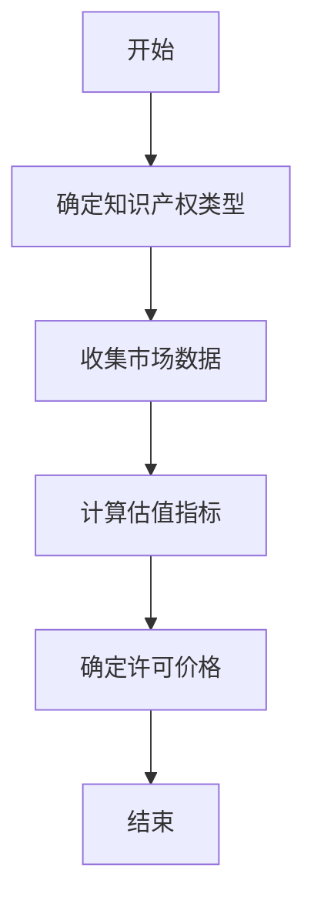
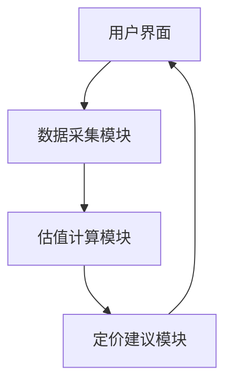

                 


# 股市估值在跨境知识产权许可定价中的应用

> 关键词：股市估值，知识产权许可定价，跨境交易，技术转移，知识产权评估

> 摘要：本文探讨了股市估值在跨境知识产权许可定价中的应用，分析了其核心概念、算法原理、系统架构，并通过实际案例展示了如何在国际交易中应用这些方法来确定知识产权的许可价格。

---

## 第1章: 股市估值与知识产权许可定价的背景

### 1.1 股市估值的基本概念

#### 1.1.1 股市估值的定义
股市估值是指通过对公司财务数据、市场表现和行业趋势的分析，评估公司股票的合理价格。常见的估值方法包括市盈率（P/E）、市净率（P/B）等。

#### 1.1.2 股市估值的核心要素
1. **财务数据**：如净利润、营业收入等。
2. **市场数据**：如行业平均市盈率、市场趋势等。
3. **风险因素**：如行业风险、公司治理等。

#### 1.1.3 股市估值的常见方法
- **相对估值法**：通过比较类似公司的估值指标来确定目标公司的价值。
- **DCF模型**：通过现金流折现法评估公司价值。

### 1.2 知识产权许可定价的定义与特点

#### 1.2.1 知识产权的基本概念
知识产权包括专利、商标、版权等，是企业的无形资产。

#### 1.2.2 知识产权许可定价的定义
知识产权许可定价是指确定将知识产权使用权授予他人的价格。

#### 1.2.3 知识产权许可定价的核心特点
- **地域性**：不同国家的市场环境差异影响定价。
- **技术性**：依赖于技术的复杂性和市场前景。
- **动态性**：市场变化会影响定价。

### 1.3 股市估值与知识产权许可定价的联系

#### 1.3.1 股市估值在知识产权定价中的作用
股市估值提供了市场化的参考，帮助确定知识产权的市场价值。

#### 1.3.2 知识产权许可定价的市场影响
合理的定价有助于促进技术转移和市场公平竞争。

#### 1.3.3 股市估值与知识产权定价的边界与外延
股市估值适用于上市公司，而知识产权定价适用于所有类型的企业，因此需要结合具体情况调整。

---

## 第2章: 股市估值与知识产权许可定价的核心概念

### 2.1 核心概念的原理

#### 2.1.1 股市估值的核心原理
通过对公司财务数据和市场数据的分析，评估其股票的合理价格。

#### 2.1.2 知识产权许可定价的核心原理
基于知识产权的市场价值和使用情况，确定许可价格。

#### 2.1.3 两者结合的理论基础
利用股市估值的方法，评估知识产权的市场价值，从而确定其许可价格。

### 2.2 核心概念的属性特征对比

| 属性 | 股市估值 | 知识产权许可定价 |
|------|----------|------------------|
| 核心要素 | 财务数据、市场数据 | 知识产权类型、市场环境 |
| 定价方法 | 相对估值法、DCF模型 | 许可使用费、收益分成 |
| 适用范围 | 上市公司 | 各类企业 |

### 2.3 实体关系图与流程图

#### 2.3.1 知识产权许可定价的ER实体关系图
```mermaid
er
  actor: 用户
  model: 知识产权
  relation: 许可定价
  actor --> relation
  model --> relation
```

#### 2.3.2 股市估值与知识产权定价的流程图


---

## 第3章: 股市估值与知识产权许可定价的算法原理

### 3.1 算法原理的数学模型

#### 3.1.1 股市估值的基本公式
$$ P = E \times r $$
其中，\( P \) 为股票价格，\( E \) 为每股收益，\( r \) 为市盈率。

#### 3.1.2 知识产权许可定价的数学模型
$$ L = V \times t $$
其中，\( L \) 为许可价格，\( V \) 为知识产权的评估价值，\( t \) 为时间因素或市场调整系数。

### 3.2 算法实现

```python
def calculate PatentValue(revenue, expense, market_ratio):
    net_income = revenue - expense
    patent_value = net_income * market_ratio
    return patent_value
```

#### 代码解读
- `revenue`：知识产权带来的收入。
- `expense`：相关的研发或维护费用。
- `market_ratio`：市场平均市盈率或类似比率。
- `net_income`：净收入，即知识产权的贡献利润。
- `patent_value`：根据市场比率计算出的知识产权价值。

---

## 第4章: 系统分析与架构设计

### 4.1 问题场景介绍

#### 4.1.1 跨境知识产权限价许可定价问题
跨国公司需要根据目标市场的具体情况调整知识产权许可价格。

#### 4.1.2 知识产权定价系统的目标
开发一个基于股市估值的知识产权定价系统，帮助跨国企业合理定价。

### 4.2 项目介绍

#### 4.2.1 项目目标
实现一个动态调整的知识产权限价系统，支持多国市场分析。

#### 4.2.2 系统功能设计
- 数据采集模块：收集各国市场数据。
- 估值计算模块：应用算法计算知识产权价值。
- 定价建议模块：提供许可价格建议。

### 4.3 系统架构设计

#### 4.3.1 系统架构图


#### 4.3.2 系统接口设计
- 数据接口：与股票数据库和知识产权数据库对接。
- 计算接口：调用估值算法。

---

## 第5章: 项目实战

### 5.1 环境安装

```bash
pip install numpy pandas matplotlib
```

### 5.2 核心代码实现

```python
import numpy as np
import pandas as pd

def calculate_patent_value(patents_info, market_data):
    avg_pe = market_data['PE'].mean()
    patent_values = []
    for patent in patents_info:
        revenue = patent['revenue']
        expense = patent['expense']
        net_income = revenue - expense
        value = net_income * avg_pe
        patent_values.append(value)
    return patent_values

# 示例数据
patents_info = [{'revenue': 100, 'expense': 20}, {'revenue': 150, 'expense': 30}]
market_data = {'PE': [15, 20, 25]}

# 计算
values = calculate_patent_value(patents_info, market_data)
print(values)
```

### 5.3 案例分析

假设一家公司拥有一项专利，在美国和欧洲市场的市盈率分别为20和25。计算其在美国和欧洲的许可价格：

```python
patents_info = [{'revenue': 100, 'expense': 20}]
market_data_us = {'PE': 20}
market_data_eu = {'PE': 25}

values_us = calculate_patent_value(patents_info, market_data_us)
values_eu = calculate_patent_value(patents_info, market_data_eu)

print(values_us)  # [2000]
print(values_eu)  # [2500]
```

---

## 第6章: 最佳实践与小结

### 6.1 最佳实践

- 定期更新市场数据，保持估值的准确性。
- 结合多因素分析，避免单一指标的偏差。

### 6.2 小结

通过股市估值方法，可以有效评估知识产权的市场价值，帮助跨国企业在跨境交易中合理定价。这种方法结合了市场动态和财务数据，提供了更科学的定价依据。

### 6.3 注意事项

- 数据的准确性和完整性直接影响估值结果。
- 需要考虑不同国家的法律法规差异。

### 6.4 拓展阅读

- 《知识产权管理与策略》
- 《股市估值与投资分析》

---

## 作者：AI天才研究院/AI Genius Institute & 禅与计算机程序设计艺术 /Zen And The Art of Computer Programming

---

这篇文章系统地介绍了股市估值在跨境知识产权许可定价中的应用，通过理论分析、算法实现和实际案例，帮助读者理解如何在国际交易中合理确定知识产权的价值。

