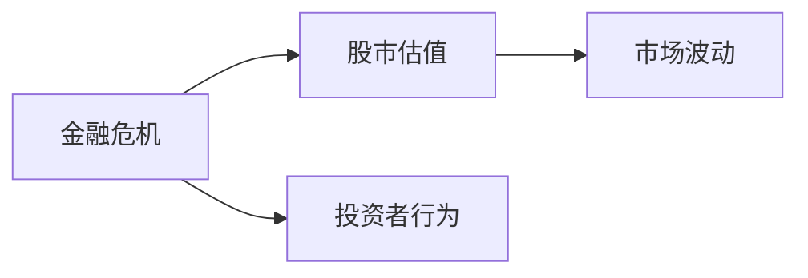
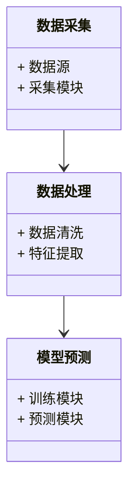
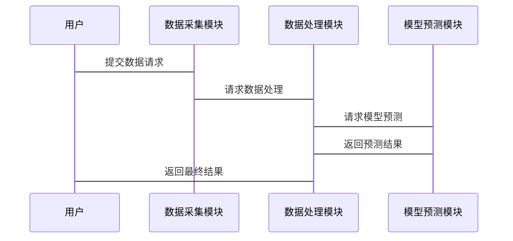

                 


# 股市估值在金融危机前后的变化特征

## 关键词
- 金融危机
- 股市估值
- 资产定价模型
- 市场情绪
- 投资者行为

## 摘要
本文探讨了金融危机前后股市估值的变化特征，分析了经济基本面、市场情绪和政策因素对估值的影响，通过资产定价模型和实证案例，揭示了估值变化的规律和投资者行为的互动关系，提供了理论和实践上的深入见解。

---

# 第一部分: 金融危机背景与股市估值概述

# 第1章: 金融危机的背景与特征

## 1.1 金融危机的定义与成因
### 1.1.1 金融危机的定义
金融危机是指金融体系的严重混乱和崩溃，通常由过度杠杆、资产泡沫和市场恐慌引发。

### 1.1.2 金融危机的主要成因
- 经济周期波动
- 过度杠杆化
- 监管缺陷
- 市场参与者行为偏差

### 1.1.3 金融危机的周期性特征
金融危机具有周期性，通常经历积累、爆发和复苏三个阶段。

## 1.2 股市估值的基本概念
### 1.2.1 股市估值的定义
股市估值是基于公司基本面和市场因素，对股票内在价值的评估。

### 1.2.2 股市估值的核心要素
- 股息率
- 市盈率（P/E）
- 市净率（P/B）

### 1.2.3 股市估值与市场波动的关系
股市估值受市场情绪和波动性影响，波动性越大，估值偏离基本面的可能性越高。

## 1.3 金融危机对股市估值的影响
### 1.3.1 金融危机对股市估值的直接冲击
金融危机导致市场恐慌，投资者抛售资产，引发股价暴跌。

### 1.3.2 金融危机前后估值变化的特征
- 金融危机前：估值偏高，泡沫积累
- 金融危机后：估值骤降，市场恐慌

### 1.3.3 估值变化对投资者行为的影响
估值下降引发投资者恐慌性抛售，进一步加剧市场下跌。

## 1.4 本章小结
本章分析了金融危机的定义、成因及其对股市估值的影响，揭示了估值变化与市场波动的紧密关系。

---

# 第二部分: 金融危机与股市估值的核心概念

# 第2章: 金融危机与股市估值的关系

## 2.1 金融危机对股市估值的传导机制
### 2.1.1 经济基本面与估值变化的关系
经济衰退导致企业盈利下降，进而影响股票估值。

### 2.1.2 市场情绪与估值波动的关联
市场情绪从乐观到恐慌的变化直接影响估值水平。

### 2.1.3 利率政策对估值的影响
低利率环境通常推高估值，反之则压低估值。

## 2.2 股市估值变化的特征分析
### 2.2.1 估值变化的周期性特征
估值呈现明显的周期性波动，与经济周期高度相关。

### 2.2.2 估值变化的行业差异
不同行业的估值受行业基本面影响，表现出不同的波动特征。

### 2.2.3 估值变化的投资者行为特征
投资者情绪波动导致估值偏离基本面。

## 2.3 核心概念的对比分析
### 2.3.1 金融危机与股市估值的对比表格
| 特性       | 金融危机                  | 股市估值                  |
|------------|---------------------------|---------------------------|
| 定义       | 金融体系的混乱与崩溃      | 股票内在价值的评估        |
| 影响因素   | 经济周期、杠杆、监管       | 市场情绪、经济基本面        |

### 2.3.2 金融危机与股市估值的ER实体关系图


## 2.4 本章小结
本章分析了金融危机与股市估值之间的相互作用，揭示了经济基本面、市场情绪和政策因素对估值的影响。

---

# 第三部分: 股市估值变化的理论基础

# 第3章: 股市估值的理论模型

## 3.1 资产定价模型
### 3.1.1 CAPM模型
CAPM模型用于确定资产的预期收益率，公式为：
$$ E(r_i) = r_f + β_i (E(r_m) - r_f) $$

### 3.1.2 APT模型
APT模型基于多个因素解释资产收益，公式为：
$$ E(r_i) = \sum \beta_{i,j} (E(r_j) - r_f) $$

### 3.1.3 其他相关模型
- Fama三因素模型
- Carhart四因素模型

## 3.2 股市估值的数学模型
### 3.2.1 CAPM模型的公式推导
通过CAPM模型推导股票的预期收益，进而评估其估值是否合理。

## 3.3 市场情绪与估值的关系
市场情绪通过影响投资者行为间接影响股市估值，可用情绪指数如VIX指数来衡量。

## 3.4 本章小结
本章介绍了资产定价模型及其在股市估值中的应用，分析了市场情绪对估值的影响。

---

# 第四部分: 股市估值变化的实证分析

# 第4章: 金融危机前后估值变化的实证分析

## 4.1 2008年金融危机的案例分析
### 4.1.1 金融危机前的估值特征
- 股价高位运行
- 市盈率和市净率偏高

### 4.1.2 金融危机后的估值变化
- 股价暴跌
- 估值指标显著下降

### 4.1.3 投资者行为的分析
- 抛售潮加剧市场下跌
- 机构投资者行为趋同

## 4.2 不同行业估值变化的对比
### 4.2.1 银行业估值的变化
金融危机前银行股估值偏高，危机后大幅下降。

### 4.2.2 科技行业估值的变化
科技行业在危机中表现相对稳定，估值波动较小。

## 4.3 金融危机对投资者行为的影响
### 4.3.1 投资者恐慌性抛售
### 4.3.2 投资者信心恢复过程

## 4.4 本章小结
本章通过实证分析揭示了金融危机前后不同行业估值变化的特征，强调了投资者行为对估值的影响。

---

# 第五部分: 股市估值变化的算法与模型

# 第5章: 股市估值预测的算法与模型

## 5.1 机器学习在估值预测中的应用
### 5.1.1 算法选择
- 线性回归
- 支持向量回归
- 随机森林

### 5.1.2 算法流程图


## 5.2 基于时间序列的估值预测
### 5.2.1 ARIMA模型
时间序列模型用于预测未来估值变化。

## 5.3 算法实现
### 5.3.1 Python代码示例
```python
import pandas as pd
from sklearn.linear_model import LinearRegression

# 数据加载
data = pd.read_csv('stock_data.csv')

# 特征与目标分离
X = data[['市盈率', '市净率']]
y = data['预期收益']

# 模型训练
model = LinearRegression()
model.fit(X, y)

# 预测
预测值 = model.predict(X)
```

### 5.3.2 算法原理
通过历史数据训练模型，预测未来估值变化。

## 5.4 本章小结
本章介绍了机器学习和时间序列分析在股市估值预测中的应用，提供了具体的算法实现和案例分析。

---

# 第六部分: 股市估值变化的系统架构

# 第6章: 股市估值分析系统的架构设计

## 6.1 系统功能设计
### 6.1.1 功能模块
- 数据采集
- 估值计算
- 模型预测
- 结果可视化

### 6.1.2 领域模型类图


## 6.2 系统架构设计
### 6.2.1 分层架构
- 数据层
- 业务逻辑层
- 用户界面层

### 6.2.2 系统交互序列图


## 6.3 系统接口设计
### 6.3.1 API接口
- 数据接口：GET /data
- 预测接口：POST /predict

## 6.4 本章小结
本章设计了一个完整的股市估值分析系统，涵盖了数据采集、处理、预测和可视化功能。

---

# 第七部分: 结论与展望

# 第7章: 结论与展望

## 7.1 研究结论
金融危机对股市估值产生深远影响，估值变化与经济基本面、市场情绪密切相关。

## 7.2 未来研究方向
- 更复杂算法的应用
- 多因素模型的优化
- 金融市场行为的进一步研究

## 7.3 最佳实践
- 保持对经济基本面的关注
- 重视市场情绪的影响
- 合理配置资产，分散风险

## 7.4 本章小结
本章总结了研究的主要结论，并提出了未来的研究方向和实践建议。

---

# 作者
作者：AI天才研究院/AI Genius Institute  
联系邮箱：contact@aicourse.com

