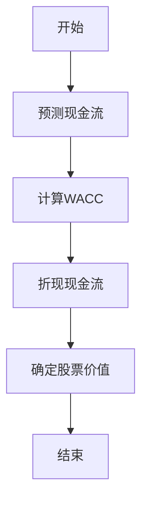

                 

# 股市估值对企业融资决策的影响

> 关键词：股市估值，企业融资决策，股票定价模型，资本成本，投资分析

> 摘要：股市估值是企业在融资过程中需要考虑的重要因素，它直接影响企业的融资成本和融资结构。本文从股市估值的基本概念出发，分析其对企业融资决策的影响，探讨股票定价模型、资本成本计算方法以及系统架构设计，结合实际案例，为企业融资决策提供理论支持和实践指导。

---

# 第1章: 股市估值的基本概念

## 1.1 股市估值的定义与重要性

股市估值是指通过对企业的财务数据和市场环境进行分析，确定其股票的合理市场价格。企业融资决策需要基于准确的股市估值，以优化融资结构和降低成本。

### 1.1.1 股市估值的定义
股市估值是对企业股票内在价值的评估，通常基于财务指标和市场状况。合理的估值帮助企业确定融资价格，吸引投资者。

### 1.1.2 股市估值的重要性
企业融资时，准确的估值有助于确定合理的融资规模和方式，避免高成本融资，提高资金使用效率。

## 1.2 企业融资决策的基本概念

### 1.2.1 企业融资的定义
企业融资是指通过发行股票、债券或其他工具筹集资金，用于业务扩展和运营。

### 1.2.2 融资决策的核心问题
融资决策涉及选择融资方式、确定融资规模和优化资本结构，以降低资本成本和风险。

---

# 第2章: 股市估值与企业融资决策的关系

## 2.1 股市估值对企业融资的影响

### 2.1.1 股市估值如何影响企业融资成本
高估值可能导致融资成本上升，反之则可能降低资本成本。

### 2.1.2 股市估值与企业融资风险的关系
合理的估值有助于降低融资风险，避免过高或过低的融资成本。

## 2.2 股市估值与企业融资决策的互动机制

### 2.2.1 股市估值变化对企业融资决策的影响
估值变化会影响企业的融资结构选择和融资工具的使用。

### 2.2.2 企业融资决策对股市估值的反馈效应
融资决策的优化可以改善市场对企业股票的估值，形成良性循环。

---

# 第3章: 股市估值的核心模型与方法

## 3.1 股票估值的主要模型

### 3.1.1 市盈率模型

#### 市盈率（P/E）公式
$$ P/E = \frac{Stock Price}{Earnings Per Share} $$

#### 优点
简单易用，适用于盈利稳定的公司。

#### 缺点
不适合亏损企业。

### 3.1.2 市净率模型

#### 市净率（P/B）公式
$$ P/B = \frac{Stock Price}{Book Value Per Share} $$

#### 优点
适用于净资产较多的企业。

#### 缺点
忽略盈利能力。

### 3.1.3 现金流折现模型（DCF）

#### 基本思路
将未来现金流折现为现值，确定股票价值。

#### 计算步骤
1. 预测未来现金流。
2. 计算加权平均资本成本（WACC）。
3. 将现金流折现，计算股票价值。

#### DCF模型的 mermaid 流程图

## 3.2 企业融资决策的数学模型

### 3.2.1 加权平均资本成本（WACC）模型

#### WACC公式
$$ WACC = w_d \times k_d \times (1 - t) + w_e \times k_e $$

#### 参数解释
- \( w_d \)：债务比例
- \( k_d \)：债务成本
- \( t \)：税率
- \( w_e \)：股权比例
- \( k_e \)：股权成本

---

# 第4章: 股市估值与企业融资决策的数学模型

## 4.1 股票估值的数学公式

### 4.1.1 市盈率公式
$$ P = E \times P/E \text{倍数} $$

### 4.1.2 市净率公式
$$ P = B \times P/B \text{倍数} $$

## 4.2 融资决策的数学模型

### 4.2.1 WACC计算公式
$$ WACC = \sum (w_i \times k_i \times (1 - t)) $$

---

# 第5章: 股市估值与企业融资决策的系统架构

## 5.1 股市估值系统的功能设计

### 5.1.1 数据采集模块

#### 数据来源
- 公司财务报表
- 市场数据

### 5.1.2 估值计算模块

#### 使用模型
- DCF模型
- 市盈率模型

### 5.1.3 结果分析模块

#### 输出内容
- 估值结果
- 融资建议

## 5.2 融资决策系统的功能

### 5.2.1 融资结构优化模块

#### 目标
最小化资本成本。

---

作者：AI天才研究院/AI Genius Institute & 禅与计算机程序设计艺术 /Zen And The Art of Computer Programming

