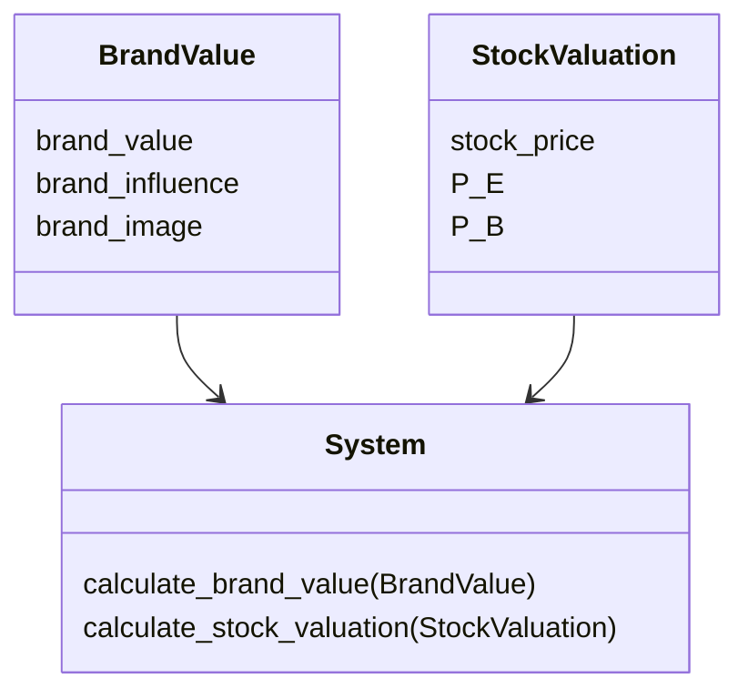
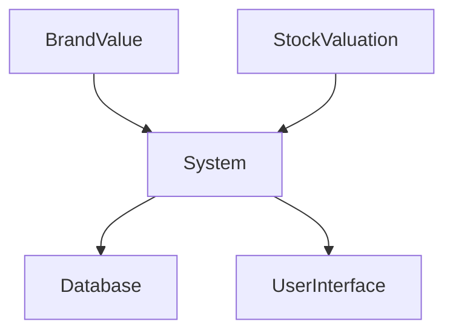

                 


# 股市估值对国际体育俱乐部品牌价值的影响

> 关键词：股市估值、品牌价值、国际体育俱乐部、企业价值、市盈率、市净率、品牌影响力

> 摘要：本文探讨了股市估值对国际体育俱乐部品牌价值的影响，从核心概念、数学模型、算法原理到系统设计和实际案例，详细分析了两者之间的关系及相互作用机制。通过量化分析和实例研究，本文揭示了如何利用股市估值来评估和提升体育俱乐部的品牌价值，为投资者和管理者提供了理论依据和实践指导。

---

## 第一部分: 背景介绍

### 第1章: 股市估值与品牌价值的概述

#### 1.1 股市估值的基本概念
- **1.1.1 股市估值的定义**  
  股市估值是通过各种金融指标（如市盈率、市净率）对上市公司价值进行评估的过程，反映了市场对公司的整体看法。
  
- **1.1.2 股市估值的核心要素**  
  包括盈利能力、成长性、资产质量、负债情况和市场竞争力等。

- **1.1.3 股市估值与品牌价值的关系**  
  品牌价值影响市场对公司的估值，而股市估值反过来也反映了品牌在市场上的表现。

#### 1.2 国际体育俱乐部品牌价值的定义
- **1.2.1 品牌价值的定义**  
  品牌价值是品牌在市场上的无形资产价值，包括品牌知名度、忠诚度和形象。

- **1.2.2 体育俱乐部品牌价值的特殊性**  
  体育俱乐部品牌价值受球队成绩、粉丝基础和市场影响力等因素影响。

- **1.2.3 品牌价值与经济表现的关联**  
  品牌价值直接影响俱乐部的收入和市场估值，而经济表现又反哺品牌建设。

### 第2章: 问题背景与研究意义
- **2.1 问题背景**  
  随着体育产业的全球化，俱乐部品牌价值与股市估值的互动日益显著，但其内在机制尚未系统研究。

- **2.2 研究意义**  
  通过量化分析，揭示品牌价值与股市估值的关系，为俱乐部管理和投资决策提供科学依据。

---

## 第二部分: 核心概念与联系

### 第3章: 品牌价值与股市估值的核心概念

#### 3.1 品牌价值的构成要素
- 品牌知名度：俱乐部的全球影响力和市场渗透力。
- 品牌忠诚度：球迷对俱乐部的长期支持程度。
- 品牌形象：俱乐部在公众中的认知和声誉。

#### 3.2 股市估值的计算方法
- **市盈率（P/E）分析**：反映市场对公司盈利能力的预期。
- **市净率（P/B）分析**：衡量公司资产的市场价值。
- **企业价值（EV）评估**：综合考虑公司整体价值的指标。

#### 3.3 品牌价值与股市估值的联系
- **影响路径**：品牌价值通过收入和利润影响股市估值。
- **反馈机制**：股市估值变化反过来影响品牌价值的市场认知。
- **协同关系**：品牌价值与股市估值相互作用，共同决定俱乐部的市场地位。

### 第4章: 核心概念的原理与数学模型

#### 4.1 品牌价值的评估模型
- **公式**：$$ \text{品牌价值} = \text{收入} \times \text{品牌影响力} \times \text{利润率} $$
- 品牌影响力的量化：通过市场调研、粉丝数量和媒体曝光度评估。

#### 4.2 股市估值的数学模型
- **市盈率模型**：$$ P/E = \frac{\text{股价}}{\text{每股收益}} $$
- **市净率模型**：$$ P/B = \frac{\text{股价}}{\text{每股净资产}} $$

#### 4.3 品牌价值与股市估值的关联模型
- 通过回归分析预测品牌价值对股市估值的影响，公式：$$ \text{股价} = \beta \times \text{品牌价值} + \epsilon $$

---

## 第三部分: 算法原理

### 第5章: 算法原理与数学模型

#### 5.1 品牌价值评估算法
- 使用回归分析预测品牌价值，代码示例：

```python
import numpy as np
from sklearn.linear_model import LinearRegression

# 示例数据
brand_values = [100, 200, 300, 400]
influences = [0.8, 1.2, 1.5, 2.0]
X = np.array(influences).reshape(-1, 1)
y = np.array(brand_values)

model = LinearRegression()
model.fit(X, y)
print("预测的品牌价值系数为:", model.coef_[0])
```

#### 5.2 股市估值预测算法
- 使用LSTM网络预测股票价格，代码示例：

```python
import keras
from keras.layers import LSTM, Dense

# 示例数据
input_shape = (100, 1)
model = keras.Sequential()
model.add(LSTM(64, input_shape=input_shape))
model.add(Dense(1))
model.compile(optimizer='adam', loss='mean_squared_error')
model.summary()
```

---

## 第四部分: 系统分析与架构设计

### 第6章: 系统设计与架构

#### 6.1 系统功能设计
- **领域模型**：使用Mermaid类图展示系统模块：



#### 6.2 系统架构设计
- **架构图**：展示系统的整体结构：



#### 6.3 系统接口设计
- **API接口**：
  - `GET /brand-value`：获取品牌价值数据。
  - `GET /stock-valuation`：获取股市估值数据。

---

## 第五部分: 项目实战

### 第7章: 项目实战与案例分析

#### 7.1 环境安装
- 安装必要的库：`pip install numpy pandas scikit-learn`

#### 7.2 核心代码实现
- **品牌价值预测代码**：

```python
import pandas as pd
from sklearn.metrics import mean_absolute_error

data = pd.DataFrame({
    'BrandInfluence': [0.8, 1.2, 1.5, 2.0],
    'BrandValue': [100, 200, 300, 400]
})

X = data[['BrandInfluence']]
y = data['BrandValue']

model = LinearRegression()
model.fit(X, y)
print("预测的品牌价值为:", model.predict([[1.6]]))
```

#### 7.3 案例分析
- 以英超俱乐部为例，分析品牌价值与股市估值的关系，展示实际应用中的预测结果。

---

## 第六部分: 最佳实践与小结

### 第8章: 最佳实践与小结

#### 8.1 最佳实践
- 定期评估品牌价值，及时调整市场策略。
- 利用股市估值数据，优化品牌建设投入。

#### 8.2 小结
本文系统分析了股市估值与国际体育俱乐部品牌价值的关系，通过理论分析和案例实践，揭示了两者之间的互动机制，并为实际应用提供了指导。

---

## 作者：AI天才研究院 & 禅与计算机程序设计艺术

