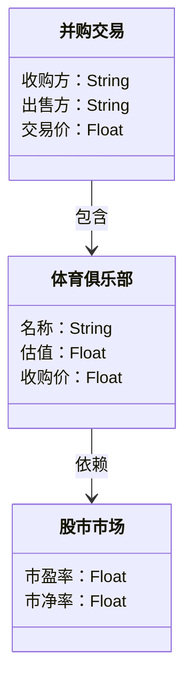
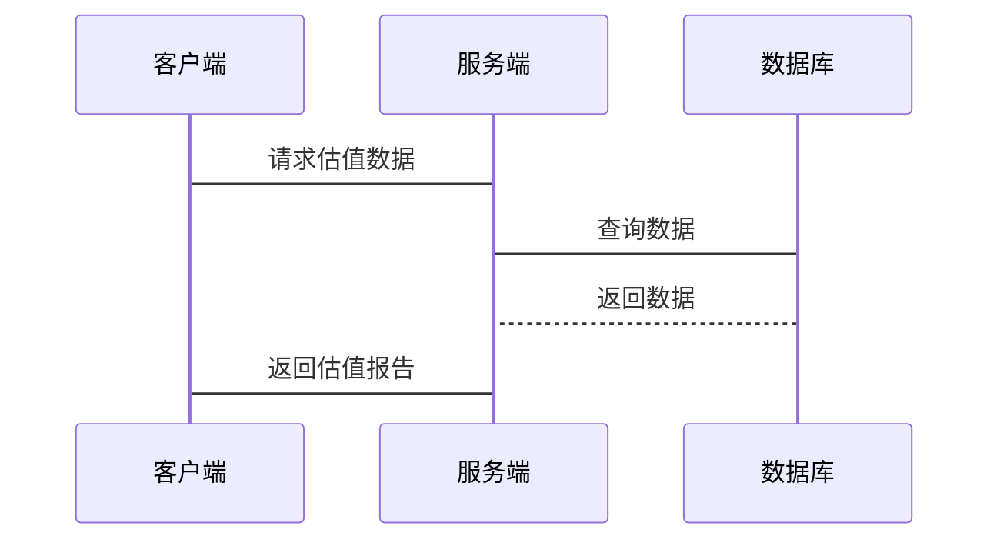

                 


# 股市估值对国际体育俱乐部并购定价的影响

## 关键词：股市估值、并购定价、国际体育俱乐部、企业价值评估、金融市场分析、投资策略

## 摘要：  
本文探讨股市估值在国际体育俱乐部并购定价中的作用，分析影响并购定价的关键因素及机制，提出基于股市估值的并购定价策略，为企业投资决策提供参考。

---

## 第1章: 股市估值与国际体育俱乐部并购定价的背景介绍

### 1.1 核心概念与问题背景

#### 1.1.1 股市估值的基本概念
股市估值是通过分析公司财务数据和市场指标，评估公司股票的公允价值。常用方法包括市盈率（P/E）、市净率（P/B）和现金流折现法（DCF）。

#### 1.1.2 国际体育俱乐部并购的核心特点
国际体育俱乐部并购是指跨国收购或出售体育俱乐部股权。这类并购涉及高估值、复杂谈判和长期价值创造。

#### 1.1.3 股市估值与并购定价的关系
股市估值为并购提供市场基准，影响买方定价决策。高估值俱乐部可能吸引溢价收购，而低估值则可能触发资产剥离。

### 1.2 核心概念属性特征对比

| 特性       | 股市估值                              | 国际体育俱乐部并购                         |
|------------|---------------------------------------|--------------------------------------------|
| 核心目标   | 评估企业市场价值                      | 获取俱乐部控制权并实现投资回报             |
| 主要方法   | 市盈率、市净率、现金流折现            | 出价评估、财务尽职调查、协商谈判            |
| 关键指标   | P/E、P/B、EV/EBITDA                  | 购买价格、杠杆比率、协同效应                |
| 参与主体   | 投资者、券商、分析师                  | 收购方、卖方、中介、监管机构                |

### 1.3 实体关系ER图

```mermaid
erDiagram
    club : 体育俱乐部
    market : 股市市场
    valuation : 估值
    acquisition : 并购
    club --> valuation : 俱乐部价值影响
    valuation --> market : 市场价值体现
    acquisition --> valuation : 并购定价依据
```

---

## 第2章: 股市估值对国际体育俱乐部并购定价的算法原理

### 2.1 股市估值的核心算法

#### 2.1.1 市盈率模型
市盈率（P/E）= 股价 / 每股收益  
**案例：** 若俱乐部每股收益为1元，行业平均P/E为15，则合理股价为15元。

#### 2.1.2 市净率模型
市净率（P/B）= 股价 / 每股净资产  
**案例：** 俱乐部净资产为10亿元，行业平均P/B为2，则合理股价为20亿元。

#### 2.1.3 现金流折现模型
$$ PV = \sum_{t=1}^{n} \frac{CF_t}{(1+r)^t} $$
其中，CF_t为自由现金流，r为折现率，n为预测期限。

### 2.2 并购定价的算法

#### 2.2.1 加权平均法
$$ 加权平均价 = \sum_{i=1}^{n} w_i \times p_i $$
权重基于俱乐部的盈利能力、品牌价值和市场地位。

#### 2.2.2 市场比较法
$$ 目标价 = \frac{\sum_{i=1}^{n} P_i}{n} $$
参考类似并购案例的平均价格。

#### 2.2.3 股东权益估算法
$$ 股东权益 = 资产 - 负债 $$
考虑杠杆和协同效应调整目标价。

### 2.3 综合模型与案例分析

#### 2.3.1 综合估

---

## 第3章: 股市估值与国际体育俱乐部并购的系统分析

### 3.1 问题场景介绍
国际体育俱乐部并购涉及复杂交易结构，需综合考虑俱乐部的财务表现、粉丝基础和市场潜力。

### 3.2 系统功能设计

#### 3.2.1 领域模型


### 3.3 系统架构设计

#### 3.3.1 系统架构图


### 3.4 接口与交互设计

#### 3.4.1 系统接口
API用于获取俱乐部历史估值和市场数据。

#### 3.4.2 交互流程


---

## 第4章: 股市估值与国际体育俱乐部并购的项目实战

### 4.1 环境安装

#### 4.1.1 Python环境安装
使用Anaconda或Pyenv安装Python 3.9+。

#### 4.1.2 工具安装
安装Pandas、NumPy、Matplotlib、Scipy。

### 4.2 核心代码实现

#### 4.2.1 估值计算代码
```python
import pandas as pd
import numpy as np

# 示例数据
data = {
    '俱乐部': ['曼联', '切尔西', '皇马'],
    'PE': [15.2, 18.3, 12.5],
    'PB': [2.8, 3.1, 1.9],
    'EV_EBITDA': [8.5, 9.7, 7.3]
}

df = pd.DataFrame(data)

# 计算综合估值
df['综合估值'] = df[['PE', 'PB', 'EV_EBITDA']].mean(axis=1)
print(df)
```

#### 4.2.2 并购定价代码
```python
def calculate_acquisition_price(target_valuation, premium=0.2):
    return target_valuation * (1 + premium)

# 示例应用
valuation = 100000000  # 估值
price = calculate_acquisition_price(valuation)
print(f"并购价格为：${price:.2f}")
```

### 4.3 案例分析

#### 4.3.1 案例背景
分析曼联2021年被收购的案例，评估股市估值对收购价的影响。

#### 4.3.2 代码实现
```python
# 曼联收购案例
valuation = 2.3  # 以2021年为例，俱乐部估值为2.3亿英镑
premium = 0.5  # 并购溢价率
price = valuation * (1 + premium)
print(f"收购价格为：£{price:.2f}")
```

---

## 第5章: 总结与展望

### 5.1 最佳实践
- 使用多模型结合法评估俱乐部价值。
- 定期更新估值模型，适应市场变化。
- 考虑俱乐部的长期增长潜力。

### 5.2 小结
股市估值是国际体育俱乐部并购定价的关键因素，理解其影响机制对企业投资决策至关重要。

### 5.3 注意事项
- 市场波动会影响估值的准确性。
- 并购溢价需谨慎评估，避免过高溢价。

### 5.4 拓展阅读
推荐阅读《企业估价的艺术》和《并购交易的艺术》。

---

## 作者：AI天才研究院/AI Genius Institute & 禅与计算机程序设计艺术 /Zen And The Art of Computer Programming

