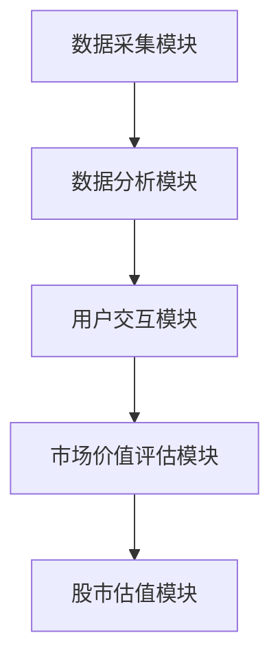

                 


# 股市估值对国际体育俱乐部数字化转型的影响

> 关键词：股市估值、国际体育俱乐部、数字化转型、数据分析、投资决策、系统架构、金融模型

> 摘要：本文探讨了股市估值与国际体育俱乐部数字化转型之间的相互影响。通过分析数字化转型对俱乐部价值的影响，结合股市估值的核心算法和模型，本文揭示了如何通过数字化手段提升俱乐部的市场价值，进而影响其股市估值。文章从背景介绍、核心概念、算法原理、系统架构、项目实战等多维度展开，结合实际案例和数学模型，深入剖析了数字化转型对国际体育俱乐部的深远影响。

---

## 第一部分: 背景介绍

### 第1章: 股市估值与国际体育俱乐部数字化转型的背景

#### 1.1 股市估值的基本概念
股市估值是通过对公司财务数据和市场表现的分析，评估其市场价值的过程。常用的方法包括市盈率（P/E）、市净率（P/B）和现金流折现模型（DCF）。这些方法帮助投资者量化公司的价值，并为投资决策提供依据。

#### 1.2 国际体育俱乐部数字化转型的现状
数字化转型是指通过技术手段优化企业运营、提升效率和用户体验的过程。在体育产业中，数字化转型主要体现在以下几个方面：
1. **数据化运营**：通过收集和分析观众、球员和市场数据，优化决策。
2. **粉丝互动**：利用社交媒体和数字平台与粉丝建立更紧密的联系。
3. **商业模式创新**：通过数字化票务、虚拟商品和增强现实体验提升收入。

#### 1.3 股市估值与数字化转型的关联性
数字化转型直接影响俱乐部的运营效率和市场价值，从而影响其股市估值。例如，通过数字化手段提升票务收入和品牌影响力，可以增加俱乐部的市场价值，进而提升其股市估值。

---

## 第二部分: 核心概念与联系

### 第2章: 股市估值的核心概念
#### 2.1 股市估值的公式与计算方法
1. **市盈率（P/E）**：
   $$ P/E = \frac{\text{股价}}{\text{每股收益}} $$
2. **市净率（P/B）**：
   $$ P/B = \frac{\text{股价}}{\text{每股净资产}} $$
3. **现金流折现模型（DCF）**：
   $$ \text{企业价值} = \sum_{t=1}^{n} \frac{\text{自由现金流}}{(1 + r)^t} + \frac{\text{终值}}{(1 + r)^n} $$

#### 2.2 数字化转型的核心概念
1. **数据化运营**：通过收集和分析数据优化决策。
2. **用户互动**：通过数字平台与用户建立更紧密的联系。
3. **技术创新**：引入人工智能、大数据等技术提升效率。

### 第3章: 核心概念的联系与对比
#### 3.1 股市估值对数字化转型的促进作用
1. 提供资金支持：高估值俱乐部更容易获得投资，用于数字化转型。
2. 激励创新：高估值俱乐部更倾向于采用新技术提升竞争力。

#### 3.2 数字化转型对股市估值的影响
1. 提升收入：数字化转型可以通过增加票务收入和粉丝互动提升俱乐部的市场价值。
2. 提高效率：通过优化运营流程降低成本，提升盈利能力。

---

## 第三部分: 算法原理讲解

### 第4章: 股市估值的算法原理
#### 4.1 市盈率模型
市盈率模型通过比较公司股价与每股收益的比率，评估公司价值。例如，如果一家俱乐部的股价为$50，每股收益为$5，则市盈率为10。

#### 4.2 现金流折现模型
现金流折现模型通过将未来现金流折现到当前价值来评估企业价值。例如，假设俱乐部未来5年的现金流分别为$10, $12, $15, $18, $22，折现率r=10%，则企业价值为：
$$ \text{企业价值} = \frac{10}{1.1} + \frac{12}{1.21} + \frac{15}{1.331} + \frac{18}{1.4641} + \frac{22}{1.6105} $$

---

## 第四部分: 系统分析与架构设计方案

### 第5章: 系统架构设计
#### 5.1 问题场景介绍
以英超俱乐部为例，分析其数字化转型过程中如何通过数据分析优化运营和提升市场价值。

#### 5.2 系统功能设计
1. 数据采集模块：收集球员数据、观众数据和市场数据。
2. 数据分析模块：利用机器学习算法预测比赛结果和观众偏好。
3. 系统架构图：


---

## 第五部分: 项目实战

### 第6章: 项目实战
#### 6.1 环境安装
安装Python、Pandas、NumPy和Scikit-learn库，用于数据处理和分析。

#### 6.2 核心实现源代码
```python
import pandas as pd
import numpy as np
from sklearn.linear_model import LinearRegression

# 数据加载
data = pd.read_csv('club_data.csv')

# 数据预处理
X = data[['revenue', 'profit', 'fans_growth']]
y = data['valuation']

# 模型训练
model = LinearRegression()
model.fit(X, y)

# 预测估值
new_data = [[200, 10, 5]]  # 示例数据
prediction = model.predict(new_data)
print(f"预测估值为：{prediction[0]:.2f}")
```

#### 6.3 实际案例分析
以英超俱乐部为例，分析其数字化转型过程中如何通过数据化运营提升市场价值。

---

## 第六部分: 总结与展望

### 第7章: 总结与展望
#### 7.1 总结
数字化转型对国际体育俱乐部的市场价值和股市估值具有深远影响。通过数据分析和技术创新，俱乐部可以显著提升运营效率和市场价值。

#### 7.2 展望
未来，随着人工智能和区块链技术的发展，数字化转型将为国际体育俱乐部带来更多的创新机遇和挑战。

---

## 作者：AI天才研究院/AI Genius Institute & 禅与计算机程序设计艺术 /Zen And The Art of Computer Programming

---

本文通过系统化的分析和实际案例的深入探讨，揭示了数字化转型对国际体育俱乐部股市估值的影响。从算法原理到系统设计，再到项目实战，本文为读者提供了全面的视角和深入的见解。

