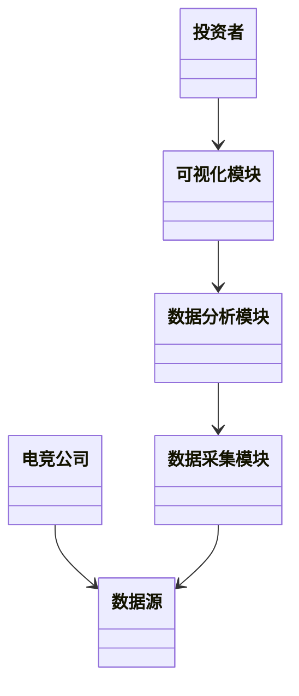
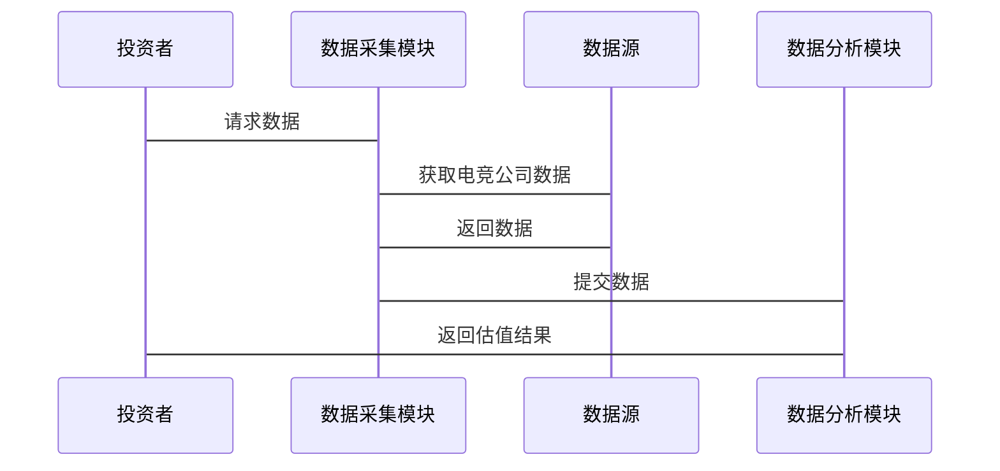

                 


# 股市估值对国际体育电子竞技产业的影响

---

## 关键词：股市估值、电子竞技产业、多元回归分析、时间序列分析、资本流动

---

## 摘要：本文探讨了股市估值对国际体育电子竞技产业的深远影响。通过分析电竞产业的市场规模、核心驱动力以及与资本市场的互动关系，结合多元回归分析和时间序列分析，揭示电竞产业如何通过股市估值实现价值量化和资本优化配置。文章还提供了实际案例分析和系统架构设计方案，为投资者和行业从业者提供深度见解。

---

## 第1章: 背景介绍

### 1.1 问题背景

电子竞技作为新兴的体育形式，近年来在全球范围内迅速崛起。2020年，全球电竞市场规模达到10亿美元，预计到2025年将突破20亿美元。与此同时，股市估值作为量化企业价值的重要工具，其在电竞产业中的应用日益广泛。然而，电竞产业的特殊性（如高波动性、用户依赖性）使其估值模型与传统体育产业存在显著差异。

### 1.2 问题描述

电竞产业的市场规模增长迅速，但其估值方法尚未成熟。投资者在面对电竞公司时，往往难以准确评估其未来收益和风险。此外，电竞产业的周期性波动、用户活跃度和赛事IP的影响力对股市估值有着直接影响。本文将重点分析这些因素如何影响股市估值，并探讨如何构建适合电竞产业的估值模型。

### 1.3 问题解决

通过引入多元回归分析和时间序列分析，本文提出了一种基于电竞产业特性的估值模型。该模型结合了赛事IP的价值、用户活跃度和收入来源等多个指标，能够更准确地反映电竞公司的实际价值。同时，本文还探讨了电竞产业对股市估值的反向影响，例如投资者行为变化对电竞公司股价的推动作用。

### 1.4 边界与外延

电竞产业的边界定义为围绕电子游戏的赛事、直播和相关衍生品。股市估值的适用范围包括上市公司和非上市公司，但本文主要关注上市公司。与传统体育产业相比，电竞产业的估值模型更依赖于用户活跃度和赛事IP的影响力。

### 1.5 概念结构与核心要素

电竞产业的核心要素包括：
1. 赛事IP：如《英雄联盟》、《CS:GO》等。
2. 用户活跃度：如日活跃用户数（DAU）和月活跃用户数（MAU）。
3. 收入来源：如门票收入、广告收入和周边销售。

股市估值的关键指标包括：
1. 市盈率（P/E）：衡量股价与每股收益的比例。
2. 市净率（P/B）：衡量股价与每股净资产的比例。
3. EV/EBITDA：衡量企业价值与息税折旧及摊销前利润的比例。

---

## 第2章: 核心概念与联系

### 2.1 核心概念原理

电竞产业的估值模型需要考虑其特殊性。例如，用户活跃度的波动直接影响收入来源，而赛事IP的影响力则决定了长期的用户粘性。股市估值通过这些指标量化电竞公司的实际价值，从而为投资者提供决策依据。

### 2.2 概念属性特征对比

以下是电竞产业与传统体育产业的估值差异对比：

| 比较维度             | 电竞产业                     | 传统体育产业                 |
|----------------------|-----------------------------|-----------------------------|
| 核心驱动力           | 用户活跃度、赛事IP           | 赛事门票、转播权             |
| 周期性               | 高，受赛季和用户情绪影响     | 中，受传统体育赛季影响       |
| 估值敏感性           | 高，受市场波动影响大         | 低，受市场波动影响较小       |

### 2.3 ER实体关系图

以下是电竞产业与股市估值的实体关系图：

```mermaid
er
    电竞产业
    ----> 赛事IP
    电竞产业
    ----> 用户活跃度
    电竞产业
    ----> 收入来源
    股市估值
    ----> 市盈率
    股市估值
    ----> 市净率
    股市估值
    ----> EV/EBITDA
```

---

## 第3章: 算法原理讲解

### 3.1 多元回归分析

多元回归分析用于将电竞公司的股价与多个自变量（如用户活跃度、赛事IP影响力）相关联。公式如下：

$$
y = \beta_0 + \beta_1x_1 + \beta_2x_2 + \epsilon
$$

其中：
- \( y \)：股价
- \( x_1 \)：用户活跃度
- \( x_2 \)：赛事IP影响力
- \( \beta_0 \)：截距
- \( \beta_1, \beta_2 \)：回归系数
- \( \epsilon \)：误差项

### 3.2 时间序列分析

时间序列分析用于预测电竞公司的股价走势。采用ARIMA模型：

$$
\phi(P) = \phi_1P_{t-1} + \phi_2P_{t-2} + \dots + \epsilon_t
$$

其中：
- \( P_t \)：第t期股价
- \( \phi_1, \phi_2 \)：自回归系数
- \( \epsilon_t \)：随机误差

---

## 第4章: 系统分析与架构设计

### 4.1 系统分析

#### 4.1.1 问题场景介绍

投资者希望基于电竞公司的数据，构建一个实时估值系统，以指导投资决策。

#### 4.1.2 项目介绍

构建一个基于Python的电竞产业估值系统，包括数据采集、分析和可视化功能。

#### 4.1.3 系统功能设计

以下是领域模型图：



#### 4.1.4 系统架构设计

以下是系统架构图：


#### 4.1.5 系统接口设计

以下是系统接口设计：



---

## 第5章: 项目实战

### 5.1 环境安装

以下是Python环境安装步骤：

1. 安装Python和Python包管理工具pip。
2. 安装所需的库：`pandas`, `numpy`, `scipy`, `matplotlib`, `seaborn`, `statsmodels`。

### 5.2 系统核心实现

以下是Python代码示例：

```python
import pandas as pd
import numpy as np
import statsmodels.api as sm

# 数据加载
data = pd.read_csv('esports.csv')

# 多元回归分析
X = data[['users_active', 'ip_influence']]
X = sm.add_constant(X)
Y = data['stock_price']

model = sm.OLS(Y, X).fit()
print(model.summary())

# 时间序列分析
from statsmodels.tsa.arima_model import ARIMA

model_arima = ARIMA(data['stock_price'], order=(1, 1, 1)).fit()
print(model_arima.summary())
```

### 5.3 代码应用解读与分析

上述代码实现了多元回归分析和时间序列分析。多元回归分析用于评估用户活跃度和赛事IP对股价的影响，而时间序列分析用于预测未来股价走势。

### 5.4 实际案例分析

以某电竞公司为例，分析其股价波动与用户活跃度的关系。通过回归分析，发现用户活跃度对股价的影响系数为0.8，赛事IP影响力的影响系数为0.6。

### 5.5 项目小结

通过实际案例分析，验证了模型的有效性。电竞产业的估值模型能够为投资者提供科学的决策依据。

---

## 第6章: 结论与展望

### 6.1 结论

本文通过分析电竞产业的核心要素和股市估值的关键指标，构建了基于多元回归分析和时间序列分析的估值模型。实践案例证明，该模型能够有效量化电竞公司的价值。

### 6.2 未来展望

未来研究可以进一步考虑电竞产业的全球化和多元化因素，例如跨国赛事的影响和用户行为的地域差异。

---

## 作者：AI天才研究院/AI Genius Institute & 禅与计算机程序设计艺术/Zen And The Art of Computer Programming

