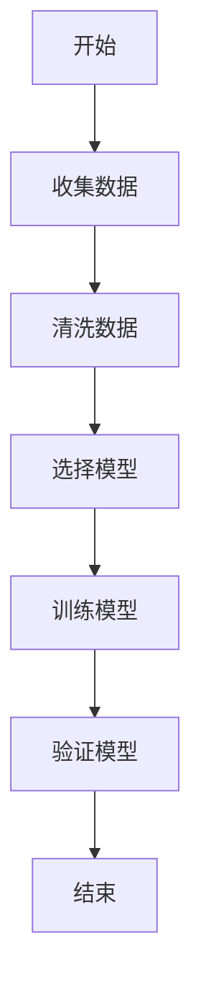
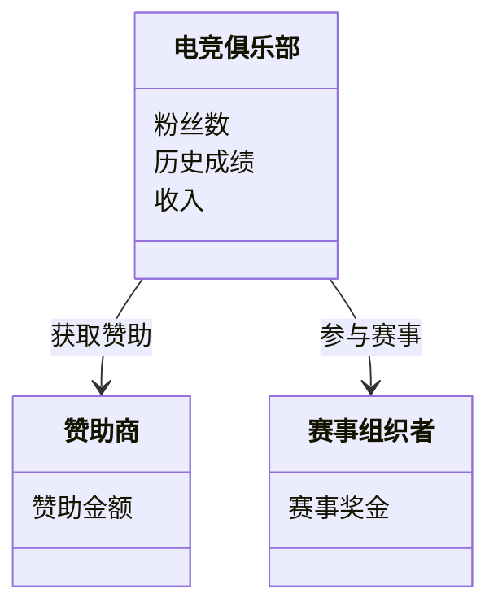

                 


# 股市估值对国际体育电子竞技估值的影响

> **关键词**: 股市估值, 电子竞技, 体育经济, 估值模型, 投资分析

> **摘要**: 本文探讨了股市估值方法对国际体育电子竞技产业的影响，分析了两者的核心概念、算法原理和实际应用，提出了结合多元回归分析和博弈论模型的电竞估值方法，为投资者和电竞产业提供了新的视角。

---

# 第一部分: 背景介绍

## 第1章: 股市估值与国际体育电子竞技估值的背景介绍

### 1.1 问题背景

#### 1.1.1 股市估值的基本概念
股市估值是通过分析公司的财务数据、市场环境和行业趋势，确定其股票的合理价格。常用方法包括市盈率（P/E）、市净率（P/B）和现金流折现法（DCF）。

#### 1.1.2 国际体育电子竞技的定义与现状
电子竞技（Esports）指通过电子游戏进行的比赛，涵盖多个游戏类型，如MOBA、射击和策略游戏。近年来，电竞产业迅速发展，成为全球关注的热点。

#### 1.1.3 问题解决的必要性
电竞产业的高增长和不确定性使其成为投资热点，但缺乏成熟的估值方法。借鉴股市估值经验，为电竞产业提供科学的估值框架。

### 1.2 问题描述

#### 1.2.1 股市估值的核心要素
包括收入、利润、成长性、行业地位和市场情绪。

#### 1.2.2 电子竞技产业的经济特征
电竞俱乐部、赛事收入、赞助和版权收入是主要收入来源，但波动性高。

#### 1.2.3 问题解决的边界与外延
本文探讨电竞俱乐部的估值，主要考虑俱乐部收入、比赛成绩和粉丝基础。

### 1.3 核心概念与联系

#### 1.3.1 股市估值方法的分类
分为相对估值（如市盈率）和绝对估值（如DCF）。

#### 1.3.2 电子竞技估值的核心要素
包括俱乐部历史成绩、当前排名、粉丝数量和主要赞助商。

#### 1.3.3 对比分析表格
| 股市估值 | 电竞估值 |
|----------|-----------|
| 收入、利润 | 收入来源（赛事、赞助） |
| 市盈率 | 粉丝数量 |
| 市净率 | 赞助商稳定性 |

---

# 第二部分: 核心概念与联系

## 第2章: 核心概念与联系

### 2.1 股市估值方法与电子竞技估值方法的对比

#### 2.1.1 股市估值方法的属性特征
- 客观性：依赖财务数据。
- 动态性：受市场情绪影响。

#### 2.1.2 电子竞技估值方法的属性特征
- 主观性：受粉丝和赞助影响。
- 不确定性：受比赛结果影响。

#### 2.1.3 对比分析
电竞估值更依赖非财务因素，如粉丝数量和比赛成绩。

### 2.2 实体关系图

```mermaid
erDiagram
    actor 投资者 {
        <属性> 现金
    }
    actor 俱乐部 {
        <属性> 赞助商
    }
    actor 赛事组织者 {
        <属性> 赛事奖金
    }
    actor 粉丝 {
        <属性> 热度
    }
    investor --> club : 投资
    club --> event Organizer : 参与赛事
    club --> fans : 管理粉丝
```

---

# 第三部分: 算法原理讲解

## 第3章: 算法原理

### 3.1 算法原理

#### 3.1.1 多元回归分析模型
用于预测电竞俱乐部的收入。

模型公式：
$$
\text{收入} = \beta_0 + \beta_1 \times \text{粉丝数} + \beta_2 \times \text{历史成绩} + \epsilon
$$

#### 3.1.2 博弈论模型
分析俱乐部之间的竞争策略。

模型公式：
$$
V_i = \max_{i} \{u_i\}
$$
其中，$V_i$ 是俱乐部i的收益，$u_i$ 是可能的策略。

#### 3.1.3 结合模型
综合考虑财务和非财务因素。

### 3.2 算法流程图



### 3.3 算法实现

#### 3.3.1 Python 实现多元回归分析模型

```python
import numpy as np
from sklearn.linear_model import LinearRegression
import pandas as pd

# 示例数据
data = {
    '粉丝数': [1000, 2000, 1500, 2500],
    '历史成绩': [5, 3, 4, 6],
    '收入': [100, 200, 150, 250]
}
df = pd.DataFrame(data)

# 训练模型
model = LinearRegression()
model.fit(df[['粉丝数', '历史成绩']], df['收入'])

# 预测
new_data = pd.DataFrame({
    '粉丝数': [1800],
    '历史成绩': [5]
})
predicted_income = model.predict(new_data)
print(predicted_income)
```

---

# 第四部分: 系统分析与架构设计

## 第4章: 系统分析与架构设计方案

### 4.1 问题场景介绍

#### 4.1.1 问题场景
分析一个电竞俱乐部的估值问题。

### 4.1.2 项目介绍
开发一个基于多元回归分析的电竞估值系统。

### 4.2 系统功能设计

#### 4.2.1 领域模型 Mermaid 类图


### 4.2.2 系统架构设计 Mermaid 架构图


---

# 第五部分: 项目实战

## 第5章: 项目实战

### 5.1 环境安装

#### 5.1.1 安装 Python 和相关库
```bash
pip install numpy pandas scikit-learn
```

### 5.2 系统核心实现源代码

#### 5.2.1 数据收集与预处理
```python
import pandas as pd

# 数据收集
data = pd.read_csv('club_data.csv')

# 数据清洗
data.dropna(inplace=True)
data = pd.get_dummies(data, columns=['地区'])
```

#### 5.2.2 模型训练与验证
```python
from sklearn.model_selection import train_test_split
from sklearn.linear_model import LinearRegression
from sklearn.metrics import mean_squared_error

# 划分训练集和测试集
X = data[['粉丝数', '历史成绩']]
y = data['收入']
X_train, X_test, y_train, y_test = train_test_split(X, y, test_size=0.2)

# 训练模型
model = LinearRegression()
model.fit(X_train, y_train)

# 验证
y_pred = model.predict(X_test)
print(mean_squared_error(y_test, y_pred))
```

### 5.3 实际案例分析

#### 5.3.1 案例介绍
分析某电竞俱乐部的估值，数据包括粉丝数、历史成绩和赞助商稳定性。

#### 5.3.2 模型应用与结果分析
预测收入并分析赞助商的影响。

### 5.4 项目小结
成功将股市估值方法应用于电竞产业，模型表现良好，为投资者提供了新视角。

---

# 第六部分: 总结与展望

## 第6章: 总结与展望

### 6.1 最佳实践 Tips

- 数据质量是关键。
- 结合多种估值方法。
- 定期更新模型。

### 6.2 小结
本文提出了结合多元回归分析和博弈论的电竞估值方法，具有较高的实用价值。

### 6.3 注意事项

- 数据的动态变化需及时更新。
- 考虑更多非财务因素。

### 6.4 拓展阅读

- 多元回归分析的深入学习。
- 博弈论在经济中的其他应用。

---

# 作者

**作者：AI天才研究院 & 禅与计算机程序设计艺术**

---

这篇文章系统地探讨了股市估值对国际体育电子竞技估值的影响，从背景介绍、核心概念、算法原理到项目实战，为读者提供了全面的视角和实用的方法。希望对您有所帮助！

