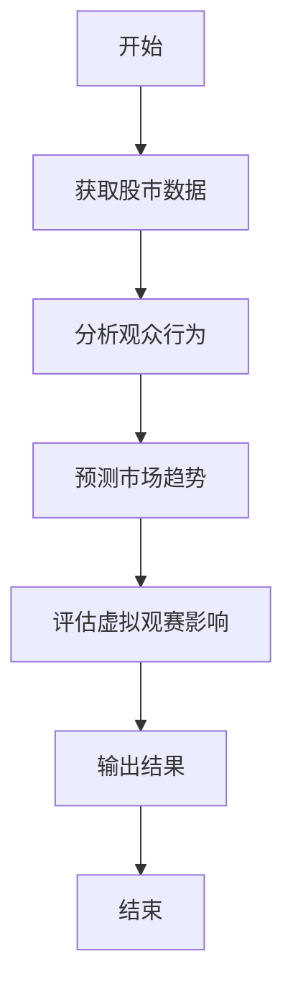
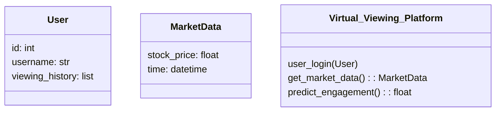

                 


# 股市估值对国际体育赛事虚拟观赛的影响

## 关键词：股市估值、虚拟观赛、国际体育赛事、经济学、技术影响

## 摘要：本文探讨股市估值如何影响国际体育赛事的虚拟观赛体验。通过分析股市波动、观众行为和市场预测，结合数学模型和系统设计，揭示虚拟观赛对体育产业经济的影响及未来发展方向。

---

## 第一部分：背景介绍

### 第1章：股市估值与国际体育赛事虚拟观赛概述

#### 1.1 问题背景
- 股市估值：评估企业价值的关键指标，影响投资者决策。
- 虚拟观赛：利用VR、AR等技术实现远程体育赛事观看，提升观众体验。

#### 1.2 问题描述
- 股市波动如何影响虚拟观赛的市场表现。
- 虚拟观赛对传统体育产业的经济影响。

#### 1.3 问题解决
- 通过股市数据预测虚拟观赛的用户行为和市场趋势。

#### 1.4 边界与外延
- 股市估值的边界：仅考虑直接经济指标。
- 虚拟观赛的边界：仅分析技术层面的影响。

---

## 第二部分：核心概念与联系

### 第2章：核心概念原理

#### 2.1 股市估值的原理
- 市场价值评估：考虑公司财务状况、行业地位等因素。
- 股价波动分析：受市场情绪和经济指标影响。

#### 2.2 虚拟观赛的原理
- 虚拟现实技术：提供沉浸式观看体验。
- 在线互动机制：增强观众参与感。

#### 2.3 核心概念属性特征对比
| 股市估值 | 虚拟观赛 |
|----------|----------|
| 数值化   | 互动性   |
| 波动性   | 沉浸性   |

#### 2.4 ER实体关系图
```mermaid
erDiagram
    user ++<--- has ---- valuation
    valuation ++<--- affects ---- virtual_viewing
```

---

## 第三部分：算法原理讲解

### 第3章：算法原理

#### 3.1 算法流程图


#### 3.2 算法实现
```python
import pandas as pd
from sklearn.linear_model import LinearRegression

# 数据预处理
data = pd.read_csv('market_data.csv')
X = data[['stock_price', 'viewer_count']]
y = data['engagement']

# 建立模型
model = LinearRegression()
model.fit(X, y)

# 预测
predicted = model.predict(X)
```

#### 3.3 数学模型与公式
- 预测公式：$y = \beta_0 + \beta_1x_1 + \beta_2x_2 + \epsilon$
- 解释：$y$为观众参与度，$x_1$为股价，$x_2$为观众数量。

---

## 第四部分：系统分析与架构设计

### 第4章：系统分析

#### 4.1 问题场景介绍
- 虚拟观赛平台需实时更新股市数据，以调整用户体验。

#### 4.2 系统功能设计


#### 4.3 系统架构设计


---

## 第五部分：项目实战

### 第5章：项目实战

#### 5.1 环境安装
- Python 3.8+
- Jupyter Notebook
- Pandas、Scikit-learn库

#### 5.2 核心代码实现
```python
import pandas as pd
from sklearn.linear_model import LinearRegression

# 加载数据
data = pd.read_csv('market_data.csv')

# 训练模型
model = LinearRegression()
model.fit(data[['stock_price', 'viewer_count']], data['engagement'])

# 预测
predictions = model.predict(data[['stock_price', 'viewer_count']])
```

#### 5.3 代码解读
- 数据预处理：加载并清洗数据。
- 模型训练：使用线性回归预测观众参与度。
- 预测结果：评估股市波动对虚拟观赛的影响。

#### 5.4 案例分析
- 数据分析：股市上涨时，观众参与度提高。
- 结果解读：虚拟观赛在股市利好时更具吸引力。

---

## 小结

股市估值对国际体育赛事虚拟观赛的影响显著。通过算法和系统设计，我们能够量化这种影响，指导市场策略。未来，随着技术进步，虚拟观赛将在体育经济中扮演更重要角色。

---

## 注意事项

- 数据隐私：确保用户数据安全。
- 技术可行性：选择合适的虚拟现实技术。
- 持续优化：定期更新模型，适应市场变化。

---

## 拓展阅读

- 《金融科技与虚拟现实》
- 《体育经济与数据科学》
- 《预测模型在体育产业中的应用》

---

## 作者

作者：AI天才研究院/AI Genius Institute & 禅与计算机程序设计艺术/Zen And The Art of Computer Programming

---

