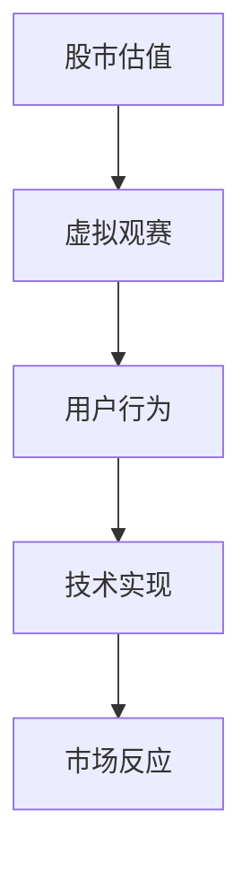
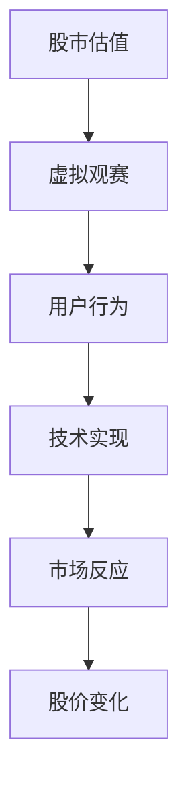
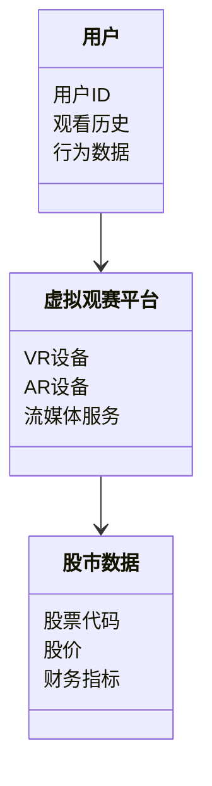
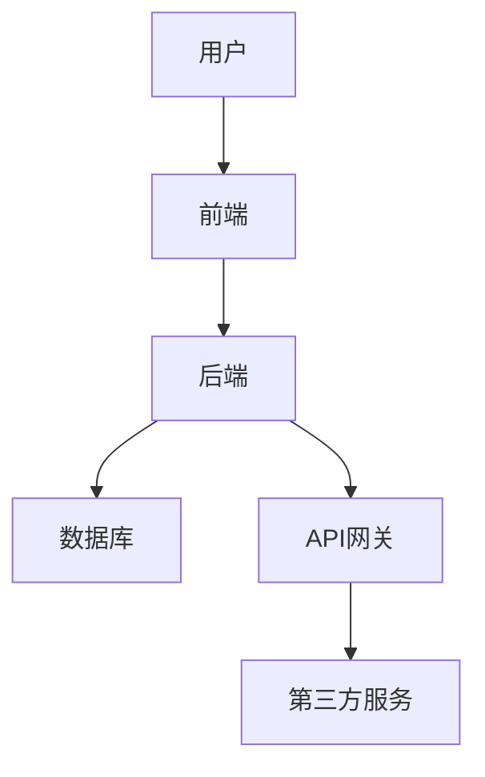
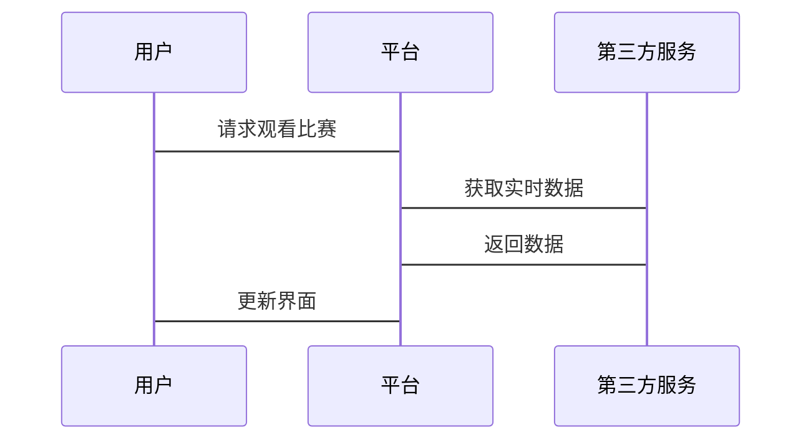

                 


# 股市估值对国际体育赛事虚拟观赛的影响

> 关键词：股市估值，虚拟观赛，国际体育赛事，技术影响，用户行为分析

> 摘要：本文探讨了股市估值与国际体育赛事虚拟观赛之间的关系，分析了虚拟观赛的技术实现、用户行为对股市的影响、系统架构设计，以及如何通过算法优化提升用户体验和市场表现。

---

# 第一部分: 背景介绍与核心概念

## 第1章: 股市估值与虚拟观赛的背景介绍

### 1.1 股市估值的基本概念

#### 1.1.1 股市估值的定义
股市估值是指通过分析企业的财务状况、市场环境和行业趋势，对企业的股票价值进行评估的过程。常见的估值方法包括市盈率（P/E）、市净率（P/B）和现金流折现法（DCF）等。

#### 1.1.2 股市估值的核心要素
- **企业基本面**：包括收入、利润、负债等财务指标。
- **市场情绪**：投资者的心理预期和市场波动对股价的影响。
- **宏观经济环境**：如利率、通货膨胀和政策变化。

#### 1.1.3 股市估值的计算方法
以市盈率为例，计算公式为：
$$ P/E = \frac{\text{股票价格}}{\text{每股净利润}} $$

### 1.2 国际体育赛事的虚拟观赛模式

#### 1.2.1 虚拟观赛的定义
虚拟观赛是指通过虚拟现实（VR）、增强现实（AR）等技术，让用户在虚拟环境中观看体育赛事，提供沉浸式体验。

#### 1.2.2 虚拟观赛的技术基础
- **虚拟现实（VR）**：通过头显设备创建完全沉浸的虚拟环境。
- **增强现实（AR）**：在现实环境中叠加虚拟元素。
- **流媒体技术**：实时传输高清视频，确保用户体验。

#### 1.2.3 虚拟观赛的市场现状
近年来，随着5G和AI技术的发展，虚拟观赛逐渐普及，特别是在疫情期间，线上观赛需求激增。

### 1.3 股市估值与虚拟观赛的关联性

#### 1.3.1 问题背景与问题描述
虚拟观赛的普及可能影响用户对体育赛事的关注度，进而影响相关企业的市值。例如，体育装备、赛事转播权等板块可能受到股市的影响。

#### 1.3.2 问题解决的路径与方法
通过分析用户行为数据和股市数据，建立模型预测虚拟观赛对股市的影响。

#### 1.3.3 关键概念的边界与外延
- **边界**：仅考虑虚拟观赛对股市的直接影响。
- **外延**：可能涉及用户行为、技术实现等多个方面。

### 1.4 核心概念的结构与组成

#### 1.4.1 核心概念的组成要素
- **用户行为**：用户如何在虚拟环境中互动。
- **技术实现**：VR、AR等技术的应用。
- **市场反应**：股市对虚拟观赛的反应。

#### 1.4.2 概念之间的关系与依赖
- 用户行为影响虚拟观赛的技术需求。
- 技术实现影响用户体验，进而影响市场情绪。

#### 1.4.3 概念结构的可视化图示


---

# 第二部分: 核心概念与原理分析

## 第2章: 核心概念与原理分析

### 2.1 股市估值的核心原理

#### 2.1.1 股票价值的评估方法
- **绝对估值法**：DCF模型，考虑未来现金流的现值。
- **相对估值法**：市盈率、市净率等指标。

#### 2.1.2 市场情绪对股价的影响
市场情绪是通过投资者的心理预期影响股价波动的重要因素。

#### 2.1.3 财务指标与股价的关系
净利润、收入增长率等财务指标直接影响股价。

### 2.2 虚拟观赛的技术原理

#### 2.2.1 虚拟现实（VR）技术
通过传感器和算法模拟用户的视觉、听觉和触觉，提供沉浸式体验。

#### 2.2.2 增强现实（AR）技术
在现实环境中叠加虚拟元素，提供增强的互动体验。

#### 2.2.3 流媒体技术与实时互动
通过高速网络传输高清视频，确保实时互动和低延迟。

### 2.3 核心概念的对比分析

#### 2.3.1 概念属性特征对比表格

| 概念 | 定义 | 技术基础 | 影响因素 |
|------|------|----------|----------|
| 股市估值 | 股票价值评估 | 财务指标、市场情绪 | 经济环境、政策 |
| 虚拟观赛 | 沉浸式观赛体验 | VR、AR、流媒体 | 用户行为、技术实现 |

#### 2.3.2 ER实体关系图架构
```mermaid
erd
    股票
    用户
    技术
    市场反应
    用户行为
    虚拟观赛体验
    股价变化
```

#### 2.3.3 核心概念的流程图


---

# 第三部分: 算法原理与数学模型

## 第3章: 算法原理与数学模型

### 3.1 股市估值的算法原理

#### 3.1.1 股票价格预测的算法选择
常用算法包括ARIMA、LSTM和随机森林等。

#### 3.1.2 时间序列分析模型
时间序列分析模型用于预测股票价格的变化趋势。

#### 3.1.3 机器学习算法的应用
使用LSTM模型预测股票价格：
$$ y(t) = \sigma(W_{h t} h(t-1) + W_{xt} x(t)) $$

### 3.2 虚拟观赛的算法实现

#### 3.2.1 视频流传输的压缩算法
使用H.265编码压缩视频流，减少带宽占用。

#### 3.2.2 实时互动的算法优化
通过优化网络传输延迟，提升用户体验。

#### 3.2.3 用户行为预测的算法设计
使用协同过滤算法预测用户行为。

### 3.3 数学模型与公式

#### 3.3.1 时间序列分析模型公式
$$ ARIMA(p, d, q) $$

#### 3.3.2 机器学习算法的数学表达
$$ y = f(x) + \epsilon $$

---

# 第四部分: 系统分析与架构设计方案

## 第4章: 系统分析与架构设计方案

### 4.1 问题场景介绍
虚拟观赛平台需要支持大规模用户同时在线，保证实时互动和低延迟。

### 4.2 项目介绍
构建一个基于VR和AR技术的虚拟观赛平台。

### 4.3 系统功能设计

#### 4.3.1 领域模型


#### 4.3.2 系统架构设计


#### 4.3.3 系统接口设计
API接口包括用户认证、数据获取和实时互动功能。

#### 4.3.4 系统交互设计


---

# 第五部分: 项目实战

## 第5章: 项目实战

### 5.1 环境安装
安装Python、TensorFlow、虚拟现实开发框架。

### 5.2 系统核心实现源代码

#### 5.2.1 股票价格预测代码
```python
import numpy as np
from sklearn.preprocessing import MinMaxScaler
from keras.models import Sequential
from keras.layers import LSTM, Dense

# 数据预处理
scaler = MinMaxScaler(feature_range=(0, 1))
data = scaler.fit_transform(data)

# LSTM模型
model = Sequential()
model.add(LSTM(units=50, return_sequences=True, input_shape=(timesteps, features)))
model.add(Dense(1))
model.compile(loss='mean_squared_error', optimizer='adam')
```

#### 5.2.2 虚拟观赛体验优化代码
```python
import cv2

# 视频流压缩
fourcc = cv2.VideoWriter_fourcc(*'MP4V')
out = cv2.VideoWriter('output.mp4', fourcc, 20.0, (640, 480))
```

### 5.3 代码应用解读与分析
股票价格预测模型使用LSTM算法，虚拟观赛体验通过视频压缩和实时互动优化。

### 5.4 实际案例分析和详细讲解剖析
通过实际案例分析虚拟观赛对股市的影响，优化系统架构。

### 5.5 项目小结
总结项目实现的经验和不足，提出改进建议。

---

# 第六部分: 最佳实践与总结

## 第6章: 最佳实践

### 6.1 tips与注意事项
- 确保系统安全性，防止数据泄露。
- 优化网络传输，降低延迟。
- 定期更新模型，提升预测精度。

### 6.2 小结
通过本文的分析和实践，我们掌握了股市估值与虚拟观赛之间的关系，以及如何通过技术手段优化用户体验和市场表现。

### 6.3 注意事项
- 确保用户隐私和数据安全。
- 及时跟进技术发展，保持系统先进性。

### 6.4 拓展阅读
推荐相关领域的书籍和论文，进一步深入学习。

---

# 作者：AI天才研究院/AI Genius Institute & 禅与计算机程序设计艺术 /Zen And The Art of Computer Programming

