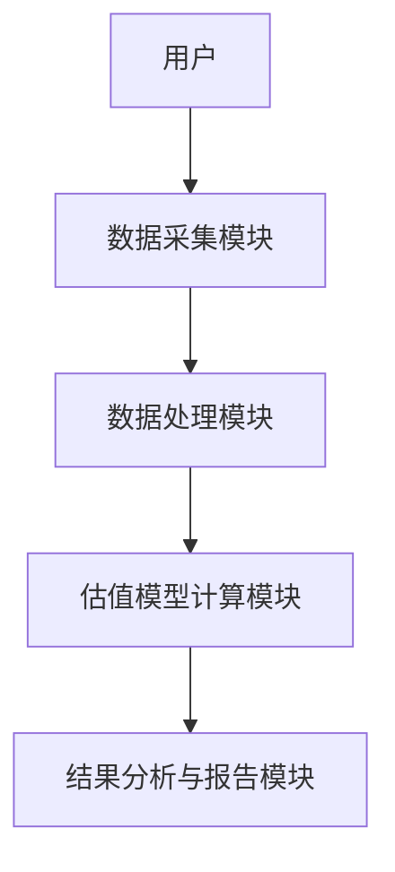
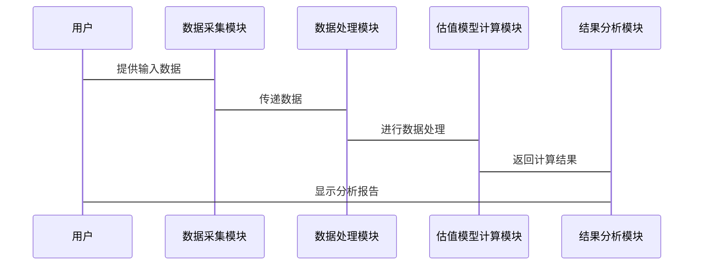

                 


# 股市估值对国际体育赛事转播权估值的影响

> 关键词：股市估值，转播权估值，市盈率，市净率，国际体育赛事，媒体经济

> 摘要：本文探讨股市估值方法对国际体育赛事转播权估值的影响，分析股市波动如何影响广告收入和观众数量，进而影响转播权的价值。通过构建综合评估系统，本文提出了一种基于股市数据和转播权数据的分析框架，帮助理解两者之间的相互作用。

---

## 第1章: 股市估值与国际体育赛事转播权估值的背景介绍

### 1.1 股市估值的基本概念与方法

#### 1.1.1 股市估值的核心概念
股市估值是指通过分析公司的财务数据和市场因素来确定其股票价值的过程。常用的方法包括市盈率（P/E）和市净率（P/B）等。

#### 1.1.2 股市估值的主要方法
- 市盈率（P/E）= 股价 / 每股收益  
- 市净率（P/B）= 股价 / 每股净资产  
- 现金流量折现模型（DCF）等。

#### 1.1.3 股市估值的边界与外延
股市估值不仅考虑公司财务状况，还包括宏观经济、行业趋势和市场情绪等因素。

### 1.2 国际体育赛事转播权的基本概念与现状

#### 1.2.1 转播权的定义与类型
转播权是将体育赛事通过电视、网络等媒介传播的权利，分为独家转播权和非独家转播权。

#### 1.2.2 国际体育赛事转播权的市场现状
近年来，随着互联网的发展，转播权市场逐渐从传统的电视转播扩展到网络直播，市场规模不断扩大。

#### 1.2.3 转播权的经济价值与影响因素
转播权的价值主要取决于观众数量、广告收入和赞助商支持等因素。

---

## 第2章: 股市估值与转播权估值的核心概念与联系

### 2.1 股市估值的核心指标与分析框架

#### 2.1.1 市盈率（P/E）与市净率（P/B）的定义与计算
市盈率反映了市场对公司盈利能力的预期，市净率则反映了市场对公司资产价值的评估。

#### 2.1.2 股东权益与企业价值的评估方法
企业价值（EV）= 企业市值 + 净债务  
EV/EBITDA= 企业价值与息税折旧及摊销前利润的比率。

#### 2.1.3 股价波动与市场情绪的分析
股价波动受市场情绪、宏观经济和公司基本面的影响。

### 2.2 转播权估值的核心维度与评估模型

#### 2.2.1 转播权收入的计算与分配
转播权收入= 观众数量×广告收入/观众数  
收入分成模型：转播商将收入的一部分分配给版权持有者。

#### 2.2.2 转播权的市场价值与风险评估
市场价值受观众数量、版权期限和转播技术的影响，风险包括观众流失和技术落后。

#### 2.2.3 转播权的生命周期与价值变化
转播权价值随时间变化，受观众需求和技术进步的影响。

### 2.3 股市估值与转播权估值的联系与区别

#### 2.3.1 股市估值对转播权估值的直接影响
股市波动影响广告收入和赞助商价值，进而影响转播权估值。

#### 2.3.2 转播权估值对股市估值的反馈机制
转播权的价值变化可能影响公司的收入预期，从而影响股市估值。

#### 2.3.3 股市估值与转播权估值的差异与互补
股市估值综合考虑多因素，转播权估值侧重于特定经济指标，两者互补。

---

## 第3章: 股市估值的核心原理与数学模型

### 3.1 股市估值的主要模型与公式

#### 3.1.1 市盈率模型
$$ P/E = \frac{\text{股价}}{\text{每股收益}} $$

#### 3.1.2 市净率模型
$$ P/B = \frac{\text{股价}}{\text{每股净资产}} $$

#### 3.1.3 现金流量折现模型（DCF）
$$ EV = \sum_{t=1}^{n} \frac{\text{现金流}}{(1 + r)^t} $$

### 3.2 股市估值的关键影响因素
- 宏观经济：GDP增速、利率水平  
- 行业趋势：数字化转型、新媒体发展  
- 企业基本面：盈利能力、财务状况

---

## 第4章: 转播权估值的核心原理与数学模型

### 4.1 转播权估值的主要模型与公式

#### 4.1.1 转播权收入分成模型
$$ \text{转播权收入} = \text{观众数量} \times \text{广告收入/观众数} $$

#### 4.1.2 转播权市场价值评估模型
$$ \text{市场价值} = \text{转播权收入} \times \text{市场倍数} $$

#### 4.1.3 转播权生命周期价值模型
$$ \text{生命周期价值} = \sum_{t=1}^{n} \text{转播权收入}_t \times \text{折现因子}_t $$

### 4.2 转播权估值的关键影响因素
- 观众数量与收视率：直接影响收入  
- 广告收入与赞助商价值：收入来源  
- 转播技术与媒体环境：影响覆盖范围和用户体验

---

## 第5章: 股市估值与转播权估值的系统分析与架构

### 5.1 股市估值与转播权估值的系统架构

#### 5.1.1 问题场景描述
分析股市波动如何影响转播权价值，构建综合评估系统。

#### 5.1.2 系统功能设计
- 数据采集：收集股市数据和转播权数据  
- 模型计算：应用估值模型进行评估  
- 结果分析：生成可视化报告

#### 5.1.3 系统架构图


#### 5.1.4 系统接口设计
- 数据接口：与股市和转播权数据库对接  
- 用户接口：可视化界面供用户输入和查看结果

#### 5.1.5 系统交互流程图


---

## 第6章: 项目实战与案例分析

### 6.1 项目实战: 股市波动对英超联赛转播权估值的影响

#### 6.1.1 环境安装
- 安装Python和相关库（pandas, numpy, matplotlib）
- 数据来源：英超转播权数据和股市数据

#### 6.1.2 核心代码实现

```python
import pandas as pd
import numpy as np
import matplotlib.pyplot as plt

# 数据加载
df = pd.read_csv('data.csv')

# 计算市盈率
df['PE'] = df['股价'] / df['每股收益']

# 计算转播权收入
df['转播权收入'] = df['观众数量'] * df['广告收入/观众数']

# 可视化市盈率与转播权收入的关系
plt.scatter(df['PE'], df['转播权收入'])
plt.xlabel('市盈率')
plt.ylabel('转播权收入')
plt.title('市盈率与转播权收入的关系')
plt.show()
```

#### 6.1.3 案例分析
通过分析英超转播权的数据，展示股市波动如何影响其估值。结果表明，股市波动显著影响广告收入，进而影响转播权价值。

---

## 第7章: 最佳实践、小结与未来展望

### 7.1 最佳实践 tips
- 数据收集要全面，考虑多种因素  
- 模型选择要合理，避免过度复杂  
- 结果分析要结合实际情况，避免片面

### 7.2 小结
股市估值对转播权估值有直接影响，构建综合评估系统有助于更准确地评估转播权价值。

### 7.3 未来展望
随着技术进步，转播权估值可能引入更多因素，如社交媒体互动和虚拟现实技术的影响。

---

## 作者信息

作者：AI天才研究院（AI Genius Institute） & 禅与计算机程序设计艺术（Zen And The Art of Computer Programming）

---

通过以上分析，我们深入探讨了股市估值对国际体育赛事转播权估值的影响，构建了一个综合评估系统，并通过案例分析验证了模型的有效性。

