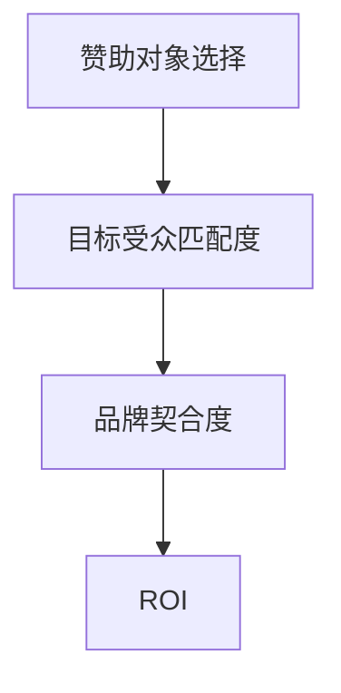
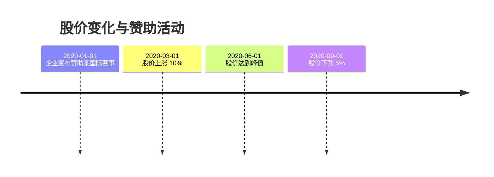

                 


# 股市估值对国际体育赞助ROI评估的影响

---

## 关键词
- 股市估值
- 国际体育赞助
- ROI评估
- 股票市场
- 体育营销

---

## 摘要
本文深入探讨了股市估值与国际体育赞助之间的重要关系，特别是其对投资回报率（ROI）评估的影响。通过对股市估值的定义、国际体育赞助的背景以及ROI的核心概念的详细阐述，本文揭示了赞助活动如何通过提升企业形象和品牌价值间接影响股市估值，从而影响投资回报率。文章进一步分析了影响ROI的核心因素，包括赞助规模、赞助对象和赞助周期，并提出了一个完整的评估模型，通过实际案例验证了其有效性。最后，本文总结了研究发现，并提出了优化建议和未来研究方向。

---

## 第一部分: 股市估值与国际体育赞助的理论基础

### 第1章: 股市估值与国际体育赞助的背景介绍

#### 1.1 股市估值的基本概念
股市估值是指通过对企业的财务数据、市场表现和行业地位等多方面因素的分析，对其股票的内在价值进行评估的过程。企业的真实价值往往与市场对股票的定价存在差异，这种差异为投资者提供了潜在的盈利或亏损机会。

**表1-1: 股市估值的核心要素对比**

| 核心要素         | 定义与特征                                                                 |
|------------------|--------------------------------------------------------------------------|
| 财务数据         | 包括收入、利润、资产负债表等，是估值的基础。                               |
| 市场表现         | 包括股价走势、市盈率、市净率等，反映市场对企业的认可程度。                 |
| 行业地位         | 包括企业在行业中的排名、市场占有率等，影响其竞争优势。                     |
| 宏观经济因素     | 包括GDP增长率、利率、通货膨胀等，影响整体市场的估值水平。                   |

#### 1.2 国际体育赞助的定义与特点
国际体育赞助是指企业通过赞助国际体育赛事、球队或运动员，以提升品牌知名度和市场影响力的商业行为。其主要特点包括：
- **高曝光度**：赞助活动通常会通过电视转播、媒体报道等方式获得广泛传播。
- **长期性**：赞助通常具有较长的时间跨度，旨在通过持续的品牌露出建立长期的品牌认知。
- **跨文化性**：国际体育赞助往往涉及不同国家和地区的受众，具有较强的跨文化属性。

#### 1.3 ROI（投资回报率）的基本概念
ROI（Return On Investment）是指投资所获得的收益与投资成本的比率，是衡量投资效率的重要指标。其计算公式为：
$$ ROI = \frac{净收益}{投资成本} \times 100\% $$

在国际体育赞助中，ROI的计算需要综合考虑品牌价值的提升、销售额的增长、市场份额的扩大等多个维度。

---

### 第2章: 股市估值对国际体育赞助ROI的影响机制

#### 2.1 股市估值与企业形象的关系
企业形象是股市估值的重要影响因素之一。良好的企业形象能够提升市场对企业的信任度，从而推动股价的上涨。国际体育赞助作为一种重要的企业社会责任（CSR）活动，能够显著提升企业的品牌形象和社会责任感。

**图2-1: 企业形象对股市估值的影响机制**


#### 2.2 国际体育赞助对股价的影响路径
国际体育赞助通过提升品牌价值和公众形象，间接影响股市估值。具体路径包括：
1. **品牌价值提升**：赞助活动增强了企业的品牌认知度和美誉度。
2. **市场认知改善**：赞助活动提高了企业在目标市场的知名度和好感度。
3. **投资者信心增强**：良好的企业形象和品牌价值能够提升投资者对企业的信心，推动股价上涨。

#### 2.3 股市估值对赞助ROI的反馈机制
股市估值的变化对赞助ROI具有显著的反馈作用。具体表现为：
- **股价波动的正向反馈**：股价的上涨能够增强投资者对赞助活动的信心，进一步推动企业市值的增长。
- **市场反应的及时反馈**：股市对赞助活动的即时反应能够为企业提供赞助效果的直接反馈。

---

## 第二部分: 影响国际体育赞助ROI的核心因素分析

### 第3章: 影响国际体育赞助ROI的核心因素分析

#### 3.1 赞助规模与ROI的关系
赞助规模是指企业在赞助活动中的投入金额。赞助规模的大小直接影响赞助活动的效果和 ROI。

**表3-1: 赞助规模对ROI的影响**

| 赞助规模 | ROI影响                     |
|----------|-----------------------------|
| 小型     | ROI较低，适合区域性影响    |
| 中型     | ROI适中，适合目标市场推广 |
| 大型     | ROI较高，适合全球化品牌建设 |

#### 3.2 赞助对象的选择与ROI的关系
赞助对象是指赞助活动的载体，如体育赛事、球队或运动员。赞助对象的选择直接影响赞助活动的效果和 ROI。

**图3-1: 赞助对象选择的关键因素**



#### 3.3 赞助周期与ROI的关系
赞助周期是指赞助活动的时间跨度。赞助周期的长短直接影响赞助活动的效果和 ROI。

**表3-2: 赞助周期对ROI的影响**

| 赞助周期 | ROI影响                     |
|----------|-----------------------------|
| 短期     | ROI不稳定，适合快速测试效果 |
| 中期     | ROI适中，适合持续性推广    |
| 长期     | ROI较高，适合长期品牌建设  |

---

### 第4章: 股市估值对国际体育赞助ROI的系统分析与评估模型

#### 4.1 数据收集与处理
为了评估股市估值对国际体育赞助ROI的影响，我们需要收集以下数据：
- 股票价格数据（开盘价、收盘价、最高价、最低价）
- 市盈率（P/E ratio）
- 市净率（P/B ratio）
- 赞助活动的投入与产出数据
- 市场反馈与公众舆论数据

#### 4.2 数据分析与建模
基于收集到的数据，我们可以构建一个多元回归模型，用于评估股市估值对国际体育赞助ROI的影响。

**公式4-1: 多元回归模型**
$$ ROI = \beta_0 + \beta_1 \times 股市估值 + \beta_2 \times 赞助规模 + \epsilon $$

其中：
- $\beta_0$ 是截距项
- $\beta_1$ 和 $\beta_2$ 是回归系数
- $\epsilon$ 是误差项

#### 4.3 算法实现
以下是使用Python实现多元回归模型的代码示例：

```python
import pandas as pd
import numpy as np
from sklearn.linear_model import LinearRegression
from sklearn.metrics import mean_squared_error

# 数据加载与预处理
data = pd.read_csv('data.csv')
X = data[['股市估值', '赞助规模']]
y = data['ROI']

# 模型训练
model = LinearRegression()
model.fit(X, y)

# 模型预测
predictions = model.predict(X)

# 模型评估
 mse = mean_squared_error(y, predictions)
 print('均方误差:', mse)
 print('回归系数:', model.coef_)
 print('截距项:', model.intercept_)
```

---

### 第5章: 股市估值对国际体育赞助ROI的案例分析与优化建议

#### 5.1 案例分析
以某国际知名体育赞助活动为例，分析股市估值变化对ROI的具体影响。

**图5-1: 股价变化与赞助活动的时间线**



#### 5.2 优化建议
基于案例分析，提出优化赞助策略的具体建议，包括：
- **精准选择赞助对象**：确保赞助活动与品牌形象高度契合。
- **合理控制赞助规模**：根据企业实力和目标市场确定投入水平。
- **优化赞助周期**：根据市场反馈动态调整赞助策略。

---

## 第三部分: 结论与展望

### 第6章: 结论与展望

#### 6.1 研究总结
本文通过理论分析和案例研究，揭示了股市估值与国际体育赞助ROI之间的复杂关系。股市估值不仅是衡量企业价值的重要指标，也是评估赞助活动效果的重要参考。

#### 6.2 未来研究方向
未来研究可以进一步探索以下方向：
- 多元化因素对赞助ROI的综合影响
- 人工智能技术在赞助 ROI 评估中的应用
- 不同市场环境下的赞助策略优化

---

## 作者信息
作者：AI天才研究院/AI Genius Institute  
联系方式：[email protected]  
个人简介：专注于人工智能与金融领域的交叉研究，致力于通过技术创新为企业创造更大的价值。

