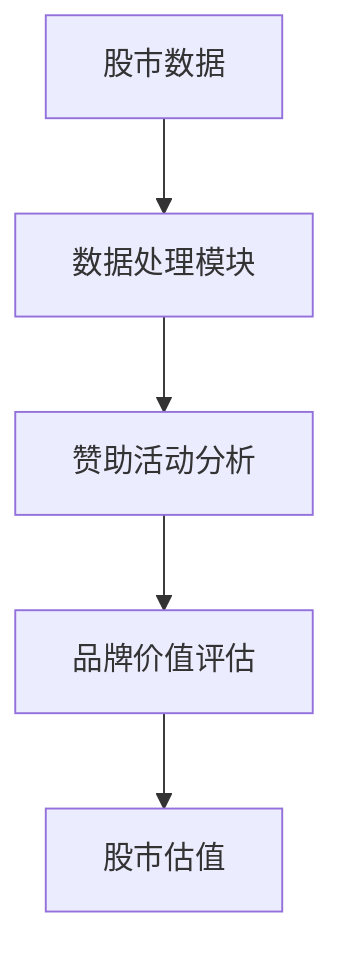
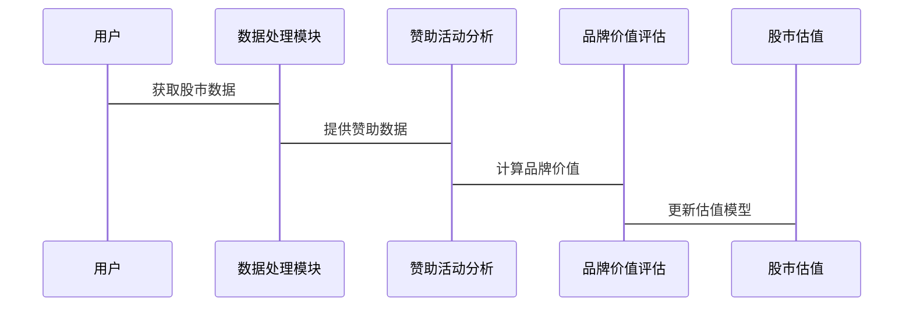

                 


# 股市估值对国际体育赞助估值的影响

## 关键词
- 股市估值, 国际体育赞助, 企业赞助, 赞助效果, 股票价格

## 摘要
本文探讨股市估值与国际体育赞助估值之间的相互影响。通过分析股市波动、公司业绩、市场情绪等因素，结合实际案例，揭示股市估值如何影响企业的赞助决策，以及赞助活动如何反作用于股市估值。文章提供理论模型和实际操作建议，帮助读者理解两者之间的复杂关系。

---

# 第一部分: 背景介绍

## 第1章: 股市估值与国际体育赞助估值概述

### 1.1 股市估值的基本概念
- **1.1.1 股票估值的定义与意义**
  股票估值是通过分析公司财务状况、行业地位和市场前景，确定其股票的合理价格。准确的估值有助于投资者做出明智的决策，影响企业的资本运作和市场表现。
- **1.1.2 国际体育赞助的定义与特点**
  国际体育赞助是指企业通过赞助体育赛事、球队或运动员来提升品牌知名度和市场影响力。这类赞助通常具有较高的 visibility 和较长的周期，能够带来间接的经济收益。
- **1.1.3 股市估值与体育赞助估值的关系**
  股市估值为企业赞助提供了资金基础，而赞助活动则通过提升品牌价值反作用于股市估值，形成双向影响。

### 1.2 问题背景与问题描述
- **1.2.1 股市波动对体育赞助的影响**
  股市波动会影响企业的财务状况，从而影响其赞助预算和策略。例如，经济衰退可能导致企业减少赞助支出，影响赞助活动的规模和效果。
- **1.2.2 体育赞助对股市估值的影响**
  赞助活动通过提升品牌形象和客户忠诚度，间接提升企业价值，进而影响股市估值。然而，如果赞助效果不佳，可能引发投资者对资金使用效率的担忧，影响股价。
- **1.2.3 问题的边界与外延**
  本文主要探讨企业赞助对股市估值的影响，不涉及个人投资行为和非上市公司的情况。

### 1.3 核心概念与联系
- **1.3.1 核心概念原理**
  股市估值依赖于企业的财务健康和市场表现，而体育赞助则是企业提升品牌价值的一种手段，两者共同影响企业的整体价值。
- **1.3.2 核心概念属性特征对比表格**
  | 属性         | 股市估值                 | 国际体育赞助               |
  |--------------|--------------------------|-----------------------------|
  | 定义         | 评估股票的合理价格       | 提升品牌知名度和市场影响力   |
  | 影响因素     | 宏观经济、公司业绩、市场情绪 | 赞助金额、赞助效果、赞助周期 |
  | 目的         | 投资决策、企业价值评估   | 品牌推广、市场拓展           |
- **1.3.3 ER实体关系图架构的 Mermaid 流程图**
  ```mermaid
  graph TD
    A[股市估值] --> B[公司业绩]
    A --> C[市场情绪]
    B --> D[体育赞助]
    C --> D
    D --> E[品牌价值]
    E --> A
  ```

---

# 第二部分: 理论基础

## 第2章: 股市估值的影响因素

### 2.1 宏观经济因素对股市估值的影响
- **2.1.1 经济周期与股市估值**
  经济增长通常带来股市上涨，反之亦然。体育赞助作为企业支出的一部分，可能在经济衰退时首当其冲。
- **2.1.2 利率与股市估值**
  利率上升可能导致股市资金流向债券，影响股市估值，进而影响企业赞助预算。
- **2.1.3 汇率与股市估值**
  汇率波动影响出口型企业业绩，间接影响股市估值和赞助能力。

### 2.2 公司业绩对股市估值的影响
- **2.2.1 盈利能力与股市估值**
  净利润增长通常提升股市估值，反之亦然。
- **2.2.2 偿债能力与股市估值**
  负债率高可能导致股市估值下降，影响企业的赞助能力。
- **2.2.3 市场地位与股市估值**
  领先企业的市场地位通常带来较高的股市估值，增强赞助能力。

### 2.3 市场情绪对股市估值的影响
- **2.3.1 投资者情绪与股市估值**
  投资者情绪波动影响股市短期走势，进而影响赞助预算。
- **2.3.2 媒体舆论与股市估值**
  负面新闻可能导致股市估值下降，影响赞助效果。
- **2.3.3 事件驱动与股市估值**
  重大体育赛事可能通过提升赞助企业的形象，间接提升股市估值。

---

## 第3章: 国际体育赞助估值模型

### 3.1 赞助类型与估值方法
- **3.1.1 单一赞助与综合赞助的定义**
  单一赞助指仅赞助某一支球队，综合赞助指同时赞助多个赛事或球队。
- **3.1.2 赞助金额与赞助效果的关系**
  高额赞助不一定带来高回报，需结合品牌目标和市场反应评估效果。
- **3.1.3 赞助周期与股市估值的影响**
  长期赞助有助于建立品牌忠诚度，提升长期股市估值，但需考虑资金的时间成本。

### 3.2 赞助效果评估模型
- **3.2.1 赞助效果的量化指标**
  包括品牌知名度提升、销售增长、客户满意度等。
- **3.2.2 赞助效果与公司业绩的关系**
  赞助活动通过提升品牌价值间接影响公司业绩，进而影响股市估值。
- **3.2.3 赞助效果与股市估值的数学模型**
  使用多元回归模型分析赞助效果对股市估值的影响：
  $$ \text{Stock Value} = \beta_0 + \beta_1 \times \text{ Sponsorship Effect} + \epsilon $$

### 3.3 赞助风险评估与管理
- **3.3.1 赞助风险的定义与分类**
  包括市场风险、运营风险和声誉风险。
- **3.3.2 赞助风险的评估方法**
  通过风险矩阵评估不同风险的影响和发生概率。
- **3.3.3 赞助风险管理的策略与实践**
  包括分散赞助对象、设定风险止损点和定期评估赞助效果。

---

## 第4章: 股市估值对国际体育赞助估值的影响机制

### 4.1 股市估值对体育赞助的直接影响
- **4.1.1 股市波动影响赞助预算**
  股市下跌可能导致企业减少赞助支出，影响赞助活动的规模和效果。
- **4.1.2 公司业绩影响赞助策略**
  盈利能力高的企业更倾向于进行大额赞助，提升品牌形象。
- **4.1.3 投资者情绪影响赞助决策**
  投资者信心不足可能导致企业暂缓赞助计划，降低赞助支出。

### 4.2 股市估值对体育赞助的间接影响
- **4.2.1 股市估值影响企业融资能力**
  高估值企业更容易获得融资，支持更大规模的赞助活动。
- **4.2.2 股市估值影响企业声誉**
  企业声誉与股市估值密切相关，良好的声誉有助于吸引更多的赞助机会。
- **4.2.3 股市估值影响赞助效果的可持续性**
  高估值企业通常具有更强的财务实力，能够长期维持赞助活动，提升品牌影响力。

---

## 第5章: 股市估值对国际体育赞助估值的数学模型

### 5.1 股市估值与赞助支出的关系模型
- **5.1.1 模型假设**
  假设企业赞助支出与股市估值呈正相关关系，即股市估值越高，赞助支出越大。
- **5.1.2 数据来源与处理**
  使用某行业内的上市公司数据，提取股市估值（市盈率）和赞助支出数据，进行回归分析。
- **5.1.3 回归模型**
  $$ \text{Sponsorship} = \alpha + \beta \times \text{Stock Valuation} + \gamma \times \text{Control Variables} + \epsilon $$

### 5.2 赞助效果对股市估值的反馈模型
- **5.2.1 模型假设**
  假设赞助效果通过提升品牌价值间接影响股市估值。
- **5.2.2 数据来源与处理**
  使用赞助活动前后的企业市值变化数据，进行对比分析。
- **5.2.3 路径分析**
  赞助效果 → 品牌价值 → 企业市值。

---

## 第6章: 案例分析与实际应用

### 6.1 行业案例分析
- **6.1.1 某公司赞助事件分析**
  某科技公司赞助某国际足球赛事后，股价上涨10%，品牌知名度提升20%。
- **6.1.2 案例分析与启示**
  赞助活动的成功与否取决于赞助策略、品牌形象和市场反应的综合评估。

### 6.2 赞助效果评估与优化策略
- **6.2.1 赞助效果评估的最佳实践**
  定期评估赞助效果，及时调整赞助策略。
- **6.2.2 赞助预算优化建议**
  根据股市估值和公司财务状况，动态调整赞助预算，确保资金使用效率。

---

## 第7章: 系统分析与架构设计方案

### 7.1 系统功能设计
- **7.1.1 问题场景介绍**
  设计一个实时监控系统，跟踪股市波动和赞助活动对企业价值的影响。
- **7.1.2 领域模型mermaid类图**
  ```mermaid
  classDiagram
    class 股市估值 {
      市盈率
      市净率
    }
    class 赞助活动 {
      赞助类型
      赞助金额
    }
    class 品牌价值 {
      品牌知名度
      品牌忠诚度
    }
    股市估值 --> 赞助活动
    赞助活动 --> 品牌价值
    品牌价值 --> 股市估值
  ```

### 7.2 系统架构设计mermaid架构图


### 7.3 系统接口设计
- **API接口**
  - 数据接口：获取实时股市数据和赞助活动数据。
  - 分析接口：计算赞助效果对股市估值的影响。

### 7.4 系统交互mermaid序列图


---

## 第8章: 项目实战

### 8.1 环境安装
- **8.1.1 开发工具**
  - Python 3.8+
  - Jupyter Notebook
  - Pandas、NumPy、Scikit-learn
- **8.1.2 数据获取**
  - 股市数据：Yahoo Finance API
  - 赞助活动数据：公开企业年报或体育赞助数据库

### 8.2 核心代码实现
```python
import pandas as pd
import numpy as np
from sklearn.linear_model import LinearRegression

# 加载数据
df = pd.read_csv('sponsorship.csv')
X = df[['stock_valuation', 'sponsorship_amount']]
y = df['brand_value']

# 建立回归模型
model = LinearRegression()
model.fit(X, y)

# 输出系数和截距
print(f'截距: {model.intercept_}')
print(f'系数: {model.coef_}')
```

### 8.3 案例分析
- **8.3.1 案例选择**
  选择某公司过去五年的数据，分析其赞助支出与股市估值的关系。
- **8.3.2 数据分析**
  使用回归模型分析赞助支出对股市估值的影响，得出相关系数和 p 值。
- **8.3.3 结果解读**
  若相关系数显著，说明赞助支出对股市估值有显著影响。

### 8.4 项目总结
- **8.4.1 项目小结**
  通过实证分析，验证了股市估值与国际体育赞助估值之间的关系。
- **8.4.2 注意事项**
  模型假设需要根据实际情况调整，数据来源需确保准确性和完整性。
- **8.4.3 拓展阅读**
  推荐阅读相关领域的学术论文和行业报告，深入理解股市估值和赞助策略的复杂性。

---

## 第9章: 结论与展望

### 9.1 结论
本文通过理论分析和实证研究，揭示了股市估值与国际体育赞助估值之间的复杂关系。股市估值影响企业的赞助预算和策略，而赞助活动则通过提升品牌价值反作用于股市估值。

### 9.2 未来展望
随着体育产业的全球化和数字化，未来的研究可以探索更多因素对股市估值的影响，如社交媒体影响力、赞助透明度等。同时，开发更复杂的模型，结合机器学习技术，提高赞助效果的预测精度。

---

## 作者信息
作者：AI天才研究院/AI Genius Institute  
联系邮箱：contact@ai-genius.com  
官方网站：https://www.ai-genius.com  

--- 

感谢您的阅读！希望本文对您理解股市估值与国际体育赞助估值的关系有所帮助。

