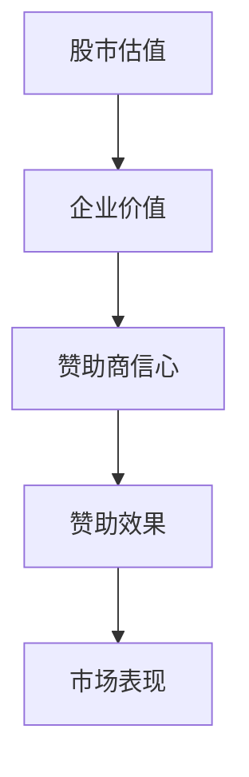
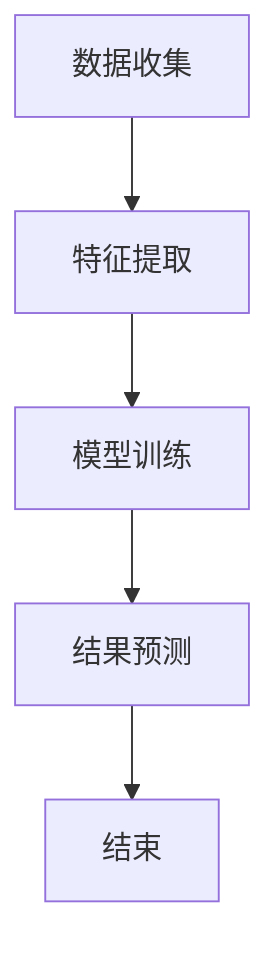
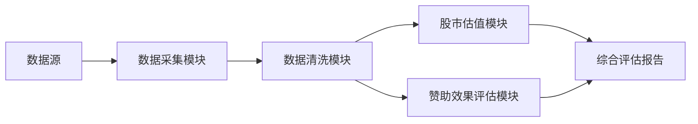

                 


# 股市估值对国际体育赞助效果评估的影响

> 关键词：股市估值、国际体育赞助、赞助效果评估、市盈率、赞助 ROI

> 摘要：本文系统地探讨了股市估值与国际体育赞助效果评估之间的相互影响。通过分析股市估值的核心概念、赞助效果评估的算法模型以及两者的关联性，本文提出了一个结合统计分析和机器学习的评估框架，为赞助商和投资者提供了实用的决策参考。

---

# 第1章 股市估值与国际体育赞助效果评估的背景介绍

## 1.1 股市估值的核心概念

### 1.1.1 股市估值的定义与基本原理
股市估值是通过对企业的财务数据和市场表现进行分析，估算其股票的合理价格范围。常见的估值方法包括市盈率（P/E）、市净率（P/B）和现金流折现模型（DCF）等。

### 1.1.2 股市估值的主要方法
- **市盈率（P/E）**：计算公式为 $P/E = \frac{Price}{Earnings}$，用于衡量股票价格与每股收益的比例。
- **市净率（P/B）**：计算公式为 $P/B = \frac{Price}{Book\ Value}$，用于衡量股票价格与每股账面价值的比例。
- **现金流折现模型（DCF）**：通过预测企业未来现金流，折现到现值以估算企业价值。

### 1.1.3 股市估值与企业价值的关系
股市估值反映了市场对企业未来盈利能力的预期。合理的估值能够帮助投资者判断股票的买卖时机，同时也能为企业提供融资价值参考。

---

## 1.2 国际体育赞助的核心概念

### 1.2.1 国际体育赞助的定义与范围
国际体育赞助是指企业通过赞助体育赛事、球队或运动员，以提升品牌知名度和市场影响力的商业行为。常见的赞助形式包括现金赞助、产品赞助和无形资产赞助。

### 1.2.2 国际体育赞助的主要形式
- **现金赞助**：直接向体育组织或运动员提供资金支持。
- **产品赞助**：提供产品或服务作为赞助，如装备赞助。
- **无形资产赞助**：通过品牌露出、广告等方式进行赞助。

### 1.2.3 国际体育赞助的行业现状与趋势
近年来，随着体育产业的全球化和商业化，国际体育赞助市场规模持续增长。赞助商的 ROI（Return On Investment，投资回报率）成为衡量赞助效果的重要指标。

---

## 1.3 股市估值与国际体育赞助的关联性分析

### 1.3.1 股市估值对赞助效果的影响
股市估值的变化会影响企业的财务状况和市场形象，从而间接影响赞助效果。例如，高市盈率可能意味着市场对公司未来盈利能力的乐观预期，从而吸引更多赞助商。

### 1.3.2 赞助效果对股市估值的反向影响
优秀的赞助策略能够提升企业的品牌价值和市场影响力，从而改善股市估值。例如，赞助国际顶级赛事可以提升企业的知名度，进而提高股价。

### 1.3.3 两者的协同关系与边界条件
股市估值和赞助效果评估是相互影响的双向关系。然而，这种影响并非线性相关，受到市场环境、企业战略和赞助目标等多种因素的制约。

---

## 1.4 本章小结
本章从股市估值和国际体育赞助的基本概念出发，分析了两者的核心要素及其相互关系。接下来的章节将深入探讨这些概念的算法原理和系统架构设计。

---

# 第2章 股市估值与国际体育赞助效果评估的核心概念分析

## 2.1 股市估值的核心要素

### 2.1.1 市盈率（P/E）的计算与意义
市盈率是衡量股票价值的重要指标，低市盈率可能意味着股票被低估，而高市盈率可能意味着市场对公司未来增长的预期较高。

### 2.1.2 市净率（P/B）的计算与意义
市净率用于衡量股票价格与账面价值的比例，常用于评估银行、保险公司等资产密集型行业的企业价值。

### 2.1.3 市值与企业价值的对比
市值是市场对公司整体价值的评估，而企业价值则包括了公司的资产、负债和无形资产等多方面的因素。

---

## 2.2 国际体育赞助的核心要素

### 2.2.1 赞助金额的计算与评估
赞助金额通常基于赞助商的预算和赞助目标进行评估。例如，赞助金额与赞助效果的 ROI 直接相关。

### 2.2.2 赞助效果的衡量指标
- **品牌知名度提升**：通过市场调研和品牌价值评估来衡量。
- **销售增长**：通过赞助前后的产品销售数据对比来评估。
- **市场份额提升**：通过市场份额的变化来衡量。

### 2.2.3 赞助商的 ROI 分析
ROI（Return On Investment）是赞助效果评估的重要指标，计算公式为 $ROI = \frac{Net\ Profit}{Investment} \times 100\%$。

---

## 2.3 核心概念的对比与联系

### 2.3.1 股市估值与赞助效果的对比分析
| 指标 | 股市估值 | 赞助效果评估 |
|------|----------|-------------|
| 评估对象 | 企业整体价值 | 赞助活动效果 |
| 评估方法 | 市盈率、市净率等 | ROI、品牌价值等 |
| 数据来源 | 财务报表、市场数据 | 调查问卷、销售数据 |

### 2.3.2 股市估值与赞助效果的联系图解



### 2.3.3 核心概念的 ER 实体关系图

```mermaid
erd
    企业 --|{many})-> 股票 : 股票代码
    股票 --|{many})-> 股市 : 交易所
    赞助活动 --|{many})-> 赞助商 : 赞助合同
    赞助商 --|{many})-> 赞助效果 : ROI
```

---

## 2.4 本章小结
本章通过对比分析和实体关系图，详细阐述了股市估值与国际体育赞助效果评估的核心概念及其联系。接下来的章节将从算法原理和系统设计的角度进一步探讨这一主题。

---

# 第3章 股市估值与国际体育赞助效果评估的算法原理

## 3.1 股市估值的算法模型

### 3.1.1 市盈率模型
市盈率模型用于评估股票的合理价格。公式为 $P/E = \frac{Price}{Earnings}$。

### 3.1.2 市净率模型
市净率模型用于评估股票的合理价格。公式为 $P/B = \frac{Price}{Book\ Value}$。

### 3.1.3 现金流折现模型（DCF）
DCF 模型通过预测企业未来现金流，折现到现值以估算企业价值。

---

## 3.2 国际体育赞助效果评估的算法模型

### 3.2.1 赞助 ROI 模型
赞助 ROI 模型用于评估赞助活动的投资回报率。公式为 $ROI = \frac{Net\ Profit}{Investment} \times 100\%$。

### 3.2.2 赞助效果的回归分析模型
回归分析模型用于预测赞助效果与相关因素之间的关系。公式为 $Y = \beta_0 + \beta_1 X + \epsilon$。

### 3.2.3 赞助效果的机器学习预测模型
机器学习模型（如随机森林）可以用于预测赞助效果，通过历史数据训练模型，预测未来的赞助 ROI。

---

## 3.3 算法流程图（Mermaid）



---

## 3.4 算法实现与代码示例

### 3.4.1 市盈率计算代码
```python
def calculate_pe(stock_price, earnings_per_share):
    return stock_price / earnings_per_share
```

### 3.4.2 ROI 计算代码
```python
def calculate ROI(net_profit, investment):
    return (net_profit / investment) * 100
```

### 3.4.3 回归分析代码
```python
import statsmodels.api as sm
X = sm.add_constant(X)
model = sm.OLS(y, X).fit()
print(model.summary())
```

---

## 3.5 本章小结
本章从算法原理的角度，详细介绍了股市估值和赞助效果评估的主要模型和实现方法。接下来的章节将从系统设计的角度进一步探讨这一主题。

---

# 第4章 股市估值与国际体育赞助效果评估的系统架构设计

## 4.1 系统功能设计

### 4.1.1 股市数据采集模块
- 从多个数据源采集实时股票数据。
- 数据清洗与预处理。

### 4.1.2 赞助效果分析模块
- 计算赞助 ROI。
- 生成赞助效果报告。

### 4.1.3 综合评估模块
- 结合股市估值和赞助效果，生成综合评估报告。

---

## 4.2 系统架构设计



---

## 4.3 系统接口设计
- **API 接口**：提供 RESTful API 供外部系统调用。
- **数据接口**：与第三方数据源（如 Bloomberg、ESPN）对接。

---

## 4.4 本章小结
本章从系统架构设计的角度，详细介绍了如何构建一个结合股市估值与赞助效果评估的综合系统。接下来的章节将从项目实战的角度进一步探讨这一主题。

---

# 第5章 股市估值与国际体育赞助效果评估的项目实战

## 5.1 项目环境安装

```bash
pip install pandas numpy statsmodels matplotlib seaborn
```

---

## 5.2 系统核心实现

### 5.2.1 股市估值模块实现
```python
import pandas as pd
import numpy as np

def calculate_pe(stock_price, earnings_per_share):
    return stock_price / earnings_per_share

data = pd.read_csv('stock_data.csv')
pe_ratio = calculate_pe(data['Price'], data['Earnings'])
print(pe_ratio)
```

### 5.2.2 赞助效果评估模块实现
```python
def calculate ROI(net_profit, investment):
    return (net_profit / investment) * 100

sponsor_data = pd.read_csv('sponsor_data.csv')
roi = calculate ROI(sponsor_data['Net Profit'], sponsor_data['Investment'])
print(roi)
```

---

## 5.3 实际案例分析
假设某公司赞助国际足球赛事，赞助金额为 1000 万美元，赞助后品牌价值提升了 20%，销售额增长了 15%。计算 ROI：
$$ ROI = \frac{150 万}{1000 万} \times 100\% = 15\% $$

---

## 5.4 本章小结
本章通过项目实战，展示了如何将股市估值与赞助效果评估的算法模型应用于实际场景。接下来的章节将从总结和最佳实践的角度进一步探讨这一主题。

---

# 第6章 总结与最佳实践

## 6.1 总结
本文系统地探讨了股市估值与国际体育赞助效果评估的相互影响，提出了结合统计分析和机器学习的评估框架，为赞助商和投资者提供了实用的决策参考。

## 6.2 最佳实践

### 6.2.1 小贴士
- 在进行赞助决策时，应综合考虑股市估值和赞助 ROI。
- 定期监测市场环境和企业财务状况，及时调整赞助策略。

### 6.2.2 注意事项
- 数据来源的可靠性和时效性直接影响评估结果。
- 模型的选择应根据实际需求和数据特征进行调整。

### 6.2.3 拓展阅读
- 《企业价值评估》
- 《体育营销与赞助策略》

---

# 作者

作者：AI天才研究院/AI Genius Institute  
禅与计算机程序设计艺术 /Zen And The Art of Computer Programming

---

以上是文章的完整目录和部分章节内容，您可以根据需要进一步扩展每个部分的具体内容。

