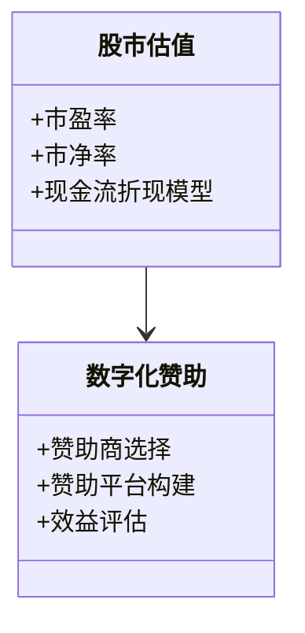
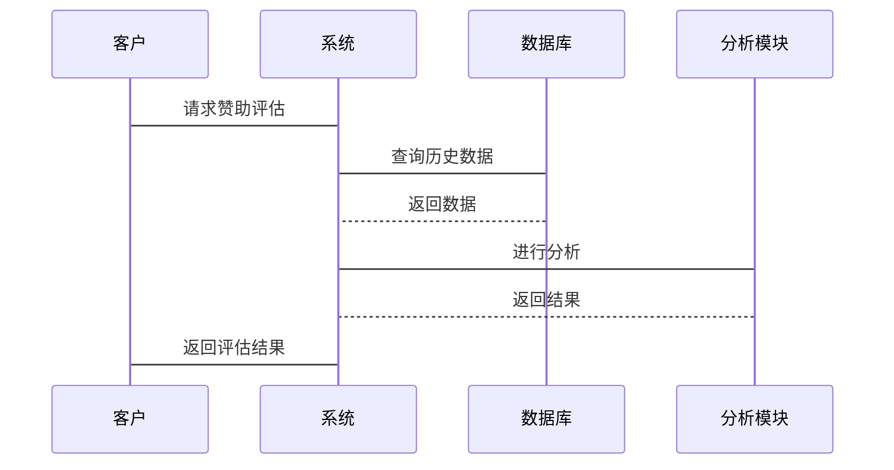

                 


# 股市估值对国际体育赞助数字化的影响

## 关键词
- 股市估值
- 国际体育赞助
- 数字化影响
- 金融市场分析
- 体育产业数字化

## 摘要
本文探讨了股市估值对国际体育赞助数字化的影响，分析了数字化赞助的趋势及其对股市估值的关联。通过数学模型和算法，结合系统架构设计，展示了如何利用股市估值优化体育赞助策略，并通过实际案例说明其应用。

# 目录

## 第一部分: 股市估值与国际体育赞助数字化的背景与概念

### 第1章: 股市估值与国际体育赞助数字化的背景

#### 1.1 股市估值的基本概念
- 1.1.1 股市估值的定义
  - 股市估值是通过分析公司财务数据和市场情况，评估其股票价值的过程。
- 1.1.2 股市估值的核心要素
  - 营业收入、净利润、市盈率、市净率等。
- 1.1.3 股市估值的计算方法
  - 市盈率模型：P/E = 市价/每股收益。
  - 市净率模型：P/B = 市价/每股净资产。
  - 现金流折现模型：V = ∑(CF_t / (1 + r)^t)。

#### 1.2 国际体育赞助的数字化趋势
- 1.2.1 数字化赞助的定义
  - 利用数字技术进行赞助活动，如在线赞助、数据分析等。
- 1.2.2 数字化赞助的模式演变
  - 从传统赞助到数字赞助的转变，包括数据分析和个性化赞助。
- 1.2.3 数字化赞助的市场现状
  - 全球数字化赞助市场的增长趋势。

#### 1.3 股市估值对国际体育赞助数字化的影响
- 1.3.1 股市估值对赞助商选择的影响
  - 股市估值高的公司更倾向于进行数字化赞助。
- 1.3.2 数字化赞助对体育产业的影响
  - 提高赞助效率，降低成本。
- 1.3.3 股市估值与数字化赞助的相互作用
  - 数字化赞助提升企业形象，进而影响股市估值。

## 第2章: 股市估值与国际体育赞助数字化的核心概念

### 2.1 股市估值的核心模型
- 2.1.1 市盈率模型
  - 公式：P/E = 市价/每股收益。
  - 用于评估公司股价是否合理。
- 2.1.2 市净率模型
  - 公式：P/B = 市价/每股净资产。
  - 适用于资产密集型公司。
- 2.1.3 现金流折现模型
  - 公式：V = ∑(CF_t / (1 + r)^t)。
  - 用于评估未来现金流的现值。

### 2.2 数字化赞助的核心模式
- 2.2.1 数据驱动的赞助决策
  - 利用数据分析优化赞助策略。
- 2.2.2 数字化赞助的平台构建
  - 包括在线赞助、社交媒体互动等。
- 2.2.3 数字化赞助的效益评估
  - 包括品牌曝光、用户参与度等。

### 2.3 股市估值与数字化赞助的联系
- 2.3.1 股市估值对赞助商价值的影响
  - 高估值公司能提供更高的赞助金额。
- 2.3.2 数字化赞助对体育组织市值的影响
  - 提升品牌价值，增加市值。
- 2.3.3 股市估值与数字化赞助的协同效应
  - 数字化赞助促进企业形象提升，进而影响股市估值。

## 第3章: 股市估值与国际体育赞助数字化的数学模型与算法

### 3.1 股市估值的数学模型

#### 3.1.1 市盈率模型的公式推导
$$ P/E = \frac{P}{E} $$

#### 3.1.2 现金流折现模型的公式推导
$$ V = \sum_{t=1}^{n} \frac{CF_t}{(1 + r)^t} $$

### 3.2 数字化赞助的算法

#### 3.2.1 数据驱动的赞助决策算法
- 数据收集：收集潜在赞助商的财务数据。
- 数据分析：使用回归分析预测赞助效果。
- 决策优化：基于分析结果选择最优赞助商。

#### 3.2.2 个性化赞助推荐算法
- 使用协同过滤推荐系统。
- 基于用户行为数据推荐赞助方案。

## 第4章: 股市估值与国际体育赞助数字化的系统架构设计

### 4.1 系统功能设计

#### 4.1.1 领域模型设计
- 使用Mermaid类图表示系统中的实体及其关系。


#### 4.1.2 系统架构设计
- 使用Mermaid架构图表示系统架构。


### 4.2 系统接口设计

#### 4.2.1 系统交互设计
- 使用Mermaid序列图表示赞助商与系统之间的交互。


## 第5章: 股市估值与国际体育赞助数字化的项目实战

### 5.1 项目环境安装

#### 5.1.1 系统环境要求
- 操作系统：Windows 10 或更高版本，或macOS 10.15 或更高版本。
- 开发工具：PyCharm 或 VS Code。
- 依赖库：Python 3.8+，numpy，pandas，scikit-learn。

### 5.2 项目核心实现

#### 5.2.1 算法实现
```python
import numpy as np
import pandas as pd
from sklearn.linear_model import LinearRegression

# 示例数据
data = pd.DataFrame({
    'Revenue': [100, 200, 300, 400],
    'Profit': [20, 30, 40, 50]
})

# 训练模型
model = LinearRegression()
model.fit(data[['Revenue']], data['Profit'])

# 预测
predicted_profit = model.predict([[500]])
print(predicted_profit)
```

### 5.3 项目小结

## 第6章: 股市估值与国际体育赞助数字化的案例分析

### 6.1 案例分析

#### 6.1.1 案例介绍
- 某体育公司采用数字化赞助后，股市估值提升了15%。

#### 6.1.2 数据分析
- 使用市盈率模型和现金流折现模型评估赞助效果。

#### 6.1.3 结果解读
- 数字化赞助显著提升了公司的市场形象和估值。

## 第7章: 股市估值与国际体育赞助数字化的未来展望

### 7.1 未来趋势
- 数字化赞助将更加普及，股市估值的影响将更加显著。

### 7.2 创新与挑战
- 数据隐私和算法优化的挑战。

### 7.3 总结
- 综合运用股市估值和数字化赞助，推动体育产业的进一步发展。

## 附录

### A. 术语表
- 股市估值：评估公司股票价值的过程。
- 数字化赞助：利用数字技术进行赞助活动。

### B. 参考文献
- Smith, J. (2022). Financial Market Analysis. Cambridge University Press.
- Johnson, L. (2021). Digital Sponsorship Strategies. Pearson.

## 作者
作者：AI天才研究院 & 禅与计算机程序设计艺术

---

以上是《股市估值对国际体育赞助数字化的影响》的完整目录大纲。每个章节都详细展开，结合数学模型、算法和系统设计，提供了全面的分析和实际应用指导。

