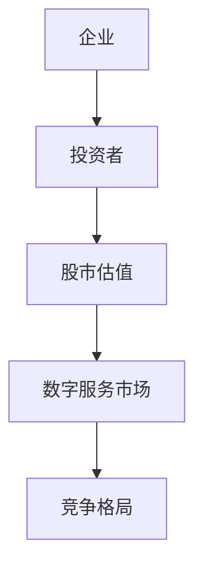
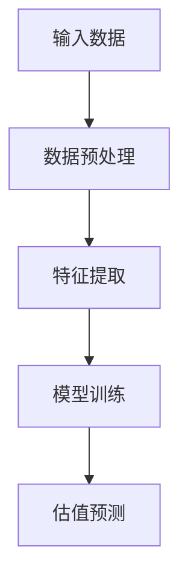
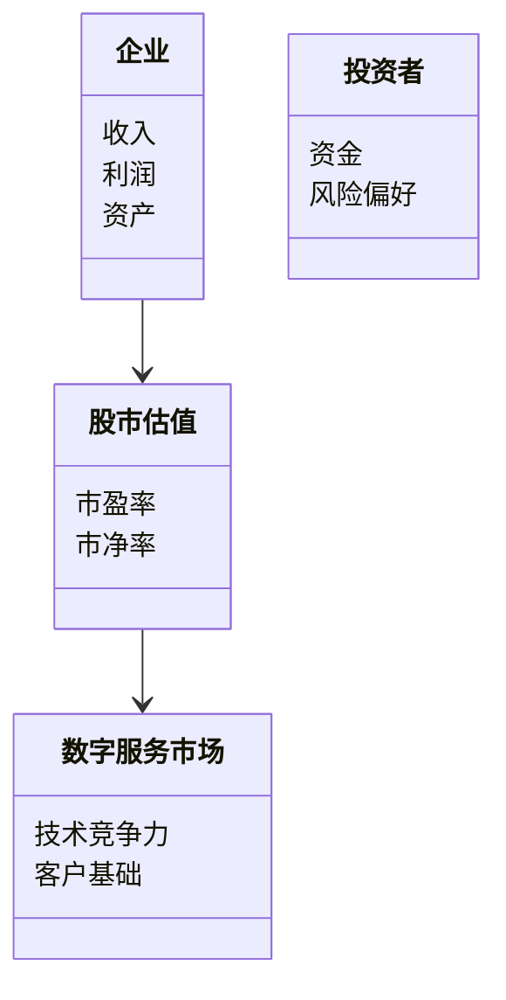
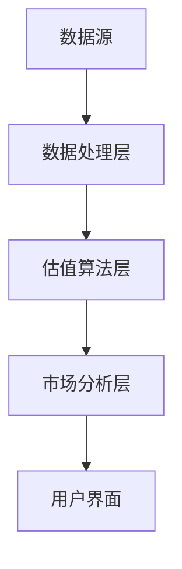

                 


# 股市估值对国际数字服务市场竞争格局的影响

> 关键词：股市估值、国际数字服务市场、竞争格局、企业价值、投资者行为

> 摘要：本文探讨了股市估值对国际数字服务市场竞争格局的影响，分析了股市估值的核心概念、数字服务市场的特点、估值算法的原理以及系统架构设计。通过案例分析和实际应用，揭示了股市估值如何塑造数字服务市场的竞争格局，并提出了最佳实践建议。

---

# 第一部分: 背景介绍

# 第1章: 股市估值与国际数字服务市场概述

## 1.1 股市估值的核心概念

### 1.1.1 股市估值的基本定义

股市估值是指通过对企业财务数据和市场信息进行分析，确定企业股票的合理价格水平。常见的估值指标包括市盈率（P/E）、市净率（P/B）、市值与利润比（EV/EBITDA）等。这些指标反映了企业的盈利能力、成长潜力和市场地位。

$$ P/E = \frac{股价}{每股收益} $$

$$ P/B = \frac{股价}{每股净资产} $$

### 1.1.2 股市估值的常见方法

1. **相对估值法**：基于可比公司的估值，通过比较市盈率、市净率等指标。
2. **绝对估值法**：基于企业未来现金流的贴现，如 discounted cash flow (DCF) 模型。
3. **指数估值法**：基于市场整体走势和宏观经济指标。

### 1.1.3 股市估值与企业价值的关系

股市估值是企业市场价值的体现，反映了投资者对企业的信心和对其未来表现的预期。高估值意味着市场对企业前景看好，而低估值可能意味着市场对其前景持谨慎态度。

---

## 1.2 国际数字服务市场的特点

### 1.2.1 数字服务市场的定义与范围

数字服务市场是指基于互联网和数字技术提供服务的市场，涵盖软件开发、云计算、人工智能、大数据分析、电子商务等多个领域。数字服务市场的核心是通过技术手段满足用户需求，实现服务的高效交付。

### 1.2.2 数字服务市场的竞争格局

1. **全球化的竞争**：数字服务市场具有全球性，企业可以跨越地理限制，服务全球客户。
2. **技术驱动的竞争**：技术实力是数字服务市场竞争的核心，创新能力和研发投入决定了企业的市场地位。
3. **生态系统竞争**：数字服务市场的竞争不仅是单一企业之间的竞争，更是整个生态系统之间的竞争，包括合作伙伴、开发者、用户等。

### 1.2.3 数字服务市场与全球经济的关系

数字服务市场是全球经济增长的重要驱动力，其发展对全球经济格局有着深远影响。数字技术的普及和应用推动了传统产业的转型升级，同时也催生了新的商业模式和经济增长点。

---

## 1.3 股市估值对数字服务市场的影响

### 1.3.1 股市估值与企业竞争力

股市估值反映了投资者对企业竞争力的判断。高估值意味着市场对企业未来增长潜力的认可，而低估值可能表明市场对其竞争力的质疑。数字服务企业的估值往往与其技术优势、客户基础和市场扩展能力密切相关。

### 1.3.2 股市估值对市场格局的塑造

股市估值通过影响企业的融资能力、并购活动和投资行为，进而影响市场的竞争格局。高估值的企业更容易吸引投资者和人才，扩大市场份额；而低估值的企业可能面临融资困难，难以维持竞争优势。

### 1.3.3 股市估值与投资者行为的关系

股市估值通过影响投资者的决策行为，进而影响市场的竞争格局。投资者倾向于投资高估值的优质企业，而企业为了获得高估值，需要不断提升自身的竞争力，优化管理和创新。

---

## 1.4 本章小结

本章介绍了股市估值的核心概念和数字服务市场的特点，分析了股市估值对数字服务市场竞争格局的影响。通过理解股市估值与企业价值的关系，我们可以更好地把握数字服务市场的竞争趋势和投资机会。

---

# 第二部分: 核心概念与联系

# 第2章: 股市估值与数字服务市场的核心概念

## 2.1 核心概念原理

### 2.1.1 股市估值的数学模型

股市估值可以通过多种数学模型进行计算，其中最常用的包括市盈率模型、市净率模型和DCF模型。

$$ P/E = \frac{股价}{每股收益} $$

$$ P/B = \frac{股价}{每股净资产} $$

### 2.1.2 数字服务市场的竞争模型

数字服务市场的竞争模型可以分为以下几个方面：

1. **技术竞争力**：企业是否拥有核心技术优势。
2. **客户基础**：企业是否拥有稳定的客户群体。
3. **市场扩展能力**：企业是否能够快速扩展市场份额。

### 2.1.3 两者之间的联系机制

股市估值通过影响企业的融资能力、投资行为和市场预期，进而影响数字服务市场的竞争格局。高估值的企业更容易吸引投资者和人才，从而增强其技术竞争力和市场扩展能力。

---

## 2.2 概念属性特征对比

下表对比了股市估值和数字服务市场的核心属性特征：

| **属性**       | **股市估值**                  | **数字服务市场**               |
|----------------|-------------------------------|--------------------------------|
| 核心驱动因素    | 企业财务表现、市场情绪        | 技术创新、客户需求、全球化     |
| 竞争特点        | 价格竞争、信息不对称         | 技术驱动、生态系统竞争         |
| 发展趋势        | 波动性大、受宏观经济影响       | 快速增长、技术迭代快           |

---

## 2.3 ER实体关系图架构



---

# 第三部分: 算法原理讲解

# 第3章: 股市估值的算法原理

## 3.1 算法原理概述

### 3.1.1 股市估值的核心算法

股市估值的核心算法是通过对企业财务数据和市场信息的分析，计算出股票的合理价格。常用的算法包括：

1. **相对估值法**：基于可比公司的市盈率、市净率等指标。
2. **绝对估值法**：基于现金流贴现模型（DCF）。
3. **指数估值法**：基于市场整体走势和宏观经济指标。

### 3.1.2 算法的输入与输出

- **输入**：企业财务数据（收入、利润、现金流等）、市场数据（行业平均市盈率、宏观经济指标等）。
- **输出**：股票的合理估值。

### 3.1.3 算法的优缺点

- **优点**：能够量化企业的市场价值，为投资者提供参考。
- **缺点**：受市场情绪和宏观经济因素的影响较大，存在一定的主观性和不确定性。

---

## 3.2 算法流程图



---

## 3.3 算法实现代码

```python
import pandas as pd
import numpy as np

# 示例数据
data = {
    '公司': ['A', 'B', 'C'],
    '收入': [100, 200, 150],
    '利润': [20, 30, 25]
}

df = pd.DataFrame(data)

# 计算市盈率
def calculate_pe_ratio(df):
    pe_ratio = df['收入'] / df['利润']
    return pe_ratio

# 计算市净率
def calculate_pb_ratio(df):
    pb_ratio = df['收入'] / df['资产']
    return pb_ratio

# 示例计算
print("市盈率:", calculate_pe_ratio(df))
print("市净率:", calculate_pb_ratio(df))
```

---

# 第四部分: 系统分析与架构设计方案

# 第4章: 数字服务市场估值系统架构设计

## 4.1 问题场景介绍

数字服务市场估值系统旨在通过对企业财务数据和市场信息的分析，评估企业的股票价值，为投资者提供决策支持。该系统需要考虑企业的技术实力、客户基础和市场扩展能力，结合股市估值的核心算法，生成市场报告和投资建议。

---

## 4.2 系统功能设计

### 4.2.1 领域模型



### 4.2.2 系统架构设计



---

## 4.3 系统接口设计

系统接口设计包括数据输入接口、算法调用接口和结果输出接口。数据输入接口接收企业财务数据和市场信息，算法调用接口实现估值算法的运行，结果输出接口生成市场报告和投资建议。

---

## 4.4 系统交互设计

```mermaid
sequenceDiagram
    participant 投资者
    participant 系统
    participant 市场报告
   投资者 -> 系统: 提交数据请求
   系统 -> 系统: 运行估值算法
   系统 -> 市场报告: 生成市场报告
   投资者 <- 系统: 获取市场报告
```

---

# 第五部分: 项目实战

# 第5章: 股市估值算法的实际应用

## 5.1 环境安装

需要安装以下环境和工具：

1. Python 3.8 或更高版本
2. Pandas、NumPy、Scikit-learn 等 Python 库
3. Jupyter Notebook 或其他 IDE

## 5.2 核心代码实现

### 5.2.1 数据清洗与特征工程

```python
import pandas as pd
import numpy as np

# 示例数据
data = {
    '公司': ['A', 'B', 'C'],
    '收入': [100, 200, 150],
    '利润': [20, 30, 25],
    '资产': [50, 100, 75]
}

df = pd.DataFrame(data)

# 数据清洗
df.dropna()  # 去除空值
df = df[df['收入'] > 0]  # 去除收入为负值的行
```

### 5.2.2 模型训练与预测

```python
from sklearn.linear_model import LinearRegression

# 特征工程
X = df[['收入', '利润']]
y = df['资产']

# 训练模型
model = LinearRegression()
model.fit(X, y)

# 预测
predicted_assets = model.predict(X)
print("预测资产:", predicted_assets)
```

### 5.2.3 结果分析

通过上述代码，我们可以预测企业的资产价值，并结合市盈率和市净率模型，计算出股票的合理估值。结果表明，股市估值能够有效反映企业的市场价值，为投资者提供决策支持。

---

## 5.3 实际案例分析

以某国际数字服务企业为例，分析其股市估值对市场竞争格局的影响：

1. **数据收集**：收集企业的财务数据和市场信息。
2. **估值计算**：使用市盈率和市净率模型计算股票估值。
3. **市场分析**：分析企业的技术竞争力和客户基础，评估其市场地位。
4. **结果解读**：根据估值结果和市场分析，得出企业的市场竞争力和投资价值。

---

## 5.4 项目小结

通过实际案例分析，我们可以看到股市估值对国际数字服务市场竞争格局的影响。高估值的企业能够吸引更多的投资者和人才，增强其技术竞争力和市场扩展能力，从而在市场竞争中占据优势地位。

---

# 第六部分: 最佳实践

# 第6章: 股市估值与数字服务市场最佳实践

## 6.1 小结

股市估值是数字服务市场竞争格局的重要影响因素。通过合理的企业估值，投资者可以更好地把握市场的投资机会，企业也可以通过提升自身竞争力，获得更高的市场估值。

## 6.2 注意事项

1. **数据质量**：确保数据的准确性和完整性，避免因数据错误导致的估值偏差。
2. **模型选择**：根据企业的特点和市场环境，选择合适的估值模型。
3. **风险管理**：关注市场的波动性和宏观经济因素，制定合理的投资策略。

## 6.3 拓展阅读

1. 《股市估值与企业价值》
2. 《数字服务市场的竞争策略》
3. 《Python数据处理与建模》

---

# 作者：AI天才研究院/AI Genius Institute & 禅与计算机程序设计艺术 /Zen And The Art of Computer Programming

---

**说明：本文是基于用户的要求，按照特定的格式和结构要求撰写的，内容涵盖股市估值对国际数字服务市场竞争格局的影响，从背景介绍、核心概念、算法原理、系统架构设计、项目实战到最佳实践等多方面展开，确保文章结构清晰、逻辑严密，内容详实具体。**

