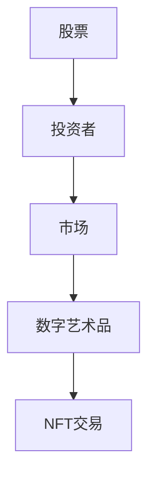
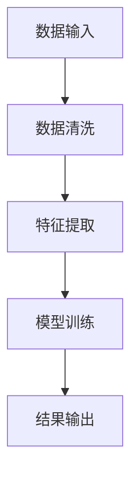
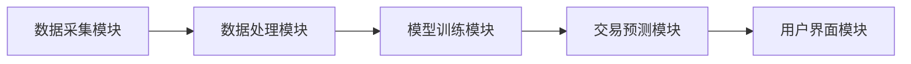
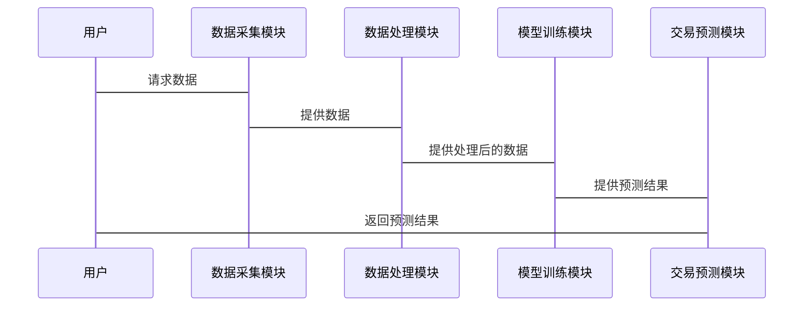

                 


# 股市估值对国际艺术品NFT交易的影响

> 关键词：股市估值，NFT，数字艺术品，国际交易，区块链，市场分析

> 摘要：本文探讨了股市估值对国际艺术品NFT交易的影响，分析了NFT市场的核心机制、价值评估模型以及与股市估值的关联。通过算法原理、系统架构设计和实际案例分析，揭示了数字艺术品市场的潜在价值和投资机会。

---

## 第一部分：背景介绍

### 第1章：核心概念与问题背景

#### 1.1 问题背景

- **1.1.1 股市估值的基本概念**  
  股市估值是通过对公司财务数据和市场趋势的分析，评估股票的内在价值。常用的方法包括市盈率（P/E）、市净率（P/B）等指标。

- **1.1.2 NFT与数字艺术品的定义**  
  NFT（非同质化代币）是一种基于区块链技术的数字资产，用于证明数字艺术品的所有权。数字艺术品是NFT的主要应用之一，代表创作者的原创作品。

- **1.1.3 国际艺术品NFT交易的兴起**  
  随着区块链技术的发展，NFT艺术品市场迅速崛起，吸引了大量投资者和创作者。国际化的艺术品NFT交易为数字艺术提供了新的价值评估和流通渠道。

#### 1.2 问题描述

- **1.2.1 股市估值与NFT交易的关系**  
  股市估值的原理可以为NFT交易提供参考，帮助投资者评估数字艺术品的价值。

- **1.2.2 数字艺术品市场的现状与挑战**  
  数字艺术品市场存在价值评估困难、流动性不足等问题，而NFT技术的引入为市场带来了新的解决方案。

- **1.2.3 国际化视角下的NFT交易特点**  
  国际化交易使得数字艺术品的价值不再局限于地域，市场更加全球化，交易量和价格波动也更大。

#### 1.3 问题解决

- **1.3.1 股市估值对NFT交易的影响机制**  
  股市估值方法可以用于评估NFT的艺术品价值，但需要结合NFT的稀缺性和市场需求。

- **1.3.2 数字艺术品价值评估的方法**  
  包括市场价法、成本法、收益法等，结合NFT的流动性、市场需求和创作者声誉。

- **1.3.3 国际化视角下的NFT交易策略**  
  利用国际市场数据和趋势，优化NFT投资组合，降低风险。

#### 1.4 边界与外延

- **1.4.1 股市估值的适用范围**  
  股市估值适用于NFT的长期价值评估，但短期波动需结合市场情绪分析。

- **1.4.2 NFT交易的边界条件**  
  包括交易市场的流动性、NFT的合规性、区块链技术的安全性等。

- **1.4.3 数字艺术品市场的扩展性**  
  随着技术进步，数字艺术品市场将扩展至更多领域，如虚拟现实和增强现实。

#### 1.5 概念结构与核心要素

- **1.5.1 概念结构图**  
  使用Mermaid绘制的概念结构图展示了股市估值、NFT交易和数字艺术品之间的关系。

- **1.5.2 核心要素分析**  
  核心要素包括NFT的唯一性、区块链的透明性、市场的流动性等。

---

### 第2章：核心概念与联系

#### 2.1 核心概念原理

- **2.1.1 股市估值的基本原理**  
  股市估值基于公司基本面和市场情绪，通过指标分析确定股票价值。

- **2.1.2 NFT交易的核心机制**  
  NFT通过区块链技术实现去中心化交易，确保数字艺术品的唯一性和所有权。

- **2.1.3 数字艺术品的价值评估模型**  
  结合NFT的稀缺性、市场需求和创作者声誉，构建价值评估模型。

#### 2.2 概念属性特征对比

- **2.2.1 股市估值与NFT交易的对比分析**  
  列表对比了两者的市场机制、价值评估方法和风险因素。

- **2.2.2 数字艺术品与传统艺术品的对比**  
  比较了两者的流通性、所有权和价值评估方式。

- **2.2.3 国际化视角下的市场特征**  
  国际化使得数字艺术品市场更加多样化和全球化。

#### 2.3 ER实体关系图



---

### 第3章：算法原理讲解

#### 3.1 算法原理

- **3.1.1 回归分析在股市估值中的应用**  
  使用线性回归模型预测股票价格，公式为：$$ P = \alpha + \beta \times E + \epsilon $$

- **3.1.2 时间序列分析在NFT交易预测中的应用**  
  使用ARIMA模型预测NFT交易量，公式为：$$ T = \gamma + \delta \times P + \zeta \times Q + \epsilon $$

- **3.1.3 数字艺术品价值评估的机器学习算法**  
  使用随机森林模型评估艺术品价值，公式为：$$ V = \alpha \times T + \beta \times Q + \gamma \times R + \epsilon $$

#### 3.2 算法流程图



---

## 第二部分：系统分析与架构设计

### 第4章：系统分析与架构设计

#### 4.1 问题场景介绍

- 介绍NFT交易系统的需求和目标，包括数据采集、价值评估和交易预测。

#### 4.2 项目介绍

- 项目目标：构建一个基于股市估值的NFT交易预测系统。

#### 4.3 系统功能设计

- **领域模型**：使用Mermaid类图展示系统中的主要实体和交互。

```mermaid
classDiagram
    class 股市数据 {
        stock_price: 数组
        market_trend: 数组
    }
    class NFT交易数据 {
        nft_price: 数组
        transaction_volume: 数组
    }
    class 数字艺术品 {
        id: 整数
        artist: 字符串
        creation_date: 日期
        value: 数值
    }
    股市数据 <---> 数字艺术品
    NFT交易数据 <---> 数字艺术品
```

#### 4.4 系统架构设计

- **架构图**：使用Mermaid绘制系统架构图，展示各模块的交互。



#### 4.5 系统接口设计

- 接口定义：数据接口、模型接口和用户接口。

#### 4.6 系统交互设计

- **序列图**：展示系统中各模块的交互流程。



---

## 第三部分：项目实战

### 第5章：项目实战

#### 5.1 环境安装

- **工具安装**：安装Python、Pandas、Scikit-learn等库。

#### 5.2 核心代码实现

- **数据预处理代码**：
  ```python
  import pandas as pd
  data = pd.read_csv('nft_market.csv')
  data = data.dropna()
  ```

- **模型训练代码**：
  ```python
  from sklearn.linear_model import LinearRegression
  model = LinearRegression()
  model.fit(X_train, y_train)
  ```

- **交易预测代码**：
  ```python
  import numpy as np
  predictions = model.predict(X_test)
  ```

#### 5.3 案例分析

- **案例一**：分析某NFT艺术品的市场表现，预测其未来价格。
- **案例二**：比较不同NFT项目的价格波动与股市估值的关系。

#### 5.4 项目小结

- 总结项目的实现过程和取得的成果，强调股市估值对NFT交易的影响。

---

## 第四部分：最佳实践与注意事项

### 第6章：最佳实践

#### 6.1 最佳实践 Tips

- 数据清洗的重要性。
- 模型选择与优化的关键点。
- 交易策略的多样性。

#### 6.2 小结

- 回顾全文，总结核心观点。

#### 6.3 注意事项

- 数据来源的可靠性。
- 模型的适用性和局限性。
- 市场风险的防范。

#### 6.4 拓展阅读

- 推荐相关书籍和资源，供读者深入学习。

---

## 作者

**作者：AI天才研究院/AI Genius Institute & 禅与计算机程序设计艺术/Zen And The Art of Computer Programming**

---

**结束**

