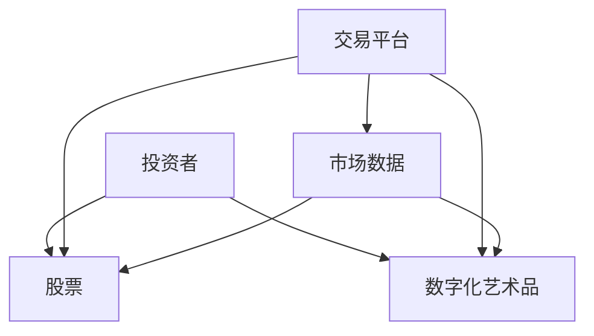
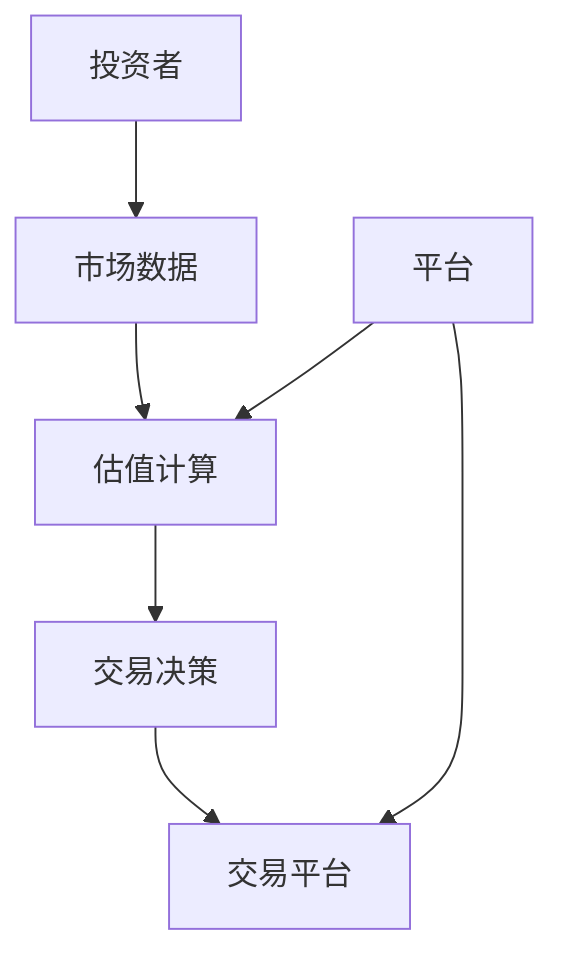
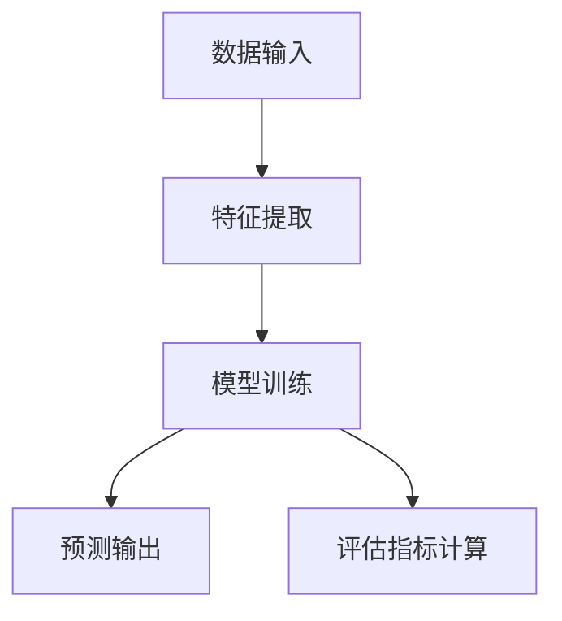
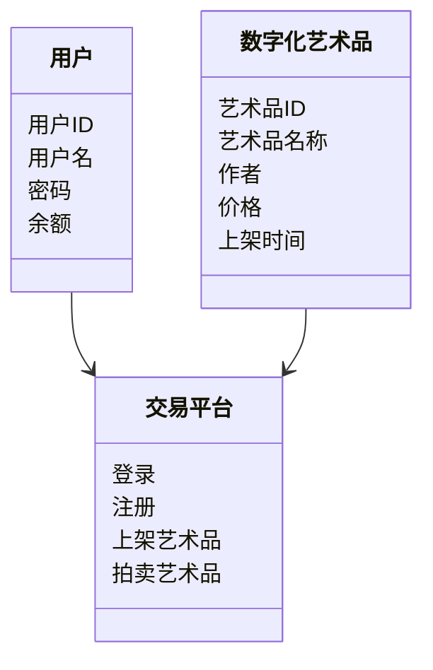
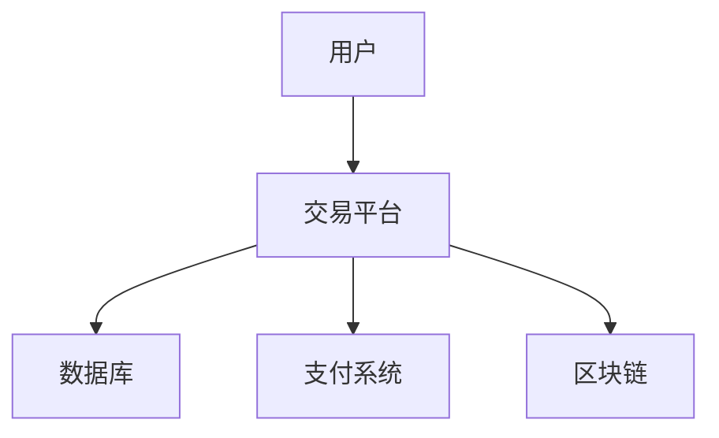
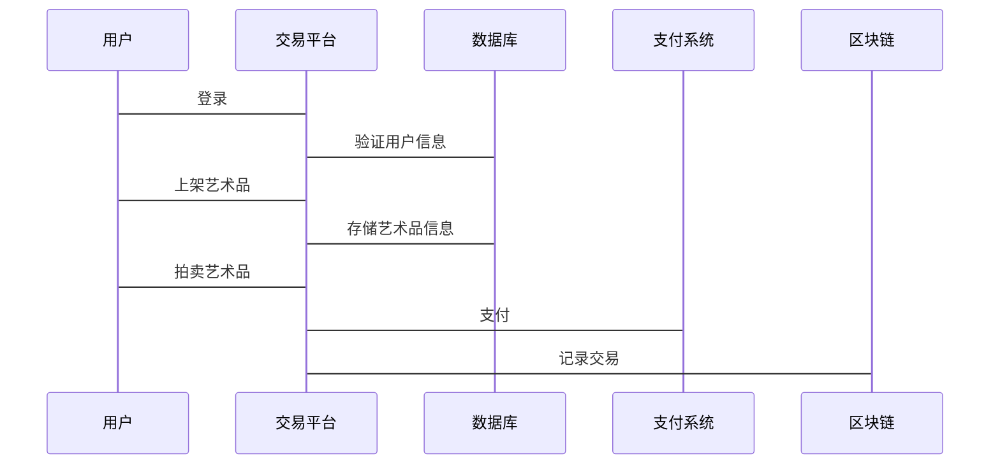

                 


# 股市估值对国际艺术品数字化交易平台的影响

---

## 关键词

- 股市估值
- 数字化交易平台
- 艺术品市场
- 机器学习
- 系统架构设计

---

## 摘要

本文探讨股市估值对国际艺术品数字化交易平台的影响，分析数字化交易的技术基础、市场现状及未来趋势。通过核心概念对比、算法模型构建和系统设计，揭示股市估值对平台的动态影响。文章最后提供实战案例和最佳实践，为相关领域提供理论与实践指导。

---

# 第一部分：背景介绍

## 第1章：股市估值与国际艺术品市场概述

### 1.1 股市估值的基本概念

#### 1.1.1 股市估值的定义与作用

股市估值是指对股票内在价值的评估，用于判断其市场价格是否合理。其作用包括指导投资决策、评估企业价值和市场风险。

#### 1.1.2 股市估值的核心指标

- 市盈率（P/E）
- 市净率（P/B）
- 股息率
- 市值与销售收入比

#### 1.1.3 股市估值与艺术品市场的关联性

艺术品市场与股市的投资者行为、市场流动性存在相似性，但艺术品价值受主观因素影响更大，波动性高于股票。

### 1.2 国际艺术品市场的现状

#### 1.2.1 国际艺术品市场的规模与结构

2022年全球艺术品市场成交额约650亿美元，主要分布在欧美地区，拍卖行和画廊是主要销售渠道。

#### 1.2.2 数字化交易在艺术品市场中的兴起

数字化交易平台降低了交易门槛，提高了艺术品的流通性，使艺术品投资更趋近于股票交易。

#### 1.2.3 艺术品数字化交易平台的典型模式

- 基于区块链的NFT平台（如OpenSea）
- 传统拍卖行的数字化转型（如苏富比在线拍卖）

## 第2章：问题背景与研究意义

### 2.1 数字化交易平台的兴起

#### 2.1.1 数字化交易的技术基础

互联网技术的发展、区块链的去中心化特性以及人工智能的应用推动了数字化交易的普及。

#### 2.1.2 数字化交易平台的优势与挑战

优势：透明高效、降低交易成本；挑战：缺乏监管、艺术品真伪辨别困难。

#### 2.1.3 股市估值在数字化交易中的作用

通过分析市场情绪和价格波动，帮助投资者做出决策，影响平台交易活跃度。

### 2.2 艺术品市场的数字化转型

#### 2.2.1 艺术品市场的传统模式与数字化模式对比

传统模式依赖中间商，交易成本高；数字化模式直接连接买家和卖家，透明高效。

#### 2.2.2 数字化交易平台对艺术品市场的重构

打破了地域限制，扩大了艺术品的受众群体，提升了交易效率。

#### 2.2.3 股市估值在数字化交易平台中的应用

通过分析平台交易数据和市场情绪，预测艺术品价格走势，优化投资决策。

### 2.3 问题背景与研究意义

#### 2.3.1 股市估值对数字化交易平台的影响问题

研究如何利用股市估值模型优化艺术品价格预测，提升交易效率。

#### 2.3.2 研究的艺术价值与现实意义

为艺术品投资者和平台提供科学的估值工具，推动艺术品市场的健康发展。

#### 2.3.3 研究的创新点与突破点

将股市估值方法应用于艺术品市场，构建跨领域的分析模型。

---

# 第二部分：核心概念与联系

## 第3章：核心概念与原理

### 3.1 股市估值的核心原理

#### 3.1.1 股票价值评估的基本方法

- 市盈率法
- 现金流折现法
- 市净率法

#### 3.1.2 市场情绪与股市估值的关系

市场情绪影响投资者行为，进而影响股票价格和估值。

#### 3.1.3 股市估值的动态变化机制

价格波动、市场信息和宏观经济因素共同作用，导致估值变化。

### 3.2 艺术品数字化交易的核心原理

#### 3.2.1 数字化艺术品的定义与特征

数字化艺术品指以数字形式存在的艺术作品，具有可复制性和可传播性。

#### 3.2.2 艺术品数字化交易的流程与机制

- 用户注册
- 作品上架
- 价格拍卖
- 作品交割

#### 3.2.3 数字化交易平台的运作模式

采用区块链技术确保作品 authenticity，智能合约实现自动交割。

### 3.3 股市估值与数字化交易的关联性分析

#### 3.3.1 股市估值对数字化交易的影响路径

- 市场情绪影响交易活跃度
- 价格波动影响投资者信心
- 估值变化影响平台交易量

#### 3.3.2 数字化交易对股市估值的反向影响

- 提高市场流动性
- 影响投资者情绪
- 改变市场结构

#### 3.3.3 两者的协同效应与潜在风险

协同效应：提高市场效率，优化资源配置；风险：市场过度波动和信息不对称。

## 第4章：核心概念的属性特征对比

### 4.1 股市估值与数字化交易的属性对比

| 属性         | 股市估值                | 数字化交易               |
|--------------|-------------------------|--------------------------|
| 价值评估     | 客观数据驱动            | 主观与客观结合            |
| 市场流动性     | 高                     | 中到高                   |
| 交易成本     | 低                     | 低到中                   |
| 交易主体     | 多样，包括机构和个人     | 多样，但平台作为中介      |
| 交易标的     | 股票                   | 数字化艺术品             |
| 交易规则     | 严格监管                | 较少监管，依赖技术保障    |

### 4.2 股市估值与数字化交易的特征对比

| 特征         | 股市估值                | 数字化交易               |
|--------------|-------------------------|--------------------------|
| 价格波动性     | 高                     | 高                       |
| 信息透明度     | 高                     | 高                       |
| 投资门槛     | 低                     | 中到低                   |
| 风险因素     | 宏观经济、政策风险      | 市场流动性、技术风险      |

## 第5章：实体关系图与流程图

### 5.1 股市估值与数字化交易的实体关系图



### 5.2 股市估值与数字化交易的流程图



---

# 第三部分：算法原理讲解

## 第6章：基于机器学习的股市估值预测模型

### 6.1 算法原理

#### 6.1.1 线性回归模型

线性回归模型用于预测股票价格，基于历史数据和市场指标。

#### 6.1.2 算法流程



#### 6.1.3 Python代码实现

```python
import pandas as pd
from sklearn.linear_model import LinearRegression
from sklearn.metrics import mean_squared_error

# 加载数据
data = pd.read_csv('stock_data.csv')

# 特征与目标变量
X = data[['PE', 'PB', 'Volume']]
y = data['Price']

# 模型训练
model = LinearRegression()
model.fit(X, y)

# 预测与评估
y_pred = model.predict(X)
print(mean_squared_error(y, y_pred))
```

### 6.2 算法原理的数学模型

线性回归模型：

$$ y = \beta_0 + \beta_1 x_1 + \beta_2 x_2 + ... + \beta_n x_n + \epsilon $$

其中，$\beta_0$是截距，$\beta_i$是回归系数，$\epsilon$是误差项。

---

# 第四部分：系统分析与架构设计

## 第7章：系统分析与架构设计

### 7.1 问题场景介绍

分析数字化交易平台的用户需求，设计系统功能模块。

### 7.2 系统功能设计

#### 7.2.1 领域模型类图



### 7.3 系统架构设计

#### 7.3.1 系统架构图



### 7.4 系统接口设计

- 用户登录与注册接口
- 艺术品上架与拍卖接口
- 交易完成与支付接口

### 7.5 系统交互序列图



---

# 第五部分：项目实战

## 第8章：项目实战

### 8.1 环境安装与配置

安装Python、Pandas、Scikit-learn等库，配置开发环境。

### 8.2 系统核心实现

#### 8.2.1 核心代码实现

```python
from flask import Flask, request, jsonify
import sqlite3

app = Flask(__name__)

@app.route('/login', methods=['POST'])
def login():
    data = request.json
    # 登录验证逻辑
    return jsonify({'status': 'success'})

@app.route('/upload', methods=['POST'])
def upload():
    data = request.json
    # 上架艺术品逻辑
    return jsonify({'status': 'success'})

if __name__ == '__main__':
    app.run()
```

#### 8.2.2 代码功能解读

- `/login`接口：处理用户登录请求。
- `/upload`接口：处理用户上架艺术品请求。

### 8.3 实际案例分析

分析某数字化交易平台的用户行为数据，利用机器学习模型预测艺术品价格走势。

### 8.4 项目小结

总结项目实现的关键点和遇到的问题，提出改进建议。

---

# 第六部分：最佳实践

## 第9章：最佳实践

### 9.1 小结

股市估值对数字化交易平台的影响是双向的，投资者和平台需共同适应市场变化。

### 9.2 注意事项

- 注意市场风险
- 确保数据安全
- 遵守相关法律法规

### 9.3 拓展阅读

推荐相关书籍和资源，帮助读者深入学习。

---

## 作者：AI天才研究院 & 禅与计算机程序设计艺术

---

通过以上结构，文章全面分析了股市估值对国际艺术品数字化交易平台的影响，从理论到实践，为读者提供了深入的见解和实用指导。

