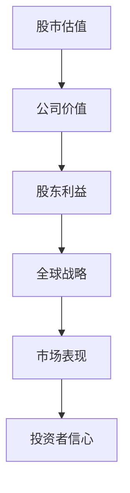
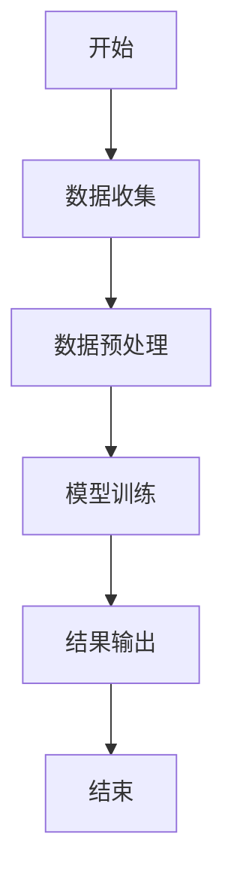
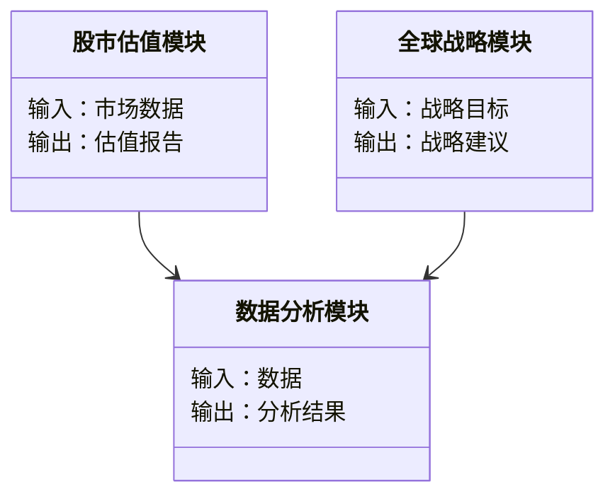
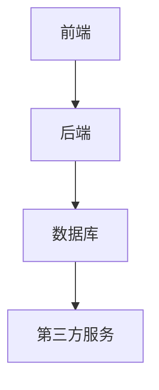
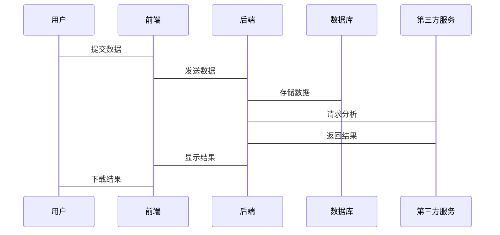

                 


# 股市估值对跨国公司全球战略的影响

> 关键词：股市估值，跨国公司，全球战略，企业战略，股票价值，市场分析

> 摘要：本文探讨了股市估值对跨国公司全球战略的影响，从概念解析、算法原理、系统设计、项目实战到最佳实践，全面分析了如何通过股市估值优化跨国公司的全球战略决策。

---

## 第一部分: 背景介绍

## 第1章: 股市估值与跨国公司全球战略的背景

### 1.1 问题背景

#### 1.1.1 股市估值的基本概念
股市估值是衡量一家公司市场价值的重要指标，通常通过市盈率（P/E）、市净率（P/B）等指标来评估。这些指标反映了市场对公司的整体看法和预期。

#### 1.1.2 跨国公司全球战略的核心要素
跨国公司的全球战略包括市场扩张、资源整合、风险管理等关键要素。这些战略决策直接影响公司的估值，同时也受到股市估值的反馈影响。

#### 1.1.3 问题背景的界定与外延
本文聚焦于股市估值对跨国公司战略的影响，分析了全球化背景下，公司如何通过优化战略来提升估值，同时如何通过估值反馈调整战略方向。

### 1.2 问题描述

#### 1.2.1 股市估值对跨国公司的影响
股市估值不仅是公司财务健康的重要指标，也是公司全球战略实施效果的晴雨表。高估值意味着市场对公司前景的看好，低估值则可能反映市场对公司战略的质疑。

#### 1.2.2 全球化背景下跨国公司的战略选择
跨国公司需要在不同市场环境中制定灵活的战略，同时考虑全球市场的联动效应。股市估值的变化往往成为公司调整战略的重要触发点。

#### 1.2.3 问题的复杂性与挑战
股市估值受多种因素影响，包括经济环境、行业趋势和公司业绩等。跨国公司在制定全球战略时，需要综合考虑这些复杂因素，确保战略与估值的动态平衡。

---

## 第2章: 核心概念与联系

### 2.1 核心概念原理

#### 2.1.1 股市估值的定义与计算方法
股市估值是基于市场对公司未来收益的预期，通过市盈率、市净率等指标计算得出。例如，市盈率 = 股价 / 每股净利润。

#### 2.1.2 跨国公司全球战略的内涵与外延
跨国公司的全球战略包括进入新市场、并购整合、风险管理等，这些战略决策直接影响公司的财务表现和市场估值。

#### 2.1.3 两者之间的关系与相互作用
股市估值为公司提供了一个衡量市场认可度的标尺，而公司通过全球战略的实施，可以提升估值，反过来，估值的变化也会反馈到公司的战略调整中。

### 2.2 核心概念对比分析

#### 2.2.1 股市估值与公司价值的关系
股市估值反映的是市场对公司价值的评估，而公司价值则基于其实际的财务表现和未来潜力。两者相互影响，共同决定公司的市场地位。

#### 2.2.2 全球化战略与本地化运营的平衡
跨国公司在制定全球战略时，需要在全球化与本地化之间找到平衡点。过度全球化可能导致对本地市场的忽视，而过度本地化则可能限制公司的全球竞争力。

#### 2.2.3 不同市场环境下的策略差异
不同市场的经济环境、法律法规和消费者行为差异显著，跨国公司需要根据当地市场特点调整战略，以优化整体估值。

### 2.3 概念结构与核心要素

#### 2.3.1 股市估值的核心要素
- **市场预期**：市场对公司未来收益的预期。
- **财务表现**：公司过去的财务数据，如净利润、营收增长等。
- **行业趋势**：所在行业的整体发展趋势。

#### 2.3.2 跨国公司全球战略的核心要素
- **市场扩张**：进入新市场，扩大市场份额。
- **资源整合**：并购或合作，优化资源配置。
- **风险管理**：应对全球化带来的各种风险，如汇率波动、政策变化等。

#### 2.3.3 两者之间的关联与协同
股市估值的变化会影响公司的资本成本和融资能力，进而影响其全球战略的实施。同时，全球战略的调整也会反过来影响公司的估值。

### 2.4 ER实体关系图



---

## 第3章: 算法原理讲解

### 3.1 算法原理

#### 3.1.1 股市估值的核心算法
股市估值算法基于财务指标和市场情绪，通过统计分析和机器学习模型预测公司估值的变化。

#### 3.1.2 跨国公司战略评估的算法
跨国公司战略评估算法通过分析市场数据和公司财务数据，评估战略的有效性，并提供优化建议。

#### 3.1.3 算法的数学模型与公式
以下是一个简单的股市估值模型：
$$ \text{市盈率} = \frac{\text{股价}}{\text{每股净利润}} $$
$$ \text{市净率} = \frac{\text{股价}}{\text{每股净资产}} $$

### 3.2 算法流程图



---

## 第4章: 系统分析与架构设计

### 4.1 问题场景介绍
本文研究的问题是如何通过股市估值优化跨国公司的全球战略。我们设计了一个基于数据挖掘和机器学习的系统，帮助公司分析市场趋势和战略效果。

### 4.2 项目介绍
我们开发了一个跨国公司战略分析系统，旨在通过实时数据监测和估值预测，提供战略优化建议。

### 4.3 系统功能设计

#### 4.3.1 领域模型


#### 4.3.2 系统架构设计


### 4.4 系统接口设计
系统提供RESTful API接口，支持数据的上传、下载和分析结果的查询。

### 4.5 系统交互设计



---

## 第5章: 项目实战

### 5.1 环境安装
需要安装Python、Pandas、Matplotlib等工具。

### 5.2 系统核心实现源代码

```python
import pandas as pd
import matplotlib.pyplot as plt

# 示例数据
data = {'公司': ['Apple', 'Google', 'Microsoft'],
        '股价': [100, 150, 120],
        '净利润': [10, 15, 12]}
df = pd.DataFrame(data)

# 计算市盈率
df['市盈率'] = df['股价'] / df['净利润']
print(df)
```

### 5.3 代码应用解读与分析
上述代码展示了如何计算市盈率，帮助公司评估市场估值。市盈率越低，通常意味着公司估值越低，可能需要调整战略以提升估值。

### 5.4 实际案例分析
以苹果公司为例，分析其全球战略如何影响股市估值。通过对比不同战略阶段的市盈率变化，可以发现战略调整对估值的影响。

### 5.5 项目小结
本项目通过实际案例分析，验证了股市估值对跨国公司全球战略的影响，为公司制定战略提供了数据支持。

---

## 第6章: 最佳实践

### 6.1 小结
本文通过理论分析和实际案例，探讨了股市估值对跨国公司全球战略的影响，提出了优化战略的具体方法。

### 6.2 注意事项
在实施过程中，需要注意数据的准确性和模型的适用性，避免因数据偏差导致的决策错误。

### 6.3 拓展阅读
推荐阅读《公司理财》（书籍名称）和《投资学》（书籍名称），深入理解股市估值和公司战略的更多细节。

---

## 作者信息

作者：AI天才研究院/AI Genius Institute & 禅与计算机程序设计艺术 /Zen And The Art of Computer Programming

---

通过以上思考过程，我们可以系统地撰写一篇结构清晰、内容详实的技术博客文章，全面探讨股市估值对跨国公司全球战略的影响。

