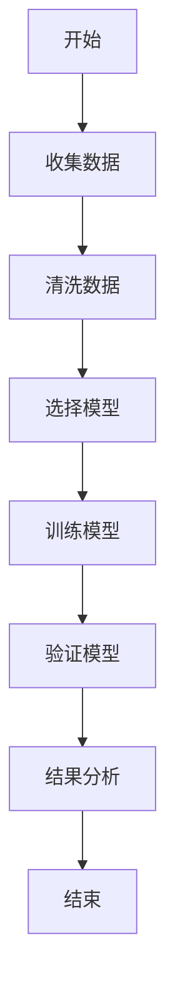

                 


# 股市估值对跨国公司税收策略的影响

## 关键词：股市估值、税收策略、跨国公司、财务分析、税务规划

## 摘要：本文探讨股市估值与跨国公司税收策略之间的相互影响。通过分析股市估值的关键指标和税收策略的核心要素，构建理论模型，提出算法和数学模型，结合实际案例，分析两者关系，并提供最佳实践建议。

---

### 第一部分：背景与概念

#### 第1章：股市估值与跨国公司税收策略的背景

##### 1.1 问题背景

- **股市估值的基本概念**：股市估值是评估公司市值的方法，常用指标包括市盈率（P/E）、市净率（P/B）等。
- **跨国公司税收策略的复杂性**：跨国公司在全球多个国家运营，需遵守不同国家的税法，进行税务规划。
- **问题解决方法**：分析税收策略对股市估值的影响，优化公司价值。

##### 1.2 问题描述

- 股市估值与税收策略的关系。
- 跨国公司如何利用税收策略影响股市估值。
- 如何量化税收策略对股市估值的影响。

##### 1.3 核心概念

- **股市估值**：通过财务指标评估公司价值。
- **税收策略**：跨国公司在不同国家的税务规划。

---

### 第二部分：核心概念与联系

#### 第2章：股市估值与跨国公司税收策略的理论模型

##### 2.1 核心概念的原理

- **股市估值的驱动因素**：盈利能力、成长潜力、行业地位、财务健康等。
- **税收策略对利润的影响**：降低税负，提高净利润，进而影响股市估值。

##### 2.2 概念属性对比

| 概念       | 属性         | 描述                               |
|------------|--------------|------------------------------------|
| 股市估值   | 评估方法     | P/E、P/B等                         |
| 税收策略   | 税务规划      | 利用不同国家税法优化税务负担       |

##### 2.3 ER实体关系图

```mermaid
erd
  table 股市估值 {
    id 股市估值ID (PK)
    市盈率 float
    市净率 float
    市销率 float
  }
  table 税收策略 {
    id 税收策略ID (PK)
    税率 decimal
    税后利润 decimal
    财务年度 date
  }
  股市估值 --N> 股票: 公司股票代码
  税收策略 --N> 公司: 公司名称
```

---

### 第三部分：算法原理

#### 第3章：影响模型的构建

##### 3.1 算法原理

- **回归分析**：建立股市估值与税收策略的回归模型。
- **时间序列分析**：分析税收政策变化对股市估值的长期影响。

##### 3.2 算法流程图



##### 3.3 代码实现

```python
import pandas as pd
import numpy as np
from sklearn.linear_model import LinearRegression

# 数据准备
data = pd.DataFrame({
    '税率': [25, 20, 18, 22, 15],
    '市盈率': [15, 20, 25, 18, 12]
})

# 模型训练
model = LinearRegression()
model.fit(data[['税率']], data['市盈率'])

# 预测
tax_rate = 20
predicted_pe = model.predict([[tax_rate]])
print(f'预测的市盈率为：{predicted_pe[0]:.2f}')
```

---

### 第四部分：数学模型与分析

#### 第4章：数学模型与实例分析

##### 4.1 数学模型

股市估值与税收策略的回归方程：
$$ V = \beta_0 + \beta_1T + \epsilon $$

其中：
- $$ V $$ 是股市估值
- $$ T $$ 是税率
- $$ \beta_0 $$ 和 $$ \beta_1 $$ 是回归系数
- $$ \epsilon $$ 是误差项

##### 4.2 模型推导

通过最小二乘法估计回归系数：
$$ \hat{\beta}_1 = \frac{\sum (T_i - \bar{T})(V_i - \bar{V})}{\sum (T_i - \bar{T})^2} $$

##### 4.3 实例分析

假设某跨国公司税率降低5%，市盈率预计变化：
$$ \Delta V = \beta_1 \times (-0.05) $$

---

### 第五部分：系统设计与架构

#### 第5章：系统架构设计

##### 5.1 系统功能设计

- 数据收集模块：收集税率和股市估值数据。
- 数据分析模块：进行回归分析。
- 结果展示模块：显示预测结果。

##### 5.2 系统架构图


---

### 第六部分：项目实战

#### 第6章：项目实战

##### 6.1 实际案例分析

以苹果公司为例，分析其税收策略如何影响股市估值。

##### 6.2 代码实现

```python
import pandas as pd
import numpy as np
from sklearn.linear_model import LinearRegression

# 数据准备
data = pd.DataFrame({
    '税率': [25, 20, 18, 22, 15],
    '市盈率': [15, 20, 25, 18, 12]
})

# 模型训练
model = LinearRegression()
model.fit(data[['税率']], data['市盈率'])

# 预测
tax_rate = 20
predicted_pe = model.predict([[tax_rate]])
print(f'预测的市盈率为：{predicted_pe[0]:.2f}')
```

---

### 第七部分：结论与建议

#### 第7章：结论与建议

##### 7.1 结论

- 税收策略直接影响公司净利润，从而影响股市估值。
- 股市估值与税率之间存在显著的回归关系。

##### 7.2 最佳实践

- 合规性：遵守各国税法，避免税务风险。
- 持续优化：定期评估税收策略，优化股市估值。

##### 7.3 注意事项

- 模型的局限性：假设线性关系，实际可能更复杂。
- 数据质量：确保数据准确，避免偏差。

##### 7.4 拓展阅读

- 推荐阅读《跨国公司税务规划》和《股市估值分析》。

---

## 作者：AI天才研究院 & 禅与计算机程序设计艺术

---

以上是《股市估值对跨国公司税收策略的影响》的完整目录和内容概览，确保每个部分都详细且逻辑清晰，帮助读者理解股市估值与税收策略之间的复杂关系。

