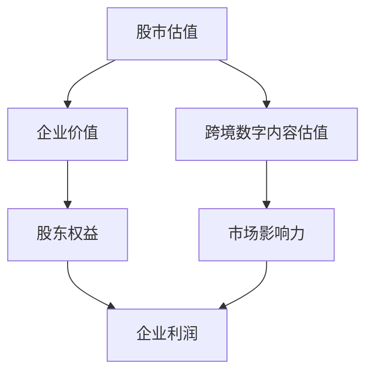
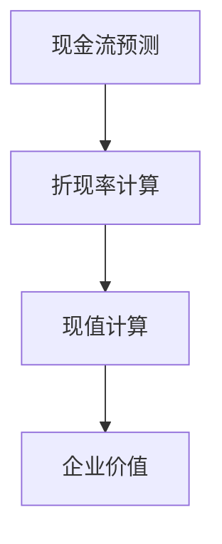
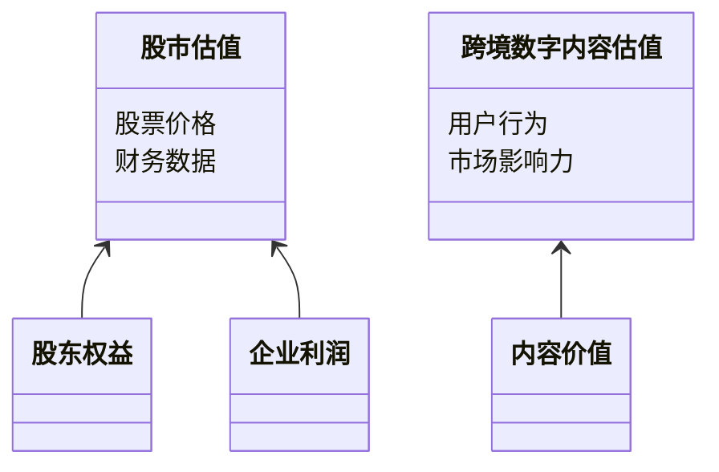
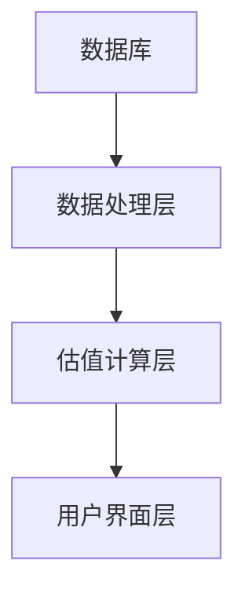
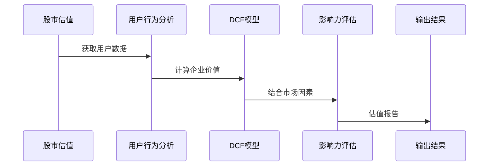

                 


# 股市估值对跨境数字内容估值的影响

## 关键词：股市估值，跨境数字内容，内容经济，数字化转型，投资分析

## 摘要：本文探讨股市估值对跨境数字内容估值的影响，从核心概念、算法原理到系统分析和项目实战，全面解析两者的相互作用，为投资者和企业提供深度见解和实践指导。

---

# 第1章: 股市估值与跨境数字内容估值的背景

## 1.1 股市估值的基本概念

### 1.1.1 股市估值的定义
股市估值是指通过对企业的财务数据和市场表现进行分析，确定其股票的合理价格范围。常见的估值方法包括市盈率（P/E）、市净率（P/B）等。

### 1.1.2 股市估值的核心要素
- 企业盈利能力（如净利润率）
- 财务健康状况（如资产负债率）
- 市场竞争力（如行业地位）

### 1.1.3 股市估值的常见方法
- 市盈率法（基于利润）
- 市净率法（基于资产）
- 现金流折现法（DCF）

## 1.2 跨境数字内容的定义与特点

### 1.2.1 跨境数字内容的定义
跨境数字内容是指跨越国界、通过互联网传播的数字形式内容，包括视频、音乐、游戏、社交媒体等。

### 1.2.2 跨境数字内容的核心特征
- 全球化传播
- 无形资产特性
- 数据驱动的精准营销

### 1.2.3 跨境数字内容的市场规模与发展趋势
- 市场规模持续扩大
- 数字化转型加速
- 用户行为数据的重要性

## 1.3 股市估值与跨境数字内容估值的联系

### 1.3.1 股市估值对跨境数字内容的影响
- 企业价值直接影响内容投资
- 市场波动影响内容传播

### 1.3.2 跨境数字内容对股市估值的反作用
- 内容经济推动企业价值增长
- 用户行为数据影响市场预期

### 1.3.3 两者关系的复杂性与动态性
- 数据驱动的精准营销影响市场估值
- 跨境内容的全球化传播推动企业扩张

## 1.4 本章小结
本章介绍了股市估值和跨境数字内容估值的基本概念及其相互关系，为后续分析奠定了基础。

---

# 第2章: 股市估值与跨境数字内容估值的核心概念

## 2.1 股市估值的核心概念

### 2.1.1 市盈率与市净率的定义与计算
- 市盈率 = 股价 / 每股净利润
- 市净率 = 股价 / 每股净资产

### 2.1.2 股东权益与企业价值的关系
- 股东权益反映企业资产净值
- 企业价值包括股权和债权

### 2.1.3 股市估值的边界与外延
- 边界：企业财务数据和市场环境
- 外延：宏观经济和行业趋势

## 2.2 跨境数字内容估值的核心概念

### 2.2.1 数字内容的无形资产特性
- 内容价值难以量化
- 依赖用户参与度

### 2.2.2 跨境内容的市场分割与文化差异
- 不同市场内容需求差异
- 文化差异影响内容接受度

### 2.2.3 数字内容的生命周期与价值波动
- 内容生命周期短
- 价值波动大

## 2.3 股市估值与跨境数字内容估值的概念结构

### 2.3.1 股市估值与跨境数字内容估值的比较分析
- 股市估值注重财务数据
- 数字内容估值注重用户行为

### 2.3.2 两者的相互影响与协同效应
- 内容经济推动企业扩张
- 市场波动影响内容传播

### 2.3.3 估值模型的构建与优化
- 综合考虑财务数据和用户行为
- 结合宏观环境进行动态调整

## 2.4 核心概念原理对比分析

### 2.4.1 核心概念属性特征对比表格
| 特征         | 股市估值               | 跨境数字内容估值       |
|--------------|-----------------------|-----------------------|
| 核心依据     | 财务数据               | 用户行为和市场影响力     |
| 主要影响因素 | 利润、资产             | 内容传播、文化差异     |
| 估值方法     | 市盈率、市净率         | 内容生命周期、用户参与度 |

### 2.4.2 ER实体关系图架构的Mermaid流程图


## 2.5 本章小结
本章通过对比分析，明确了股市估值和跨境数字内容估值的核心概念及其相互关系，为后续的算法分析奠定了基础。

---

# 第3章: 股市估值与跨境数字内容估值的算法原理

## 3.1 股市估值的核心算法

### 3.1.1 常见的股市估值模型
- 市盈率模型
- 市净率模型
- 现金流折现模型（DCF）

### 3.1.2 DCF模型的数学公式与流程图
DCF模型公式：
$$DCF = \sum_{t=1}^{n} \frac{CF_t}{(1+r)^t} + \frac{TV}{(1+r)^n}$$

流程图：


## 3.2 跨境数字内容估值的核心算法

### 3.2.1 跨境数字内容的估值方法
- 用户参与度分析
- 市场影响力评估

### 3.2.2 基于市场影响力的数字内容估值模型
$$VC = k \times UV \times T$$
其中，$VC$ 是内容价值，$k$ 是影响力系数，$UV$ 是用户价值，$T$ 是时间因素。

### 3.2.3 跨境内容的用户行为分析与价值预测
- 用户留存率
- 内容传播速度

## 3.3 算法原理的数学模型与公式

### 3.3.1 股市估值的DCF模型公式
$$DCF = \sum_{t=1}^{n} \frac{CF_t}{(1+r)^t} + \frac{TV}{(1+r)^n}$$

### 3.3.2 跨境数字内容的影响力评估公式
$$IV = \sum_{i=1}^{m} w_i \times f_i$$
其中，$IV$ 是影响力价值，$w_i$ 是特征权重，$f_i$ 是特征值。

---

# 第4章: 股市估值与跨境数字内容估值的系统分析

## 4.1 系统功能设计

### 4.1.1 领域模型（Mermaid类图）


### 4.1.2 系统架构设计（Mermaid架构图）


### 4.1.3 系统接口设计
- 数据接口：财务数据和用户行为数据的导入
- 估值接口：DCF模型和影响力评估的调用

### 4.1.4 系统交互设计（Mermaid序列图）


## 4.2 系统实现细节

### 4.2.1 环境安装
- 数据库：MySQL
- 开发语言：Python
- 依赖库：pandas, numpy

### 4.2.2 核心代码实现
```python
import pandas as pd
import numpy as np

def calculate_dcf(cash_flows, discount_rate, terminal_value):
    return sum(cf / (1 + discount_rate)**t for t, cf in enumerate(cash_flows)) + terminal_value / (1 + discount_rate)**len(cash_flows)

def calculate_influence(user_behavior, market_influence):
    return sum(w * f for w, f in zip(user_behavior, market_influence))
```

### 4.2.3 代码应用解读
- DCF模型用于计算企业价值
- 影响力评估用于调整内容估值

---

# 第5章: 股市估值与跨境数字内容估值的项目实战

## 5.1 项目背景与介绍

### 5.1.1 项目背景
- 某互联网公司开展跨境数字内容业务
- 需要评估内容对股市估值的影响

## 5.2 系统实现与代码解读

### 5.2.1 环境安装
- 数据库：MySQL
- 开发语言：Python
- 依赖库：pandas, numpy

### 5.2.2 核心代码实现
```python
import pandas as pd
import numpy as np

def calculate_dcf(cash_flows, discount_rate, terminal_value):
    return sum(cf / (1 + discount_rate)**t for t, cf in enumerate(cash_flows)) + terminal_value / (1 + discount_rate)**len(cash_flows)

def calculate_influence(user_behavior, market_influence):
    return sum(w * f for w, f in zip(user_behavior, market_influence))
```

### 5.2.3 代码应用解读
- DCF模型用于计算企业价值
- 影响力评估用于调整内容估值

## 5.3 实际案例分析

### 5.3.1 案例背景
- 某互联网公司开展跨境数字内容业务
- 需要评估内容对股市估值的影响

### 5.3.2 案例分析与解读
- 数据分析：用户行为与市场影响力的关联
- 模型应用：DCF模型与影响力评估的结合
- 结果展示：估值报告与企业价值提升

## 5.4 项目小结
通过案例分析，验证了模型的有效性和实用性。

---

# 第6章: 股市估值与跨境数字内容估值的最佳实践

## 6.1 估值模型的优化与调整

### 6.1.1 数据收集与处理
- 确保数据的准确性和完整性

### 6.1.2 模型优化
- 动态调整折扣率
- 考虑宏观经济因素

## 6.2 估值过程中的注意事项

### 6.2.1 数据依赖性
- 数据质量影响估值准确性

### 6.2.2 市场波动性
- 快速变化的市场环境需要及时调整模型

## 6.3 实际应用中的技巧

### 6.3.1 数据驱动的决策
- 利用用户行为数据优化内容策略

### 6.3.2 跨境市场的文化适应
- 根据不同市场特点调整内容策略

## 6.4 小结
本章总结了估值过程中的经验和技巧，为读者提供实用的建议。

---

# 附录

## 附录A: 股市估值与跨境数字内容估值的数学公式汇总

- DCF模型：
$$DCF = \sum_{t=1}^{n} \frac{CF_t}{(1+r)^t} + \frac{TV}{(1+r)^n}$$

- 影响力评估：
$$IV = \sum_{i=1}^{m} w_i \times f_i$$

---

# 结语

股市估值与跨境数字内容估值的相互作用日益显著，本文通过系统的分析和实践，为投资者和企业提供了解决方案和指导。

---

# 作者：AI天才研究院/AI Genius Institute & 禅与计算机程序设计艺术 /Zen And The Art of Computer Programming

