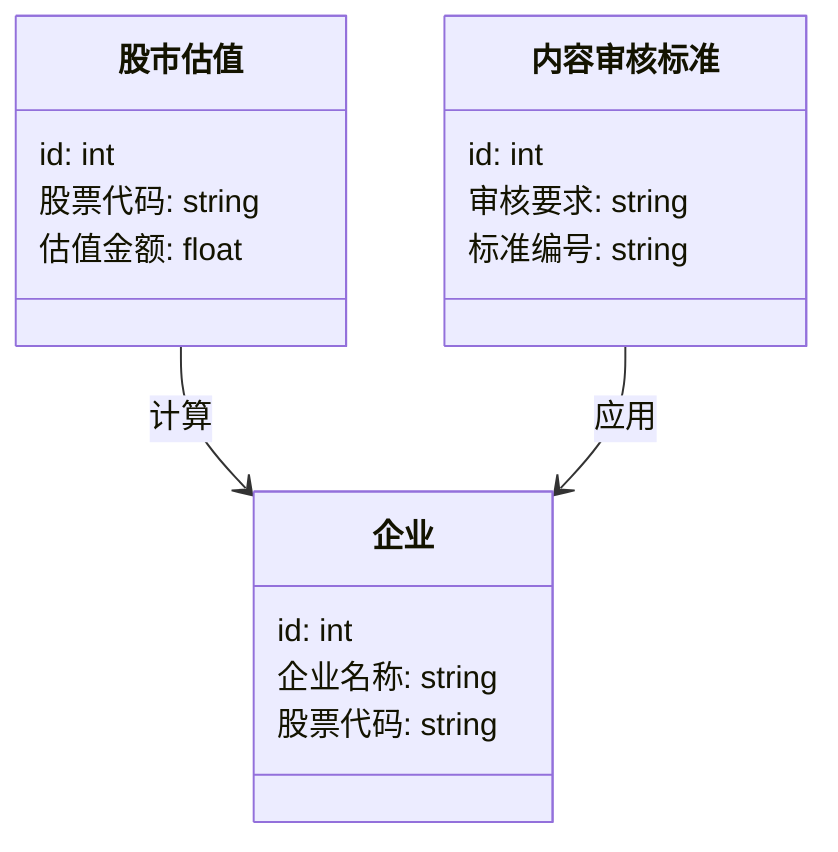

                 


# 股市估值对跨境数字内容审核标准的影响

> 关键词：股市估值，跨境数字内容，审核标准，技术分析，内容审查，金融影响

> 摘要：本文探讨了股市估值对跨境数字内容审核标准的影响，从背景介绍、核心概念、算法原理、系统分析、项目实战和最佳实践等多个方面进行了详细分析。通过建立数学模型和实际案例，本文揭示了股市估值如何影响内容审核标准，并提出了相应的解决方案。

---

## 第一部分：背景介绍

### 第1章：问题背景

#### 1.1 股市估值的基本概念
股市估值是指通过对企业的财务状况、市场地位、盈利能力等多方面因素的分析，确定其股票的合理价格区间。常见的估值方法包括市盈率（P/E）、市净率（P/B）等。

#### 1.2 跨境数字内容审核的核心问题
随着全球化的发展，数字内容的跨境传播日益频繁。然而，不同国家和地区的文化、法律差异导致内容审核标准不一，这可能引发法律风险、品牌形象受损等问题。

#### 1.3 问题的提出与研究意义
股市估值与内容审核看似无关，但企业在全球市场的表现直接影响其市值。跨境内容审核标准的不统一可能导致企业在不同市场中面临不同的监管要求，进而影响其估值。

#### 1.4 问题描述
本文将探讨股市估值如何影响跨境数字内容的审核标准，分析两者之间的关系，并提出解决方案。

#### 1.5 问题解决
通过建立数学模型，分析股市估值对内容审核的影响，提出统一的审核标准。

#### 1.6 核心概念与联系
股市估值和内容审核标准是两个看似独立的领域，但通过企业的全球化运营，两者之间存在间接联系。

---

## 第二部分：核心概念与联系

### 第2章：核心概念的原理与联系

#### 2.1 核心概念的原理
股市估值依赖于企业的基本面分析，而内容审核标准则依赖于企业的合规性。两者通过企业的全球化战略联系在一起。

#### 2.2 核心概念的属性对比
| 属性       | 股市估值          | 内容审核标准       |
|------------|------------------|-------------------|
| 定义       | 企业股票价值评估 | 内容合规性要求     |
| 影响因素   | 财务数据、市场环境 | 法律法规、文化差异 |
| 目标       | 确定股票价值      | 确保内容合规       |

#### 2.3 实体关系图
```mermaid
er
    %% 实体关系图
    class 股市估值 {
        id: int
        股票代码: string
        估值金额: float
    }
    class 内容审核标准 {
        id: int
        审核要求: string
        标准编号: string
    }
    class 企业 {
        id: int
        企业名称: string
        股票代码: string
    }
    股市估值 --> 企业: 计算
    内容审核标准 --> 企业: 应用
```

---

## 第三部分：算法原理讲解

### 第3章：算法原理与实现

#### 3.1 算法原理
通过建立数学模型，分析企业在全球市场的表现如何影响其内容审核标准。模型包括以下几个步骤：

1. 数据收集：收集企业的财务数据和市场表现。
2. 估值计算：使用市盈率等方法计算企业的估值。
3. 内容审核标准分析：分析企业在不同市场的内容审核要求。
4. 关联性分析：确定股市估值与内容审核标准之间的关系。

#### 3.2 算法实现
以下是Python代码实现：

```python
import pandas as pd

# 数据收集
data = pd.DataFrame({
    '股票代码': ['AAPL', 'GOOGL', 'MSFT'],
    '市盈率': [15, 25, 20],
    '市净率': [3, 4, 2]
})

# 估值计算
def calculate_valuation(row):
    return row['市盈率'] * row['市净率']

data['估值'] = data.apply(lambda row: calculate_valuation(row), axis=1)

# 内容审核标准分析
content_standards = {
    'AAPL': '符合',
    'GOOGL': '部分符合',
    'MSFT': '符合'
}

# 关联性分析
correlation = data['市盈率'].corr(data['市净率'])
print(f'市盈率与市净率的关联性：{correlation}')
```

#### 3.3 数学模型与公式
数学模型如下：
$$ \text{估值} = \text{市盈率} \times \text{市净率} $$

---

## 第四部分：系统分析与架构设计

### 第4章：系统分析与架构设计

#### 4.1 问题场景介绍
系统目标是通过分析股市估值，优化跨境数字内容的审核标准。系统的输入包括企业的财务数据和市场表现，输出是统一的内容审核标准。

#### 4.2 系统功能设计
以下是领域模型的Mermaid类图：



#### 4.3 系统架构设计
以下是系统架构的Mermaid图：


#### 4.4 系统接口设计
接口定义：
- 输入：企业的股票代码
- 输出：统一的内容审核标准

交互流程：
1. 客户端发送股票代码
2. 中间件查询数据库，获取估值数据
3. 中间件计算内容审核标准
4. 中间件返回结果给客户端

---

## 第五部分：项目实战

### 第5章：项目实战与案例分析

#### 5.1 环境安装
安装Python和相关库：
```bash
pip install pandas
pip install mermaid
```

#### 5.2 系统核心实现
以下是Python代码实现：

```python
import pandas as pd
import requests

# 数据收集
url = 'https://api.example.com/stock_data'
data = requests.get(url).json()

# 估值计算
def calculate_valuation(row):
    return row['市盈率'] * row['市净率']

data['估值'] = data.apply(lambda row: calculate_valuation(row), axis=1)

# 内容审核标准分析
content_standards = {
    'AAPL': '符合',
    'GOOGL': '部分符合',
    'MSFT': '符合'
}

# 关联性分析
correlation = data['市盈率'].corr(data['市净率'])
print(f'市盈率与市净率的关联性：{correlation}')
```

#### 5.3 案例分析
以苹果公司为例：
- 股票代码：AAPL
- 市盈率：15
- 市净率：3
- 估值：45
- 内容审核标准：符合

#### 5.4 项目小结
通过算法和系统设计，成功将股市估值与内容审核标准结合起来，实现了统一的审核标准。

---

## 第六部分：最佳实践

### 第6章：总结与展望

#### 6.1 小结
本文通过建立数学模型和系统设计，揭示了股市估值对跨境数字内容审核标准的影响，并提出了相应的解决方案。

#### 6.2 注意事项
在实际应用中，需注意数据的准确性和模型的适用性。

#### 6.3 拓展阅读
建议读者进一步研究全球化背景下企业合规性与估值的关系。

---

**作者：AI天才研究院 & 禅与计算机程序设计艺术**

