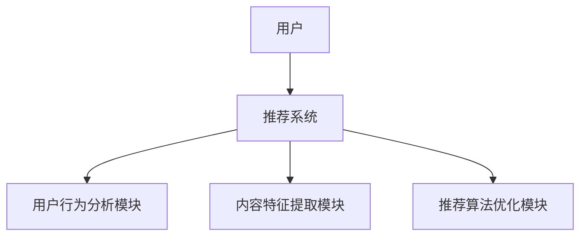
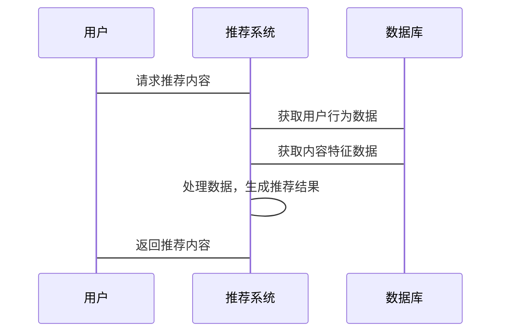

                 


# 股市估值对跨境数字内容推荐算法的影响

> 关键词：股市估值、跨境数字内容、推荐算法、数据特征、算法优化、用户行为分析

> 摘要：本文探讨了股市估值与跨境数字内容推荐算法之间的复杂关系。通过分析股市估值的核心概念和推荐算法的数学模型，结合实际案例，详细阐述了股市波动如何影响推荐系统的性能和数据特征。文章还提供了系统架构设计和项目实战，帮助读者理解如何在实际应用中优化推荐算法，以应对股市估值带来的挑战。

---

## 第1章: 股市估值与跨境数字内容推荐算法的背景

### 1.1 股市估值的基本概念

#### 1.1.1 股市估值的定义与核心要素
股市估值是指对股票价格的合理性和内在价值的评估过程。核心要素包括：
- **市盈率（P/E）**：衡量股票价格与每股收益的关系。
- **市净率（P/B）**：衡量股票价格与每股净资产的关系。
- **市值**：公司总市值的计算。

#### 1.1.2 股市估值的主要方法
- **基本分析法**：通过公司财务数据（如收入、利润、负债等）评估股票价值。
- **技术分析法**：通过历史价格和成交量数据预测未来走势。
- **股票评级**：根据公司基本面和技术指标给出的投资评级。

#### 1.1.3 股市估值与经济周期的关系
股市估值受到宏观经济周期的影响，例如经济增长、通货膨胀和利率变化等因素会直接影响股票估值。

### 1.2 跨境数字内容推荐算法的基本概念

#### 1.2.1 推荐算法的定义与分类
推荐算法是一种通过分析用户行为和内容特征，预测用户兴趣并进行个性化推荐的技术。主要分类包括：
- **协同过滤**：基于用户行为相似性推荐。
- **基于内容的推荐**：基于内容特征相似性推荐。
- **混合推荐**：结合协同过滤和内容推荐的混合模型。

#### 1.2.2 跨境数字内容的特点与挑战
跨境数字内容涉及多语言、多文化背景的用户群体，推荐算法需要处理语言、文化差异和全球化内容分发的挑战。

#### 1.2.3 股市估值与推荐算法的关联性
股市估值的波动性和不确定性可能影响用户的消费行为和内容偏好，从而间接影响推荐算法的推荐结果。

---

## 第2章: 股市估值的核心概念与分析方法

### 2.1 股市估值的核心概念

#### 2.1.1 市盈率（P/E）的计算与应用
市盈率 = 股票价格 / 每股收益（Earnings Per Share，EPS）。

#### 2.1.2 市净率（P/B）的计算与应用
市净率 = 股票价格 / 每股净资产（Book Value Per Share）。

#### 2.1.3 市值与净利润的关系
市值 = 股票价格 × 流通股数量；净利润是衡量公司盈利能力的重要指标。

### 2.2 股市估值的分析方法

#### 2.2.1 基本分析法
通过分析公司的财务报表（收入、利润、负债等）预测股票的内在价值。

#### 2.2.2 技术分析法
通过分析历史价格和成交量数据，预测股票价格的短期波动。

#### 2.2.3 股票评级与评分系统
根据公司基本面和技术指标，给出买入、持有或卖出的投资评级。

---

## 第3章: 跨境数字内容推荐算法的核心原理

### 3.1 推荐算法的基本原理

#### 3.1.1 协同过滤推荐算法
协同过滤基于用户行为的相似性进行推荐。例如，如果用户A和用户B的购买行为相似，用户B喜欢的内容推荐给用户A。

#### 3.1.2 基于内容的推荐算法
基于内容特征相似性进行推荐。例如，如果用户喜欢电影A，推荐与电影A内容相似的电影B。

#### 3.1.3 混合推荐算法
结合协同过滤和内容推荐的混合模型，通过加权平均的方式提高推荐的准确性和多样性。

### 3.2 跨境数字内容推荐的特殊性

#### 3.2.1 跨境内容的多样性
跨境数字内容涉及多种语言和文化背景，推荐算法需要处理多样的内容特征和用户需求。

#### 3.2.2 用户行为的跨文化差异
不同文化背景的用户在内容偏好和行为模式上存在显著差异，影响推荐算法的个性化能力。

#### 3.2.3 内容分发的全球化挑战
全球化内容分发需要推荐算法具备跨地域、跨语言的内容理解和推荐能力。

---

## 第4章: 股市估值对跨境数字内容推荐算法的影响分析

### 4.1 股市估值对推荐算法数据特征的影响

#### 4.1.1 股市波动对用户行为数据的影响
股市波动可能导致用户消费行为的变化，例如在股市上涨时增加消费，股市下跌时减少消费。

#### 4.1.2 股市趋势对内容偏好变化的影响
股市趋势可能影响用户的兴趣偏好，例如在经济繁荣时期，用户可能更倾向于消费高端内容。

#### 4.1.3 股市风险对推荐算法稳定性的影响
股市风险可能导致推荐算法的数据波动性增加，影响推荐的准确性和稳定性。

### 4.2 股市估值对推荐算法性能的影响

#### 4.2.1 股市波动对推荐算法准确性的测试
股市波动可能导致推荐算法的准确性下降，需要通过实验验证波动对推荐性能的影响。

#### 4.2.2 股市趋势对推荐算法召回率的影响
股市趋势可能影响推荐算法的召回率，例如在经济低迷时期，用户可能减少对某些内容的消费。

#### 4.2.3 股市风险对推荐算法鲁棒性的挑战
股市风险要求推荐算法具备更强的鲁棒性，能够在市场波动中保持稳定的推荐效果。

---

## 第5章: 股市估值与跨境数字内容推荐算法的数学模型与公式

### 5.1 股市估值的数学模型

#### 5.1.1 市盈率模型
$$ P/E = \frac{Price}{Earnings} $$

#### 5.1.2 市净率模型
$$ P/B = \frac{Price}{Book\ Value} $$

#### 5.1.3 市值计算公式
$$ Market\ Value = Price \times Shares\ Outstanding $$

### 5.2 推荐算法的数学模型

#### 5.2.1 协同过滤模型
$$ \hat{r}_{u,i} = \bar{r} + \sum_{k=1}^{K} \beta_{k} (r_{u,k} - \bar{r}) $$

#### 5.2.2 基于内容的推荐模型
$$ \hat{y}_{u,i} = \theta_u^T \cdot x_i + b_i $$

---

## 第6章: 股市估值与跨境数字内容推荐算法的系统架构设计

### 6.1 系统功能设计

#### 6.1.1 用户行为分析模块
- 收集用户行为数据（点击、收藏、购买等）。
- 分析用户行为的跨文化差异。

#### 6.1.2 内容特征提取模块
- 提取内容的多语言和多文化特征。
- 分析内容与股市估值的相关性。

#### 6.1.3 推荐算法优化模块
- 根据股市估值调整推荐算法的参数。
- 实现基于股市波动的动态推荐。

### 6.2 系统架构设计

#### 6.2.1 系统架构图


#### 6.2.2 系统接口设计
- 用户行为数据接口：用于获取用户的点击、收藏、购买等行为数据。
- 内容特征接口：用于获取内容的多语言和文化特征。
- 推荐结果接口：用于返回推荐的内容列表。

#### 6.2.3 系统交互流程


---

## 第7章: 项目实战

### 7.1 环境安装

#### 7.1.1 安装Python环境
```bash
python --version
pip install numpy
pip install scikit-learn
pip install pandas
```

#### 7.1.2 安装推荐算法库
```bash
pip install scikit-learn
pip install surprise
```

### 7.2 核心代码实现

#### 7.2.1 协同过滤推荐算法实现
```python
from surprise import SVD
from surprise.dataset import Dataset
from surprise.model_selection import train_test_split
from surprise import accuracy

# 加载数据集
data = Dataset.load_from_file('u.data', format='ml_100k')

# 分割数据集
trainset, testset = train_test_split(data, test_size=0.25)

# 训练模型
model = SVD()
model.fit(trainset)

# 预测
predictions = model.test(testset)

# 评估
accuracy.rmse(predictions)
accuracy.mae(predictions)
```

#### 7.2.2 基于内容的推荐算法实现
```python
from sklearn.feature_extraction.text import TfidfVectorizer
from sklearn.metrics.pairwise import cosine_similarity

# 加载数据集
texts = [...]  # 文本数据

# 提取TF-IDF特征
vectorizer = TfidfVectorizer()
tfidf = vectorizer.fit_transform(texts)

# 计算余弦相似度
similarity_matrix = cosine_similarity(tfidf)
```

### 7.3 案例分析与总结

#### 7.3.1 案例分析
通过实际数据集，分析股市波动对推荐算法准确性和召回率的影响。

#### 7.3.2 总结
总结股市估值对推荐算法的影响，提出优化建议和未来研究方向。

---

## 第8章: 总结与展望

### 8.1 总结
本文探讨了股市估值与跨境数字内容推荐算法之间的关系，分析了股市波动对推荐算法性能的影响，并提出了优化建议。

### 8.2 最佳实践 tips
- 定期更新推荐算法的参数，以适应股市波动。
- 结合股市估值和用户行为数据，优化推荐系统的个性化能力。
- 加强跨文化内容理解和推荐能力。

### 8.3 未来研究方向
- 研究股市估值对推荐算法的长期影响。
- 探讨更复杂的混合推荐模型在跨境环境中的应用。
- 结合人工智能技术，提升推荐系统的智能化水平。

---

作者：AI天才研究院/AI Genius Institute & 禅与计算机程序设计艺术 /Zen And The Art of Computer Programming

---

**全文完**

