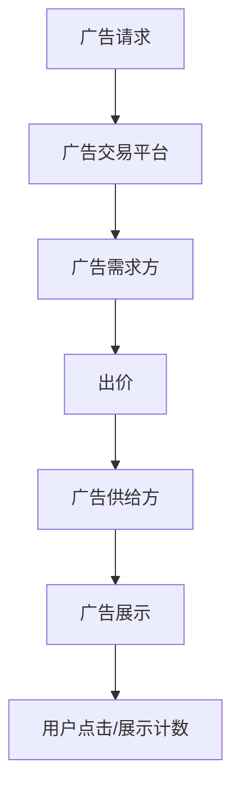
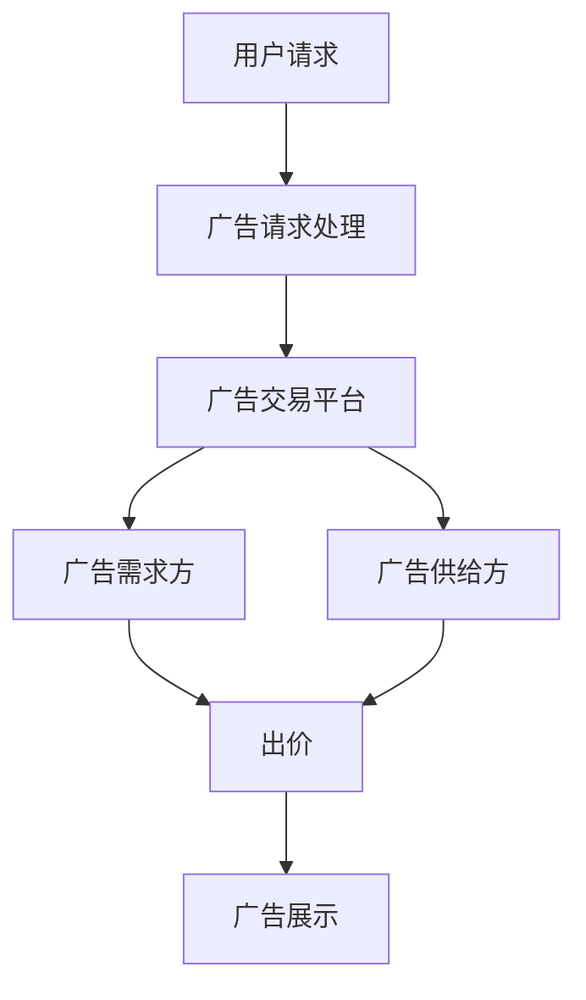

                 


# 股市估值对跨境数字广告定价的影响

## 关键词：股市估值、数字广告定价、实时竞价系统、CPM、CPC、广告投放平台

## 摘要：  
本文深入探讨了股市估值与跨境数字广告定价之间的关系，分析了股市波动如何影响广告定价策略，并通过数学模型和算法原理详细阐述了两者之间的联系。文章从背景介绍、核心概念、数学模型、系统架构、项目实战到最佳实践，全面解析了股市估值对跨境数字广告定价的影响。通过案例分析和实际应用，本文为广告行业和金融市场之间的协同关系提供了新的视角和解决方案。

---

## 第一部分：股市估值与数字广告定价的背景与核心概念

### 第1章：股市估值与数字广告定价的背景介绍

#### 1.1 股市估值的基本概念
- **定义**：股市估值是指通过对公司的财务数据（如收入、利润、资产等）进行分析，评估其股票的合理价格。
- **核心要素**：市盈率（P/E）、市净率（P/B）、股东权益回报率（ROE）等。
- **影响因素**：宏观经济环境、行业趋势、公司基本面、市场情绪等。

#### 1.2 跨境数字广告定价的定义与特点
- **定义**：数字广告定价是指在数字平台上为广告展示或点击制定价格的过程，包括CPC（每点击成本）、CPM（每千次展示成本）等。
- **核心特点**：实时性、数据驱动、精准定位、动态调整。
- **与传统广告定价的区别**：数字广告更具互动性和数据支持，定价更灵活。

#### 1.3 股市估值与数字广告定价的联系
- **股市波动对广告行业的影响**：股市上涨可能增加企业广告预算，股市下跌可能减少广告支出。
- **股市估值对广告定价的间接影响**：企业市值变化影响广告预算，进而影响广告定价策略。

#### 1.4 本章小结
本章通过介绍股市估值和数字广告定价的基本概念，明确了两者之间的联系，并为后续分析奠定了基础。

---

## 第二部分：核心概念与联系

### 第2章：核心概念与联系

#### 2.1 股市估值的核心原理
- **市盈率模型**：通过公司股价与每股收益的比率，评估股票的合理价格。
- **市净率模型**：通过公司股价与每股净资产的比率，评估股票的价值。
- **股东权益回报率模型**：通过净利润与股东权益的比率，评估公司的盈利能力。

#### 2.2 数字广告定价的核心原理
- **每点击成本（CPC）**：广告商为每次用户点击广告支付的成本。
- **每千次展示成本（CPM）**：广告商为每千次广告展示支付的成本。
- **实时竞价（RTB）**：通过实时拍卖机制确定广告展示的价格。

#### 2.3 股市估值与数字广告定价的关联性分析
- **股市波动对广告需求的影响**：股市上涨可能增加广告需求，股市下跌可能减少广告需求。
- **股市表现对广告预算的潜在影响**：公司市值增长可能增加广告预算，反之亦然。

#### 2.4 核心概念对比分析
- **核心要素对比**：股市估值关注公司财务数据和市场情绪，广告定价关注用户行为和市场供需。
- **数学模型对比**：股市估值模型（如市盈率）与广告定价模型（如CPC）在计算方式和应用领域上有显著差异。
- **市场影响对比**：股市估值影响整体经济环境，广告定价影响特定行业的市场活动。

#### 2.5 本章小结
本章通过对比分析，揭示了股市估值与数字广告定价在核心概念和市场影响上的异同。

---

## 第三部分：股市估值与数字广告定价的数学模型与算法原理

### 第3章：数学模型与算法原理

#### 3.1 股市估值的数学模型
- **市盈率模型**：$$ P/E = \frac{Price}{Earnings} $$
- **市净率模型**：$$ P/B = \frac{Price}{Book\ Value} $$
- **股东权益回报率模型**：$$ ROE = \frac{Net\ Profit}{Equity} $$

#### 3.2 数字广告定价的数学模型
- **CPC计算**：$$ CPC = \frac{广告总成本}{广告点击次数} $$
- **CPM计算**：$$ CPM = \frac{广告总成本 \times 1000}{广告展示次数} $$
- **实时竞价算法**：通过拍卖机制，动态调整广告价格。

#### 3.3 股市估值与数字广告定价的关联模型
- **广告需求与股市的关系**：当股市表现良好时，广告需求增加，广告价格上升。
- **广告预算与企业市值的关系**：企业市值增长，广告预算增加，广告价格调整。

#### 3.4 算法实现与流程图
##### 实时竞价流程图（使用mermaid）：


##### Python代码示例：
```python
import pandas as pd
import numpy as np

# 示例数据：广告展示次数和点击次数
data = {
    '展示次数': [1000, 2000, 1500],
    '点击次数': [100, 200, 150]
}

df = pd.DataFrame(data)
df['CPC'] = df['广告总成本'] / df['点击次数']
df['CPM'] = (df['广告总成本'] * 1000) / df['展示次数']
```

#### 3.5 本章小结
本章通过数学模型和算法原理，详细解释了股市估值与数字广告定价之间的关系，并通过流程图和代码示例展示了实时竞价系统的实现。

---

## 第四部分：系统分析与架构设计方案

### 第4章：系统分析与架构设计

#### 4.1 系统功能设计
- **广告投放平台**：负责接收广告请求、处理广告交易、记录广告数据。
- **数据收集与分析**：收集用户行为数据、广告点击数据、市场数据等。
- **实时竞价系统**：通过拍卖机制动态调整广告价格。

#### 4.2 系统架构设计
##### 系统架构图（使用mermaid）：


#### 4.3 系统接口设计
- **广告请求接口**：接收广告展示请求。
- **广告响应接口**：返回广告内容和定价信息。
- **数据统计接口**：记录广告展示和点击数据。

#### 4.4 系统交互流程
##### 实时竞价流程（使用mermaid）：


#### 4.5 本章小结
本章通过系统架构设计和交互流程图，详细描述了股市估值对数字广告定价的系统实现。

---

## 第五部分：项目实战与案例分析

### 第5章：项目实战与案例分析

#### 5.1 项目背景
- **项目目标**：设计一个基于实时竞价的广告定价系统，考虑股市波动对广告定价的影响。
- **项目需求**：实现广告投放、实时竞价、数据统计等功能。

#### 5.2 核心代码实现
##### 环境安装：
```bash
pip install pandas numpy matplotlib
```

##### 核心代码：
```python
import pandas as pd
import numpy as np
import matplotlib.pyplot as plt

# 示例数据：广告展示和点击数据
data = {
    '展示次数': [1000, 2000, 1500],
    '点击次数': [100, 200, 150],
    '广告成本': [10000, 20000, 15000]
}

df = pd.DataFrame(data)

# 计算CPC和CPM
df['CPC'] = df['广告成本'] / df['点击次数']
df['CPM'] = (df['广告成本'] * 1000) / df['展示次数']

print(df)
```

#### 5.3 案例分析
- **案例背景**：某公司市值增长20%，广告预算增加10%。
- **数据分析**：广告点击率和展示率的变化对广告价格的影响。
- **优化建议**：根据股市波动动态调整广告定价策略。

#### 5.4 本章小结
本章通过实际案例分析，展示了如何将股市估值与广告定价策略相结合，并通过代码实现广告定价的动态调整。

---

## 第六部分：最佳实践、小结与注意事项

### 第6章：最佳实践与小结

#### 6.1 最佳实践
- **数据驱动决策**：利用实时数据和历史数据优化广告定价策略。
- **模型优化**：定期更新数学模型，适应市场变化。
- **风险管理**：建立风险预警机制，应对股市波动对广告定价的影响。

#### 6.2 小结
本文通过背景介绍、核心概念、数学模型、系统设计、项目实战等部分，全面分析了股市估值对跨境数字广告定价的影响。通过实际案例和代码实现，展示了如何将股市波动纳入广告定价策略中。

#### 6.3 注意事项
- **数据质量**：确保数据的准确性和实时性。
- **模型适用性**：根据市场环境调整模型参数。
- **法律法规**：遵守相关法律法规，确保广告投放的合规性。

#### 6.4 拓展阅读
- 建议阅读《实时竞价广告系统：原理与实践》和《股市分析与投资策略》。

---

## 作者：AI天才研究院（AI Genius Institute）  
本文由AI天才研究院撰写，转载请注明出处。

