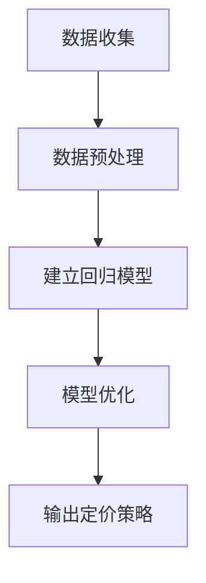
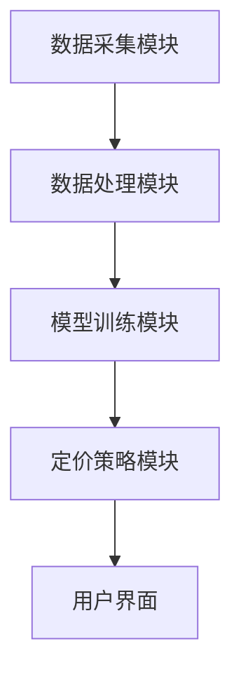

                 


# 股市估值对跨境数字服务定价的影响

> 关键词：股市估值, 跨境数字服务, 定价模型, 机器学习, 系统架构

> 摘要：本文深入探讨股市估值对跨境数字服务定价的影响，分析股市估值的核心模型和跨境数字服务定价的主要方法，提出基于股市估值的定价算法，并通过系统架构设计和项目实战，展示如何利用股市估值优化跨境数字服务定价策略。

---

## 第一部分: 背景介绍与核心概念

### 第1章: 股市估值与跨境数字服务定价概述

#### 1.1 股市估值的基本概念
股市估值是指通过对企业的财务数据、市场表现和行业趋势等多方面因素进行分析，估算其股票的合理价格区间。核心指标包括市盈率（P/E）、市净率（P/B）和股息率（Dividend Yield）等。

#### 1.2 跨境数字服务定价的基本概念
跨境数字服务是指通过互联网提供跨国界的数字产品或服务，如在线教育、云服务、数字内容订阅等。其定价特点包括全球化、数字化和动态调整。

#### 1.3 股市估值对跨境数字服务定价的影响
股市估值通过影响企业的市场价值和投资者预期，间接影响跨境数字服务的定价策略。例如，股市波动会改变企业的市场地位，进而影响其定价能力。

---

### 第2章: 股市估值与跨境数字服务定价的核心概念

#### 2.1 股市估值的核心模型
- **市盈率模型**：P/E = 股价 / 每股净利润。
- **市净率模型**：P/B = 股价 / 每股净资产。
- **股息率模型**：Dividend Yield = 每股股息 / 股价。

#### 2.2 跨境数字服务定价的主要方法
- **成本加成定价法**：基于成本加固定比例的利润。
- **市场导向定价法**：基于市场需求和竞争情况定价。
- **竞争导向定价法**：基于竞争对手的价格进行调整。

#### 2.3 股市估值与跨境数字服务定价的关联模型
- **直接影响**：股市估值变化直接影响企业的市场地位和定价能力。
- **间接影响**：股市估值通过影响企业利润和股东预期间接影响定价策略。

---

## 第二部分: 核心概念与联系

### 第3章: 股市估值与跨境数字服务定价的核心原理

#### 3.1 股市估值的核心原理
- 股市估值是市场对企业未来盈利能力的预期，反映了企业的内在价值和市场风险。

#### 3.2 跨境数字服务定价的核心原理
- 跨境数字服务定价需要考虑全球市场的差异性和数字化服务的边际成本特点。

#### 3.3 股市估值与跨境数字服务定价的联系
- 股市估值为跨境数字服务定价提供了市场基准和参考依据。

---

### 第4章: 股市估值与跨境数字服务定价的核心概念对比

#### 4.1 核心概念对比表格
| 比较维度 | 股市估值 | 跨境数字服务定价 |
|----------|----------|------------------|
| 定义     | 企业股票的合理价格估算 | 数字服务的收费策略 |
| 方法     | 市盈率、市净率等 | 成本加成、市场导向等 |
| 影响因素 | 财务数据、市场情绪 | 成本、需求、竞争 |

#### 4.2 ER实体关系图
```mermaid
erd
  章节：ER实体关系图
  entity 股市估值 {
    <<属性>>：市盈率, 市净率
  }
  entity 跨境数字服务定价 {
    <<属性>>：定价模型, 定价策略
  }
  relation 股市估值与定价的关系 {
    关系：股市估值影响定价策略
  }
```

---

## 第三部分: 算法原理

### 第5章: 基于股市估值的定价算法

#### 5.1 算法原理
- 使用机器学习模型（如线性回归）分析股市估值与定价策略的关系。
- 算法步骤：
  1. 数据收集：收集企业的财务数据和市场数据。
  2. 数据预处理：清洗和标准化数据。
  3. 模型训练：建立股市估值与定价策略的回归模型。
  4. 模型优化：调整参数以提高预测精度。

#### 5.2 算法流程图


#### 5.3 代码实现
```python
import pandas as pd
from sklearn.linear_model import LinearRegression
from sklearn.metrics import mean_squared_error

# 数据加载
data = pd.read_csv('stock_valuation.csv')

# 特征与目标变量
X = data[['P/E', 'P/B', 'Dividend Yield']]
y = data['pricing_strategy']

# 模型训练
model = LinearRegression()
model.fit(X, y)

# 预测与评估
y_pred = model.predict(X)
print('均方误差:', mean_squared_error(y, y_pred))
```

---

## 第四部分: 系统分析与架构设计

### 第6章: 系统架构设计

#### 6.1 项目背景
- 开发一个基于股市估值的跨境数字服务定价系统，帮助企业在跨国市场中优化定价策略。

#### 6.2 系统功能设计
- **数据采集模块**：收集企业财务数据和市场数据。
- **数据处理模块**：清洗和预处理数据。
- **模型训练模块**：建立定价模型并进行优化。
- **定价策略模块**：生成定价策略并输出结果。

#### 6.3 系统架构图


---

## 第五部分: 项目实战

### 第7章: 项目实战

#### 7.1 环境安装
- 安装Python和相关库：`pip install numpy pandas scikit-learn`

#### 7.2 数据采集与预处理
```python
import pandas as pd
import requests

# 数据采集
url = 'https://example.com/stock_data.csv'
data = pd.read_csv(url)

# 数据清洗
data = data.dropna()
data = pd.get_dummies(data)
```

#### 7.3 模型训练与优化
```python
from sklearn.model_selection import train_test_split
from sklearn.ensemble import RandomForestRegressor

# 数据分割
X_train, X_test, y_train, y_test = train_test_split(X, y, test_size=0.2)

# 模型训练
model = RandomForestRegressor()
model.fit(X_train, y_train)

# 模型评估
score = model.score(X_test, y_test)
print('模型准确率:', score)
```

---

## 第六部分: 最佳实践与总结

### 第8章: 最佳实践与总结

#### 8.1 总结
- 股市估值是影响跨境数字服务定价的重要因素。
- 通过机器学习模型可以有效优化定价策略。

#### 8.2 注意事项
- 数据质量直接影响模型准确性。
- 需要定期更新模型以适应市场变化。

#### 8.3 拓展阅读
- 《机器学习实战》
- 《股票投资的数学分析》

---

作者：AI天才研究院/AI Genius Institute & 禅与计算机程序设计艺术 /Zen And The Art of Computer Programming

