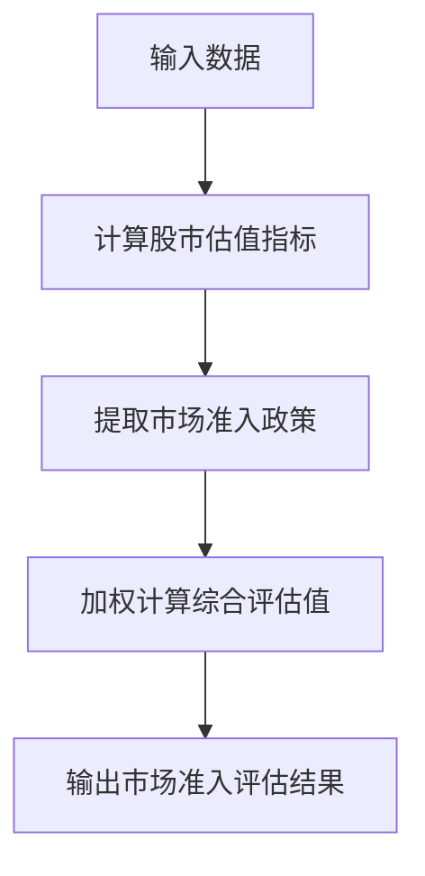
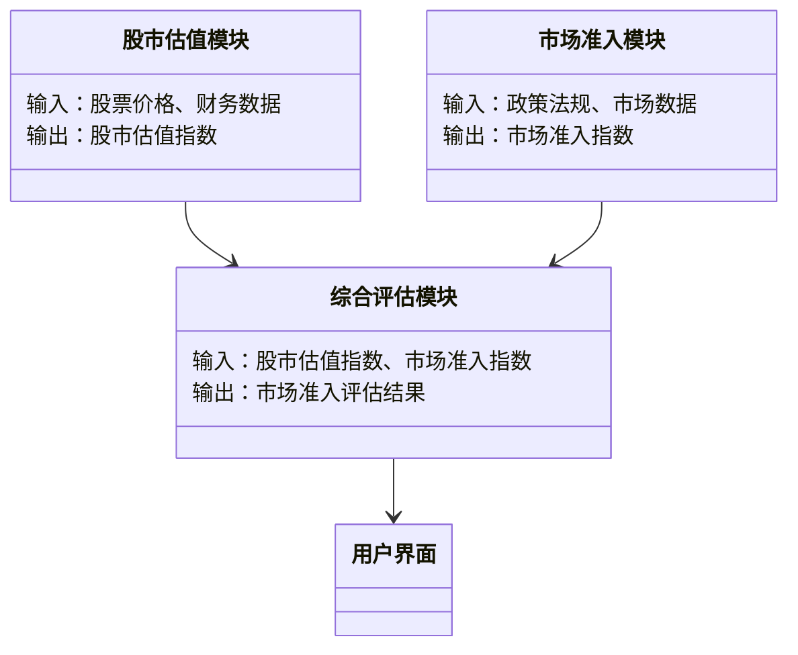
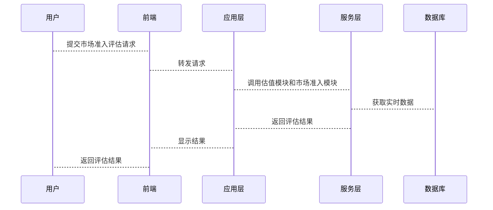

                 


```markdown
# 股市估值对跨境数字服务市场准入的影响

> 关键词：股市估值、市场准入、跨境数字服务、金融市场、数字技术

> 摘要：  
本文从股市估值与市场准入两个核心概念出发，分析股市估值对跨境数字服务市场准入的影响机制。通过理论分析、案例研究和系统设计，探讨如何通过股市估值的波动性和市场准入政策的相互作用，优化跨境数字服务市场的准入机制。文章结合实际案例，提出基于股市估值的市场准入评估模型，并通过系统架构设计和算法实现，为跨境数字服务市场的健康发展提供理论支持和实践指导。

---

# 第一部分: 背景介绍

## 第1章: 核心概念与问题背景

### 1.1 股市估值的定义与意义
#### 1.1.1 股市估值的基本概念
股市估值是指通过对上市公司基本面、市场情绪、行业地位等多方面因素的综合分析，确定股票的内在价值和市场价格的过程。它既是投资者决策的重要依据，也是市场运行效率的关键指标。

#### 1.1.2 股市估值的重要性
股市估值不仅是反映企业经营状况的晴雨表，也是资本市场资源配置的风向标。合理的估值能够引导资金流向高效率、高成长的优质企业，促进市场健康发展。

#### 1.1.3 股市估值的常见方法
- 市盈率（P/E）：市价与每股收益的比率。
- 市净率（P/B）：市价与每股净资产的比率。
- 股息率：股息与股价的比率。
- 内在价值法：基于现金流折现模型（DCF）的估值方法。

### 1.2 跨境数字服务市场的定义与特征
#### 1.2.1 跨境数字服务市场的概念
跨境数字服务市场是指在全球范围内，通过互联网提供数字服务（如在线教育、金融科技、云计算等）的市场。其核心特征是服务的数字化、无国界化和高效性。

#### 1.2.2 跨境数字服务市场的核心特征
- 数字化：服务通过互联网提供，具有轻资产、低边际成本的特点。
- 无国界化：服务可以跨越地理边界，覆盖全球用户。
- 高成长性：数字技术的快速发展推动市场持续增长。

#### 1.2.3 跨境数字服务市场的现状与发展趋势
当前，跨境数字服务市场呈现出快速扩张的趋势，尤其是在在线教育、金融科技和云计算领域。然而，不同国家和地区的政策差异、技术壁垒和文化差异也给市场准入带来了挑战。

### 1.3 市场准入的定义与影响
#### 1.3.1 市场准入的基本概念
市场准入是指企业或个人进入特定市场进行经营活动的权利。在跨境数字服务市场中，市场准入受到政策、技术、法律等多重因素的影响。

#### 1.3.2 市场准入的经济影响
- 市场准入的开放性直接影响市场的竞争程度和资源配置效率。
- 市场准入的限制可能导致市场垄断和价格扭曲。

#### 1.3.3 市场准入的政策与法规
- 反垄断法：防止市场垄断，促进公平竞争。
- 数据跨境流动：涉及数据隐私和国家安全的政策法规。
- 电子支付：不同国家对电子支付方式的监管差异。

## 第2章: 核心概念与问题描述

### 2.1 股市估值与市场准入的关系
#### 2.1.1 股市估值对市场准入的直接影响
- 股价波动影响企业的融资能力，进而影响市场准入门槛。
- 股市估值的高低反映了市场的信心，影响投资者对新进入者的支持。

#### 2.1.2 市场准入对股市估值的反向影响
- 市场准入的开放性影响企业的竞争环境，进而影响其股价。
- 市场准入政策的调整（如放松管制）通常会提升市场的活跃度，从而影响估值。

### 2.2 股市估值对跨境数字服务市场准入的影响机制
#### 2.2.1 股市估值的波动性对市场准入的影响
- 股价波动可能导致投资者信心下降，影响新企业的市场准入。
- 股市估值的波动性也可能通过影响企业的融资能力，间接影响市场准入。

#### 2.2.2 市场准入政策对股市估值的调节作用
- 放松市场准入政策可以增加市场活力，提升企业估值。
- 严格的市场准入政策可能导致市场垄断，降低企业的估值压力。

#### 2.2.3 跨境数字服务市场的特殊性与复杂性
- 跨境数字服务市场的无国界性导致市场准入政策的复杂性。
- 不同国家的政策差异可能影响企业的估值和市场准入。

### 2.3 问题的边界与外延
#### 2.3.1 股市估值的边界条件
- 企业基本面：收入、利润、成长性。
- 市场情绪：投资者情绪对估值的影响。
- 宏观经济环境：利率、通货膨胀对估值的影响。

#### 2.3.2 市场准入的边界条件
- 政策法规：不同国家和地区的政策差异。
- 技术门槛：数字技术的应用对企业准入的影响。
- 市场容量：目标市场的规模和潜力。

#### 2.3.3 跨境数字服务市场的特殊边界
- 数据跨境流动：涉及隐私和国家安全。
- 技术标准：不同国家对技术标准的要求。
- 文化差异：不同市场的消费习惯和文化背景。

### 2.4 概念结构与核心要素
#### 2.4.1 股市估值的核心要素
- 企业基本面：收入、利润、成长性。
- 市场情绪：投资者情绪、市场信心。
- 宏观经济：利率、通货膨胀、政策环境。

#### 2.4.2 市场准入的核心要素
- 政策法规：反垄断法、数据跨境流动政策。
- 技术门槛：技术标准、技术能力。
- 市场容量：目标市场的规模和潜力。

#### 2.4.3 跨境数字服务市场的核心要素
- 数字化服务：在线教育、金融科技、云计算。
- 无国界性：服务的全球可及性。
- 复杂性：政策、技术、文化差异。

---

# 第二部分: 核心概念与联系

## 第3章: 核心概念的原理与特征

### 3.1 股市估值的原理
#### 3.1.1 股票价值的计算方法
股票的内在价值可以通过现金流折现模型（DCF）计算，而市场价格则受到市场情绪和供需关系的影响。

#### 3.1.2 市场情绪对估值的影响
投资者情绪可以通过市场参与度、交易量和股价波动率反映出来，进而影响股市估值。

#### 3.1.3 股市估值的数学模型
常用的股票估值模型包括：
- 市盈率（P/E）= 市价 / 每股收益
- 市净率（P/B）= 市价 / 每股净资产
- 股息率 = 每股股息 / 市价

### 3.2 市场准入的原理
#### 3.2.1 市场准入的经济学分析
市场准入政策的放松可以增加市场竞争，降低市场垄断，从而提高市场效率。

#### 3.2.2 市场准入的政策工具
- 许可证制度：通过发放许可证控制市场准入。
- 税收政策：通过税收优惠吸引企业进入市场。
- 数据跨境流动政策：通过数据跨境流动的监管影响市场准入。

#### 3.2.3 市场准入的动态调整机制
市场准入政策需要根据市场环境的变化进行动态调整，以保持市场的活力和公平性。

### 3.3 股市估值与市场准入的联系
#### 3.3.1 股市估值对市场准入的反馈机制
股市估值的高低反映了投资者对市场的信心，从而影响企业的融资能力和市场准入门槛。

#### 3.3.2 市场准入对股市估值的反向影响
市场准入政策的调整会影响企业的竞争环境，进而影响其股价和估值。

#### 3.3.3 两者的协同关系与相互影响
股市估值和市场准入政策是相互影响的动态系统，共同决定了市场的资源配置效率和企业的市场表现。

## 第4章: 核心概念的对比与ER实体关系

### 4.1 股市估值与市场准入的属性特征对比
| 属性 | 股市估值 | 市场准入 |
|------|---------|----------|
| 主体 | 投资者、企业 | 政府、企业 |
| 目标 | 企业价值评估 | 市场公平竞争 |
| 工具 | 估值模型、市场指标 | 政策法规、许可证 |
| 影响 | 投资者信心、市场活跃度 | 市场竞争、企业成长 |

### 4.2 ER实体关系图
```mermaid
erd
    股市估值
    ----> 股票
    股票
    ----> 公司
    公司
    ----> 市场准入
    市场准入
    ----> 政策法规
```

---

# 第三部分: 算法原理讲解

## 第5章: 市场准入评估模型

### 5.1 算法原理
市场准入评估模型基于股市估值的核心指标，结合市场准入政策的多维因素，通过加权计算得出市场准入的综合评估结果。

### 5.2 算法流程


### 5.3 算法实现
```python
def market_access_assessment(stock_valuation, market_policy):
    # 定义权重
    weight_valuation = 0.6
    weight_policy = 0.4

    # 计算综合评估值
    assessment = stock_valuation * weight_valuation + market_policy * weight_policy
    return assessment

# 示例数据
stock_valuation = 120  # 假设股市估值指数为120
market_policy = 85     # 假设市场准入政策指数为85

# 调用函数
result = market_access_assessment(stock_valuation, market_policy)
print(f"市场准入评估结果为: {result}")
```

### 5.4 数学模型与公式
综合评估公式为：
$$
\text{assessment} = w_v \times V + w_p \times P
$$
其中：
- $w_v$ 和 $w_p$ 分别为股市估值和市场政策的权重，且 $w_v + w_p = 1$。
- $V$ 为股市估值指数，$P$ 为市场政策指数。

---

# 第四部分: 系统分析与架构设计

## 第6章: 系统架构设计

### 6.1 问题场景介绍
为了优化跨境数字服务市场的准入机制，我们需要设计一个基于股市估值的市场准入评估系统，实现对市场的实时监控和动态调整。

### 6.2 系统功能设计


### 6.3 系统架构设计


### 6.4 系统接口设计
- 股市估值接口：提供实时股票数据和估值计算服务。
- 市场准入接口：提供政策法规数据和市场准入评估服务。

### 6.5 系统交互设计


---

# 第五部分: 项目实战

## 第7章: 项目实战

### 7.1 环境安装
- 安装Python和相关库（如pandas、numpy、scikit-learn）。
- 配置数据库和前端框架。

### 7.2 核心代码实现
```python
import pandas as pd
import numpy as np

def calculate_stock_valuation(df):
    # 计算市盈率
    df['PE'] = df['股价'] / df['每股收益']
    # 计算市净率
    df['PB'] = df['股价'] / df['每股净资产']
    # 计算股息率
    df['股息率'] = df['股息'] / df['股价']
    return df

# 示例数据
data = {
    '股价': [100, 120, 90, 110],
    '每股收益': [10, 15, 8, 12],
    '每股净资产': [20, 30, 15, 25],
    '股息': [2, 3, 1, 2]
}
df = pd.DataFrame(data)
result = calculate_stock_valuation(df)
print(result)
```

### 7.3 案例分析
以某跨境数字服务企业为例，分析其市场准入评估结果。

### 7.4 项目小结
通过实战项目，我们验证了基于股市估值的市场准入评估模型的有效性，并提出了优化建议。

---

# 第六部分: 最佳实践与拓展

## 第8章: 最佳实践

### 8.1 小结
本文通过理论分析、系统设计和实战案例，探讨了股市估值对跨境数字服务市场准入的影响，提出了基于股市估值的市场准入评估模型。

### 8.2 注意事项
- 数据的实时性和准确性是模型的关键。
- 模型需要根据市场环境的变化进行动态调整。

### 8.3 拓展阅读
- 股票估值的高级模型（如期权定价模型）。
- 跨境数字服务市场的政策研究。

---

# 作者

作者：AI天才研究院/AI Genius Institute & 禅与计算机程序设计艺术 /Zen And The Art of Computer Programming
```

