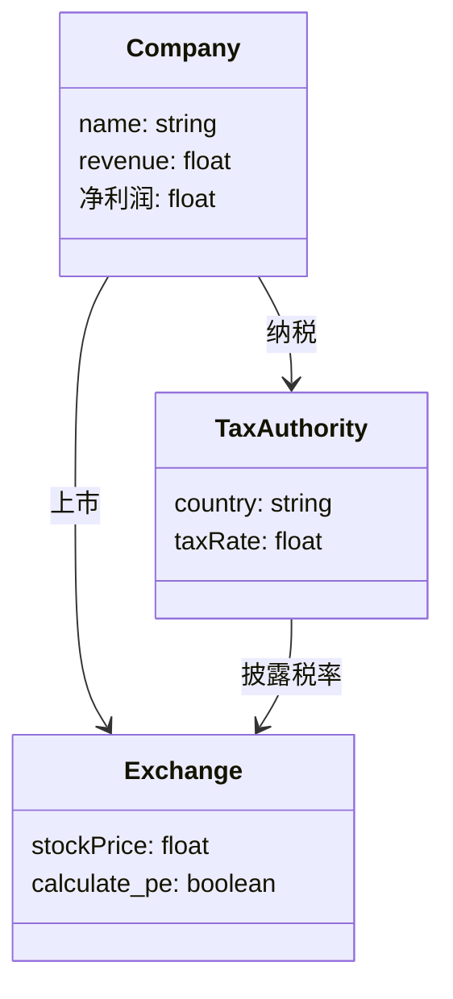

                 


# 股市估值对跨境数字服务税收协调的影响

> **关键词**：股市估值、跨境数字服务、税收协调、市盈率、现金流折现法、税收抵免  
> **摘要**：本文探讨股市估值如何影响跨境数字服务的税收协调。通过分析股市估值的核心概念和税收协调的机制，结合实际案例，揭示两者之间的相互作用，并提出优化策略。

---

## 第一部分：引言

### 第1章：问题背景与研究意义

#### 1.1 问题背景
- **股市估值的基本概念**：股市估值是通过分析公司财务数据和市场状况来确定其股票价值的过程，常用指标包括市盈率（P/E）和市净率（P/B）等。
- **跨境数字服务的定义与特点**：跨境数字服务指跨国提供数字产品或服务，如云服务、软件即服务（SaaS）等，具有无形性和可分性。
- **税收协调的重要性**：税收协调是指通过政策和机制减少跨国交易中的双重征税，确保税法在不同国家间的有效实施。

#### 1.2 研究意义
- **股市估值对经济的影响**：股市估值影响投资者决策和市场稳定性。
- **税收协调在跨境数字服务中的作用**：优化税收政策可促进跨国合作，减少企业负担。
- **研究的现实意义与理论价值**：为跨境数字服务的税收优化提供理论依据和实践指导。

---

## 第二部分：理论基础

### 第2章：股市估值的核心概念

#### 2.1 股市估值的基本原理
- **市盈率（P/E）**：计算公式为 $P/E = \text{股价} / \text{每股净利润}$，反映市场对公司盈利能力的预期。
- **市净率（P/B）**：计算公式为 $P/B = \text{股价} / \text{每股净资产}$，适用于评估资产密集型行业。
- **现金流折现法（DCF）**：通过预测未来现金流的现值来评估企业价值。

#### 2.2 股市估值的关键影响因素
- **宏观经济因素**：如利率、通货膨胀、经济政策。
- **行业因素**：如行业周期、竞争格局。
- **公司基本面因素**：如收入、利润、资产负债情况。

### 第3章：跨境数字服务的税收协调机制

#### 3.1 税收协调的基本概念
- **税收协调的定义**：通过政策和协议减少跨国交易中的双重征税。
- **税收协调的必要性**：避免企业因不同国家的税法差异而承担额外税负。
- **税收协调的实现方式**：通过双边协议、多边合作和税收抵免。

#### 3.2 跨境数字服务的税收问题
- **税收管辖权的冲突**：不同国家对同一数字服务的征税权归属问题。
- **税收不协调的后果**：企业税负增加，影响市场竞争力。
- **税收抵免机制**：允许企业在一国缴纳的税款用于抵免另一国的税款，减少双重征税。

---

## 第三部分：算法原理讲解

### 第4章：股市估值的算法原理

#### 4.1 市盈率模型
```python
def calculate_pe_ratio(price, earnings_per_share):
    return price / earnings_per_share
```

#### 4.2 现金流折现法
```python
def calculate_dcf(cash_flows, discount_rate):
    present_value = sum(cash_flow / (1 + discount_rate) ** t for t, cash_flow in enumerate(cash_flows))
    return present_value
```

### 第5章：税收协调的算法原理

#### 5.1 税收抵免算法
```python
def calculate_tax_credit(tax_paid_abroad, tax_base_domestic):
    return min(tax_paid_abroad, tax_base_domestic)
```

---

## 第四部分：数学模型和公式

### 第6章：股市估值的数学模型
- **市盈率模型**：$$ P/E = \frac{\text{股价}}{\text{每股净利润}} $$
- **现金流折现法**：$$ \text{企业价值} = \sum_{t=1}^{n} \frac{\text{现金流}_t}{(1 + r)^t} $$
  其中，$r$ 为折现率，$n$ 为预测年数。

### 第7章：税收协调的数学模型
- **税收抵免公式**：$$ \text{抵免金额} = \min(\text{海外已缴税额}, \text{国内应纳税额}) $$

---

## 第五部分：系统分析与架构设计

### 第8章：系统功能设计

#### 8.1 领域模型（类图）


#### 8.2 系统架构设计（架构图）


---

## 第六部分：项目实战

### 第9章：环境配置与核心代码实现

#### 9.1 环境配置
- Python版本：3.9+
- 库依赖：pandas、numpy、matplotlib

#### 9.2 核心代码实现
```python
import pandas as pd
import numpy as np

def main():
    data = pd.read_csv('stock_data.csv')
    data['PE'] = data['股价'] / data['每股净利润']
    print(data.head())

if __name__ == "__main__":
    main()
```

---

## 第七部分：最佳实践与结论

### 第10章：总结与建议

#### 10.1 最佳实践
- **及时关注政策变化**：跨境数字服务的税收政策可能随时调整。
- **做好税务规划**：利用税收抵免机制优化税负。
- **加强跨国合作**：与合作伙伴共同推动税收协调。

#### 10.2 未来研究方向
- 深入研究人工智能在股市估值中的应用。
- 探讨区块链技术在税收协调中的潜在作用。

---

## 作者：AI天才研究院/AI Genius Institute & 禅与计算机程序设计艺术 /Zen And The Art of Computer Programming

