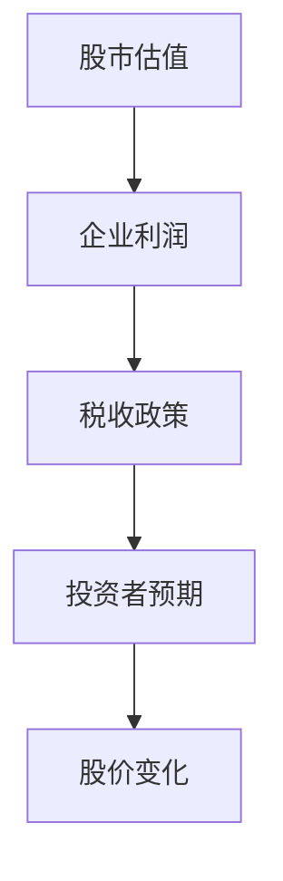
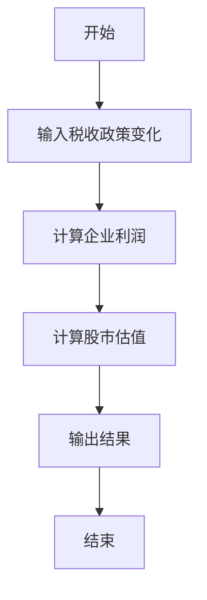
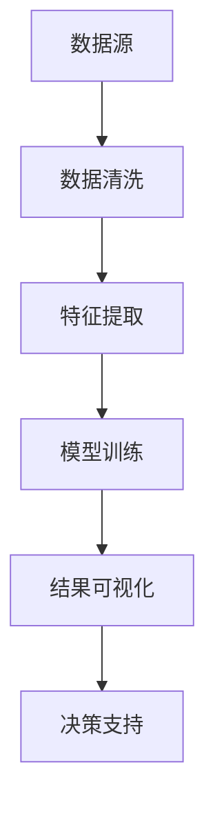

                 


# 股市估值对跨境数字服务税收政策的影响

## 关键词：股市估值、税收政策、跨境数字服务、数字经济、企业价值

## 摘要：本文探讨了跨境数字服务税收政策变化如何影响股市估值，通过构建数学模型和实证分析，揭示了两者之间的内在联系，并提出了相应的政策建议。

---

## 第一部分：背景介绍

### 第1章：股市估值与跨境数字服务税收政策的背景

#### 1.1 股市估值的基本概念
股市估值是衡量企业价值的重要指标，主要通过市盈率（P/E）和市净率（P/B）等指标来评估。股市估值的准确性直接影响投资者的决策和市场的稳定性。

#### 1.2 跨境数字服务的特点
跨境数字服务是指通过互联网提供的跨国服务，如云服务、在线教育、数字支付等。这些服务具有无形性和跨境性，使得传统的税收政策难以适用。

#### 1.3 税收政策的基本框架
税收政策是政府调节经济的重要工具。对于跨境数字服务，各国通常采用来源地原则，即在服务提供地征税。然而，数字经济的快速发展使得这一原则面临挑战。

---

## 第二部分：核心概念与联系

### 第2章：股市估值与跨境数字服务税收政策的核心概念

#### 2.1 核心概念的原理
股市估值通过分析企业财务数据和市场因素来评估企业价值，而跨境数字服务的税收政策则影响企业的利润和投资者的预期。

#### 2.2 核心概念的属性特征对比
| 属性 | 股市估值 | 跨境数字服务税收政策 |
|------|----------|----------------------|
| 动态性 | 受市场波动影响 | 受政策变化影响 |
| 无形性 | 与企业价值相关 | 针对无形服务征税 |
| 跨境性 | 受跨国企业影响 | 需要跨国协调 |

#### 2.3 ER实体关系图架构


---

## 第三部分：算法原理讲解

### 第3章：股市估值与税收政策影响的算法模型

#### 3.1 算法原理
通过构建多元线性回归模型，分析税收政策变化对股市估值的影响。模型如下：

$$ \text{股价变化} = \beta_0 + \beta_1 \times \text{税率变化} + \beta_2 \times \text{其他因素} + \epsilon $$

#### 3.2 算法流程图


#### 3.3 算法实现代码
```python
import numpy as np
import pandas as pd
import statsmodels.api as sm

# 数据准备
data = pd.DataFrame({
    'tax_rate_change': [2, 3, 1, 4, 2],
    'stock_price_change': [5, 7, 3, 8, 4]
})

# 模型构建
model = sm.OLS(data['stock_price_change'], sm.add_constant(data['tax_rate_change']))
results = model.fit()

# 输出结果
print(results.summary())
```

---

## 第四部分：系统分析与架构设计

### 第4章：系统分析与架构设计方案

#### 4.1 问题场景介绍
随着数字经济的发展，跨境数字服务的税收政策变得复杂。企业需要适应不同国家的税收规则，而股市估值的变化反映了这些政策的影响。

#### 4.2 系统功能设计
- 数据采集：收集税收政策变化和股市数据。
- 模型构建：建立回归模型分析影响。
- 可视化：展示税率变化与股价变化的关系。

#### 4.3 系统架构设计


---

## 第五部分：项目实战

### 第5章：项目实战

#### 5.1 环境安装
安装Python和相关库：
```bash
pip install numpy pandas statsmodels
```

#### 5.2 系统核心实现源代码
```python
import numpy as np
import pandas as pd
import statsmodels.api as sm

# 数据准备
data = pd.DataFrame({
    'tax_rate_change': [2, 3, 1, 4, 2],
    'stock_price_change': [5, 7, 3, 8, 4]
})

# 模型构建
model = sm.OLS(data['stock_price_change'], sm.add_constant(data['tax_rate_change']))
results = model.fit()

# 输出结果
print(results.summary())
```

#### 5.3 代码应用解读与分析
通过代码实现回归分析，量化税率变化对股价的影响，为政策制定提供数据支持。

#### 5.4 实际案例分析
以某国为例，分析税收政策变化对企业股价的具体影响，展示模型的应用价值。

---

## 第六部分：最佳实践与总结

### 第6章：最佳实践 tips

#### 6.1 小结
本文通过构建数学模型，揭示了税收政策变化对股市估值的影响，为企业和政策制定者提供了参考。

#### 6.2 注意事项
在实际应用中，需考虑更多变量，如市场情绪、全球经济环境等，以提高模型的准确性。

#### 6.3 拓展阅读
建议进一步研究动态模型，探讨更多影响因素。

---

## 结语

股市估值和跨境数字服务税收政策的相互影响是一个复杂的系统问题。通过本文的分析，我们希望为政策制定者和投资者提供有价值的参考，促进数字经济的健康发展。

---

## 作者：AI天才研究院/AI Genius Institute & 禅与计算机程序设计艺术/Zen And The Art of Computer Programming

