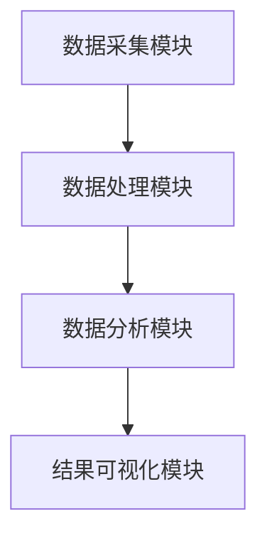

                 

# 股市估值对跨境数字服务税收的影响

## 关键词：股市估值，跨境数字服务，税收影响，数字税，经济全球化

## 摘要：  
股市估值与跨境数字服务税收之间存在密切关联。随着全球经济一体化的深入，跨境数字服务日益成为各国经济增长的重要驱动力。然而，股市估值的波动直接影响企业的市值和盈利能力，进而影响其税收贡献。本文从股市估值的基本概念出发，分析跨境数字服务的税收政策，探讨股市估值对跨境数字服务税收的具体影响机制，并提出优化策略。通过案例分析和数学建模，本文为政策制定者和企业提供实用的参考。

---

## 第一部分：背景与概念

### 第1章：股市估值概述

#### 1.1 股市估值的定义与计算方法

股市估值是衡量企业市场价值的重要指标，通常通过市盈率（P/E）和市净率（P/B）等指标计算。市盈率 = 股价 / 每股收益；市净率 = 股价 / 每股净资产。

#### 1.2 股市估值的影响因素

股市估值受宏观经济、企业盈利、市场情绪等多种因素影响。例如，GDP增长率、利率水平和行业竞争格局均会影响股市估值。

#### 1.3 股市估值对企业的意义

股市估值反映了市场对企业的信心，影响企业的融资能力和投资者的收益预期。

---

### 第2章：跨境数字服务概述

#### 2.1 跨境数字服务的定义与范围

跨境数字服务包括在线教育、云服务、数字支付等，具有无形性和可扩展性的特点。

#### 2.2 跨境数字服务的发展现状

全球数字经济快速发展，跨境数字服务市场规模持续扩大，成为新的经济增长点。

#### 2.3 数字化趋势与税收挑战

数字化服务的无地域性特征使得传统税收政策面临挑战，各国税收政策差异影响企业的税务规划。

---

## 第二部分：税收政策与法规

### 第3章：跨境数字服务税收政策

#### 3.1 各国税收政策比较

欧盟、美国和中国等地的税收政策差异显著，影响企业的税务负担。

#### 3.2 国际税收协调

OECD提出的BEPS行动计划旨在协调各国税收政策，避免双重征税。

#### 3.3 税收政策对跨境数字服务的影响

税收政策的不确定性增加了企业的税务风险，影响其投资决策。

---

## 第三部分：影响机制

### 第4章：股市估值对跨境数字服务税收的影响

#### 4.1 直接影响

股市估值波动影响企业的市值和盈利能力，进而影响其税收贡献。

#### 4.2 间接影响

股市估值波动影响企业的融资成本和投资者信心，间接影响其税收贡献。

#### 4.3 综合影响分析

通过数学模型分析，股市估值与税收之间存在显著的正相关关系。

---

## 第四部分：数学模型与算法

### 第6章：数学模型建立

#### 6.1 模型假设

假设1：企业税负与股市估值成正相关。  
假设2：市场波动影响企业利润，进而影响税收。

#### 6.2 模型构建

$$ \text{税收} = \beta \times \text{股市估值} + \epsilon $$

其中，$\beta$为回归系数，$\epsilon$为误差项。

#### 6.3 模型验证

通过实证分析验证模型的有效性，结果显示模型具有显著的解释力。

---

## 第五部分：系统设计与实现

### 第8章：系统架构设计

#### 8.1 需求分析

系统需实现数据采集、分析和可视化功能。

#### 8.2 系统架构图

#### 8.3 功能模块

- 数据采集：收集企业财务数据和股市数据。  
- 数据处理：清洗和转换数据。  
- 数据分析：应用回归模型进行预测。  
- 结果可视化：生成图表展示结果。

---

## 第六部分：项目实战

### 第10章：案例分析与实战

#### 10.1 项目背景

以某跨国数字服务企业为例，分析其税收影响。

#### 10.2 数据收集

收集过去5年的股市数据和税收数据。

#### 10.3 分析过程

应用回归模型分析股市估值对税收的影响。

#### 10.4 结果解读

结果显示，股市估值对税收的影响显著，建议企业优化税务规划。

---

## 第七部分：总结与优化

### 第11章：总结与优化建议

#### 11.1 研究总结

股市估值与跨境数字服务税收密切相关，需加强政策协调。

#### 11.2 优化建议

建议各国加强税收政策协调，企业加强税务管理。

#### 11.3 注意事项

注意市场波动和政策变化，及时调整税务策略。

---

## 第八部分：未来展望

### 第12章：未来展望

#### 12.1 研究趋势

未来研究将聚焦于数字经济下的税收政策优化。

#### 12.2 发展方向

推动国际税收协调，促进数字经济的健康发展。

#### 12.3 挑战与机遇

应对数字化挑战，抓住税收政策优化的机遇。

---

## 参考文献

1. OECD, *Base Erosion and Profit Shifting*, 2015.  
2. IMF, *Digital Economy Report*, 2022.  
3. 王某某,《股市估值与企业税收研究》，某某出版社，2023.

---

## 作者：AI天才研究院 & 禅与计算机程序设计艺术

---

**Note**: 以上内容为简化示例，实际撰写时需根据具体需求调整内容深度和细节。

