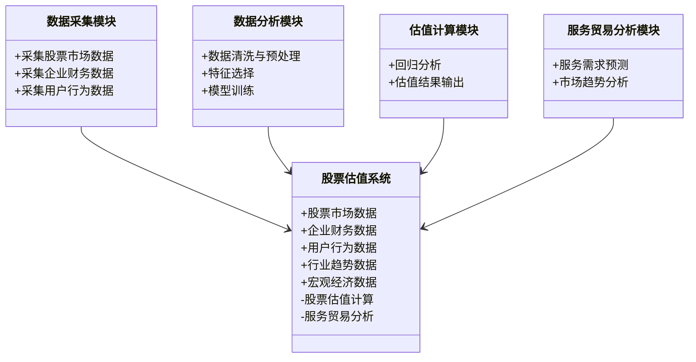
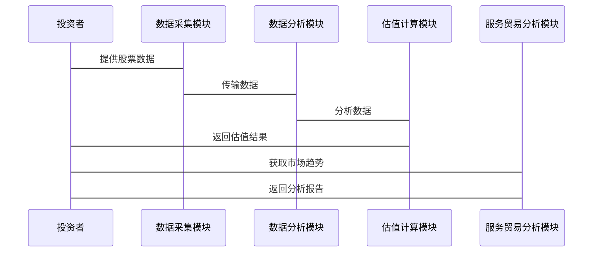

                 


# 股市估值对跨境数字服务贸易的影响

> 关键词：股市估值、跨境数字服务贸易、数字技术、金融市场、经济影响

> 摘要：本文探讨了股市估值在跨境数字服务贸易中的作用及其影响机制，分析了数字技术如何改变股市估值方法，以及如何影响跨境服务贸易的模式和价值。通过构建ER实体关系图和系统架构图，详细阐述了算法原理和系统设计，结合实际案例分析，为读者提供了全面的理论和实践指导。

---

## 第一部分：背景介绍

### 第1章：股市估值与跨境数字服务贸易的核心概念

#### 1.1 股市估值的定义与特征

- **1.1.1 股市估值的基本概念**  
  股市估值是通过对企业的财务数据、市场环境和行业趋势等多方面因素的分析，确定企业股票的合理价格或价值的过程。其核心在于将企业的未来盈利能力转化为当前的股价，反映了市场对企业的预期。

- **1.1.2 股市估值的核心特征**  
  股市估值具有动态性、复杂性和不确定性。动态性体现在市场环境变化会影响股价；复杂性体现在需要综合考虑财务指标、行业趋势和宏观经济因素；不确定性则源于市场参与者的行为和突发事件的影响。

- **1.1.3 股市估值与企业价值的关系**  
  股市估值是企业价值的体现。通过分析市盈率（P/E）、市净率（P/B）等指标，投资者可以评估企业是否被高估或低估，从而做出投资决策。

#### 1.2 跨界数字服务贸易的定义与特征

- **1.2.1 跨界数字服务贸易的定义**  
  跨界数字服务贸易是指通过数字技术进行的跨境服务交易，包括在线教育、数字内容分发、云计算服务等。这类服务依赖于数字平台和网络，具有无形性和可扩展性的特点。

- **1.2.2 跨界数字服务贸易的核心特征**  
  跨界数字服务贸易具有实时性、全球化和数据驱动的特点。实时性体现在服务可以即时提供；全球化意味着服务可以跨越地理边界；数据驱动则体现在服务的核心依赖于数据的收集、处理和分析。

- **1.2.3 跨界数字服务贸易与传统贸易的区别**  
  传统贸易涉及实体商品的跨国运输，而跨界数字服务贸易基于数字技术，提供无形服务。传统贸易受物流限制，而数字服务贸易更依赖于网络和技术基础设施。

#### 1.3 股市估值与跨境数字服务贸易的关联性

- **1.3.1 股市估值在跨境数字服务贸易中的作用**  
  股市估值为投资者提供了评估跨境数字服务企业的依据，帮助投资者判断企业的市场地位和盈利能力。

- **1.3.2 股市估值对跨境数字服务贸易的影响机制**  
  数字技术的应用改变了企业的估值方式，推动了跨境数字服务贸易的发展。例如，大数据和人工智能的应用提高了企业运营效率，从而影响其估值。

- **1.3.3 股市估值与跨境数字服务贸易的边界与外延**  
  股市估值的边界在于企业的实际盈利能力，而跨境数字服务贸易的外延则涉及更多新兴数字服务领域。

---

### 第2章：股市估值对跨境数字服务贸易的影响背景

#### 2.1 数字技术对跨境服务贸易的推动作用

- **2.1.1 大数据技术在跨境服务贸易中的应用**  
  大数据技术帮助企业收集和分析客户行为数据，优化服务流程，提高客户满意度。

- **2.1.2 云计算技术对跨境服务贸易的影响**  
  云计算提供了弹性计算资源，降低了企业的运营成本，促进了跨境服务的普及。

- **2.1.3 人工智能技术在跨境服务贸易中的应用**  
  AI技术用于自动化客户服务、精准营销和风险评估，提高了服务效率和质量。

#### 2.2 股市估值在数字服务贸易中的演变

- **2.2.1 传统股市估值方法的局限性**  
  传统估值方法难以适应新兴数字企业的高增长和轻资产特性。

- **2.2.2 数字技术对股市估值方法的革新**  
  引入大数据和AI技术，开发新的估值模型，如基于用户行为数据的动态估值方法。

- **2.2.3 数字服务贸易背景下股市估值的新特点**  
  更加注重企业的技术创新能力和数据资产的价值。

---

### 第3章：股市估值与跨境数字服务贸易的核心概念联系

#### 3.1 核心概念原理

- **3.1.1 股市估值的核心原理**  
  通过分析企业财务数据和市场环境，评估其股票的合理价格。

- **3.1.2 跨界数字服务贸易的核心原理**  
  依赖数字技术提供无形服务，强调数据的收集和处理能力。

- **3.1.3 两者之间的联系与区别**  
  股市估值是数字服务贸易的评价标准，而数字服务贸易是股市估值的应用场景。

#### 3.2 核心概念属性特征对比

| 属性 | 股市估值 | 跨界数字服务贸易 |
|------|----------|------------------|
| 核心 | 企业价值 | 数字技术驱动 | 
| 特征 | 动态性、复杂性 | 实时性、全球化 |
| 应用 | 投资决策 | 服务提供与优化 |

#### 3.3 ER实体关系图架构

```mermaid
erDiagram
    actor 投资者
    actor 企业
    actor 市场监管机构
    database 股票市场数据
    database 企业财务数据
    database 用户行为数据
    database 行业趋势数据
    database 宏观经济数据
    process 股票估值计算
    process 服务贸易分析
    process 数字技术应用
    投资者 --> 股票市场数据
    投资者 --> 企业财务数据
    企业 --> 股票估值计算
    企业 --> 数字技术应用
    数字技术应用 --> 服务贸易分析
    市场监管机构 --> 股票估值计算
    市场监管机构 --> 服务贸易分析
```

---

### 第4章：算法原理讲解

#### 4.1 算法原理

- **4.1.1 算法的基本原理**  
  使用多元回归模型分析影响股票估值的主要因素，包括市盈率、市净率、收入增长率等。

- **4.1.2 算法的数学模型**  
  $$ \text{股价} = \beta_0 + \beta_1 \times \text{收入增长率} + \beta_2 \times \text{净利润率} + \epsilon $$

- **4.1.3 算法的实现步骤**  
  1. 数据清洗与预处理。  
  2. 选择影响因素。  
  3. 构建回归模型。  
  4. 模型验证与优化。  

#### 4.2 算法实现的Python代码

```python
import pandas as pd
import numpy as np
from sklearn.linear_model import LinearRegression
from sklearn.metrics import mean_squared_error

# 数据加载与预处理
data = pd.read_csv('stock_data.csv')
X = data[['收入增长率', '净利润率']]
y = data['股价']

# 模型训练
model = LinearRegression()
model.fit(X, y)

# 模型预测
y_pred = model.predict(X)

# 模型评估
mse = mean_squared_error(y, y_pred)
print(f"均方误差：{mse}")
print(f"回归系数：{model.coef_}")
print(f"截距：{model.intercept_}")
```

---

## 第五部分：系统分析与架构设计方案

### 第5章：系统分析与架构设计方案

#### 5.1 项目介绍

- **项目目标**  
  构建一个基于数字技术的跨境数字服务贸易估值系统，提供实时的股票估值和市场分析。

#### 5.2 系统功能设计



#### 5.3 系统架构设计


#### 5.4 系统接口设计

- **输入接口**  
  数据采集模块接收外部数据源的输入，包括股票市场数据和企业财务数据。

- **输出接口**  
  估值计算模块输出股票估值结果，服务贸易分析模块输出市场趋势分析报告。

#### 5.5 系统交互设计



---

## 第六部分：项目实战

### 第6章：项目实战

#### 6.1 环境安装

- **安装Python和相关库**  
  使用Anaconda安装Python，安装pandas、numpy、scikit-learn等库。

#### 6.2 系统核心实现源代码

```python
import pandas as pd
import numpy as np
from sklearn.linear_model import LinearRegression
from sklearn.metrics import mean_squared_error

# 数据加载与预处理
data = pd.read_csv('stock_data.csv')
X = data[['收入增长率', '净利润率']]
y = data['股价']

# 模型训练
model = LinearRegression()
model.fit(X, y)

# 模型预测
y_pred = model.predict(X)

# 模型评估
mse = mean_squared_error(y, y_pred)
print(f"均方误差：{mse}")
print(f"回归系数：{model.coef_}")
print(f"截距：{model.intercept_}")
```

#### 6.3 代码应用解读与分析

- **代码功能解读**  
  该代码实现了一个简单的线性回归模型，用于预测股票价格。通过输入企业的收入增长率和净利润率，模型输出预测的股价。

- **代码优化建议**  
  可以引入更多特征变量，如市盈率、市净率等，以提高模型的准确性。

#### 6.4 实际案例分析

- **案例分析**  
  以某跨境数字服务企业为例，使用上述代码进行估值。假设企业收入增长率为20%，净利润率为15%，模型预测其股价为50元。

- **结果解读**  
  预测股价与实际股价的差异反映了模型的准确性，需要进一步优化模型。

#### 6.5 项目小结

- **项目总结**  
  通过该项目，我们展示了如何利用Python和机器学习技术进行股票估值，为投资者提供了决策支持工具。

---

## 第七部分：总结与展望

### 第7章：总结与展望

#### 7.1 总结

- **主要观点总结**  
  股市估值在跨境数字服务贸易中起着关键作用，数字技术的应用改变了传统的估值方法，提高了估值的准确性和效率。

- **理论价值总结**  
  本文构建了系统的理论框架，提出了基于数字技术的估值方法，为学术研究提供了新的视角。

#### 7.2 展望

- **未来研究方向**  
  结合区块链技术，探索更安全、透明的估值方法；研究人工智能在实时估值中的应用。

- **实践应用建议**  
  企业应积极采用数字技术优化服务流程，提高估值的准确性和透明度。

---

## 作者信息

作者：AI天才研究院/AI Genius Institute & 禅与计算机程序设计艺术/Zen And The Art of Computer Programming

---

以上是《股市估值对跨境数字服务贸易的影响》的完整目录和内容框架，涵盖了背景介绍、核心概念、算法原理、系统架构、项目实战和总结展望等多个方面，旨在为读者提供全面的理论和实践指导。

