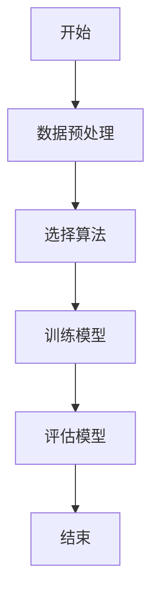
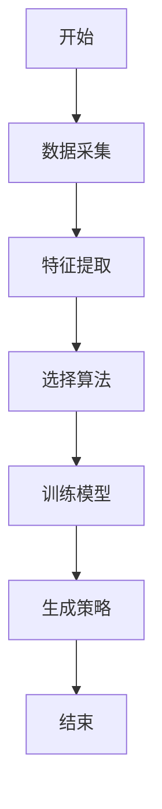
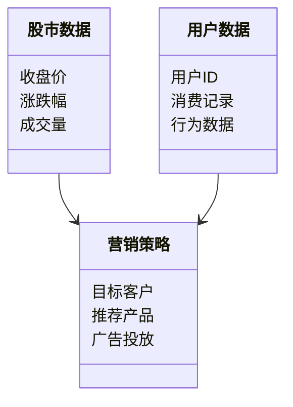
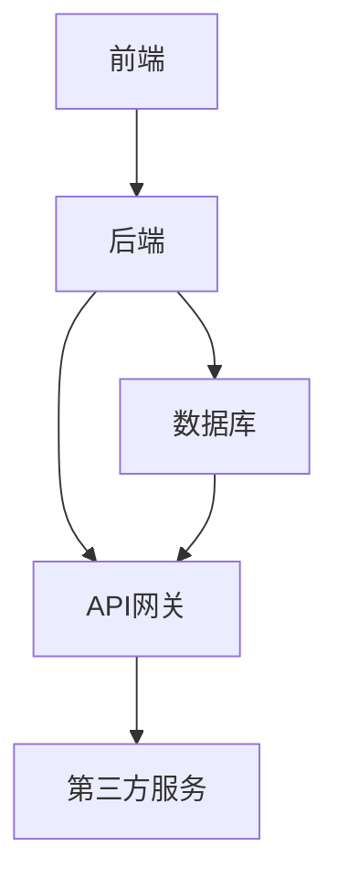
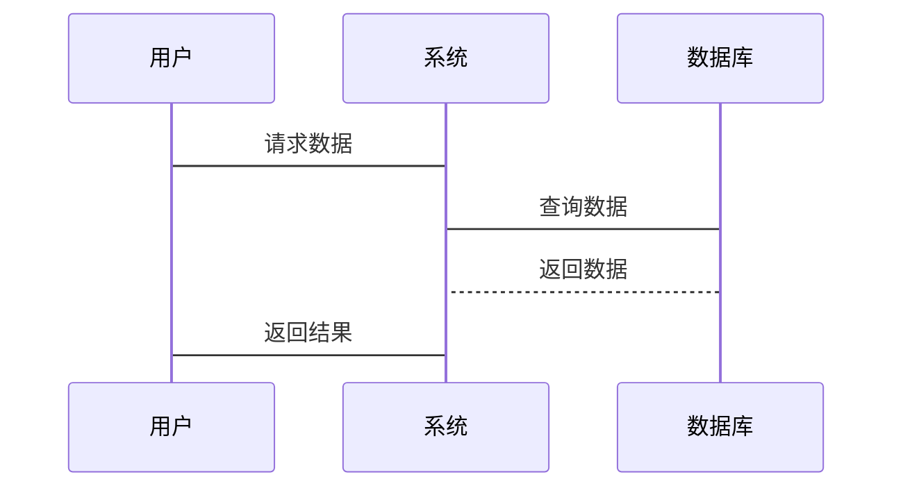

                 


# 股市估值对跨境数字营销个性化策略的影响

## 关键词：股市估值、数字营销、个性化策略、机器学习、系统架构

## 摘要：本文探讨股市估值如何影响跨境数字营销的个性化策略。通过分析股市波动对消费者行为和企业营销预算的影响，结合机器学习算法，提出数据驱动的个性化营销方案。文章还详细讲解了系统架构设计和实际案例，为数字营销提供理论支持和实践指导。

---

## 第1章: 股市估值与数字营销概述

### 1.1 股市估值的基本概念

#### 1.1.1 股票估值的定义与意义
股票估值是通过分析企业财务状况、市场地位和行业前景，确定其股票的合理价格。它反映了投资者对企业的信心，是企业价值的晴雨表。

#### 1.1.2 股市估值的核心指标与方法
常用的估值指标包括市盈率（P/E）、市净率（P/B）、股息率等。常用的方法有DCF模型、PE模型和EV/EBITDA模型。

#### 1.1.3 股市波动对企业营销策略的影响
股市波动会影响企业的利润预期和预算分配，进而影响其营销策略。例如，股市下跌可能导致企业减少广告投入。

### 1.2 跨境数字营销的定义与特点

#### 1.2.1 跨境数字营销的定义
跨境数字营销是指通过互联网向不同国家或地区的消费者推广产品或服务。其特点包括全球化、实时性和数据驱动。

#### 1.2.2 跨境数字营销的核心要素
包括目标受众分析、多语言支持、本地化内容和跨平台整合。

#### 1.2.3 跨境数字营销与传统营销的区别
主要区别在于传播媒介、受众范围和数据技术的应用。

### 1.3 个性化营销策略的内涵

#### 1.3.1 个性化营销的定义
个性化营销是根据消费者的个体需求和行为，定制独特的营销策略。

#### 1.3.2 数据驱动的个性化策略
利用大数据分析消费者行为，进行精准营销。

#### 1.3.3 个性化策略在跨境营销中的应用
通过分析用户的浏览行为、购买记录和地理位置，提供定制化的产品推荐和广告内容。

---

## 第2章: 股市估值对营销策略的影响

### 2.1 股市波动与企业经营的关系

#### 2.1.1 股市波动对企业利润的影响
股市波动会影响企业的市值和投资者信心，进而影响其盈利能力和营销预算。

#### 2.1.2 股市波动对企业营销预算的调整
股市下跌可能导致企业减少营销投入，而上涨则可能增加预算。

#### 2.1.3 股市波动对企业市场定位的影响
股市波动会影响企业对目标市场的选择和定位策略。

### 2.2 股市估值与企业价值的关系

#### 2.2.1 企业价值的衡量标准
包括收入、利润、资产和市场份额等。

#### 2.2.2 股市估值对企业价值的影响
合理的估值能够反映企业的实际价值，影响投资者决策。

#### 2.2.3 股市估值对企业营销策略的指导作用
高估或低估的估值会影响企业的定价策略和市场推广活动。

### 2.3 股市波动对消费者行为的影响

#### 2.3.1 消费者信心与股市波动的关系
股市波动会影响消费者的信心，进而影响其购买行为。

#### 2.3.2 股市波动对消费心理的影响
股市下跌可能导致消费者更倾向于储蓄而非消费。

#### 2.3.3 不同经济周期下的消费行为分析
在牛市中，消费者更愿意进行大额消费；在熊市中，消费趋于保守。

---

## 第3章: 股市估值对数字营销个性化策略的影响

### 3.1 股市波动对数字营销预算的影响

#### 3.1.1 股市波动与营销预算调整
企业根据股市表现调整营销投入，优化资源配置。

#### 3.1.2 不同行业在股市波动中的预算变化
金融行业受股市影响较大，而消费品行业相对稳定。

#### 3.1.3 预算调整对营销策略的影响
预算减少可能导致精准营销和内容营销的加强。

### 3.2 股市估值对目标客户定位的影响

#### 3.2.1 目标客户群体的定义与选择
通过数据分析确定高价值客户群体。

#### 3.2.2 股市波动对客户群体的影响
股市波动会影响客户的需求和购买能力。

#### 3.2.3 个性化客户定位的策略调整
根据客户行为变化，动态调整目标客户定位。

### 3.3 股市波动对营销渠道选择的影响

#### 3.3.1 股市波动与渠道成本的关系
股市波动会影响广告投放成本和渠道选择。

#### 3.3.2 不同渠道在不同经济周期中的表现
社交媒体在牛市中表现更佳，传统媒体在熊市中更具稳定性。

#### 3.3.3 渠道优化策略的调整
根据股市表现，动态优化渠道组合和预算分配。

---

## 第4章: 核心概念与原理

### 4.1 股市估值的核心原理

#### 4.1.1 股票定价模型
常用的模型包括DCF模型和PE模型，用于估算股票的内在价值。

#### 4.1.2 股市波动的数学模型
利用时间序列分析和随机过程模型，预测股市波动趋势。

#### 4.1.3 企业价值评估的指标体系
包括P/E、P/B、EV/EBITDA等指标，用于综合评估企业价值。

### 4.2 跨境数字营销的核心原理

#### 4.2.1 数字营销的传播原理
通过数字化渠道进行精准传播，提升品牌影响力和客户转化率。

#### 4.2.2 个性化营销的传播策略
基于用户数据，定制个性化内容和推广策略。

---

## 第5章: 算法原理讲解

### 5.1 股市预测算法

#### 5.1.1 算法流程图


#### 5.1.2 Python实现代码
```python
import numpy as np
import pandas as pd
from sklearn.linear_model import LinearRegression

# 示例数据加载
data = pd.DataFrame({
    'price': [100, 105, 98, 110, 115],
    'volume': [1000, 800, 1200, 900, 1100]
})

# 特征矩阵和目标向量
X = data[['volume']]
y = data['price']

# 模型训练
model = LinearRegression()
model.fit(X, y)

# 预测
predicted_price = model.predict(X)
print(predicted_price)
```

#### 5.1.3 数学模型
$$ \text{预测价格} = \beta_0 + \beta_1 \times \text{成交量} $$

### 5.2 个性化营销策略优化算法

#### 5.2.1 算法流程图


#### 5.2.2 Python实现代码
```python
import numpy as np
import pandas as pd
from sklearn.tree import DecisionTreeClassifier

# 示例数据加载
data = pd.DataFrame({
    'age': [25, 35, 45, 20, 30],
    'income': [50000, 60000, 40000, 70000, 55000],
    'response': [1, 0, 1, 0, 1]
})

# 特征矩阵和目标向量
X = data[['age', 'income']]
y = data['response']

# 模型训练
model = DecisionTreeClassifier()
model.fit(X, y)

# 预测
predicted_response = model.predict(X)
print(predicted_response)
```

---

## 第6章: 系统分析与架构设计方案

### 6.1 问题场景介绍

#### 6.1.1 背景
企业需要根据股市波动调整营销策略，优化资源配置。

#### 6.1.2 目标
构建一个实时监控股市数据，并根据波动调整数字营销策略的系统。

### 6.2 系统功能设计

#### 6.2.1 领域模型


#### 6.2.2 系统架构


#### 6.2.3 系统接口设计
API接口包括数据获取、策略生成和结果反馈。

#### 6.2.4 系统交互


---

## 第7章: 项目实战

### 7.1 环境安装

#### 7.1.1 安装Python和依赖库
```bash
pip install numpy pandas scikit-learn
```

### 7.2 核心代码实现

#### 7.2.1 股市数据处理
```python
import pandas as pd
import numpy as np

# 示例数据
data = pd.DataFrame({
    'date': ['2023-01-01', '2023-01-02', '2023-01-03'],
    'price': [100, 102, 101],
    'volume': [1000, 900, 1100]
})

# 数据处理
data['change'] = data['price'].diff()
print(data)
```

#### 7.2.2 个性化营销策略生成
```python
from sklearn.ensemble import RandomForestClassifier

# 示例数据
data = pd.DataFrame({
    'age': [25, 35, 45, 20, 30],
    'income': [50000, 60000, 40000, 70000, 55000],
    'response': [1, 0, 1, 0, 1]
})

# 模型训练
model = RandomForestClassifier()
model.fit(data[['age', 'income']], data['response'])

# 预测
predicted_response = model.predict(data[['age', 'income']])
print(predicted_response)
```

### 7.3 案例分析

#### 7.3.1 某公司案例分析
在2023年经济波动期间，某公司通过调整营销预算和优化广告渠道，成功提高了销售额。

#### 7.3.2 数据驱动的策略优化
通过机器学习模型，企业能够实时调整营销策略，提升客户转化率。

### 7.4 项目小结

---

## 第8章: 总结与展望

### 8.1 最佳实践 tips

#### 8.1.1 数据的重要性
高质量的数据是精准营销的基础。

#### 8.1.2 模型的可解释性
选择可解释的模型有助于优化策略。

#### 8.1.3 系统的实时性
实时监控和调整是应对股市波动的关键。

### 8.2 小结

通过结合股市估值和数字营销，企业可以制定更具竞争力的个性化策略，提升市场表现。

### 8.3 注意事项

- 数据隐私保护
- 模型的持续优化
- 跨境营销的法律合规

### 8.4 拓展阅读

- 《股票技术分析实战》
- 《数据驱动的营销策略》

---

## 作者：AI天才研究院/AI Genius Institute & 禅与计算机程序设计艺术 /Zen And The Art of Computer Programming

---

通过以上结构和内容，您可以根据需要进一步扩展每个部分的内容，确保文章的完整性和深度。

