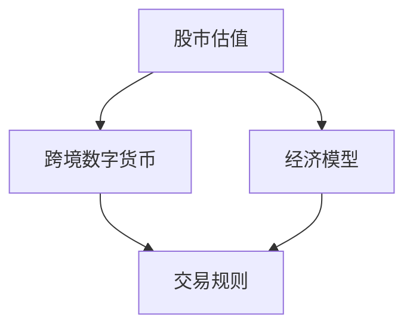
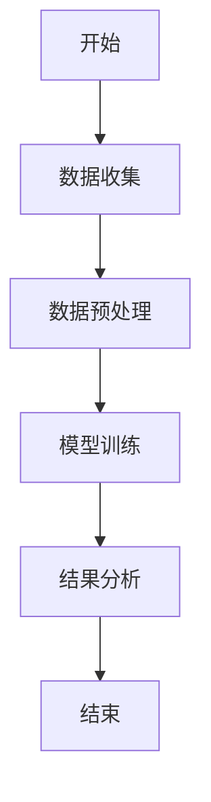
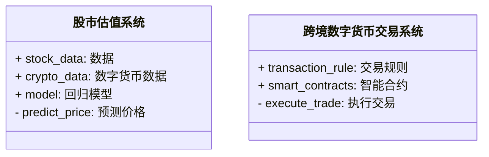
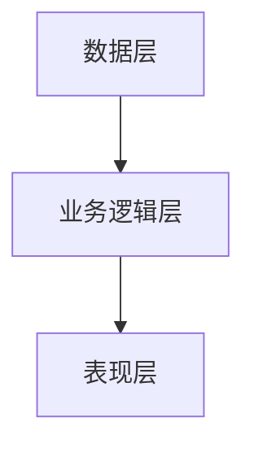

                 


# 股市估值对跨境数字货币交易规则的影响

## 关键词：股市估值、跨境数字货币、交易规则、经济模型、算法原理、系统架构

## 摘要：本文深入探讨股市估值如何影响跨境数字货币的交易规则，分析其经济模型、算法原理和系统架构。通过实际案例，展示如何利用技术手段优化交易规则，提升市场效率。

---

## 第一部分：背景与基础

### 第1章：股市估值的基本概念与现状

#### 1.1 股市估值的定义与核心要素

股市估值是通过分析公司财务数据，评估其股票的合理价格。核心要素包括市盈率、市净率和现金流折现率。

#### 1.2 跨境数字货币的基本概念

跨境数字货币是基于区块链技术的电子货币，如比特币和以太坊。其交易规则涉及智能合约和去中心化交易所。

#### 1.3 两者的相互关系

股市估值影响投资者信心，进而影响跨境数字货币的价格波动。跨境数字货币的出现改变了传统金融市场的交易规则，推动了金融创新。

### 第2章：经济模型与影响机制

#### 2.1 股市估值的核心模型

- **市盈率模型**：评估股票的内在价值。
- **市净率模型**：衡量股票相对于账面价值的高低。
- **现金流折现模型**：预测未来现金流的现值。

#### 2.2 跨境数字货币的定价模型

- **市场供需模型**：价格由市场供需决定。
- **智能合约模型**：通过智能合约自动执行交易规则。
- **币值波动模型**：分析数字货币的价格波动。

#### 2.3 经济模型对比

表1：股市估值与跨境数字货币模型对比

| 比较维度 | 股市估值模型       | 跨境数字货币模型       |
|----------|--------------------|-----------------------|
| 核心变量 | 市盈率、市净率       | 市场需求、智能合约     |
| 输入数据 | 公司财务数据       | 交易数据、区块链数据   |
| 输出结果 | 股票合理价格       | 数字货币合理价格       |

图1：实体关系图



### 第3章：影响机制与数学模型

#### 3.1 影响机制的理论分析

- **价格发现机制**：股市估值帮助确定数字货币的合理价格。
- **市场情绪传导机制**：股市波动影响投资者情绪，进而影响数字货币交易。
- **市场流动性影响机制**：股市流动性变化影响数字货币的交易量。

#### 3.2 数学模型

回归分析模型：

$$ y = \beta_0 + \beta_1x + \epsilon $$

其中，y为数字货币价格，x为股市指数，β系数为回归系数，ε为误差项。

时间序列分析模型：

$$ ARIMA(p, d, q) $$

用于分析数字货币价格的时间序列数据。

贝叶斯网络模型：

通过贝叶斯定理，分析股市估值与数字货币交易规则之间的关系。

#### 3.3 算法实现

流程图：



Python代码示例：

```python
import pandas as pd
import numpy as np
from sklearn.linear_model import LinearRegression

# 示例数据加载
data = pd.read_csv('stock_data.csv')

# 数据预处理
X = data[['stock_index', 'market_sentiment']]
y = data['crypto_price']

# 模型训练
model = LinearRegression()
model.fit(X, y)

# 预测结果
y_pred = model.predict(X)
print('预测结果:', y_pred)
```

---

## 第二部分：系统分析与架构设计

### 第4章：系统分析

#### 4.1 问题场景

分析股市估值对跨境数字货币交易规则的影响，设计一个实时监控和预测系统。

#### 4.2 系统功能设计

类图：



#### 4.3 系统架构设计

分层架构：



接口设计：

API接口用于数据传输和模型调用。

交互流程：

序列图：


---

## 第三部分：项目实战

### 第5章：项目实战

#### 5.1 环境安装

安装Python、Pandas、NumPy和Scikit-learn。

#### 5.2 核心算法实现

实现回归模型：

```python
from sklearn.linear_model import LinearRegression

model = LinearRegression()
model.fit(X_train, y_train)
y_pred = model.predict(X_test)
```

#### 5.3 实际案例分析

分析某数字货币在股市波动下的交易规则变化，展示模型的应用效果。

#### 5.4 项目小结

总结项目经验，提出改进建议，强调数据质量和模型优化的重要性。

---

## 第四部分：最佳实践与总结

### 第6章：最佳实践

#### 6.1 风险管理

提示读者注意数据质量和模型适用性，避免过度依赖单一模型。

#### 6.2 数据源选择

建议使用可靠的金融数据源，确保数据的准确性和全面性。

#### 6.3 系统优化

推荐采用分布式架构，提升系统的处理能力。

### 6.4 小结

回顾文章内容，强调股市估值与跨境数字货币交易规则的相互影响，鼓励读者深入研究和实践。

---

## 作者：AI天才研究院 & 禅与计算机程序设计艺术

这篇文章通过系统分析和实际案例，深入探讨了股市估值对跨境数字货币交易规则的影响。通过理论分析、算法实现和系统设计，为读者提供了全面的技术视角。希望本文能为相关领域的研究和实践提供有价值的参考。

