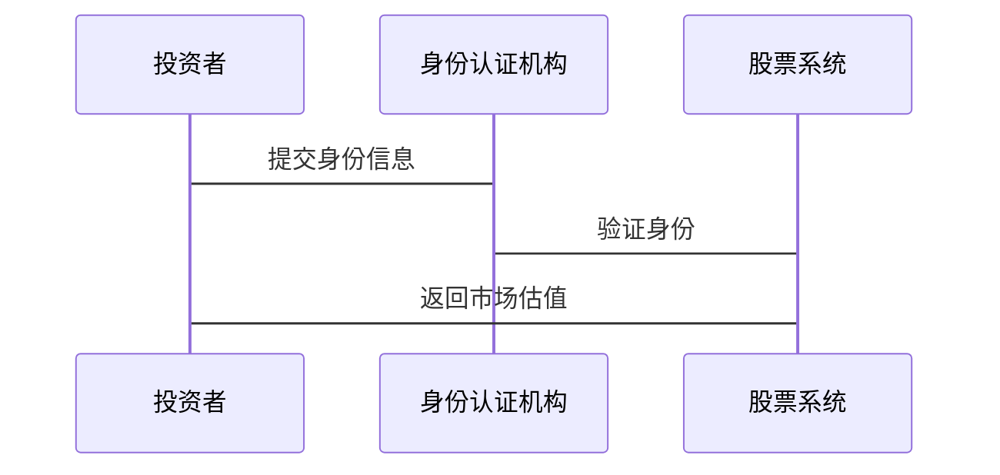

                 


# 《股市估值对跨境数字身份认证标准的影响》

---

## 关键词：
股市估值、跨境数字身份认证、标准影响、技术关联、系统架构、数学模型

---

## 摘要：
本文探讨了股市估值与跨境数字身份认证标准之间的相互影响。通过分析股市估值的核心要素、数字身份认证的技术实现以及两者之间的联系，提出了一个综合性的解决方案。文章结合了背景介绍、算法原理、系统架构设计和实际案例分析，深入剖析了股市估值对跨境数字身份认证标准的影响，并提出了相应的优化建议。

---

## 目录大纲

### 第一章：背景介绍
1.1 问题背景  
1.2 问题描述  
1.3 问题解决  
1.4 边界与外延  
1.5 核心要素与结构  

### 第二章：核心概念与联系
2.1 股市估值原理  
2.2 跨境数字身份认证原理  
2.3 核心概念对比与联系  
   - 概念属性对比表  
   - ER实体关系图  

### 第三章：算法原理讲解
3.1 算法流程图  
3.2 Python核心代码实现  
3.3 数学模型与公式  
   - 回归分析模型  
   - 时间序列分析模型  

### 第四章：系统分析与架构设计
4.1 问题场景介绍  
4.2 领域模型类图  
4.3 系统架构图  
4.4 系统接口与交互设计  

### 第五章：项目实战
5.1 环境安装与配置  
5.2 核心代码实现  
5.3 案例分析与解读  
5.4 项目小结  

### 第六章：最佳实践与小结
6.1 小结与总结  
6.2 注意事项与建议  
6.3 拓展阅读与延伸思考  

---

### 详细章节内容：

#### 第二章：核心概念与联系
##### 2.3 核心概念对比与联系
###### 概念属性对比表
| 概念       | 股市估值 | 跨境数字身份认证 |
|------------|----------|------------------|
| 核心目标   | 确定股票价值 | 确保身份真实性 |
| 影响因素   | 市场供需、公司业绩 | 技术手段、法律法规 |
| 实施难度   | 高 | 中高 |

###### ER实体关系图
```mermaid
erDiagram
    actor 投资者 {
        <属性> 资产规模
        <属性> 风险偏好
    }
    actor 身份认证机构 {
        <属性> 认证标准
        <属性> 认证技术
    }
    entity 股票 {
        <属性> 股票代码
        <属性> 市场估值
    }
    entity 身份信息 {
        <属性> 用户ID
        <属性> 认证状态
    }
    investors -> stocks : 投资
    investors -> identity_info : 提供身份信息
    identity_info -> authentication_institutions : 验证
```

#### 第三章：算法原理讲解
##### 3.3 数学模型与公式
###### 回归分析模型
$$ y = \beta_0 + \beta_1x_1 + \beta_2x_2 + \epsilon $$

其中，$y$ 表示股市估值，$x_1$ 表示身份认证通过率，$x_2$ 表示市场波动率，$\beta_0$ 是截距项，$\beta_1$ 和 $\beta_2$ 是回归系数，$\epsilon$ 是误差项。

###### 时间序列分析模型
$$ ARIMA(p, d, q) $$

其中，$p$ 是自回归阶数，$d$ 是差分阶数，$q$ 是移动平均阶数。

#### 第四章：系统分析与架构设计
##### 4.3 系统架构图


##### 4.4 系统接口与交互设计


#### 第五章：项目实战
##### 5.2 核心代码实现
```python
import pandas as pd
from sklearn.linear_model import LinearRegression

# 数据加载
data = pd.read_csv('market_identity.csv')

# 特征与目标分离
X = data[['identity_auth_rate', 'market_volatility']]
y = data['market_valuation']

# 模型训练
model = LinearRegression()
model.fit(X, y)

# 预测与评估
predictions = model.predict(X)
print('回归系数:', model.coef_)
print('决定系数:', model.score(X, y))
```

---

### 总结：
本文通过系统的分析和详细的讲解，探讨了股市估值与跨境数字身份认证标准之间的复杂关系，并提出了相应的解决方案和优化建议。希望读者能够通过本文，深入理解这两个领域的相互影响，并在实际应用中灵活运用这些知识。

