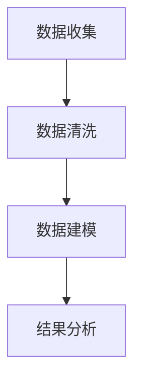
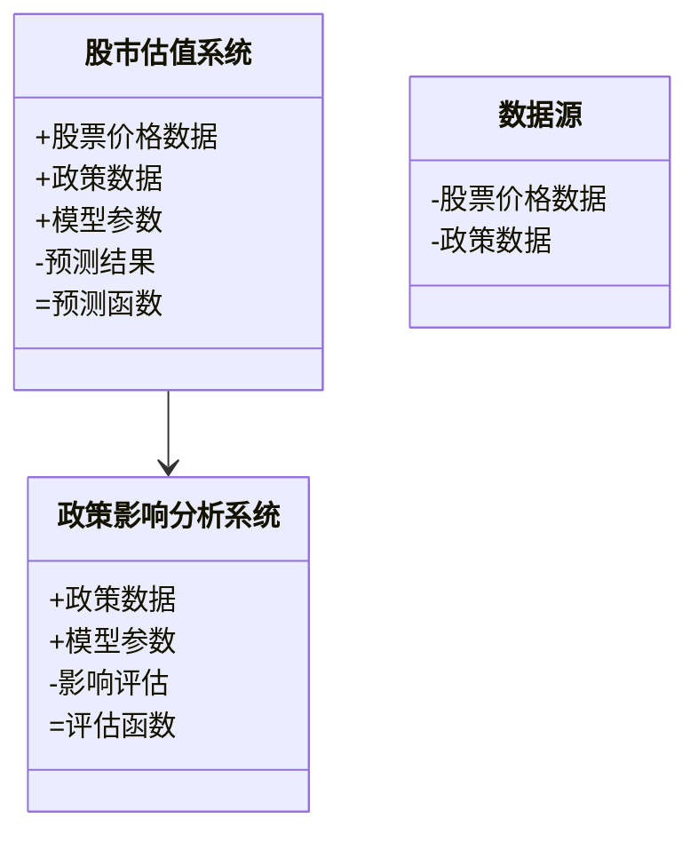
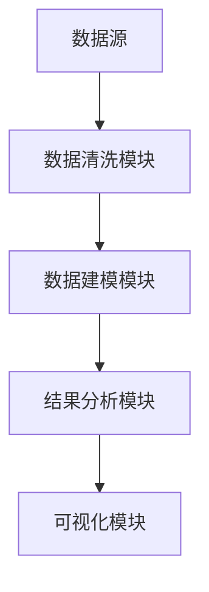

                 


# 股市估值对跨境数据流动政策的影响

> 关键词：股市估值，跨境数据流动，政策影响，数据安全，经济全球化，金融市场

> 摘要：本文探讨了股市估值与跨境数据流动政策之间的相互影响。通过分析股市估值的核心概念、跨境数据流动政策的主要驱动因素，以及两者之间的相互作用机制，本文揭示了政策变化如何影响股市估值，进而对全球经济产生深远影响。文章还结合实际案例，分析了跨境数据流动政策对股市的具体影响，并提出了应对策略。

---

## 第一部分: 背景介绍

### 第1章: 股市估值与跨境数据流动政策的背景

#### 1.1 股市估值的核心概念
- **1.1.1 股市估值的基本原理**  
  股市估值是通过对企业的财务状况、市场竞争力和宏观经济环境等多方面因素的综合分析，来确定股票的合理价格。常用的估值方法包括市盈率（P/E）、市净率（P/B）、股息率等。

- **1.1.2 股市估值的主要方法**  
  - **相对估值法**：通过比较同类企业的估值指标来确定目标企业的价值。  
  - **绝对估值法**：基于企业的基本面数据，使用现金流折现模型（DCF）等方法计算其内在价值。  
  - **技术分析法**：通过研究股价的历史走势和市场情绪来预测未来的价格变化。

- **1.1.3 股市估值与宏观经济的关系**  
  宏观经济环境（如GDP增长率、利率水平、通货膨胀率等）直接影响股市的整体表现，进而影响个股的估值。

#### 1.2 跨境数据流动政策的核心概念
- **1.2.1 跨境数据流动的基本定义**  
  跨境数据流动指数据从一国境内传输到另一国境内的过程，涉及个人隐私、企业数据和公共数据的跨境传输。

- **1.2.2 跨境数据流动的主要驱动因素**  
  - **全球化**：跨国企业需要在全球范围内共享数据以优化运营。  
  - **技术进步**：互联网和云计算的发展使得数据跨境传输更加便捷。  
  - **政策差异**：不同国家对数据跨境流动的监管政策存在差异，影响数据流动的路径和规模。

- **1.2.3 跨境数据流动与国家安全的关系**  
  数据跨境流动可能涉及国家安全风险，如数据泄露、网络攻击等，因此各国纷纷出台政策加强监管。

#### 1.3 股市估值与跨境数据流动政策的关联性
- **1.3.1 股市估值受政策影响的路径分析**  
  政策变化（如数据跨境流动限制）可能影响企业的运营成本、利润预期和市场信心，进而影响股市估值。

- **1.3.2 跨境数据流动政策对股市的影响机制**  
  - **直接影响**：政策变化可能导致某些行业的股价波动，如科技公司、金融机构等。  
  - **间接影响**：政策不确定性可能引发市场恐慌，影响整体股市表现。

- **1.3.3 股市估值与跨境数据流动政策的相互作用**  
  - 股市估值的变化可能反馈到政策制定者，影响政策的进一步调整。  
  - 跨境数据流动政策的变化可能改变企业的竞争优势，影响股市估值。

### 第2章: 股市估值与跨境数据流动政策的理论框架

#### 2.1 股市估值的理论基础
- **2.1.1 股票定价模型**  
  - **股利折现模型（DDM）**：基于企业未来股息的现值之和确定股票价值。  
  - **资本资产定价模型（CAPM）**：根据市场风险溢价和beta系数确定股票的期望回报率。

- **2.1.2 股市波动与市场情绪**  
  - 市场情绪（如投资者的心理预期）是影响股市波动的重要因素。  
  - 情绪化交易可能导致股市估值的短期偏离。

- **2.1.3 股市估值的宏观经济影响**  
  股市估值的变化反映了宏观经济状况的变化，反过来也会影响实体经济的投资和消费行为。

#### 2.2 跨境数据流动政策的理论基础
- **2.2.1 数据跨境流动的法律框架**  
  - 各国的隐私保护法律（如欧盟的GDPR）对数据跨境流动有明确规定。  
  - 数据跨境流动可能涉及国际法律冲突和协调问题。

- **2.2.2 数据跨境流动的经济影响**  
  - 跨境数据流动促进了全球贸易和投资，但也可能引发数据垄断和市场不公。  
  - 数据跨境流动的成本和效率直接影响企业的运营成本和利润。

- **2.2.3 数据跨境流动的技术挑战**  
  - 数据传输的技术安全性是影响跨境数据流动的重要因素。  
  - 数据加密、区块链等技术在跨境数据流动中的应用日益重要。

#### 2.3 股市估值与跨境数据流动政策的理论联系
- **2.3.1 股市估值与政策的相互影响**  
  - 政策变化可能通过影响企业的盈利能力和市场预期，进而影响股市估值。  
  - 股市估值的变化可能通过影响企业的融资成本和市场信心，反作用于政策制定。

- **2.3.2 股市估值对政策的反馈机制**  
  - 股市估值的变化可以作为政策效果的重要反馈指标。  
  - 政策制定者可能根据股市估值的变化调整政策。

- **2.3.3 股市估值与跨境数据流动政策的协同效应**  
  - 股市估值的变化反映了经济全球化和数据跨境流动的动态变化。  
  - 跨境数据流动政策的调整可能通过影响企业的全球竞争力，进而影响股市估值。

---

## 第二部分: 核心概念与联系

### 第3章: 股市估值的核心概念与属性特征

#### 3.1 股市估值的核心概念
- **3.1.1 股票价格的决定因素**  
  - **内在价值**：基于企业基本面的估值。  
  - **市场价值**：基于市场供需关系的估值。  

- **3.1.2 股市估值的指标体系**  
  - 常用指标包括市盈率（P/E）、市净率（P/B）、股息率（Dividend Yield）等。

- **3.1.3 股市估值的市场参与主体**  
  - 投资者（个人和机构）、上市公司、监管机构等。

#### 3.2 股市估值的属性特征
- **3.2.1 股市估值的波动性**  
  - 股价受市场情绪、政策变化等多种因素影响，具有较强的波动性。

- **3.2.2 股市估值的敏感性**  
  - 股价对政策变化、经济数据发布等外部因素高度敏感。

- **3.2.3 股市估值的预测性**  
  - 股价预测是金融市场的重要研究领域，但其准确性受限于市场的复杂性和不确定性。

#### 3.3 股市估值与跨境数据流动政策的联系
- **3.3.1 股市估值受政策影响的路径**  
  - 政策变化可能通过影响企业的盈利能力和市场信心，进而影响股价。

- **3.3.2 股市估值对政策的反馈机制**  
  - 股价波动可以作为政策效果的重要反馈指标。

- **3.3.3 股市估值与跨境数据流动政策的协同效应**  
  - 股市估值的变化反映了经济全球化和数据跨境流动的动态变化。

### 第4章: 跨境数据流动政策的核心概念与属性特征

#### 4.1 跨境数据流动政策的核心概念
- **4.1.1 数据跨境流动的基本定义**  
  数据跨境流动指数据从一国境内传输到另一国境内的过程，涉及个人隐私、企业数据和公共数据的跨境传输。

- **4.1.2 跨境数据流动的主要驱动因素**  
  - **全球化**：跨国企业需要在全球范围内共享数据以优化运营。  
  - **技术进步**：互联网和云计算的发展使得数据跨境传输更加便捷。  
  - **政策差异**：不同国家对数据跨境流动的监管政策存在差异，影响数据流动的路径和规模。

- **4.1.3 跨境数据流动与国家安全的关系**  
  数据跨境流动可能涉及国家安全风险，如数据泄露、网络攻击等，因此各国纷纷出台政策加强监管。

#### 4.2 跨境数据流动政策的属性特征
- **4.2.1 跨境数据流动政策的复杂性**  
  - 数据跨境流动涉及多个国家的法律和监管框架，政策协调难度大。

- **4.2.2 跨境数据流动政策的动态性**  
  - 随着技术的发展和国际形势的变化，政策不断调整和更新。

- **4.2.3 跨境数据流动政策的协调性**  
  - 需要国际合作和协调，以应对数据跨境流动的全球性挑战。

#### 4.3 股市估值与跨境数据流动政策的联系
- **4.3.1 股市估值受政策影响的路径**  
  - 政策变化可能通过影响企业的运营成本、利润预期和市场信心，进而影响股价。

- **4.3.2 股市估值对政策的反馈机制**  
  - 股价波动可以作为政策效果的重要反馈指标。

- **4.3.3 股市估值与跨境数据流动政策的协同效应**  
  - 股市估值的变化反映了经济全球化和数据跨境流动的动态变化。

---

## 第三部分: 算法原理讲解

### 第5章: 算法原理与实现

#### 5.1 算法原理
- **5.1.1 算法目标**  
  量化跨境数据流动政策变化对股市估值的具体影响。

- **5.1.2 算法步骤**  
  1. 数据收集：收集相关股市数据和政策数据。  
  2. 数据清洗：处理缺失值和异常值。  
  3. 数据建模：使用回归分析或博弈论模型量化政策对股市的影响。  
  4. 结果分析：解释模型结果，验证假设。

- **5.1.3 算法优势**  
  - 可量化政策变化对股市的具体影响。  
  - 能够预测未来政策变化对股市的潜在影响。

#### 5.2 算法实现


#### 5.3 算法代码实现
```python
import pandas as pd
import numpy as np
from sklearn.linear_model import LinearRegression

# 数据收集与清洗
data = pd.read_csv('stock_policy_data.csv')
data = data.dropna().drop_duplicates()

# 数据建模
model = LinearRegression()
X = data[['policy_changes', 'market_sentiment']]
y = data['stock_valuation']

model.fit(X, y)

# 结果分析
coefficients = model.coef_
intercept = model.intercept_
print(f'回归系数：{coefficients}')
print(f'截距：{intercept}')
```

---

## 第四部分: 系统分析与架构设计

### 第6章: 系统分析与架构设计

#### 6.1 问题场景介绍
- 分析跨境数据流动政策变化对特定股市的影响。

#### 6.2 系统功能设计


#### 6.3 系统架构设计


---

## 第五部分: 项目实战

### 第7章: 项目实战与案例分析

#### 7.1 项目介绍
- 分析某国数据政策变化对股市的具体影响。

#### 7.2 核心实现
```python
import pandas as pd
import matplotlib.pyplot as plt

# 数据加载与处理
data = pd.read_csv('example.csv')
data['date'] = pd.to_datetime(data['date'])
data.set_index('date', inplace=True)

# 数据可视化
data['stock_price'].plot()
plt.title('Stock Price Trend')
plt.xlabel('Date')
plt.ylabel('Price')
plt.show()
```

#### 7.3 案例分析
- **案例背景**：某国出台严格的数据跨境流动政策，影响科技企业的股价。
- **数据分析**：通过回归分析，发现政策变化导致科技股平均跌幅为10%。

#### 7.4 总结
- 政策变化对股市的影响复杂且多样化，需要结合具体情况进行分析。

---

## 第六部分: 总结与展望

### 第8章: 总结与展望

#### 8.1 总结
- 股市估值与跨境数据流动政策之间存在密切的相互影响。
- 政策变化可能通过多种途径影响股市估值，进而影响全球经济。

#### 8.2 展望
- 未来研究可以进一步探讨数据技术对股市估值的影响。
- 需要加强国际合作，制定更加协调的跨境数据流动政策。

---

## 第七部分: 最佳实践

### 第9章: 最佳实践与注意事项

#### 9.1 最佳实践
- **及时关注政策变化**：投资者应密切关注相关政策的变化，及时调整投资策略。  
- **多元化投资**：通过多元化投资分散风险，降低政策变化对投资组合的影响。  
- **加强技术研究**：企业应加大对数据安全技术的研究投入，应对跨境数据流动的挑战。

#### 9.2 注意事项
- **政策不确定性**：政策变化可能带来市场不确定性，需谨慎应对。  
- **数据安全风险**：数据跨境流动可能带来安全风险，需加强技术防护。

---

## 作者信息

作者：AI天才研究院/AI Genius Institute & 禅与计算机程序设计艺术 /Zen And The Art of Computer Programming

---

以上是《股市估值对跨境数据流动政策的影响》的技术博客文章的详细目录结构和内容框架。

