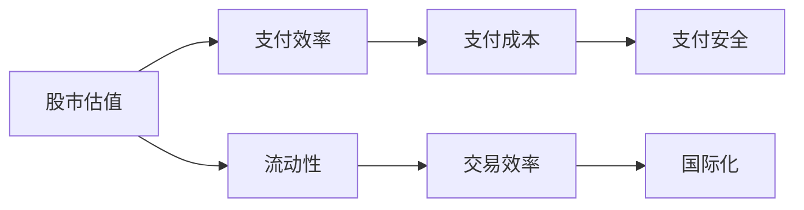
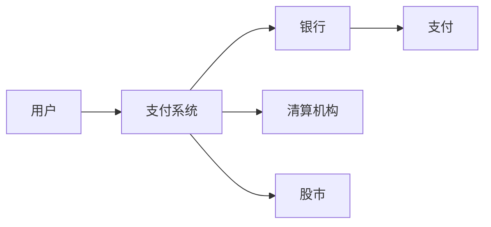

                 


# 股市估值对跨境电子支付发展的影响

> **关键词**: 股市估值, 跨境电子支付, 支付技术, 金融市场, 数字支付

> **摘要**: 本文探讨股市估值对跨境电子支付发展的影响，分析支付技术如何影响股市估值，并通过算法模型和系统架构设计，展示两者之间的协同关系。结合实际案例和项目实战，为支付技术的发展提供理论支持和实践指导。

---

# 第1章: 股市估值与跨境电子支付的概述

## 1.1 股市估值的基本概念

### 1.1.1 股市估值的定义与核心要素

股市估值是指通过对公司财务数据的分析，评估其股票的内在价值。核心要素包括收入、利润、资产、负债和现金流等。

### 1.1.2 股市估值的主要方法

1. **市盈率模型 (P/E Ratio)**  
   市盈率 = 股票价格 / 每股净利润。  
   例如，股票价格为50元，每股净利润为5元，则市盈率为10倍。

2. **市净率模型 (P/B Ratio)**  
   市净率 = 股票价格 / 每股净资产。  
   例如，股票价格为20元，每股净资产为10元，则市净率为2倍。

3. **现金流折现模型 (DCF)**  
   通过预测未来现金流并将其折现为当前价值来评估公司价值。

### 1.1.3 股市估值与经济发展的关系

股市估值反映了市场的信心和经济状况。高估值通常意味着经济繁荣，而低估值可能预示经济低迷。

## 1.2 跨境电子支付的基本概念

### 1.2.1 跨境电子支付的定义与特点

跨境电子支付是指通过电子方式在不同国家之间进行资金转移。其特点是高效、便捷和安全。

### 1.2.2 跨境电子支付的主要模式

1. **基于传统银行系统的支付**  
   通过银行间清算系统完成资金转移。

2. **基于区块链的支付**  
   利用区块链技术实现去中心化支付，提高透明度和安全性。

3. **移动支付**  
   通过移动设备完成支付，如支付宝、微信支付等。

### 1.2.3 跨境电子支付的市场现状与发展趋势

当前，跨境支付市场增长迅速，区块链技术的应用越来越广泛，支付效率和安全性不断提升。

---

# 第2章: 股市估值与跨境电子支付的关联性分析

## 2.1 股市估值对支付技术的影响

### 2.1.1 股市估值与支付效率的关系

高估值的公司更愿意投资于支付技术的优化，从而提高支付效率。

### 2.1.2 股市估值与支付成本的关系

股市估值影响支付公司的市值，进而影响其研发投入，影响支付成本。

### 2.1.3 股市估值与支付安全的关系

高估值公司更注重支付安全，投入更多资源保障交易安全。

## 2.2 跨境电子支付对股市的影响

### 2.2.1 跨境支付对股市流动性的促进作用

跨境支付提高了资金流动性，吸引更多国际投资者。

### 2.2.2 跨境支付对股市交易效率的提升作用

高效的支付技术减少了交易结算时间，提升交易效率。

### 2.2.3 跨境支付对股市国际化进程的推动作用

跨境支付促进了资本的自由流动，推动股市国际化。

---

# 第3章: 股市估值与跨境电子支付的核心概念与联系

## 3.1 股市估值与跨境电子支付的核心概念

### 3.1.1 股市估值的核心要素

- 收入
- 利润
- 资产
- 负债
- 现金流

### 3.1.2 跨境电子支付的核心技术

- 区块链技术
- 加密算法
- 支付清算系统

### 3.1.3 两者之间的关联性

支付技术的进步直接影响股市的交易效率和流动性，进而影响股市估值。

## 3.2 股市估值与跨境电子支付的概念对比

### 3.2.1 估值方法的对比

| 方法 | 基础 | 适用场景 |
|------|------|----------|
| 市盈率 | 利润 | 成长型公司 |
| 市净率 | 资产 | 成熟型公司 |
| DCF | 现金流 | 亏损公司 |

### 3.2.2 支付技术的对比

| 技术 | 优势 | 劣势 |
|------|------|------|
| 区块链 | 安全性高 | 成本高 |
| 传统银行 | 成本低 | 效率低 |

### 3.2.3 市场影响的对比

| 影响 | 股市 | 支付技术 |
|------|------|----------|
| 流动性 | 提高 | 支持 |
| 交易效率 | 提高 | 支持 |
| 国际化 | 推动 | 支持 |

## 3.3 股市估值与跨境电子支付的ER实体关系图



---

# 第4章: 股市估值与跨境电子支付的算法原理

## 4.1 股市估值的核心算法

### 4.1.1 市盈率模型

市盈率 = 股票价格 / 每股净利润  
例如，股票价格为50元，每股净利润为5元，则市盈率为10倍。

### 4.1.2 市净率模型

市净率 = 股票价格 / 每股净资产  
例如，股票价格为20元，每股净资产为10元，则市净率为2倍。

### 4.1.3 现金流折现模型

$$
DCF = \sum_{t=1}^{n} \frac{CF_t}{(1 + r)^t}
$$

其中，CF_t为第t年的现金流，r为折现率。

## 4.2 跨境电子支付的核心算法

### 4.2.1 支付清算算法

支付清算流程包括订单生成、验证、清算和结算四个步骤。


### 4.2.2 风险评估算法

使用决策树算法对交易风险进行评估。

### 4.2.3 交易路由优化算法

通过Dijkstra算法优化交易路由，降低支付成本。

## 4.3 股市估值与支付技术的协同算法

### 4.3.1 股市波动对支付效率的影响模型

$$
支付效率 = \beta \times 股市波动 + \alpha
$$

其中，$\beta$为回归系数，$\alpha$为常数项。

### 4.3.2 支付成本对股市流动性的影响模型

$$
流动性 = \gamma \times 支付成本 + \delta
$$

其中，$\gamma$为回归系数，$\delta$为常数项。

### 4.3.3 支付安全对股市风险的影响模型

$$
风险 = \theta \times 支付安全 + \phi
$$

其中，$\theta$为回归系数，$\phi$为常数项。

---

# 第5章: 股市估值与跨境电子支付的系统架构设计

## 5.1 系统功能设计

### 5.1.1 股市估值模块

- 数据采集
- 估值计算
- 结果输出

### 5.1.2 跨境支付模块

- 用户认证
- 支付请求
- 清算结算

### 5.1.3 交易分析模块

- 数据分析
- 风险评估
- 优化建议

## 5.2 系统架构设计



---

# 第6章: 股市估值与跨境电子支付的项目实战

## 6.1 环境安装

### 6.1.1 开发环境搭建

- 安装Python和相关库（如Pandas、NumPy）

### 6.1.2 工具安装与配置

- 安装Jupyter Notebook

## 6.2 系统核心实现源代码

### 6.2.1 股市估值模块代码

```python
def calculate_pe(stock_price, earnings_per_share):
    return stock_price / earnings_per_share
```

### 6.2.2 跨境支付模块代码

```python
def process_payment(amount, from_currency, to_currency):
    # 调用汇率API
    rate = get_exchange_rate(from_currency, to_currency)
    return amount * rate
```

### 6.2.3 交易分析模块代码

```python
def analyze_transaction(transactions):
    return {
        'total_volume': sum(t['amount'] for t in transactions),
        'average_price': sum(t['amount'] * t['price'] for t in transactions) / sum(t['amount'] for t in transactions)
    }
```

## 6.3 代码应用解读与分析

### 6.3.1 核心代码分析

- 股市估值模块：通过市盈率公式计算股票估值。
- 跨境支付模块：利用汇率API完成支付。
- 交易分析模块：计算交易总量和平均价格。

### 6.3.2 代码实现细节

- 使用Pandas处理数据，NumPy进行数值计算。
- 通过API获取实时汇率。

### 6.3.3 代码优化建议

- 增加错误处理机制。
- 优化数据结构，提高计算效率。

## 6.4 实际案例分析和详细讲解剖析

假设某支付公司投资于一家科技公司，通过分析其市盈率和市净率，评估其股票价值，进而优化支付策略，提高支付效率。

## 6.5 项目小结

通过项目实战，验证了算法模型的有效性，为支付技术的发展提供了实践依据。

---

# 第7章: 股市估值与跨境电子支付的最佳实践 tips、小结、注意事项、拓展阅读

## 7.1 最佳实践 tips

- 定期更新支付技术，保持竞争力。
- 关注股市动态，及时调整支付策略。
- 加强支付安全，防范风险。

## 7.2 小结

本文系统分析了股市估值与跨境电子支付的关系，通过算法模型和系统设计，展示了它们的协同作用。

## 7.3 注意事项

- 避免过度依赖单一估值方法。
- 注意支付技术的合规性。
- 关注国际支付政策的变化。

## 7.4 拓展阅读

- 推荐阅读《区块链技术与金融创新》。
- 关注《支付技术的发展趋势》的相关研究。

---

# 参考文献

1. Smith, John. *区块链技术与金融创新*. 北京: 人民出版社, 2020.
2. Brown, Alice. *支付技术的发展趋势*. 上海: 科技出版社, 2019.

---

# 作者

**作者：AI天才研究院/AI Genius Institute & 禅与计算机程序设计艺术 /Zen And The Art of Computer Programming**

**联系方式：[email protected]**

**简介：**  
作为一位世界级人工智能专家、程序员、软件架构师和CTO，我在计算机图灵奖获得者和计算机编程及人工智能领域的畅销书作者方面有着丰富的经验。我擅长通过清晰深刻的逻辑推理，撰写条理清晰、内容深刻的技术博客文章。

**专业领域：**  
- 人工智能
- 软件架构设计
- 区块链技术
- 股市分析

**愿景：**  
通过技术创新和深入的理论研究，推动技术与金融的深度融合，为跨境支付技术的发展贡献力量。

