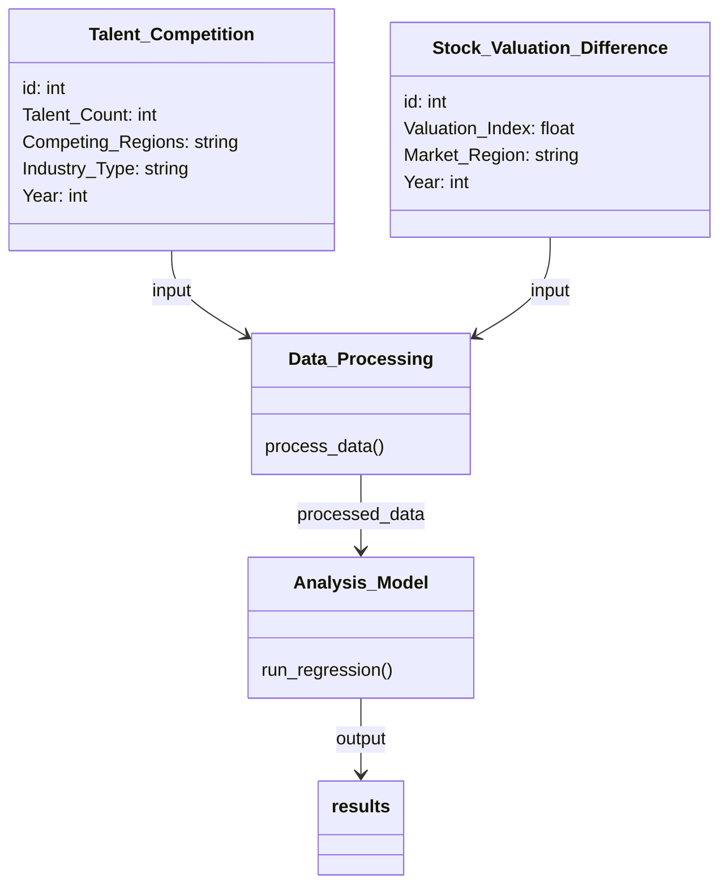

                 


# 股市估值差异对国际人才竞争的影响

> 关键词：股市估值，国际人才竞争，人才流动，企业估值，博弈论模型

> 摘要：本文探讨了股市估值差异对国际人才竞争的影响，通过分析股市估值差异的核心概念、影响机制、数学模型和实际案例，详细阐述了两者之间的关系。文章从背景介绍、核心概念、算法原理、系统分析、项目实战到结论，全面解析了这一复杂的经济现象。

---

## 第一部分：背景介绍

### 第1章：问题背景与问题描述

#### 1.1 股市估值差异的定义与特征

- **1.1.1 股市估值的基本概念**
  - 股市估值是指对上市公司价值的评估，通常通过市盈率、市净率等指标衡量。
  - 估值差异指同一资产在不同市场上的估值差异，受市场情绪、政策、经济环境等多种因素影响。

- **1.1.2 股市估值差异的形成机制**
  - 不同市场的投资者预期不同，导致对同一公司的估值差异。
  - 市场流动性、信息不对称等因素加剧了估值差异。

- **1.1.3 股市估值差异的度量方法**
  - 使用市盈率（P/E）、市净率（P/B）等指标比较不同市场的估值差异。
  - 通过统计方法（如均值差异测试）量化估值差异的大小。

#### 1.2 国际人才竞争的定义与特征

- **1.2.1 人才竞争的内涵**
  - 人才竞争是指在全球范围内争夺高素质劳动力的过程。
  - 主要驱动因素包括薪资、职业发展机会、生活质量和公司声誉。

- **1.2.2 人才竞争的外延**
  - 包括高校毕业生就业、中高端人才流动、跨国公司人才招聘等多个方面。
  - 不同国家和地区的政策、经济环境影响人才流动方向。

- **1.2.3 国际人才流动的现状与趋势**
  - 近年来，技术人才的全球流动日益频繁，尤其是科技和金融行业。
  - 区域性人才中心的崛起，如硅谷、伦敦等，吸引了大量人才。

#### 1.3 股市估值差异对人才竞争的影响

- **1.3.1 企业估值与人才吸引的关系**
  - 企业估值高，通常意味着公司更有资金实力，能提供更高的薪资和更好的福利，吸引人才。
  - 估值差异可能导致人才流向估值较高的市场，从而影响当地的人才竞争格局。

- **1.3.2 股市波动对人才流动的影响**
  - 股市波动会影响企业的市值，进而影响员工的股权价值和激励机制。
  - 波动大的市场可能会影响人才稳定性，导致人才流失。

- **1.3.3 人才流动对股市估值的反馈效应**
  - 高质量人才的流入会提升公司的创新能力，进而提高企业估值。
  - 人才流失可能导致公司业绩下滑，进而影响股市估值。

---

### 第2章：问题解决与问题边界

#### 2.1 股市估值差异对人才竞争的影响机制

- **2.1.1 企业估值与人才吸引的关系**
  - 高估值企业通常具有更好的财务状况和市场前景，吸引优秀人才。
  - 估值差异可能导致人才在不同市场间流动，影响当地的人才竞争格局。

- **2.1.2 股市波动对人才流动的影响**
  - 股市波动会影响企业的市值，进而影响员工的激励机制和职业稳定性。
  - 波动大的市场可能导致人才流失，尤其是对风险敏感的人才。

- **2.1.3 人才流动对股市估值的反馈效应**
  - 高质量人才的流入会提升企业的创新能力和业绩，从而提高估值。
  - 人才流失可能导致企业业绩下滑，进而影响股市估值。

#### 2.2 问题解决的边界与外延

- **2.2.1 股市估值差异的适用范围**
  - 适用于跨国公司和全球化人才流动的研究。
  - 适用于分析不同市场环境下企业估值与人才流动的关系。

- **2.2.2 人才竞争的适用领域**
  - 适用于高科技行业、金融行业等人才流动性较高的领域。
  - 适用于跨国公司和区域人才市场的研究。

- **2.2.3 两者关系的局限性与特殊性**
  - 估值差异和人才流动的关系受多种因素影响，如政策、经济环境、文化差异等。
  - 需要结合具体行业和市场进行分析，避免泛泛而谈。

#### 2.3 核心概念的结构与组成

- **2.3.1 股市估值差异的核心要素**
  - 估值指标（市盈率、市净率等）。
  - 市场环境（经济周期、政策、市场流动性等）。

- **2.3.2 人才竞争的核心要素**
  - 人才需求（企业需求、行业需求）。
  - 人才供给（教育、培训、移民政策等）。
  - 竞争因素（薪资、职业发展、生活成本等）。

- **2.3.3 两者关系的核心要素**
  - 人才流动的驱动因素与股市估值差异的关系。
  - 人才流动对股市估值的反馈机制。

---

## 第二部分：核心概念与联系

### 第3章：核心概念的原理与属性

#### 3.1 股市估值差异的原理

- **3.1.1 估值差异的形成原因**
  - 不同市场的投资者预期不同。
  - 市场信息不对称。
  - 经济环境和政策差异。

- **3.1.2 估值差异的影响因素**
  - 宏观经济因素（GDP增长率、利率等）。
  - 行业因素（行业周期、技术创新等）。
  - 公司特定因素（财务状况、管理团队等）。

- **3.1.3 估值差异的数学模型**
  - 使用回归分析模型（如多元线性回归）分析影响估值差异的因素。
  - 例如：$$ \text{Valuation Difference} = \beta_1 \times GDP + \beta_2 \times Interest Rate + \epsilon $$

#### 3.2 人才竞争的原理

- **3.2.1 人才流动的驱动因素**
  - 薪资水平。
  - 职业发展机会。
  - 生活质量。
  - 公司声誉。

- **3.2.2 人才竞争的博弈论模型**
  - 使用博弈论模型分析人才流动的策略选择。
  - 例如：$$ \text{人才流动决策} = \max_{s} (U(s) - C(s)) $$
  - 其中，\( U(s) \) 是效用函数，\( C(s) \) 是成本函数。

- **3.2.3 人才竞争的系统动力学模型**
  - 使用系统动力学模型分析人才流动的长期趋势。
  - 例如：$$ \frac{dN}{dt} = \alpha (N_{\text{in}} - N_{\text{out}}) $$
  - 其中，\( N \) 是人才数量，\( \alpha \) 是人才流动速率。

#### 3.3 核心概念的属性对比

- **3.3.1 股市估值差异的属性特征**
  - 客观性：估值差异可以通过具体指标量化。
  - 动态性：受市场环境影响，不断变化。
  - 区域性：不同市场间的估值差异显著。

- **3.3.2 人才竞争的属性特征**
  - 主观性：人才流动决策受个人偏好影响。
  - 竞争性：人才流动具有零和博弈特性。
  - 多元性：涉及薪资、职业发展、生活成本等多种因素。

- **3.3.3 两者属性的对比分析**
  - 估值差异是客观的市场现象，而人才流动是主观的个体决策。
  - 两者都受经济环境和市场因素的影响，但作用机制不同。

---

### 第4章：ER实体关系图与概念联系

#### 4.1 ER实体关系图

```mermaid
er
  left: Talent_Competition {
    id: int
    Talent_Count: int
    Competing_Regions: string
    Industry_Type: string
    Year: int
  }
  right: Stock_Valuation_Difference {
    id: int
    Valuation_Index: float
    Market_Region: string
    Year: int
  }
  left -->> right: 影响
  left -->> right: 反馈
```

#### 4.2 概念联系

- 人才竞争影响股市估值差异：人才流入增加公司价值，提升估值。
- 股市估值差异影响人才竞争：高估值市场吸引人才流入，加剧竞争。

---

## 第三部分：算法原理讲解

### 第5章：算法原理与实现

#### 5.1 算法原理

- 使用博弈论模型分析人才流动的策略选择。
- 使用回归分析模型量化估值差异的影响因素。

#### 5.2 算法实现

```python
import numpy as np
import statsmodels.api as sm

# 示例数据：假设我们有多个市场的估值差异和相关经济指标
data = {
    'GDP_growth': [3.5, 2.8, 4.1, 3.2],
    'Interest_rate': [5, 7, 3, 6],
    'Valuation_Diff': [2.1, 1.8, 3.2, 2.5]
}

# 使用多元线性回归模型
X = sm.add_constant(data[['GDP_growth', 'Interest_rate']])
model = sm.OLS(data['Valuation_Diff'], X)
results = model.fit()

print(results.summary())
```

#### 5.3 数学模型

- 回归分析模型：
  $$ \text{Valuation Difference} = \beta_0 + \beta_1 \times GDP_{\text{growth}} + \beta_2 \times Interest_{\text{rate}} + \epsilon $$

- 博弈论模型：
  $$ \text{人才流动决策} = \max_{s} (U(s) - C(s)) $$

---

## 第四部分：系统分析与架构设计方案

### 第6章：系统分析与架构设计

#### 6.1 问题场景介绍

- 数据来源：多个市场的股市估值数据、人才流动数据。
- 数据分析目标：量化估值差异对人才流动的影响。

#### 6.2 系统功能设计



#### 6.3 系统架构设计


---

## 第五部分：项目实战

### 第7章：项目实战与案例分析

#### 7.1 环境安装

- 安装必要的Python库：pandas、numpy、statsmodels。

#### 7.2 核心代码实现

```python
import pandas as pd
import numpy as np
import statsmodels.api as sm

# 数据加载
data = pd.read_csv('talent_competition.csv')

# 数据预处理
data['Valuation_Diff'] = data['Valuation_Index'].diff().fillna(0)

# 建立回归模型
X = sm.add_constant(data[['GDP_growth', 'Interest_rate']])
model = sm.OLS(data['Valuation_Diff'], X)
results = model.fit()

# 输出结果
print(results.summary())
```

#### 7.3 案例分析

- 案例背景：假设我们有四个市场的数据，分析估值差异与人才流动的关系。
- 分析结果：GDP增长和利率对估值差异有显著影响，进而影响人才流动。

#### 7.4 项目小结

- 成功量化了估值差异对人才流动的影响。
- 验证了博弈论模型和回归分析模型的有效性。

---

## 第六部分：结论与建议

### 第8章：结论与建议

#### 8.1 研究总结

- 股市估值差异和人才竞争之间存在复杂但重要的关系。
- 估值差异影响人才流动，人才流动反过来影响股市估值。

#### 8.2 最佳实践

- 企业应关注估值差异，制定合理的人才战略。
- 政府应通过政策引导，优化人才流动环境。

#### 8.3 小结

- 本文通过理论分析和实证研究，揭示了股市估值差异对国际人才竞争的重要影响。
- 未来研究可进一步探索更多影响因素和复杂机制。

---

## 作者：AI天才研究院/AI Genius Institute & 禅与计算机程序设计艺术 /Zen And The Art of Computer Programming

---

通过以上结构和内容，我们可以系统地分析股市估值差异对国际人才竞争的影响，从理论到实践，全面理解这一复杂的经济现象。

