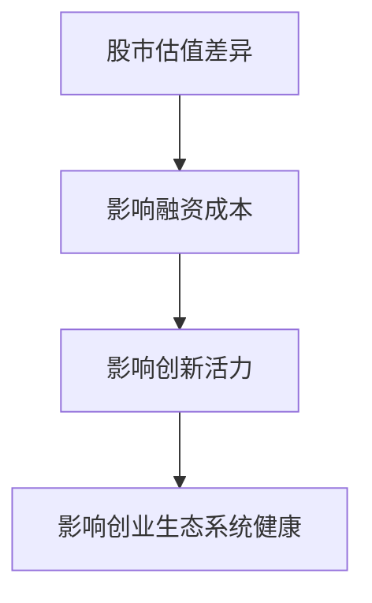
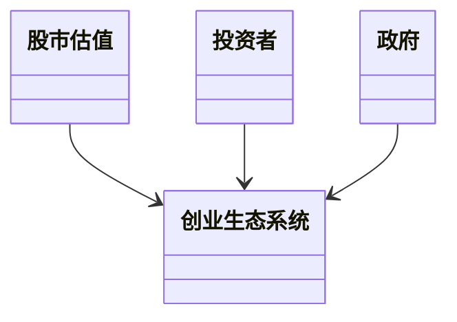
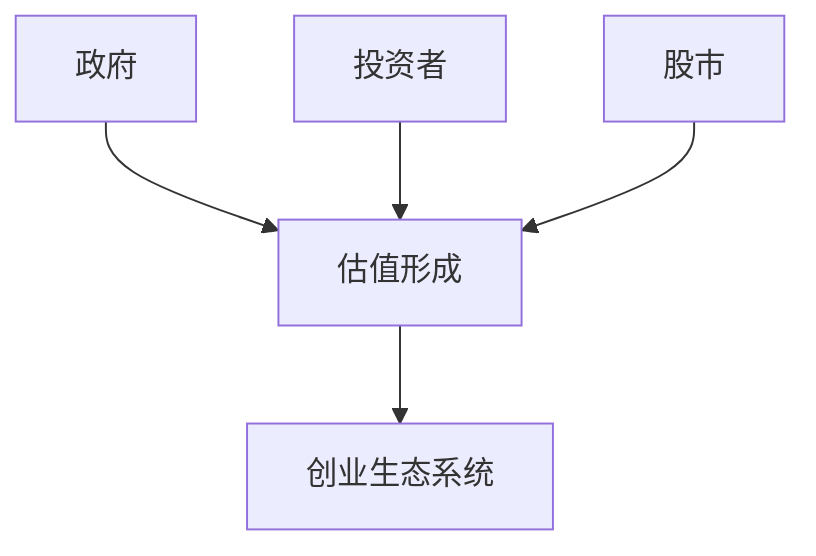

                 

# 股市估值差异对国际创业生态系统的影响

---

## 关键词：股市估值、创业生态系统、国际比较、系统分析、解决方案

---

## 摘要：  
股市估值差异对国际创业生态系统的影响是一个复杂而重要的问题。本文通过分析股市估值的基本理论、国际创业生态系统的构成及其相互关系，探讨估值差异如何影响创业生态系统的健康发展。结合实际案例分析和系统架构设计，本文提出优化建议，以促进创业生态系统的可持续发展。

---

# 第一部分：引言

## 1.1 背景介绍

### 1.1.1 问题背景  
股市估值是衡量企业价值的重要指标，但不同国家和地区的估值差异显著。这种差异对国际创业生态系统的影响不容忽视。  

### 1.1.2 问题描述  
股市估值差异可能导致创业企业融资困难，影响创新活力和投资信心。  

### 1.1.3 问题解决  
本文旨在分析估值差异的原因及其对创业生态系统的影响，并提出解决方案。  

### 1.1.4 边界与外延  
研究范围限定在股市估值差异对创业生态系统的直接影响，不考虑其他外部因素。  

### 1.1.5 核心概念结构与组成  
- 核心概念：股市估值、创业生态系统。  
- 组成：估值方法、影响因素、生态系统要素。

---

## 1.2 核心概念与联系

### 1.2.1 核心概念原理  
股市估值是企业价值的体现，创业生态系统是支持创新的关键环境。  

### 1.2.2 估值差异与创业生态系统的关系  
估值差异影响融资成本和创新活力，进而影响创业生态系统的健康。  

### 1.2.3 估值差异对创业生态系统的影响机制  
- 资金流动受阻：高估值可能导致融资困难，低估值可能吸引过度投资。  
- 投资信心下降：估值差异引发市场不信任，影响投资决策。  

### 1.2.4 关系图（Mermaid流程图）  

---

# 第二部分：股市估值基础理论

## 2.1 股市估值的基本概念

### 2.1.1 定义  
股市估值是通过财务指标和市场因素评估企业价值的过程。  

### 2.1.2 核心要素  
- 财务指标：收入、利润、现金流。  
- 市场因素：宏观经济、行业趋势。  

### 2.1.3 估值方法  
- 市盈率（P/E）：市价/每股收益。  
- 市净率（P/B）：市价/每股净资产。  
- 现金流折现法：DCF模型。  

## 2.2 估值方法的对比分析

### 2.2.1 方法优缺点对比（表格形式）  
| 方法 | 优点 | 缺点 |  
|------|------|------|  
| P/E | 简单直观 | 不适于亏损企业 |  
| P/B | 考虑资产价值 | 受资产质量影响 |  
| DCF | 精准 | 计算复杂 |  

## 2.3 影响股市估值的主要因素

### 2.3.1 宏观经济因素  
- 利率水平：影响资金成本。  
- 汇率波动：影响跨国投资。  

### 2.3.2 行业因素  
- 行业周期：成长期 vs 成熟期。  
- 行业政策：政府补贴、税收优惠。  

### 2.3.3 公司基本面  
- 财务状况：收入、利润、现金流。  
- 管理团队：领导能力和战略规划。  

---

# 第三部分：国际创业生态系统分析

## 3.1 创业生态系统的基本概念

### 3.1.1 定义  
创业生态系统是支持初创企业成长的综合环境，包括政府政策、风险投资、孵化器等。  

### 3.1.2 构成要素  
- 政府政策：税收优惠、补贴。  
- 风险投资：资金支持。  
- 孵化器：技术支持。  

## 3.2 影响机制分析

### 3.2.1 股市估值差异对创业生态系统的影响  
- 高估值：融资成本上升，企业难以获得资金。  
- 低估值：投资者信心下降，创新活力不足。  

### 3.2.2 不同国家和地区的差异性影响  
- 美国：高估值环境支持创新。  
- 中国：政府干预较多，影响估值合理性。  
- 印度：估值差异显著，影响初创企业融资。  

---

# 第四部分：案例分析

## 4.1 美国的股市估值与创业生态系统

### 4.1.1 美国股市估值特点  
- 高估值：科技企业占据主导。  
- 创投活跃：风险投资支持初创企业。  

## 4.2 中国的股市估值与创业生态系统

### 4.2.1 中国股市估值特点  
- 低估值：国有企业占主导。  
- 创业生态系统：政府政策支持明显。  

## 4.3 印度的股市估值与创业生态系统

### 4.3.1 印度股市估值特点  
- 估值差异大：科技初创企业估值偏高。  
- 创投环境：逐步发展，但仍需政策支持。  

---

# 第五部分：系统分析与架构设计

## 5.1 问题场景介绍  
股市估值差异对创业生态系统的影响涉及多方利益相关者，包括企业、投资者、政府等。  

## 5.2 系统功能设计

### 5.2.1 领域模型（Mermaid类图）  

## 5.3 系统架构设计

### 5.3.1 系统架构（Mermaid架构图）  

---

# 第六部分：解决方案与策略

## 6.1 优化建议

### 6.1.1 改善估值方法  
- 推荐使用DCF模型，避免单一估值方法的局限性。  

### 6.1.2 优化政策环境  
- 政府应制定合理政策，促进估值合理性。  

### 6.1.3 加强国际合作  
- 推动跨国合作，减少估值差异对创业生态系统的负面影响。  

## 6.2 实施路径

### 6.2.1 分阶段推进  
- 第一阶段：改善估值方法。  
- 第二阶段：优化政策环境。  
- 第三阶段：加强国际合作。  

---

# 第七部分：结论与展望

## 7.1 研究总结  
股市估值差异对国际创业生态系统的影响是一个复杂的问题，需要多方合作解决。  

## 7.2 未来展望  
随着技术进步和政策优化，股市估值和创业生态系统的关系将更加紧密。  

---

# 参考文献  
（此处列出相关的书籍、论文和网站资源）

---

# 作者：AI天才研究院 & 禅与计算机程序设计艺术  
邮箱：contact@aitiyanjiyan.com  
网站：https://www.zenofprogramming.com  

--- 

感谢您的阅读！如需进一步讨论，请随时联系我！

