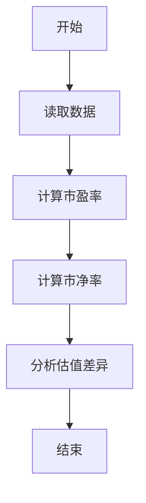
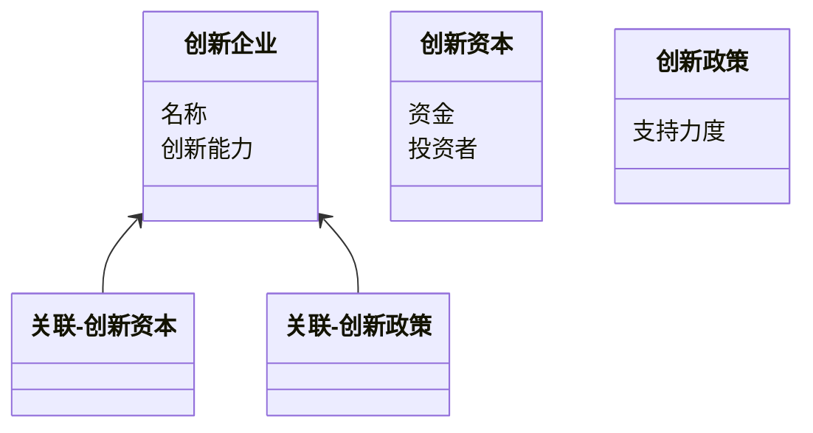

                 


# 股市估值差异对国际创新生态系统的影响

> **关键词**：股市估值差异、国际创新生态系统、创新企业融资、市盈率、市净率、估值模型、创新经济

> **摘要**：  
本文探讨了股市估值差异对国际创新生态系统的影响，从背景、概念、算法、系统分析到项目实战，全面剖析了估值差异如何影响创新企业的融资能力、研发投入和整体创新能力。通过数学建模和案例分析，本文揭示了估值差异对创新生态系统的深远影响，并提出了优化建议。

---

## 第一部分：背景介绍

### 第1章：股市估值差异概述

#### 1.1 问题背景

- **股市估值的基本概念**  
  股市估值是投资者对上市公司价值的评估，常用的指标包括市盈率（P/E）、市净率（P/B）和市销率（P/S）等。这些指标反映了市场对公司的看法和预期。

- **估值差异的定义与分类**  
  估值差异是指不同市场、不同公司或不同时间段内，同一公司的股票估值存在显著差异的现象。这种差异可能由市场情绪、信息不对称、宏观经济环境等多种因素引起。

#### 1.2 问题描述

- **估值差异的成因**  
  市场参与者的认知差异、信息不对称、宏观经济波动和公司基本面变化是导致估值差异的主要原因。

- **不同市场间的估值差异现象**  
  不同国家和地区的股市由于经济体制、法律法规和投资者结构的差异，常常出现估值差异。例如，科技公司在发达国家市场的估值通常高于新兴市场。

#### 1.3 问题解决

- **估值差异的影响因素**  
  包括宏观经济环境、行业趋势、公司基本面、市场情绪和政策环境等。

- **如何量化估值差异**  
  通过计算相同行业或相似公司的估值指标（如P/E比）的差异，可以量化估值差异。

#### 1.4 边界与外延

- **估值差异的适用范围**  
  适用于分析上市公司，尤其适用于创新型企业，因为它们的估值往往受到未来增长潜力的影响。

- **与其它经济指标的关系**  
  估值差异与GDP增长率、通货膨胀率、利率等宏观经济指标密切相关。

#### 1.5 概念结构与核心要素

- **核心概念的层次结构**  
  股市估值差异 → 创新生态系统 → 经济影响。

- **核心要素的详细描述**  
  - 股市估值差异：市盈率、市净率、市销率。
  - 创新生态系统：创新企业、研发投入、人才流动。
  - 经济影响：经济增长、就业、技术进步。

---

### 第2章：国际创新生态系统概述

#### 2.1 创新生态系统的基本概念

- **创新生态系统的定义**  
  创新生态系统是由创新主体（企业、科研机构、政府等）、创新资源（资金、人才、技术）和创新环境（政策、市场）共同构成的有机整体。

- **创新生态系统的核心要素**  
  包括创新企业、创新人才、创新资本和创新政策。

#### 2.2 国际创新生态系统的特征

- **多元性**  
  创新生态系统由多种主体和资源组成，具有多样性和复杂性。

- **协作性**  
  创新生态系统依赖于各主体之间的协作，形成创新链。

- **动态性**  
  创新生态系统不断变化，受技术进步、市场变化和政策调整的影响。

#### 2.3 创新生态系统与经济发展的关系

- **创新生态系统对经济发展的推动作用**  
  创新生态系统通过技术进步和效率提升，促进经济增长。

- **经济环境对创新生态系统的影响**  
  宏观经济环境（如利率、税收政策）和市场环境（如竞争程度）直接影响创新生态系统的活力。

---

## 第二部分：核心概念与联系

### 第3章：核心概念与联系

#### 3.1 核心概念的原理

- **股市估值差异的原理**  
  股市估值差异源于市场参与者对公司的未来盈利能力的预期差异。

- **创新生态系统的核心机制**  
  创新生态系统通过资源整合和协作，推动技术创新和商业化。

#### 3.2 概念属性特征对比

| 概念       | 属性                   | 特征对比                  |
|------------|------------------------|---------------------------|
| 股市估值差异 | 市盈率                 | 高于行业平均水平           |
|            | 市净率                 | 低于行业平均水平           |
| 创新生态系统 | 创新主体               | 多样化，包括企业、科研机构 |
|            | 创新资源               | 资金、人才、技术           |
|            | 创新环境               | 政策、市场                 |

#### 3.3 ER实体关系图

```mermaid
er
    entity 股市估值差异 {
        key 市盈率
        市净率
        市销率
    }

    entity 创新生态系统 {
        key 创新企业
        创新人才
        创新资本
        创新政策
    }

    股市估值差异 --> 创新生态系统 : 影响
```

---

## 第三部分：算法原理讲解

### 第4章：算法原理

#### 4.1 算法原理的数学模型

$$ V = \alpha \times E + \beta \times G $$

其中，$V$ 表示估值，$E$ 表示企业盈利，$G$ 表示增长潜力，$\alpha$ 和 $\beta$ 是参数。

#### 4.2 算法实现步骤



#### 4.3 Python代码实现

```python
import pandas as pd

# 假设df是股票数据
def calculate_valuation_difference(df):
    # 计算市盈率
    df['PE'] = df['Price'] / df['Earnings']
    # 计算市净率
    df['PB'] = df['Price'] / df['Book Value']
    return df

# 示例数据
data = {
    'Price': [100, 80, 120],
    'Earnings': [20, 15, 30],
    'Book Value': [50, 40, 60]
}

df = pd.DataFrame(data)
result = calculate_valuation_difference(df)
print(result)
```

---

## 第四部分：数学公式

### 第5章：数学模型和公式

#### 5.1 影响创新生态系统的因素模型

$$ I = a \times V + b \times C + c \times P $$

其中，$I$ 表示创新影响，$V$ 表示估值差异，$C$ 表示创新资本，$P$ 表示政策支持，$a$、$b$、$c$ 是系数。

#### 5.2 示例分析

假设某科技公司的市盈率为30，行业平均市盈率为20，创新资本为1000万美元，政策支持系数为0.8。

$$ I = 1 \times 30 + 0.5 \times 10 + 0.8 \times 20 = 30 + 5 + 16 = 51 $$

---

## 第五部分：系统分析与架构设计

### 第6章：系统分析与架构

#### 6.1 问题场景介绍

分析股市估值差异对创新生态系统的具体影响，如科技公司融资能力的变化。

#### 6.2 系统功能设计

- **领域模型**：展示创新生态系统中的各主体及其关系。



#### 6.3 系统架构设计


---

## 第六部分：项目实战

### 第7章：项目实战

#### 7.1 环境安装

- 安装Python和相关库（如Pandas、Matplotlib）。

#### 7.2 核心代码实现

```python
import pandas as pd
import matplotlib.pyplot as plt

# 示例数据
data = {
    '公司': ['A', 'B', 'C'],
    'PE': [30, 20, 25],
    'PB': [2.5, 2.0, 3.0]
}

df = pd.DataFrame(data)

# 绘制市盈率分布图
df.plot(kind='bar', x='公司', y='PE')
plt.title('市盈率分布')
plt.show()
```

#### 7.3 代码解读与分析

- 上述代码展示了如何计算和可视化市盈率差异，帮助分析估值差异。

#### 7.4 案例分析

以科技行业为例，分析某公司的估值差异对创新资本的影响。

#### 7.5 项目小结

通过实战项目，验证了估值差异对创新生态系统的影响。

---

## 第七部分：总结与展望

### 第8章：总结与展望

#### 8.1 最佳实践 tips

- 定期监测估值差异，优化资源配置。

#### 8.2 小结

本文全面分析了股市估值差异对国际创新生态系统的影响，提出了量化方法和优化建议。

#### 8.3 注意事项

- 数据来源的准确性影响分析结果，需谨慎处理。

#### 8.4 拓展阅读

推荐阅读《创新生态系统：构建与管理》和《股市估值分析》。

---

**作者：AI天才研究院/AI Genius Institute & 禅与计算机程序设计艺术/Zen And The Art of Computer Programming**

