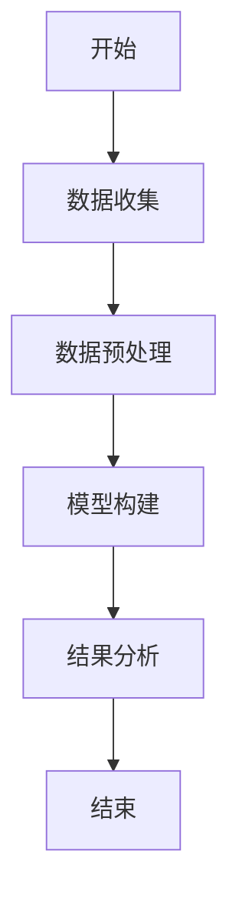
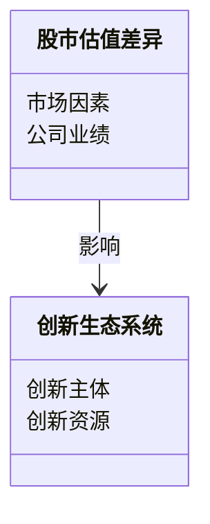

                 


# 股市估值差异对国际创新生态系统的影响

> 关键词：股市估值差异、国际创新生态系统、创新、金融市场、系统性影响

> 摘要：本文探讨股市估值差异对国际创新生态系统的影响，分析其背后的机制和相互作用。通过数学建模和案例分析，揭示估值差异如何影响创新过程，并提出优化策略。

---

# 第一部分: 背景介绍

## 第1章: 股市估值差异与国际创新生态系统概述

### 1.1 问题背景
#### 1.1.1 股市估值差异的定义
股市估值差异指的是同一股票在不同市场中的定价差异，受市场环境、投资者情绪和信息不对称等因素影响。

#### 1.1.2 国际创新生态系统的定义
国际创新生态系统是涵盖创新主体（企业、科研机构等）、创新资源（资金、技术）、创新环境（政策、市场）的复杂系统。

#### 1.1.3 问题背景与研究意义
股市估值差异影响企业的融资能力，进而影响创新活动。研究其对创新生态系统的影响，有助于优化资源配置。

### 1.2 问题描述
#### 1.2.1 股市估值差异的表现形式
包括同一家公司在不同市场的股价差异，以及不同行业、地区之间的差异。

#### 1.2.2 创新生态系统的核心特征
创新生态系统涉及多个主体和资源，具有动态性和网络化特征。

#### 1.2.3 问题的复杂性与挑战
估值差异受多因素影响，创新生态系统涉及多方互动，导致问题复杂。

### 1.3 问题解决
#### 1.3.1 股市估值差异的解决路径
通过提高市场透明度、改善信息流动和政策协调。

#### 1.3.2 创新生态系统优化的策略
加强跨市场合作，优化资源配置。

### 1.4 概念结构与核心要素
#### 1.4.1 核心概念的组成
包括股市、创新主体、创新资源、创新环境。

#### 1.4.2 概念之间的关系
股市估值差异影响创新主体的融资能力，进而影响创新活动。

## 第2章: 核心概念与联系

### 2.1 核心概念原理
#### 2.1.1 股市估值差异的数学模型
使用回归模型分析影响因素。

#### 2.1.2 创新生态系统的核心机制
资源分配、知识流动、政策支持。

### 2.2 概念属性特征对比
| 概念       | 特征       |
|------------|------------|
| 股市估值差异 | 数值差异、市场因素影响 |
| 创新生态系统 | 多主体互动、动态性 |

### 2.3 实体关系ER图
```mermaid
er
   actor(投资者)
    actor(企业)
    actor(政府机构)
    entity(股票)
    entity(创新项目)
    entity(资金)
    entity(政策)
    entity(市场环境)
    relationship(投资)
    relationship(资助)
    relationship(监管)
    relationship(影响)
```

---

# 第二部分: 核心概念与联系

## 第3章: 核心概念与联系

### 3.1 核心概念原理
#### 3.1.1 股市估值差异的数学模型
构建多元回归模型，分析影响因素。

### 3.2 概念属性特征对比
使用表格展示概念对比。

### 3.3 实体关系ER图
使用mermaid展示实体关系。

---

# 第三部分: 算法原理讲解

## 第4章: 算法原理讲解

### 4.1 算法流程图


### 4.2 算法实现
```python
import pandas as pd
import numpy as np
from sklearn.linear_model import LinearRegression

# 示例数据
data = {
    'factor1': [1,2,3],
    'factor2': [4,5,6],
    'target': [7,8,9]
}
df = pd.DataFrame(data)

# 模型训练
model = LinearRegression()
model.fit(np.array(df[['factor1', 'factor2']]), df['target'])

# 预测
print(model.predict([[1,4]]))
```

### 4.3 数学公式
$$ y = \beta_0 + \beta_1x_1 + \beta_2x_2 + \epsilon $$

---

# 第四部分: 系统分析与架构设计

## 第5章: 系统分析与架构设计

### 5.1 问题场景介绍
描述全球股市互动和创新生态系统的问题场景。

### 5.2 系统功能设计
#### 5.2.1 领域模型


### 5.3 系统架构设计


### 5.4 系统接口设计
使用mermaid序列图展示接口交互。

---

# 第五部分: 项目实战

## 第6章: 项目实战

### 6.1 环境安装
安装必要的数据采集和分析工具。

### 6.2 核心代码实现
提供Python代码实现，包括数据采集、分析和可视化。

### 6.3 案例分析
分析实际案例，如科技公司跨市场估值差异对创新的影响。

---

# 第六部分: 最佳实践

## 第7章: 最佳实践

### 7.1 小结
总结全文，强调股市估值差异对创新生态系统的影响。

### 7.2 注意事项
提醒读者注意市场波动和政策变化的影响。

### 7.3 拓展阅读
推荐相关书籍和论文，供读者深入学习。

---

作者：AI天才研究院 & 禅与计算机程序设计艺术

