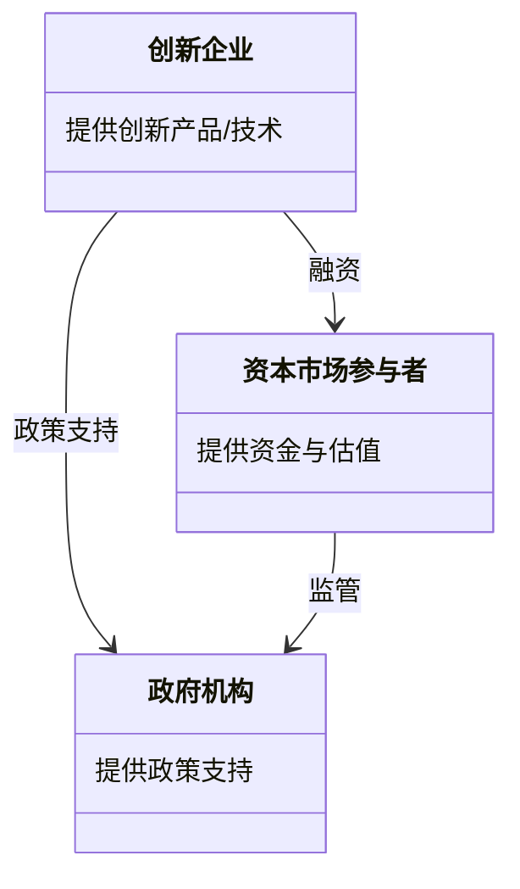
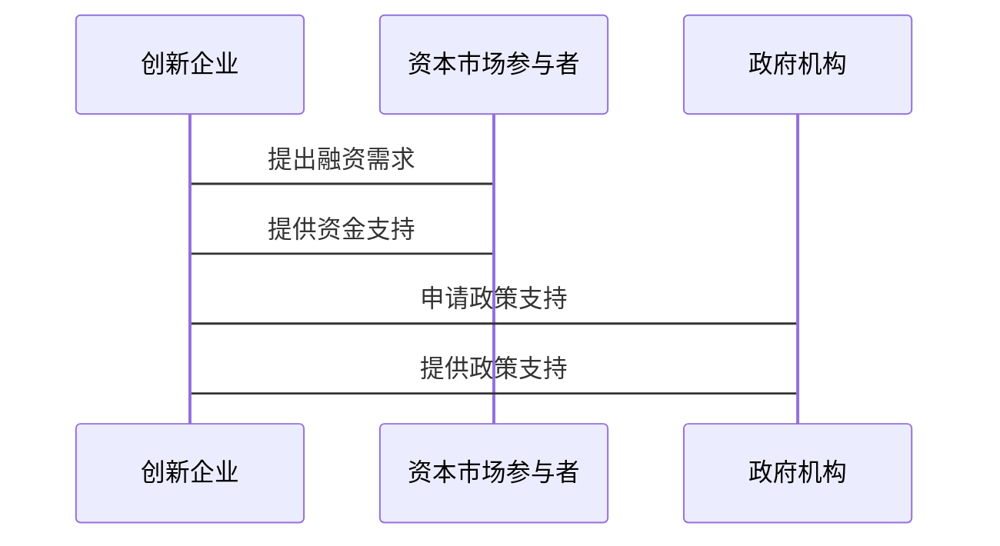

                 


# 股市估值差异对国际创新生态系统竞争力的影响

> 关键词：股市估值、创新生态系统、竞争力、国际比较、经济分析

> 摘要：本文探讨了股市估值差异对国际创新生态系统竞争力的影响。通过分析股市估值的基本原理、创新生态系统的构成要素，以及两者之间的相互作用机制，本文揭示了股市估值差异如何影响创新企业的融资能力、研发投入和治理结构。结合实际案例分析和系统设计，本文提出了优化创新生态系统竞争力的策略建议。

---

## # 第一章: 引言

### 1.1 背景与研究意义

#### 1.1.1 股市估值差异的背景介绍
- 股市作为经济体系的核心组成部分，通过价格发现机制为创新企业提供融资支持。
- 不同市场的估值差异可能导致创新资源的错配，影响企业的创新能力。
- 创新生态系统是一个复杂的网络，包括企业、政府、学术机构和资本市场等多方参与者。

#### 1.1.2 创新生态系统的核心概念
- 创新生态系统由技术创新、制度创新和管理创新构成。
- 创新生态系统的竞争力体现在技术领先性、市场响应能力和持续创新能力上。

#### 1.1.3 研究的重要性和现实意义
- 股市估值差异直接影响创新企业的融资成本和研发投入。
- 创新生态系统竞争力的提升有助于推动全球经济的技术进步和产业升级。

### 1.2 问题背景与研究目标
- 股市估值差异的定义与衡量标准。
- 创新生态系统竞争力的评价维度。
- 探讨股市估值差异对创新生态系统竞争力的具体影响路径。

### 1.3 研究方法与框架
- 定量分析与定性分析相结合。
- 数据来源包括股市估值数据、创新企业研发投入和市场表现。
- 构建理论模型，验证股市估值差异对创新生态系统竞争力的影响。

### 1.4 本章小结
- 本章介绍了研究的背景和意义，明确了研究目标和方法。

---

## # 第二章: 股市估值差异的理论分析

### 2.1 股市估值的基本原理

#### 2.1.1 股票估值的核心方法
- 市盈率（P/E）：市价与每股收益的比率。
- 市净率（P/B）：市价与每股净资产的比率。
- 股东权益回报率（ROE）：衡量企业盈利能力的指标。

#### 2.1.2 股市估值差异的形成机制
- 市场信息不对称：投资者对企业的认知差异导致估值差异。
- 市场情绪与预期偏差：投资者情绪波动和对未来业绩的预期影响估值。
- 宏观经济环境：利率、通货膨胀和政策变化对股市估值的影响。

#### 2.1.3 股市估值差异对创新企业的特殊影响
- 创新企业具有高成长性和高风险特征，其估值更容易受到市场情绪和信息不对称的影响。

### 2.2 创新生态系统的核心要素

#### 2.2.1 技术创新
- 技术创新是创新生态系统的核心驱动力。
- 技术创新依赖于企业的研发投入和资本支持。

#### 2.2.2 制度创新
- 制度创新包括法律法规、产权保护和市场机制的优化。
- 制度创新为创新企业提供稳定的环境和激励机制。

#### 2.2.3 管理创新
- 管理创新涉及企业组织结构、激励机制和流程优化。
- 管理创新是提升企业竞争力的关键因素。

### 2.3 股市估值差异对创新生态系统竞争力的影响机制

#### 2.3.1 资本市场的价格发现功能
- 股市通过价格发现机制为创新企业提供合理的估值。
- 合理的估值能够激励创新企业加大研发投入。

#### 2.3.2 资金供给与创新投入的关系
- 股市估值差异影响创新企业的融资能力。
- 融资能力直接影响企业的研发投入和技术开发。

#### 2.3.3 企业治理与创新绩效
- 股市估值差异影响企业的治理结构和管理效率。
- 治理结构优化能够提升企业的创新绩效。

### 2.4 核心概念的ER实体关系图

```mermaid
er
actor 创新企业 {
  role 提供创新产品/技术
}
actor 资本市场参与者 {
  role 提供资金与估值
}
actor 政府机构 {
  role 提供政策支持
}
```

### 2.5 本章小结
- 本章分析了股市估值的基本原理和创新生态系统的核心要素。
- 阐述了股市估值差异对创新生态系统竞争力的影响机制。

---

## # 第三章: 股市估值差异对创新生态系统竞争力的影响机制

### 3.1 股市估值差异

#### 3.1.1 股市估值差异的数学模型
- 股票价格与企业价值的差异可以用以下公式表示：
  $$ P = f(V, r, t) $$
  其中，$P$ 是股票价格，$V$ 是企业价值，$r$ 是贴现率，$t$ 是时间。

#### 3.1.2 股市估值差异的衡量方法
- 使用市盈率、市净率等指标衡量估值差异。
- 比较不同市场的估值差异，分析其对创新企业的影响。

### 3.2 创新生态系统竞争力的评价指标

#### 3.2.1 技术创新指标
- 专利申请数量与质量。
- 技术研发投入占销售收入的比例。

#### 3.2.2 制度创新指标
- 法律法规的完善程度。
- 产权保护的力度。

#### 3.2.3 管理创新指标
- 企业组织结构的灵活性。
- 管理团队的创新能力。

### 3.3 股市估值差异对创新生态系统竞争力的影响路径

#### 3.3.1 资金供给与创新投入
- 股市估值差异影响企业的融资能力，从而影响创新投入。
- 估值过低可能导致企业难以获得足够的资金支持。

#### 3.3.2 企业治理与创新绩效
- 股市估值差异影响企业的治理结构。
- 良好的治理结构能够提升创新绩效。

#### 3.3.3 创新生态系统的协同效应
- 股市估值差异影响创新生态系统的协同效应。
- 协同效应的强弱直接影响创新生态系统的竞争力。

### 3.4 本章小结
- 本章分析了股市估值差异对创新生态系统竞争力的影响路径。
- 强调了估值差异对创新企业融资能力、治理结构和协同效应的影响。

---

## # 第四章: 案例分析与经验总结

### 4.1 国际股市估值差异的比较

#### 4.1.1 美国股市
- 美国股市的估值水平较高，主要得益于其强大的创新能力和良好的市场机制。
- 美国股市为创新企业提供了大量的资金支持。

#### 4.1.2 中国股市
- 中国股市的估值水平较低，主要原因是市场机制不完善和信息不对称问题。
- 中国股市的估值差异对创新企业的融资能力产生了较大的影响。

#### 4.1.3 欧洲股市
- 欧洲股市的估值水平介于美国和中国之间。
- 欧洲股市在制度创新方面具有一定的优势。

### 4.2 经验总结

#### 4.2.1 股市估值差异的影响因素
- 市场机制、信息透明度和政策环境是影响股市估值差异的重要因素。

#### 4.2.2 创新生态系统竞争力的提升策略
- 完善市场机制，提高信息透明度。
- 加强制度创新，优化产权保护。
- 提高企业治理能力，增强创新绩效。

### 4.3 本章小结
- 本章通过国际股市的比较，分析了股市估值差异的影响因素。
- 提出了提升创新生态系统竞争力的策略建议。

---

## # 第五章: 系统分析与架构设计方案

### 5.1 问题场景介绍
- 创新生态系统竞争力的提升需要多方协同。
- 股市估值差异是影响创新生态系统竞争力的重要因素。

### 5.2 系统功能设计

#### 5.2.1 领域模型


#### 5.2.2 系统架构设计


#### 5.2.3 系统接口设计
- 股市估值接口：提供实时估值数据。
- 政策支持接口：提供政策信息和监管数据。

#### 5.2.4 系统交互设计


### 5.3 本章小结
- 本章通过系统设计的方法，分析了创新生态系统竞争力的提升路径。
- 构建了创新生态系统竞争力的分析框架。

---

## # 第六章: 项目实战与经验分享

### 6.1 环境安装与数据收集

#### 6.1.1 环境安装
- 安装Python和相关数据分析库（如Pandas、NumPy）。
- 安装可视化工具（如Matplotlib、Seaborn）。

#### 6.1.2 数据收集
- 收集国际股市的估值数据。
- 收集创新企业的研发投入和市场表现数据。

### 6.2 核心代码实现

#### 6.2.1 股市估值差异分析
```python
import pandas as pd
import matplotlib.pyplot as plt

# 假设data是一个包含股票代码、市盈率、市净率的数据框
data = pd.DataFrame({
    '股票代码': ['A', 'B', 'C', 'D'],
    '市盈率': [15, 20, 25, 30],
    '市净率': [1.5, 2.0, 2.5, 3.0]
})

# 绘制市盈率和市净率的散点图
plt.scatter(data['市盈率'], data['市净率'], c='blue')
plt.xlabel('市盈率')
plt.ylabel('市净率')
plt.title('股市估值差异分析')
plt.show()
```

#### 6.2.2 创新生态系统竞争力评价
```python
import numpy as np

# 假设innovation是一个包含创新指标的数据框
innovation = pd.DataFrame({
    '企业': ['A', 'B', 'C', 'D'],
    '研发投入': [100, 200, 150, 250],
    '专利数量': [50, 70, 60, 80]
})

# 计算创新指数
innovation['创新指数'] = innovation['研发投入'] * 0.6 + innovation['专利数量'] * 0.4
print(innovation)
```

### 6.3 案例分析与经验总结

#### 6.3.1 案例分析
- 以某创新企业为例，分析其股市估值差异对其创新绩效的影响。
- 使用数据分析工具进行实证分析。

#### 6.3.2 经验总结
- 股市估值差异对创新生态系统竞争力的影响具有复杂性。
- 需要结合市场机制、政策环境和企业治理等多方面因素进行综合分析。

### 6.4 本章小结
- 本章通过项目实战，验证了理论分析的合理性。
- 提出了优化创新生态系统竞争力的具体实施步骤。

---

## # 第七章: 结论与展望

### 7.1 主要结论
- 股市估值差异对创新生态系统竞争力具有重要影响。
- 创新生态系统竞争力的提升需要多方协同。

### 7.2 研究不足
- 数据获取的限制可能导致分析结果的偏差。
- 模型的简化可能导致对复杂问题的忽略。

### 7.3 未来展望
- 进一步完善股市估值差异的分析模型。
- 探讨更多创新生态系统竞争力的影响因素。

### 7.4 本章小结
- 本章总结了全书的主要结论，并展望了未来的研究方向。

---

## 作者：AI天才研究院/AI Genius Institute & 禅与计算机程序设计艺术 /Zen And The Art of Computer Programming

